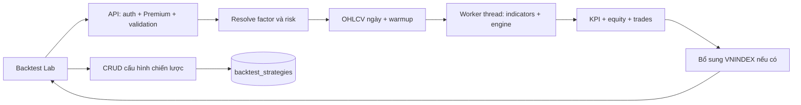

# IQX — Đặc tả Backtest

Ngày phân tích: **25/09/2026**. Mã nguồn tham chiếu: working tree tại commit nền `6418db3`.

Tài liệu mô tả **hành vi đã triển khai**, phục vụ phát triển, kiểm thử và đối chiếu khi chuyển phiên bản. Repo đồng thời có `backend` + `dashboard` và `backend-v2` + `frontend-v2`; tài liệu lấy **v2 làm hợp đồng chính**, ghi khác biệt Python/dashboard ở mục 11. Việc chọn v2 làm mốc tài liệu không xác nhận phiên bản đang chạy production. Các đề xuất ở mục 12 chưa phải chức năng đã có.

## 1. Mục tiêu và phạm vi

Người dùng Premium xây dựng một chiến lược bằng các chỉ tiêu kỹ thuật, chạy mô phỏng trên dữ liệu lịch sử một mã, đọc hiệu suất/rủi ro và lưu cấu hình để dùng lại.

| Thuộc tính           | Phạm vi hiện có                                                                |
| -------------------- | ------------------------------------------------------------------------------ |
| Tài sản mỗi lần chạy | Một `symbol`                                                                   |
| Chiều giao dịch      | Chỉ mua rồi bán; tối đa một vị thế đang mở                                     |
| Khung thời gian      | OHLCV ngày (`1D`)                                                              |
| Điều kiện            | Tổ hợp factor mua và tổ hợp factor bán, mỗi bên có logic AND hoặc OR           |
| Quản trị rủi ro      | Stop ATR/cố định/không stop; take profit; số phiên giữ tối đa; quy mô vốn; phí |
| Đầu ra               | Metadata, KPI, đường vốn, các giao dịch đã đóng                                |
| So sánh              | Buy & hold cùng mã và VNINDEX khi lấy được dữ liệu                             |
| Lưu trữ              | Lưu cấu hình chiến lược theo tài khoản; không lưu lịch sử các lần chạy         |
| Liên kết chức năng   | Chuyển điều kiện chiến lược sang tạo cảnh báo kỹ thuật                         |

Chưa có: portfolio đa mã, short/margin/leverage, mua tăng vị thế, bán từng phần, trailing stop, slippage/spread, khớp theo thanh khoản, tối ưu tham số, walk-forward train/test, out-of-sample hoặc lịch sử job backtest. Tên “walk-forward simulator” trong Python chỉ mô tả vòng lặp thời gian, không phải quy trình chia tập huấn luyện/kiểm định.

Nguồn: [engine v2](../../backend-v2/src/modules/quant/backtest.engine.ts), [service v2](../../backend-v2/src/modules/quant/quant.service.ts), [engine Python](../../backend/app/services/backtest/engine.py).

## 2. Kiến trúc và luồng xử lý



1. Kiểm tra đăng nhập, tài khoản hoạt động và quyền Premium; admin được bypass kiểm tra Premium theo guard.
2. Validate request; resolve factor ID thành `indicator`, `op`, `value`; buy phải có ít nhất một điều kiện.
3. Map preset phí sang phí mua/bán và lấy OHLCV có lịch sử warmup.
4. Đưa tính chỉ báo và mô phỏng vào Node worker thread. HTTP vẫn đợi kết quả trong cùng request.
5. Tính KPI, serialize đường vốn và giao dịch. Lấy thêm VNINDEX; lỗi benchmark không làm hỏng kết quả chính.
6. Trả JSON trực tiếp gồm `meta`, `kpis`, `equity_curve`, `trades`.

Backtest v2 dùng hàng đợi trong bộ nhớ process và `worker_threads`, không phải BullMQ durable job. Không có `job_id`, API polling, tiến độ, resume hay API hủy.

Nguồn: [quant.service.ts:72](../../backend-v2/src/modules/quant/quant.service.ts#L72), [worker-runner:17](../../backend-v2/src/modules/quant/backtest.worker-runner.ts#L17), [worker](../../backend-v2/src/modules/quant/backtest.worker.ts).

## 3. Hợp đồng cấu hình chạy — v2

### 3.1. Request

| Trường    | Kiểu / mặc định                    | Ràng buộc                                                         |
| --------- | ---------------------------------- | ----------------------------------------------------------------- |
| `symbol`  | string, bắt buộc                   | Trim, uppercase; dài 1–20; chỉ chữ, số, `.`, `_`, `-`             |
| `start`   | `YYYY-MM-DD`, bắt buộc             | Ngày ISO hợp lệ                                                   |
| `end`     | `YYYY-MM-DD`, bắt buộc             | `end >= start`; khoảng cách tối đa 3.653 ngày                     |
| `capital` | number; `100000000`                | Hữu hạn, từ `100000` đến `100000000000000`                        |
| `buy`     | object, bắt buộc                   | `logic` + `factors`; từ 1 đến 12 factor                           |
| `sell`    | object; `{logic:"AND",factors:[]}` | Từ 0 đến 12 factor; rỗng nghĩa là không thoát theo tín hiệu bán   |
| `risk`    | object; cấu hình mặc định bên dưới | Kiểm tra kể cả các tham số hiện không được mode đang chọn sử dụng |

Một bên điều kiện có dạng `{ "logic": "AND", "factors": [{ "id": "rsi_14_oversold", "value": 30 }] }`. `logic` mặc định `AND`; factor có ID dài 1–80 và `value` số hữu hạn tùy chọn. V2 từ chối thuộc tính ngoài schema. Ngày tương lai không bị schema backtest cấm; dữ liệu thực trả về quyết định số phiên chạy.

### 3.2. Risk

| Trường                  | Mặc định   | Giá trị chấp nhận qua API                  |
| ----------------------- | ---------- | ------------------------------------------ |
| `stop_loss`             | `atr`      | `none`, `atr`, `fixed`                     |
| `stop_atr_mult`         | `2`        | 0,1–20                                     |
| `stop_fixed_pct`        | `0.05`     | 0,001–0,8                                  |
| `take_profit_pct`       | `null`     | `null` hoặc 0,001–10                       |
| `max_holding`           | `60`       | `null` hoặc số nguyên 2–2.500 phiên        |
| `position_size`         | `all`      | `all`, `half`, `quarter`, `tenth`, `fixed` |
| `position_fixed_amount` | `10000000` | Số hữu hạn > 0 và ≤ `1000000000000`        |
| `fee`                   | `standard` | `standard`, `low`, `none`                  |

Các trường có hậu tố `_pct` dùng **tỷ lệ**, ví dụ `0.05 = 5%`. Không gửi `5` để biểu diễn 5%. `take_profit_pct=null` tắt take profit; `max_holding=null` bỏ giới hạn thời gian giữ, nhưng không bỏ khóa bán T+2.

| Preset phí | Phí mua | Tổng phí/thuế bán |
| ---------- | ------: | ----------------: |
| `standard` |   0,15% |             0,25% |
| `low`      |   0,10% |             0,10% |
| `none`     |       0 |                 0 |

Đây là tham số mô phỏng hardcode, không phải bảng phí thực tế của tài khoản môi giới. Catalog chỉ gợi ý một tập preset: stop ATR 1,5×/2×/3×, fixed 5%, none; take profit none/10%/15%/20%; position all/half/fixed 10 triệu; fee standard/low. API chấp nhận thêm các giá trị trong bảng trên.

Nguồn: [quant.schemas.ts:3–101](../../backend-v2/src/modules/quant/quant.schemas.ts#L3), [fee và catalog:23–68](../../backend-v2/src/modules/quant/quant.service.ts#L23).

### 3.3. Ví dụ request hoàn chỉnh

```json
{
  "symbol": "FPT",
  "start": "2025-01-01",
  "end": "2025-12-31",
  "capital": 100000000,
  "buy": {
    "logic": "AND",
    "factors": [{ "id": "breakout_20d" }, { "id": "vol_zscore_buy", "value": 1.5 }]
  },
  "sell": {
    "logic": "OR",
    "factors": [{ "id": "breakdown_20d" }, { "id": "macd_bear_cross" }]
  },
  "risk": {
    "stop_loss": "atr",
    "stop_atr_mult": 1.5,
    "stop_fixed_pct": 0.05,
    "take_profit_pct": 0.15,
    "max_holding": 40,
    "position_size": "all",
    "position_fixed_amount": 10000000,
    "fee": "standard"
  }
}
```

Ví dụ chỉ minh họa cấu trúc request, không phải khuyến nghị chiến lược hay kết quả đã chạy trên FPT.

## 4. Bộ chỉ báo, factor và điều kiện

### 4.1. Quy tắc resolve/evaluate

- Catalog có **38 factor: 22 mua, 16 bán**, chia 7 nhóm mỗi bên. Engine tính **38 chỉ báo**; số lượng bằng nhau nhưng factor và chỉ báo là hai khái niệm khác nhau.
- Factor đóng gói sẵn indicator và toán tử. `value` chỉ ghi đè được khi factor có `editable=true`; factor cố định bỏ qua giá trị truyền vào.
- `min`, `max`, `step`, `unit`, `is_percent` là metadata UI. Resolve factor phía server **không kiểm tra ngưỡng theo min/max của catalog**.
- AND yêu cầu mọi factor đúng; OR chỉ cần một factor đúng. Giá trị NaN do chưa đủ lịch sử được coi là không thỏa điều kiện.
- `cross_above`: hôm nay LHS > RHS và phiên trước LHS ≤ RHS. `cross_below`: hôm nay LHS < RHS và phiên trước LHS ≥ RHS. Phiên đầu chưa có dữ liệu trước đó không tạo cross.
- Engine nội bộ hỗ trợ `>`, `<`, `>=`, `<=`, `==`, `cross_above`, `cross_below`, `is_true`, và RHS có thể tham chiếu một field khác. API backtest chỉ nhận **factor ID + value**, không nhận biểu thức tùy ý.
- Engine điều kiện có hỗ trợ `join` riêng từng điều kiện với AND ưu tiên OR. Schema backtest không expose `join`, nên không có tổ hợp AND/OR hỗn hợp hoặc ngoặc nhóm qua API này.
- API chưa chặn ID thuộc nhóm sell đặt trong buy, ID thuộc buy đặt trong sell, hay factor trùng lặp. UI chọn theo bên và ngăn thêm trùng.

Nguồn: [catalog:333](../../backend-v2/src/modules/quant/catalog.ts#L333), [conditions](../../backend-v2/src/modules/quant/conditions.ts), [schema:11](../../backend-v2/src/modules/quant/quant.schemas.ts#L11).

### 4.2. Định nghĩa chỉ báo cần giữ khi triển khai lại

Ký hiệu `C/O/H/L/V` là close/open/high/low/volume phiên hiện tại; `SMA_n` là trung bình n phiên đầy đủ; độ lệch chuẩn dùng mẫu (`ddof=1`).

| Nhóm                | Định nghĩa đang dùng                                                                                        |
| ------------------- | ----------------------------------------------------------------------------------------------------------- |
| MA                  | SMA close 5/20/50/200; stack tăng = MA5 > MA20 > MA50 > MA200; uptrend = MA50 > MA200                       |
| Death cross         | MA20 cắt xuống MA50, có so sánh phiên trước                                                                 |
| Slope / khoảng cách | `ma_20_slope = MA20(t)/MA20(t-10)-1`; `dist_ma_n = C/MA_n-1`                                                |
| RSI14               | Trung bình đơn giản gain/loss 14 thay đổi giá; **không Wilder smoothing**; average loss = 0 trả RSI = 100   |
| MACD                | EMA12 − EMA26; signal EMA9; histogram = MACD − signal. EMA khởi tạo bằng SMA của period đầu tiên đủ dữ liệu |
| ROC20               | `C(t)/C(t-20)-1`                                                                                            |
| ATR14               | SMA14 của `max(H-L, abs(H-Cprev), abs(L-Cprev))`; phiên đầu thiếu close trước để tính TR                    |
| ATR%                | ATR14 / C                                                                                                   |
| Bollinger           | MA20 ± 2×std20; width = (upper−lower)/MA20; squeeze = width ≤ percentile 15 của 120 giá trị width gần nhất  |
| BB breakout down    | Close cắt xuống lower band so với phiên trước                                                               |
| Volume              | SMA20 volume; z-score = `(V−SMA20(V))/std20(V)`                                                             |
| OBV                 | Khởi đầu 0; cộng/trừ volume theo close tăng/giảm; bằng close thì không đổi; MA20 của OBV                    |
| Đỉnh/đáy            | Max high / min low trên 20 hoặc 252 phiên; khoảng cách = C/extreme−1                                        |
| Breakout            | `C(t) >= high_n(t-1)` và `C(t-1) < high_n(t-2)`; breakdown dùng `<= low_n(t-1)` và `> low_n(t-2)`           |
| Hammer              | Râu dưới > 2×thân, râu trên < thân, return 5 phiên < −3%                                                    |
| Shooting star       | Râu trên > 2×thân, râu dưới < thân, return 5 phiên > +3%                                                    |
| Engulfing tăng      | Nến trước giảm, nến hiện tại tăng, close hiện tại > open trước và open hiện tại < close trước               |
| Engulfing giảm      | Điều kiện đối xứng với engulfing tăng, dùng bất đẳng thức chặt                                              |

Không được thay bằng RSI/ATR mặc định của thư viện khác rồi mặc nhiên coi kết quả tương đương. Test golden hiện kiểm tra 38 giá trị cuối chuỗi tổng hợp và một số mốc warmup, chưa chứng minh parity trên mọi dữ liệu.

Nguồn: [indicators.ts](../../backend-v2/src/modules/quant/indicators.ts), [golden test](../../backend-v2/test/unit/quant-indicators.test.ts).

### 4.3. Bốn mẫu chiến lược

Các risk không ghi đè giữ mặc định ở mục 3.2.

| Key / tên                              | Mua                                  | Bán                                  | Risk ghi đè                                                 |
| -------------------------------------- | ------------------------------------ | ------------------------------------ | ----------------------------------------------------------- |
| `momentum_cross` — Giao cắt động lượng | RSI < 30 AND MACD cắt lên signal     | RSI > 70 OR death cross              | ATR 2×; giữ tối đa 60                                       |
| `volume_breakout` — Bứt phá khối lượng | Breakout20 AND volume z-score > 1,5  | Breakdown20 OR MACD cắt xuống signal | ATR 1,5×; TP 15%; giữ tối đa 40                             |
| `trend_follow` — Thuận xu hướng        | MA stack tăng AND MACD histogram > 0 | Close < MA50 OR death cross          | ATR 3×; giữ tối đa 90                                       |
| `mean_reversion` — Bắt đáy hồi phục    | RSI < 28 AND khoảng cách MA20 < −5%  | RSI > 68                             | Fixed stop 5%; TP 10%; giữ tối đa 30; dùng 50% tiền còn lại |

Nguồn: [templates.ts](../../backend-v2/src/modules/quant/templates.ts).

## 5. Dữ liệu và warmup

| Nội dung       | Hành vi v2                                                                                               |
| -------------- | -------------------------------------------------------------------------------------------------------- |
| Nguồn mặc định | VND trước, VCI dự phòng khi nguồn trước ném lỗi                                                          |
| Warmup         | Yêu cầu 300 phiên; ngày fetch bắt đầu = start − `ceil(300×1,6) − 30` ngày, tức 510 ngày lịch trước start |
| Benchmark      | VNINDEX, warmup yêu cầu 0 nhưng adapter vẫn lùi thêm 30 ngày lịch                                        |
| Chuẩn hóa ngày | Epoch giây được cộng UTC+7 rồi lấy ngày; string ISO lấy 10 ký tự đầu                                     |
| Chuẩn hóa số   | OHLCV phải chuyển được sang số hữu hạn                                                                   |
| Loại bar       | Thiếu OHLCV; giá ≤ 0; volume < 0; high < max(open,close); low > min(open,close); hoặc ngày > end         |
| Trùng ngày     | Giữ bản ghi cuối cùng, sau đó sắp ngày tăng dần                                                          |
| Giới hạn       | Adapter giữ tối đa 3.500 bar gần nhất, gồm cả warmup                                                     |
| Phiên bắt đầu  | Bar đầu tiên có ngày ≥ start; không có thì `startIndex = records.length`                                 |
| Điều chỉnh giá | Adapter trả `adjusted=false`; không cam kết corporate-action-adjusted                                    |
| Cache          | Provider OHLCV VND/VCI có TTL 15 giây; quant v2 không có cache riêng cho kết quả chạy                    |

Các giá trị giá được adapter chuyển nguyên đơn vị upstream vào engine. Vốn UI được nhập theo VND; **pipeline quant chưa có khai báo/chuẩn hóa đơn vị giá tường minh**. Muốn chứng nhận số lượng cổ phiếu và chi phí tuyệt đối cần xác minh đơn vị từng nguồn bằng fixture hoặc dữ liệu thực; các test mô phỏng hiện không đủ chứng nhận điểm này.

300 phiên warmup là mục tiêu fetch, không phải điều kiện bắt buộc đã đủ dữ liệu. Chỉ báo thiếu lịch sử trả NaN; ATR thiếu tại thời điểm mua khiến vị thế không có stop ATR. VCI hiện gọi `countBack=1000`; khoảng request dài hơn có thể nhận lịch sử ngắn hơn mong đợi khi fallback. Không có cảnh báo riêng về số phiên warmup thiếu hoặc phần khoảng thời gian bị hụt.

Nếu không có record nào: trả lỗi không có lịch sử. Nếu còn record warmup nhưng không có phiên trong khoảng: engine trả đường vốn/giao dịch rỗng, số phiên bằng 0 và các KPI tỷ lệ bằng null. `meta.start/end` thể hiện ngày thực nếu có bar giao dịch, nếu không thì dùng ngày request.

Nguồn: [market-data.adapter.ts](../../backend-v2/src/modules/quant/market-data.adapter.ts), [market-data.service.ts:77](../../backend-v2/src/modules/market-data/market-data.service.ts#L77), [VCI provider:95](../../backend-v2/src/modules/market-data/providers/vci.provider.ts#L95), [VND provider:41](../../backend-v2/src/modules/market-data/providers/vnd.provider.ts#L41).

## 6. Quy tắc mô phỏng giao dịch — v2

### 6.1. Trạng thái và vào lệnh

Ban đầu `cash = capital`, chưa có vị thế. Chỉ mô phỏng từ `startIndex`; dữ liệu trước đó chỉ dùng tính chỉ báo. Mỗi phiên xử lý đúng một nhánh: đang trống vị thế thì xét mua, đang giữ thì xét thoát.

Khi buy đúng và chưa có vị thế:

```text
budget = cash × {all:1, half:0.5, quarter:0.25, tenth:0.1}
budget nếu fixed = min(position_fixed_amount, cash)
shares = floor(budget / (close × (1 + fee_buy) × 100)) × 100
cash mới = cash − shares × close × (1 + fee_buy)
```

Nếu `shares=0`, không tạo vị thế. Nếu đủ tiền, mua tại **close cùng phiên phát tín hiệu**, tính phí ngay và ghi lý do mua. Stop/take được chốt tại entry:

- ATR stop = entry price − `stop_atr_mult × ATR14(entry)`; ATR thiếu thì stop = null.
- Fixed stop = entry price × `(1 − stop_fixed_pct)`.
- Take profit = entry price × `(1 + take_profit_pct)`; null nghĩa là tắt.
- Không dời stop theo ATR các phiên sau và không có trailing stop.

Tín hiệu dựa trên dữ liệu đến hết phiên hiện tại và khớp ngay close của phiên đó. Đây là giả định mô phỏng; không đồng nghĩa chiến lược đã chứng minh khả năng đặt lệnh sau khi biết toàn bộ close/volume mà vẫn được khớp cùng close.

### 6.2. Khóa bán và thứ tự thoát

`held = index hiện tại − index mua`. Khi `held < 2`, bỏ qua **mọi** điều kiện thoát, kể cả stop và take profit. Đây là T+2 theo số bar đã nhận, không phải lịch thanh toán chi tiết hay thời điểm chứng khoán về trong ngày.

Khi đủ điều kiện bán, xét lần lượt và dùng điều kiện đầu tiên khớp:

| Ưu tiên | Điều kiện                                   | Giá thoát   |
| ------: | ------------------------------------------- | ----------- |
|       1 | Open ≤ stop                                 | Open        |
|       2 | Open ≥ take profit                          | Open        |
|       3 | Low ≤ stop                                  | Stop        |
|       4 | High ≥ take profit                          | Take profit |
|       5 | `max_holding != null` và held ≥ max_holding | Close       |
|       6 | Tổ hợp sell đúng                            | Close       |

Nếu một bar chạm cả stop và target trong biên độ sau mở cửa, stop được ưu tiên. Nhưng **gap vượt target tại open được xử lý trước intrabar stop**. Không được giản lược mọi tình huống thành “stop luôn ưu tiên”.

Khi thoát: `cash += shares × exit_price × (1 − fee_sell)`. Bán toàn bộ vị thế, ghi một trade, đặt trạng thái về trống. Không mua lại ngay trong cùng bar bán; sớm nhất xét mua ở bar kế tiếp. Tiền bán được đưa vào cash ngay, không có mô hình riêng cho tiền bán chờ thanh toán.

### 6.3. Cuối phiên và cuối kỳ

Mỗi phiên ghi `equity = cash + shares × close` nếu còn vị thế. Không trừ trước chi phí bán giả định của vị thế chưa đóng.

Cuối kỳ **không ép bán**. Vị thế đang mở được mark-to-market vào equity và total return nhưng không nằm trong `trades`, `n_trades`, `win_rate`, `avg_hold`. Response hiện không có trường mô tả riêng vị thế đang mở, số lượng cổ phiếu hoặc cash.

Nguồn: [sharesFor:76](../../backend-v2/src/modules/quant/backtest.engine.ts#L76), [stop/checkExit:200](../../backend-v2/src/modules/quant/backtest.engine.ts#L200), [vòng mô phỏng:274](../../backend-v2/src/modules/quant/backtest.engine.ts#L274).

## 7. Hợp đồng kết quả và công thức KPI

### 7.1. Cấu trúc response

| Nhánh               | Trường                                                                                                                                                      |
| ------------------- | ----------------------------------------------------------------------------------------------------------------------------------------------------------- |
| `meta`              | `symbol`, `start`, `end`, `n_sessions`, `capital`, `data_quality`, `execution`                                                                              |
| `meta.data_quality` | `source`, `source_priority`, `adjusted`, `skipped_rows`                                                                                                     |
| `meta.execution`    | `signal="bar close"`, `entry="same close"`, `settlement="T+2"`, `gap="open price"`, `intrabar_priority=["stop_loss","take_profit"]`, `lot_size=100`, `fees` |
| `equity_curve[]`    | `date`, `strategy`, `buy_hold`, và `vnindex` nếu có                                                                                                         |
| `trades[]`          | `idx`, `entry_date`, `entry_price`, `exit_date`, `exit_price`, `hold`, `pnl_pct`, `trigger`, `entry_trigger`                                                |

Đường vốn dùng **chỉ số gốc 100**, không phải số tiền hay phần trăm return: `strategy = equity/capital×100`; `buy_hold = close/close_đầu×100`. Sau phí mua phiên đầu, strategy có thể < 100. Buy & hold là tỷ số giá thuần, không áp phí, lô 100 hoặc vốn dư như chiến lược.

VNINDEX căn theo ngày của đường vốn; ngày thiếu được forward-fill. Base lấy close VNINDEX đúng ngày đầu đường vốn, nếu thiếu dùng close đầu tiên trong chuỗi VNINDEX được fetch, không nhất thiết là phiên liền trước start. Lỗi fetch benchmark bị bỏ qua; field `vnindex` có thể vắng.

### 7.2. KPI

Gọi `E` là equity cuối mỗi phiên, `N = len(E)`, `C0 = capital`, `r_t = E_t/E_(t-1) − 1`.

| KPI                    | Công thức / ý nghĩa                                                                                                  |
| ---------------------- | -------------------------------------------------------------------------------------------------------------------- |
| `net_return`           | `E_cuối/C0 − 1`                                                                                                      |
| `cagr`                 | `(E_cuối/C0)^(252/N) − 1`; nếu equity cuối ≤ 0 thì −1                                                                |
| `sharpe`               | `mean(r)/sample_std(r) × sqrt(252)`; không trừ risk-free rate                                                        |
| `sharpe_ci`            | Bootstrap 500 lần lấy mẫu return có hoàn lại; seed 42; percentile 2,5 và 97,5                                        |
| `max_drawdown`         | Giá trị nhỏ nhất của `E_t/max(E_0…E_t) − 1`, trả tỷ lệ âm hoặc 0                                                     |
| `dd_recovery_sessions` | Từ đáy của drawdown lớn nhất đến lần quay lại đỉnh trước đó; nếu chưa hồi phục, trả số phiên từ đáy đến cuối dữ liệu |
| `n_trades`             | Số vòng mua–bán đã đóng                                                                                              |
| `n_wins`               | Số trade có PnL thuần > 0; hòa vốn không tính thắng                                                                  |
| `win_rate`             | `n_wins/n_trades`; null nếu chưa có trade đóng                                                                       |
| `avg_hold`             | Trung bình hold của trade đóng; hold là chênh lệch chỉ số bar                                                        |
| `buy_hold_return`      | `close_cuối/close_đầu − 1`                                                                                           |
| `n_sessions`           | Số bar thực sự được mô phỏng, không gồm warmup                                                                       |

PnL trade v2:

```text
pnl_pct = exit_price × (1 − fee_sell) / [entry_price × (1 + fee_buy)] − 1
```

Quy tắc thiếu dữ liệu: không có phiên ⇒ các KPI tỷ lệ/Sharpe/drawdown/hold = null, các số đếm = 0, CI = `[null,null]`. Có phiên nhưng không có trade vẫn tính net return/CAGR/drawdown và buy & hold; win rate/avg hold = null. Sharpe/CI = null nếu ít hơn 5 daily returns hữu hạn hoặc std = 0.

Làm tròn: return, CAGR, win rate, drawdown, trade PnL và strategy/buy-hold index 4 chữ số thập phân; Sharpe/CI 3; avg hold 1; giá entry/exit 2; VNINDEX index 2.

Hai lưu ý về nghĩa của KPI hiện tại:

- `dd_recovery_sessions` không có cờ “đã hồi phục”; một con số có thể là thời gian đã hồi phục hoặc thời gian vẫn đang chìm dưới đỉnh đến cuối kỳ.
- Sharpe và drawdown bắt đầu từ equity sau xử lý bar đầu; không đưa capital ban đầu thành một điểm đứng trước E. Vì vậy phí vào lệnh ở bar đầu ảnh hưởng net return/CAGR nhưng không xuất hiện thành daily return đầu của Sharpe hoặc drawdown so với capital ban đầu.

Nguồn: [KPI:134–271](../../backend-v2/src/modules/quant/backtest.engine.ts#L134), [serialization:347](../../backend-v2/src/modules/quant/backtest.engine.ts#L347), [VNINDEX:368](../../backend-v2/src/modules/quant/backtest.engine.ts#L368), [meta:136](../../backend-v2/src/modules/quant/quant.service.ts#L136).

## 8. API, quyền truy cập và lưu chiến lược

### 8.1. Endpoints v2

Base canonical: `/api/v2/backtest`. Cùng controller có alias `/api/v1/backtest` khi `COMPATIBILITY_V1_ENABLED=true` (mặc định); tắt flag thì alias trả 404. Alias là implementation TypeScript, không phải engine Python.

Tất cả endpoint yêu cầu Bearer auth và Premium. V2 xác minh entitlement grant trạng thái active, `starts_at <= now < ends_at`; admin bypass entitlement. Cấu hình được phân quyền theo user hiện tại, không nhận user ID từ request body để chọn chủ sở hữu.

| Method | Path tương đối             | HTTP thành công | Body trả về                              |
| ------ | -------------------------- | --------------: | ---------------------------------------- |
| GET    | `/catalog`                 |             200 | `{factors,templates,risk_presets}`       |
| POST   | `/run`                     |         **201** | `{meta,kpis,equity_curve,trades}`        |
| GET    | `/strategies`              |             200 | Mảng chiến lược user, mới cập nhật trước |
| POST   | `/strategies`              |             201 | Chiến lược vừa tạo                       |
| PUT    | `/strategies/{strategyId}` |             200 | Chiến lược sau cập nhật                  |
| DELETE | `/strategies/{strategyId}` |             204 | Không body                               |

`POST /run` hiện dùng default status 201 của Nest vì không khai báo `@HttpCode(200)`, dù không tạo bản ghi run. Payload thành công không bọc trong `{data:...}`. Request ID ở header `X-Request-ID`; run không tự có `meta.request_id` từ interceptor vì thiếu nhánh `data`.

### 8.2. Lỗi v2

Body lỗi canonical: `{ "error": { "code": string, "message": string, "details"?: array }, "request_id": string }`. Lỗi ≥500 dùng thông điệp chung; client phải đọc `code` để phân biệt. Alias v1 sử dụng dạng lỗi `{detail,code}` theo global filter.

| Tình huống                                                        | HTTP / code                                                                                     |
| ----------------------------------------------------------------- | ----------------------------------------------------------------------------------------------- |
| Thiếu/không hợp lệ Bearer auth                                    | 401, ví dụ `AUTH_REQUIRED`                                                                      |
| Không có quyền Premium                                            | 403 `PREMIUM_REQUIRED`                                                                          |
| Body sai schema, buy rỗng, >12 factor, risk/ngày/vốn sai giới hạn | 422 `VALIDATION_ERROR`                                                                          |
| Factor ID không tồn tại nhưng body đúng cấu trúc                  | **500 `INTERNAL_ERROR` hiện tại**: `CombinationError` chưa được map thành lỗi nhập liệu         |
| Không có OHLCV                                                    | 404 `MARKET_HISTORY_NOT_FOUND`                                                                  |
| Không inject được market provider                                 | 503 `MARKET_DATA_UNAVAILABLE`                                                                   |
| Upstream OHLCV lỗi sau fallback                                   | 502 `MARKET_UPSTREAM_ERROR`                                                                     |
| Record provider trả về >3.500                                     | 409 `BACKTEST_BAR_LIMIT`; adapter mặc định đã cắt về 3.500 nên nhánh này thường không kích hoạt |
| Hàng đợi worker đầy                                               | 409 `BACKTEST_QUEUE_FULL`                                                                       |
| Hết thời gian chờ/chạy worker                                     | 503 `BACKTEST_WORKER_TIMEOUT`                                                                   |
| Worker lỗi                                                        | 503 `BACKTEST_WORKER_FAILED`                                                                    |
| Trùng tên chiến lược cùng user khi create/update                  | 409 `STRATEGY_NAME_EXISTS`                                                                      |
| Update/delete ID không tồn tại hoặc thuộc user khác               | 404 `STRATEGY_NOT_FOUND`                                                                        |
| Vượt rate limit chung                                             | 429 `RATE_LIMITED`, kèm `Retry-After`                                                           |

### 8.3. Lưu cấu hình

Create body gồm `name` trim dài 1–120, `symbol` optional/nullable theo validator mã, `config` bắt buộc. `config` có `buy`, `sell`, `risk`, và tùy chọn `symbol`, `start`, `end`, `capital`. Update cho phép một hoặc nhiều trong `name`, `symbol`, `config`; ID phải UUID; body rỗng bị từ chối. `symbol:null` xóa symbol đã lưu. Khi gửi `config`, toàn bộ config được thay thế bằng object đã validate, không deep-merge với object cũ.

Save không chạy backtest và không đảm bảo config chạy được: schema save cho phép buy rỗng, không resolve ID factor và không kiểm tra thứ tự/khoảng cách giữa start/end. Đây là hợp đồng hiện tại, không phải xác nhận dữ liệu đã hợp lệ về nghiệp vụ.

| Cột DB                     | Kiểu / quy tắc                             |
| -------------------------- | ------------------------------------------ |
| `id`                       | UUID, khóa chính                           |
| `user_id`                  | UUID, FK users; cascade delete             |
| `name`                     | VARCHAR(120); unique theo `(user_id,name)` |
| `symbol`                   | VARCHAR(20), nullable                      |
| `config`                   | JSONB, bắt buộc                            |
| `created_at`, `updated_at` | Timestamp; update thay `updated_at`        |

V2 trả row có `id,user_id,name,symbol,config,created_at,updated_at`. List không phân trang trong repository hiện tại. Không có GET một chiến lược theo ID, clone, share, versioning, giới hạn số chiến lược riêng hoặc run theo ID. Client tải cấu hình rồi gửi lại request chạy. Không lưu OHLCV snapshot, engine version hoặc kết quả cùng chiến lược.

Nguồn: [controller](../../backend-v2/src/modules/quant/quant.controller.ts), [premium guard](../../backend-v2/src/modules/auth/premium.guard.ts), [schema:74](../../backend-v2/src/modules/quant/quant.schemas.ts#L74), [repository](../../backend-v2/src/modules/quant/strategy.repository.ts), [migration:287](../../backend-v2/migrations/0001_initial_schema.sql#L287), [error filter](../../backend-v2/src/platform/http/api-exception.filter.ts).

## 9. Giao diện và hành trình người dùng — frontend-v2

### 9.1. Truy cập và bố cục

- Màn hình chính: `/chien-luoc?tab=backtest`; `/backtest` chuyển về tab này; `/backtest/:symbol` chuyển về tab backtest với query `symbol` viết hoa. Không có tab hợp lệ thì trang Chiến lược mặc định vào Cảnh báo.
- Gate hiển thị skeleton khi đang tải quyền, yêu cầu đăng nhập nếu chưa login, CTA nâng Premium nếu chưa có quyền. Catalog/chiến lược không được chủ động tải qua hooks khi gate Premium chưa đạt.
- Bố cục desktop: thư viện factor bên trái, cấu hình và kết quả ở vùng nội dung. Màn nhỏ mở thư viện bằng nút “Chỉ tiêu” dạng overlay; panel mua/bán và nhóm risk xếp dọc tùy breakpoint.
- Thông tin mã có tên/sàn/ngành và quote hiện tại khi có dữ liệu. Quote hiện tại là thông tin phụ, không phải giá dùng khớp lệnh lịch sử.

### 9.2. Khởi tạo và chỉnh chiến lược

Default UI: symbol từ URL hoặc `FPT`; start `2020-01-01`; end lấy ngày hiện tại theo UTC bằng `toISOString()` của trình duyệt; capital 100 triệu; chưa chọn buy/sell; buy AND, **sell OR**; risk theo mục 3.2. Default sell của UI khác default AND của API nhưng không ảnh hưởng khi danh sách sell rỗng.

Người dùng có thể nhập mã, ngày, vốn; tìm factor theo label/indicator/description; thêm, xóa, sửa ngưỡng factor; đổi AND/OR từng bên; chọn hoặc chỉnh risk. UI gõ symbol chỉ giữ A–Z/0–9, hẹp hơn ký tự API chấp nhận. Ngưỡng phần trăm được đổi về tỷ lệ trước khi gửi. Ô HTML có min/max nhưng handler run không tự kiểm tra toàn bộ giới hạn API.

“Tải mẫu” thay buy/sell/risk, giữ nguyên symbol/ngày/vốn. “Đã lưu” thay buy/sell/risk và symbol nếu record có symbol; không khôi phục ngày/vốn. **UI hiện chỉ lưu `buy,sell,risk` trong config**, kèm symbol ngoài config; việc API cho phép start/end/capital trong config không có nghĩa UI lưu hay phục hồi chúng.

### 9.3. Chạy, trạng thái và kết quả

1. Nút “Chạy backtest” bị disable khi chưa có buy hoặc đang pending. Handler kiểm tra symbol không rỗng, buy có factor, capital > 0 rồi gửi mutation; backend là lớp validate cuối.
2. Pending hiển thị spinner, không có phần trăm tiến độ hoặc nút hủy. API client dùng `AbortSignal.timeout(60000)`; timeout được adapter chuyển thành lỗi client 408 với thông điệp thu hẹp khoảng chạy. Đây không phải status trả bởi worker backend.
3. Lỗi chạy hiển thị toast. Catalog lỗi có nút thử lại; danh sách chiến lược lỗi có dòng báo lỗi trong dropdown. Không tự chạy khi sửa form.
4. Sau thành công, header kết quả ghi mã/ngày/số phiên; sáu ô KPI gồm CAGR, net return, buy & hold, Sharpe + CI, tỷ lệ lệnh bán có lãi và số phiên giữ trung bình. Drawdown và số phiên phục hồi nằm phía trên chart.
5. Chart hiển thị chiến lược, buy & hold và VNINDEX nếu có; giảm mẫu về khoảng 400 điểm, giữ điểm cuối. Client đổi mỗi chuỗi sang `% = (giá trị/điểm đầu chuỗi − 1)×100`, không dùng trực tiếp `strategy−100`.
6. Giao dịch hiển thị mới nhất trước, mặc định 12 dòng, mở rộng/thu gọn; có ngày/giá/lý do vào-ra, hold, PnL. Chưa có CSV/PDF export trong màn hình này.

Kết quả thành công **không bị reset khi sửa form hoặc tải mẫu/config khác**, nên luôn phải hiểu theo metadata của lần chạy đã trả về. Không có nhãn riêng “cấu hình đã thay đổi”. Không giả định kết quả cũ tiếp tục tồn tại sau khi bấm chạy lần mới; trạng thái lúc đó do mutation điều khiển.

Các lệch hiển thị đã quan sát:

- `win_rate=null` đang render thành `0%`, dù nghĩa API là chưa có trade đóng.
- Rebase chart theo điểm equity đầu có thể che phí mua ngay phiên đầu, làm phần trăm cuối chart lệch `net_return` tính từ capital.
- Risk UI ghi “T+2.5”, trong khi engine và metadata v2 là T+2 theo index bar.
- Frontend không hiển thị riêng `meta.data_quality`/`meta.execution`, nên các giả định này chưa được giải thích đầy đủ trên màn hình kết quả.

### 9.4. Lưu, xóa và tạo cảnh báo

“Lưu chiến lược” yêu cầu tên không trắng, POST tạo mới, toast và reload danh sách khi thành công. Chưa có UI cập nhật chiến lược hiện hữu dù backend có PUT. Xóa có hộp xác nhận và pending state.

“Tạo cảnh báo” yêu cầu tên và ít nhất một buy factor; gửi rule `side="buy"` với logic/điều kiện mua. Không chuyển sell, risk, symbol backtest, ngày hay vốn vào payload rule. Tính năng scan/gửi cảnh báo nằm ngoài phạm vi spec này.

Khoảng hở chuyển đổi: UI hiện giữ default của factor chỉ khi nó là số, làm RHS dạng tham chiếu như `ma_50` hoặc `obv_ma_20` thành null khi tạo cảnh báo. Vì vậy chưa được coi mọi chiến lược backtest đều chuyển sang alert tương đương. Nguồn trực tiếp: `onCreateAlert` ở dòng 233–242 của file bên dưới.

Nguồn: [route App](../../frontend-v2/src/App.tsx), [StrategyPage](../../frontend-v2/src/pages/strategy/strategy-page.tsx), [Premium gate](../../frontend-v2/src/pages/strategy/strategy-premium-gate.tsx), [BacktestLab](../../frontend-v2/src/pages/strategy/backtest/backtest-lab.tsx), [risk UI](../../frontend-v2/src/pages/strategy/backtest/risk-config.tsx), [results UI](../../frontend-v2/src/pages/strategy/backtest/results-view.tsx), [API adapter](../../frontend-v2/src/pages/strategy/api.ts).

## 10. Giới hạn vận hành và tái lập kết quả

| Nội dung         | Hành vi hiện tại                                                                                                                                    |
| ---------------- | --------------------------------------------------------------------------------------------------------------------------------------------------- |
| Worker đồng thời | 2 trong mỗi Node process                                                                                                                            |
| Hàng chờ         | Tối đa 8 mục chờ trong mỗi process                                                                                                                  |
| Deadline worker  | 30 giây tính từ lúc vào hàng đợi, gồm thời gian chờ + chạy                                                                                          |
| Phạm vi deadline | Không bao gồm fetch OHLCV trước khi enqueue hoặc fetch VNINDEX sau worker                                                                           |
| Client deadline  | 60 giây cho request run ở frontend-v2/dashboard                                                                                                     |
| Rate limit       | Dùng giới hạn chung server; cấu hình mặc định 60 request/60 giây, không có quota backtest riêng theo user                                           |
| Tính bền vững    | Queue và worker mất khi process dừng; không có lịch sử job để resume                                                                                |
| Tái lập          | Cùng dữ liệu, config và engine cho kết quả xác định; upstream/cache, phiên đang hình thành hoặc đổi nguồn có thể làm dữ liệu khác giữa các lần chạy |

Giới hạn worker không chặn số request đang fetch giá vì fetch diễn ra trước enqueue. Client timeout không có đường hủy worker riêng trong quant. Bootstrap CI có seed cố định nhưng PRNG TypeScript khác NumPy; không yêu cầu CI v1/v2 giống từng bit. Saved strategy không gắn version dữ liệu hoặc version công thức.

Nguồn: [worker runner](../../backend-v2/src/modules/quant/backtest.worker-runner.ts), [service run](../../backend-v2/src/modules/quant/quant.service.ts#L72), [environment](../../backend-v2/src/platform/config/environment.ts), [client timeout](../../frontend-v2/src/pages/strategy/api.ts#L374).

## 11. Ma trận khác biệt với Python/dashboard

| Hạng mục             | `backend` / `dashboard`                                                                               | `backend-v2` / `frontend-v2`                                                         |
| -------------------- | ----------------------------------------------------------------------------------------------------- | ------------------------------------------------------------------------------------ |
| Route run            | `/api/v1/backtest/run`, HTTP 200                                                                      | `/api/v2/backtest/run` và alias v1; HTTP 201                                         |
| Quyền Premium        | Kiểm tra subscription; admin bypass                                                                   | Entitlement grant có hiệu lực; admin bypass                                          |
| Giá gap              | Stop/take fill ở threshold, không xét open                                                            | Gap qua ngưỡng fill tại open                                                         |
| PnL trade            | `exit/entry−1`, gross                                                                                 | Trừ phí mua và phí/thuế bán                                                          |
| Equity               | Trừ phí thực khi mua/bán                                                                              | Cùng nguyên tắc; khác fill có thể gây khác equity                                    |
| Win rate             | Dựa trade gross; lệnh tăng giá ít vẫn có thể được tính thắng dù mất tiền sau phí                      | Dựa trade net                                                                        |
| Bootstrap            | NumPy RNG seed 42                                                                                     | PRNG riêng seed 42; CI có thể khác                                                   |
| Nguồn OHLCV          | VCI trước, VND dự phòng; hàm mang hợp đồng adjusted                                                   | VND trước, VCI dự phòng; `adjusted=false`                                            |
| Dữ liệu thiếu        | Có thể điền OHLC bằng close và volume bằng 0                                                          | Quant adapter loại bar thiếu/không hợp lệ; provider vẫn có default 0 cho field thiếu |
| Cache                | OHLCV Redis 1.800s; kết quả run 600s, chia sẻ theo hash request giữa user                             | Provider OHLCV 15s; không cache kết quả quant                                        |
| CPU/concurrency      | Tính indicators/engine đồng bộ trong async endpoint; không queue/timeout riêng ở luồng này            | Worker thread, 2 chạy/8 chờ, deadline 30s                                            |
| Validate run         | Vốn >0; ngày parse 10 ký tự đầu; không chặn ngày đảo/khoảng dài; risk không có range checks tương ứng | Schema chặt, range theo mục 3, tối đa 12 factor/bên                                  |
| Factor lạ            | HTTP 400                                                                                              | Hiện HTTP 500                                                                        |
| Saved config         | JSON dict tùy ý                                                                                       | Typed shape, nhưng chưa validate đủ như run                                          |
| Xóa ID không tồn tại | 204                                                                                                   | 404                                                                                  |
| Update symbol=null   | Không xóa được giá trị cũ                                                                             | Xóa symbol được                                                                      |
| Trùng tên update     | Không có mapping lỗi uniqueness riêng                                                                 | 409                                                                                  |
| Response saved       | Không expose `user_id`                                                                                | Có `user_id` của chủ sở hữu                                                          |
| UI Premium           | Nội dung nền bị làm mờ và có tour theo quyền                                                          | Gate đăng nhập/Premium, không mount editor trước khi có quyền                        |
| UI risk              | Tập control tĩnh hẹp hơn                                                                              | Preset từ catalog, chỉnh multiplier/amount và giữ giá trị đã tải ngoài preset        |
| Tour backtest        | Có tour theo yêu cầu                                                                                  | Chưa port                                                                            |

Không nên nghiệm thu migration bằng tiêu chí mọi KPI/giao dịch phải giống Python. Cần chốt những khác biệt có chủ đích như gap fill, PnL thuần và validation; chỉ yêu cầu parity cho phần đã thống nhất.

Nguồn Python: [endpoint](../../backend/app/api/v1/endpoints/backtest.py), [schema](../../backend/app/schemas/backtest.py), [service/cache](../../backend/app/services/backtest/service.py), [engine](../../backend/app/services/backtest/engine.py), [data](../../backend/app/services/ta/data.py), [repository](../../backend/app/repositories/backtest_strategy.py), [dashboard](../../dashboard/src/features/backtest/BacktestLab.tsx).

## 12. Những điểm cần chốt trước khi nâng chuẩn sản phẩm

Đây là phân tích và đề xuất, **chưa triển khai**. Các hành vi hiện tại vẫn được mô tả ở các mục trước.

| Ưu tiên | Điểm cần quyết định/sửa                 | Tiêu chí mong muốn đề xuất                                                                                            |
| ------- | --------------------------------------- | --------------------------------------------------------------------------------------------------------------------- |
| Cao     | Đơn vị và điều chỉnh giá, lịch sử thiếu | Có hợp đồng đơn vị từng nguồn, fixture kiểm chứng sizing; công bố adjusted, nguồn, actual range và warmup thiếu       |
| Cao     | Timing signal và fill cùng close        | Công bố giả định cùng close, hoặc bổ sung mode signal close → fill next open với test riêng                           |
| Cao     | T+2 vs copy T+2.5                       | UI, metadata và mô hình settlement thống nhất; định nghĩa rõ theo phiên/bar hoặc lịch giao dịch                       |
| Cao     | Validation factor và cấu hình lưu       | Factor lạ thành 4xx; validate side, duplicate, bounds; phân biệt lưu bản nháp và cấu hình chạy được                   |
| Cao     | Backtest → alert mất RHS tham chiếu     | Giữ cả number/string/null theo đúng condition engine; test close-vs-MA và OBV-vs-MA                                   |
| Vừa     | KPI/chart/empty state                   | Chart dùng baseline công bố; win rate chưa xác định hiển thị “—”; drawdown có cờ recovered; giải thích unrealized PnL |
| Vừa     | Kết quả cũ cạnh form mới                | Gắn snapshot input vào kết quả và báo đã đổi config; hiển thị rõ metadata thực thi/dữ liệu                            |
| Vừa     | Coverage v2 còn hẹp                     | Bổ sung golden engine cho dual-hit, gap target, missing ATR, open end, CAGR/Sharpe và recovery chưa hoàn tất          |
| Vừa     | Tái lập run                             | Lưu run/input/engine version/data fingerprint nếu có nhu cầu audit hoặc so sánh lịch sử                               |

Những tính năng lớn như tối ưu chiến lược, portfolio đa mã, short/margin, live auto-trading là phạm vi mới; không suy ra từ Backtest hiện có.

## 13. Ma trận nghiệm thu và bằng chứng kiểm tra

### 13.1. Kịch bản cốt lõi

Các case sau là checklist bảo toàn hợp đồng hiện có; không phải tuyên bố tất cả đã có automated test.

| ID    | Kịch bản                                                   | Kết quả cần đối chiếu                                                           |
| ----- | ---------------------------------------------------------- | ------------------------------------------------------------------------------- |
| BT-01 | Chưa auth / chưa Premium                                   | Chặn API; UI gate đúng trạng thái                                               |
| BT-02 | Buy rỗng, 13 factor, ngày đảo, vốn dưới 100.000            | V2 trả 422; không chạy worker                                                   |
| BT-03 | Factor ID lạ                                               | Ghi nhận hiện tại 500; kỳ vọng 4xx chỉ sau khi sửa mục 12                       |
| BT-04 | Cùng điều kiện với AND và OR, chưa đủ warmup               | Đánh giá đúng logic, NaN không sinh tín hiệu                                    |
| BT-05 | 10 triệu cash, giá 10.000, phí mua 0,15%                   | Mua 900 cổ, không 1.000                                                         |
| BT-06 | Stop/sell xuất hiện trước hold=2                           | Chưa bán; chỉ đánh giá lại điều kiện bar đủ tuổi                                |
| BT-07 | Open xuyên stop; open vượt target; bar chạm cả stop/target | Fill và ưu tiên đúng bảng 6.2                                                   |
| BT-08 | Sell và buy cùng đúng khi đang giữ                         | Xử lý thoát; không tái mua cùng bar                                             |
| BT-09 | ATR thiếu lúc entry; stop none                             | Không có stop ATR ở trường hợp thiếu; take/time/sell vẫn có thể thoát sau T+2   |
| BT-10 | Kết thúc trong lúc đang giữ                                | Mark-to-market; không tạo closed trade giả                                      |
| BT-11 | Giá tăng ít hơn tổng phí                                   | Trade v2 net có thể âm; n_wins không tăng                                       |
| BT-12 | Ít phiên / equity không đổi / chưa có trade                | Null/zero đúng nghĩa mục 7; không biến thiếu dữ liệu thành lợi nhuận 0 tùy tiện |
| BT-13 | VNINDEX lỗi hoặc thiếu một ngày                            | Run vẫn thành công; thiếu benchmark hoặc forward-fill theo quy tắc              |
| BT-14 | Save/load mẫu và chiến lược                                | Phục hồi buy/sell/risk; symbol khi có; ngày/vốn giữ nguyên trên UI              |
| BT-15 | ID chiến lược của user khác                                | Không list/update/delete được; v2 update/delete trả 404                         |
| BT-16 | Queue đầy / worker timeout / client timeout                | Phân biệt 409 / 503 / lỗi client 408; không suy ra đã có API cancel             |
| BT-17 | Sửa form sau chạy thành công                               | Kết quả vẫn gắn metadata lần chạy trước, không tự tính lại                      |
| BT-18 | Tạo alert từ factor có RHS string                          | Ghi nhận lỗi chuyển đổi hiện tại; kiểm chứng parity sau khi sửa                 |

### 13.2. Các test đã chạy trong lần phân tích này

**85 test khác nhau đều đạt**, dùng dependency đã cài và dữ liệu mock/fixture; không gọi nguồn thị trường thật. Số dưới đây không cộng thêm các lần một agent chạy lặp lại cùng test.

| Bộ test                       | Lệnh (từ repo root, trừ khi ghi khác)                                                                                                                                                                                                                                                                                                                                                                                                                                                                                              |                            Kết quả |
| ----------------------------- | ---------------------------------------------------------------------------------------------------------------------------------------------------------------------------------------------------------------------------------------------------------------------------------------------------------------------------------------------------------------------------------------------------------------------------------------------------------------------------------------------------------------------------------- | ---------------------------------: |
| Python engine/service/VNINDEX | `backend/.venv/bin/python -m pytest backend/tests/test_backtest_engine.py backend/tests/test_backtest_service.py backend/tests/test_backtest_vnindex.py -q`                                                                                                                                                                                                                                                                                                                                                                        |                          22 passed |
| Python saved strategy API     | `backend/.venv/bin/python -m pytest backend/tests/test_backtest_strategies_api.py -q`                                                                                                                                                                                                                                                                                                                                                                                                                                              | 4 passed; fixture SQLite in-memory |
| Backend v2                    | Từ `backend-v2`: `npm test -- --run test/unit/quant-backtest.test.ts test/unit/quant-market-data.test.ts test/unit/quant-indicators.test.ts`                                                                                                                                                                                                                                                                                                                                                                                       |                   7 passed, 3 file |
| Dashboard                     | Từ `dashboard`: `npm test -- --run src/features/backtest/BacktestLab.test.tsx src/features/backtest/format.test.ts src/features/backtest/components/ResultsView.chart.test.tsx src/features/backtest/components/SymbolInfoBox.test.tsx src/features/backtest/components/FactorLibrary.test.tsx src/features/backtest/components/ResultsView.kpi.test.tsx src/features/backtest/components/SignalPanels.test.tsx src/features/backtest/components/RiskConfig.test.tsx src/features/backtest/components/ResultsView.trades.test.tsx` |                  52 passed, 9 file |

Chưa tìm thấy test backtest riêng trong `frontend-v2`. Chưa chạy browser E2E, integration PostgreSQL/Redis hoặc test dữ liệu upstream thật; chưa chứng nhận khả năng triển khai production, price unit hoặc corporate-action adjustment. Có warning React ref, localStorage/loader và chart zero-size ở bộ test hiện có, không làm test fail. Đây là thay đổi tài liệu, không sửa ứng dụng nên không chạy lại toàn bộ build/lint của các dự án.

## Phụ lục A. Danh mục factor để triển khai/đối chiếu

Ngưỡng dưới đây là giá trị lưu qua API, không phải giá trị đã nhân 100 để hiển thị. Dấu `—` ở ngưỡng biểu thị `is_true`; “cố định” nghĩa là API không dùng `value` override. Metadata label/group/description/min/max/step đầy đủ được cấp qua `/catalog`, nguồn là [catalog.ts](../../backend-v2/src/modules/quant/catalog.ts).

| Bên / nhóm | Factor ID             | Điều kiện mặc định        | Khoảng chỉnh sửa; bước |
| ---------- | --------------------- | ------------------------- | ---------------------- |
| Mua B1     | `ma_stack_bull`       | ma_stack_bull is_true     | Cố định                |
| Mua B1     | `uptrend`             | uptrend is_true           | Cố định                |
| Mua B1     | `close_above_ma50`    | close > ma_50             | Cố định                |
| Mua B1     | `ma_20_slope`         | ma_20_slope > 0.02        | 0…0.05; 0.005          |
| Mua B2     | `rsi_14_buy_mom`      | rsi_14 cross_above 50     | Cố định                |
| Mua B2     | `macd_hist_buy`       | macd_hist > 0             | −0.5…0.5; 0.05         |
| Mua B2     | `macd_bull_cross`     | macd_bull_cross is_true   | Cố định                |
| Mua B2     | `roc_20d_buy`         | roc_20d > 0.05            | 0…0.2; 0.01            |
| Mua B3     | `rsi_14_oversold`     | rsi_14 < 30               | 20…40; 1               |
| Mua B3     | `dist_ma_20_buy`      | dist_ma_20 < −0.05        | −0.15…0; 0.01          |
| Mua B3     | `dist_52w_low_buy`    | dist_52w_low < 0.05       | 0…1; 0.05              |
| Mua B3     | `dist_ma_200_buy`     | dist_ma_200 > 0           | −0.2…0.2; 0.01         |
| Mua B4     | `breakout_20d`        | breakout_20d is_true      | Cố định                |
| Mua B4     | `breakout_52w`        | breakout_52w is_true      | Cố định                |
| Mua B4     | `dist_52w_high_buy`   | dist_52w_high > −0.05     | −0.3…0; 0.01           |
| Mua B5     | `vol_zscore_buy`      | vol_zscore > 1.5          | 1…3; 0.1               |
| Mua B5     | `obv_cross_buy`       | obv cross_above obv_ma_20 | Cố định                |
| Mua B6     | `bb_squeeze_buy`      | bb_squeeze is_true        | Cố định                |
| Mua B6     | `bb_width_buy`        | bb_width < 0.05           | 0.01…0.2; 0.01         |
| Mua B6     | `atr_pct_low`         | atr_pct < 0.05            | 0.01…0.15; 0.005       |
| Mua B7     | `hammer_buy`          | hammer is_true            | Cố định                |
| Mua B7     | `bull_engulfing_buy`  | bull_engulfing is_true    | Cố định                |
| Bán S1     | `death_cross`         | death_cross is_true       | Cố định                |
| Bán S1     | `close_below_ma50`    | close < ma_50             | Cố định                |
| Bán S1     | `uptrend_off`         | uptrend == 0              | Cố định                |
| Bán S2     | `rsi_14_sell_mom`     | rsi_14 cross_below 50     | Cố định                |
| Bán S2     | `macd_bear_cross`     | macd_bear_cross is_true   | Cố định                |
| Bán S2     | `roc_20d_sell`        | roc_20d < −0.05           | −0.2…0; 0.01           |
| Bán S3     | `rsi_14_overbought`   | rsi_14 > 70               | 60…80; 1               |
| Bán S3     | `dist_ma_20_sell`     | dist_ma_20 > 0.1          | 0…0.2; 0.01            |
| Bán S4     | `breakdown_20d`       | breakdown_20d is_true     | Cố định                |
| Bán S4     | `breakdown_52w`       | breakdown_52w is_true     | Cố định                |
| Bán S4     | `bb_breakout_down`    | bb_breakout_down is_true  | Cố định                |
| Bán S5     | `vol_zscore_sell`     | vol_zscore > 1.5          | 1…3; 0.1               |
| Bán S5     | `obv_cross_sell`      | obv cross_below obv_ma_20 | Cố định                |
| Bán S6     | `atr_pct_high`        | atr_pct > 0.08            | 0.05…0.15; 0.005       |
| Bán S7     | `shooting_star_sell`  | shooting_star is_true     | Cố định                |
| Bán S7     | `bear_engulfing_sell` | bear_engulfing is_true    | Cố định                |

Nhóm mua: B1 xu hướng tăng; B2 động lượng tăng; B3 quá bán/mua đáy; B4 phá đỉnh/bứt phá; B5 xác nhận khối lượng; B6 bối cảnh biến động; B7 mẫu hình nến. Nhóm bán: S1 xu hướng đảo; S2 mất động lượng; S3 quá mua/bán đỉnh; S4 phá đáy; S5 xác nhận khối lượng; S6 bối cảnh biến động; S7 mẫu hình nến.
