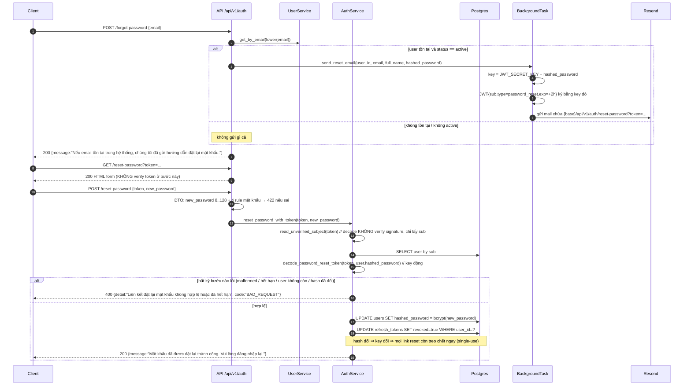

# Xác thực & phân quyền

Chương này đặc tả **toàn bộ** cơ chế xác thực (authentication) và phân quyền (authorization) của backend IQX gốc (FastAPI) ở mức đủ để cài lại y hệt bằng NestJS mà không cần mở lại source Python. Mọi con số, tên claim, tên cột, message tiếng Việt trong chương này được đọc trực tiếp từ source; những chỗ không đọc được đều đánh dấu rõ `CHƯA XÁC ĐỊNH`. Đọc chương này cùng chương CSDL (bảng `users`, `refresh_tokens`, `user_login_history`, `admin_audit_log`, `premium_subscriptions`) vì các guard đều đọc/ghi trực tiếp các bảng đó.

---

## 0. Phạm vi & bản đồ file gốc

| Chủ đề | File gốc |
| --- | --- |
| Hash mật khẩu + tạo/giải mã JWT | `app/core/security.py` |
| Token email (verify / reset) | `app/core/email_tokens.py` |
| Dependency guard chain | `app/api/deps.py` |
| AuditContext | `app/api/deps_audit.py` |
| Login / refresh / logout / reset password | `app/services/auth.py` |
| Đăng ký, verify email, CRUD user | `app/services/user.py`, `app/repositories/user.py` |
| Quy tắc premium | `app/services/premium.py`, `app/repositories/premium.py`, `app/models/premium.py` |
| Model | `app/models/user.py`, `app/models/refresh_token.py`, `app/models/login_history.py`, `app/models/admin_audit.py` |
| Schema (DTO) | `app/schemas/auth.py`, `app/schemas/user.py` |
| Endpoint | `app/api/v1/endpoints/auth.py` (prefix `/auth`, router gốc `/api/v1`) |
| Lỗi chuẩn hoá | `app/core/exceptions.py`, handler trong `app/main.py` |
| Rate limit | `app/core/rate_limit.py` |
| Request ID | `app/core/request_id.py` |
| Freeze tài khoản giao dịch ảo | `app/models/virtual_trading.py`, `app/services/admin_vt.py`, `app/api/v1/endpoints/admin_vt.py` |
| Job hạ cấp premium hết hạn | `app/services/jobs/expiry_sweep.py` |

Prefix API: router gốc là `APIRouter(prefix="/api/v1")` (`app/api/v1/router.py`), router auth là `APIRouter(prefix="/auth", tags=["Xác thực"])` → mọi endpoint auth có đường dẫn `/api/v1/auth/...`.

---

## 1. Cấu hình & biến môi trường

Đọc từ `app/core/config.py` (Pydantic Settings, `extra="ignore"`, singleton qua `@lru_cache`).

| Env | Kiểu | Default | Bắt buộc | Dùng ở đâu |
| --- | --- | --- | --- | --- |
| `JWT_SECRET_KEY` | string | *(không có default)* | **Có** | Sign/verify access token; sign/verify token verify-email; là *thành phần đầu* của key token reset password |
| `JWT_REFRESH_SECRET_KEY` | string | *(không có default)* | **Có** | Sign/verify refresh token (secret RIÊNG, khác access) |
| `JWT_ALGORITHM` | string | `"HS256"` | Không | Dùng cho **cả 4** loại token (access, refresh, email verify, password reset) |
| `ACCESS_TOKEN_EXPIRE_MINUTES` | int | `30` | Không | TTL access token (phút) |
| `REFRESH_TOKEN_EXPIRE_DAYS` | int | `7` | Không | TTL refresh token (ngày) — dùng cả cho `exp` JWT lẫn cột `refresh_tokens.expires_at` |
| `EMAIL_VERIFY_TOKEN_TTL_HOURS` | int | `48` | Không | TTL token xác thực email (giờ) |
| `PASSWORD_RESET_TOKEN_TTL_HOURS` | int | `2` | Không | TTL token đặt lại mật khẩu (giờ) |
| `RATE_LIMIT_AUTH` | string | `"10/minute"` | Không | Rate limit các endpoint auth |
| `RATE_LIMIT_DEFAULT` | string | `"60/minute"` | Không | Limit mặc định toàn app |
| `APP_ENV` | string | `"development"` | Không | `"production"` bật validate secret; `"testing"`/`"test"` tắt rate limit |
| `EMAIL_ENABLED` | bool | `false` | Không | Khi `false` → email chỉ log, KHÔNG gửi |
| `RESEND_API_KEY` | string | `""` | Không | Khi rỗng → email chỉ log, KHÔNG gửi |
| `EMAIL_FROM` | string | `"IQX <no-reply@iqx.vn>"` | Không | From header |
| `EMAIL_LINK_BASE_URL` | string | `""` | Không | Base URL cho link trong email; rỗng → fallback `APP_PUBLIC_URL` |
| `APP_PUBLIC_URL` | string | `"http://localhost:3000"` | Không | Fallback base URL |

### 1.1 Validate secret khi production

`@model_validator(mode="after")` tên `_reject_placeholder_jwt_secrets`: chỉ chạy khi `APP_ENV == "production"`. Với **cả hai** field `JWT_SECRET_KEY` và `JWT_REFRESH_SECRET_KEY`:

1. Nếu giá trị khớp `_PLACEHOLDER_PATTERNS` (regex placeholder — nội dung chính xác của regex nằm ở đầu `app/core/config.py`, **CHƯA XÁC ĐỊNH đầy đủ trong chương này — cần đọc `app/core/config.py` phần khai báo `_PLACEHOLDER_PATTERNS`**) → raise lỗi khởi động: `"{field} contains a placeholder value and must be changed before running in production (APP_ENV=production)."`
2. Nếu `len(value) < 32` → raise: `"{field} is too short ({n} chars). Use at least 32 characters in production."`

→ NestJS: cài trong lớp validate config lúc bootstrap (`ConfigModule.forRoot({ validate })`), fail-fast khi `APP_ENV=production`.

---

## 2. Hash mật khẩu (bcrypt qua passlib)

### 2.1 Cấu hình gốc

`app/core/security.py`:

- `pwd_context = CryptContext(schemes=["bcrypt"], deprecated="auto")`
- `hash_password(password) -> str` = `pwd_context.hash(password)`
- `verify_password(plain, hashed) -> bool` = `pwd_context.verify(plain, hashed)`

Dependency: `passlib[bcrypt]>=1.7,<2.0` và `bcrypt>=4.0,<5.0` (`pyproject.toml`); `uv.lock` ghim `bcrypt==4.3.0`.

Ý nghĩa `deprecated="auto"`: passlib coi *mọi scheme trừ scheme mặc định* là deprecated. Vì `schemes` chỉ có duy nhất `bcrypt`, thực tế **không có scheme nào bị deprecated**. Source **không hề gọi** `verify_and_update()` ở bất kỳ đâu → **KHÔNG có logic rehash-khi-đăng-nhập**. Impl TS mới cũng không cần rehash.

### 2.2 Cost (rounds)

Source **không truyền** `bcrypt__rounds` / `bcrypt__default_rounds` → dùng default của passlib.

- `CHƯA XÁC ĐỊNH từ source repo này`: giá trị cost thực tế của hash đang nằm trong DB. Theo tài liệu passlib 1.7.x, `bcrypt.default_rounds = 12` (thông tin từ tài liệu passlib, **không** đọc được từ repo).
- Cách xác minh chắc chắn trước khi migrate: đọc prefix hash thật trong DB, ví dụ `SELECT DISTINCT substring(hashed_password, 1, 7) FROM users;` → chuỗi dạng `$2b$12$` cho biết ident `$2b$` và cost `12`.

### 2.3 Yêu cầu tương thích BẮT BUỘC khi viết lại bằng TS

> **Hash bcrypt cũ trong DB PHẢI verify được bởi impl TS mới.** Không được đổi thuật toán (argon2, scrypt, pbkdf2) và không được "reset toàn bộ mật khẩu" khi migrate — cột `users.hashed_password` là `VARCHAR(1024)` chứa hash bcrypt modular-crypt hiện hữu.

Quy tắc cụ thể:

1. Dùng `bcrypt` (native, node-gyp) hoặc `bcryptjs`. Cả hai đọc được modular crypt format `$2<ident>$<cost>$<22-char salt><31-char hash>`.
2. Phải verify được **cả** ident `$2a$`, `$2b$`, `$2y$` (passlib chấp nhận cả ba; nếu DB có hash sinh bởi lib khác thì ident có thể là `$2a$`/`$2y$`).
3. Cost khi **hash mới** nên đặt đúng bằng cost đang có trong DB để không đổi đặc tính hiệu năng (`bcrypt.hash(pw, 12)` nếu DB đang là 12). Cost trong hash cũ luôn được đọc từ chính chuỗi hash khi verify → hash cũ vẫn verify đúng dù cost mới khác.
4. **Giới hạn 72 byte của bcrypt**: passlib với scheme `bcrypt` (không phải `bcrypt_sha256`) **không** pre-hash SHA-256. Mật khẩu dài > 72 byte bị bcrypt cắt. Impl TS phải giữ đúng hành vi (không tự thêm pre-hash), nếu không những mật khẩu > 72 byte đang tồn tại sẽ verify sai.
   - Lưu ý phụ: `bcrypt` 4.x của Python raise lỗi khi password chứa NUL byte; policy mật khẩu ở tầng schema (mục 12.1) đã chặn phần lớn ca lạ, nhưng độ dài tối đa 128 ký tự cũng đã được validate.
5. `verify_password` chỉ trả `true/false`; nếu hash trong DB bị lỗi format, passlib raise exception → tại call site login, exception này KHÔNG được bắt riêng (sẽ thành 500). Impl TS nên giữ nguyên "hash lỗi ⇒ lỗi server", **không** biến thành 401 âm thầm nếu muốn 1:1; nhưng đây là điểm nên cải thiện (xem mục 18).

Nơi dùng `hash_password`:

| Nơi | File |
| --- | --- |
| Đăng ký user | `app/services/user.py::UserService.register` |
| Admin tạo user | `app/services/user.py::UserService.admin_create` |
| Reset password qua token email | `app/services/auth.py::reset_password_with_token` |
| Admin reset password (sinh mật khẩu tạm 16 ký tự) | `app/services/admin_users.py::AdminUserService.reset_password` |

---

## 3. Access token

### 3.1 Tạo (`create_access_token`)

```ts
// Payload thực tế được encode (PyJWT chuyển datetime → NumericDate = giây epoch)
interface AccessTokenPayload {
  sub: string;            // UUID user dạng chuỗi (str(subject))
  iat: number;            // giây epoch, thời điểm phát hành (UTC)
  exp: number;            // iat + ACCESS_TOKEN_EXPIRE_MINUTES * 60
  type: 'access';         // literal
  role?: UserRole;        // extra_claims — luôn được truyền ở login & refresh
}
```

- Chữ ký: HMAC với `JWT_SECRET_KEY`, algorithm `JWT_ALGORITHM` (mặc định `HS256`).
- `extra_claims` là tham số tự do; **hai call site duy nhất** (`AuthService.login` và `AuthService.refresh_tokens`) đều truyền đúng `{"role": user.role.value}`. Không có claim `iss`, `aud`, `nbf`, `jti` trên access token.
- Không có type `Bearer` prefix trong payload; response bọc token trong `TokenResponse` với `token_type: "bearer"`.

### 3.2 Giải mã (`decode_access_token`)

`jwt.decode(token, JWT_SECRET_KEY, algorithms=[JWT_ALGORITHM])` — PyJWT mặc định verify chữ ký + `exp` (leeway 0), **không** verify `iss`/`aud` (không có trong payload). Impl TS: `jwt.verify(token, secret, { algorithms: ['HS256'] })` và **không** bật `issuer`/`audience`.

### 3.3 Hệ quả quan trọng về thu hồi

Access token là **stateless và KHÔNG thu hồi được**. `logout` chỉ revoke refresh token; access token vẫn hợp lệ tới `exp` (tối đa 30 phút mặc định). Tuy nhiên mọi request đều **đọc lại user từ DB** (mục 6) nên nếu user bị xóa mềm/đổi status thì access token cũ lập tức bị chặn ở guard. Impl TS phải giữ đúng đặc tính này: **không** cache user trong JWT payload để bỏ qua DB lookup.

Claim `role` trong access token **không được đọc lại ở bất kỳ đâu** (grep toàn repo: `"role"` chỉ xuất hiện khi *ghi* claim, khi audit, khi export CSV). Phân quyền admin luôn so `current_user.role` lấy từ DB. → NestJS: `RolesGuard` phải so role của **entity user vừa load từ DB**, không phải claim trong token.

---

## 4. Refresh token & token family rotation

### 4.1 Tạo (`create_refresh_token`)

```ts
interface RefreshTokenPayload {
  sub: string;            // UUID user
  iat: number;            // giây epoch
  exp: number;            // iat + REFRESH_TOKEN_EXPIRE_DAYS * 86400
  type: 'refresh';
  jti: string;            // uuid4() dạng chuỗi, sinh mới mỗi lần tạo token
  family: string;         // token_family — uuid4() sinh MỘT LẦN mỗi lần login
}
```

- Secret **RIÊNG**: `JWT_REFRESH_SECRET_KEY` (khác access). Algorithm dùng chung `JWT_ALGORITHM`.
- Hàm trả về tuple `(token, jti)` để caller lưu `jti` vào DB.

### 4.2 Bảng `refresh_tokens` (`app/models/refresh_token.py`)

| Cột | Kiểu | Ràng buộc | Ghi chú |
| --- | --- | --- | --- |
| `id` | UUID | PK, default `uuid4` (sinh phía app) | từ `UUIDMixin` |
| `user_id` | UUID | FK `users.id` `ON DELETE CASCADE`, NOT NULL, index | |
| `jti` | VARCHAR(64) | UNIQUE, index, NOT NULL | khớp claim `jti` |
| `token_family` | VARCHAR(64) | index, NOT NULL | khớp claim `family` |
| `expires_at` | TIMESTAMPTZ | NOT NULL | `now + REFRESH_TOKEN_EXPIRE_DAYS` (tính phía app) |
| `revoked` | BOOLEAN | NOT NULL, default `false`, server_default `false` | |
| `created_at` | TIMESTAMPTZ | NOT NULL | **không** có server_default — app luôn gán `datetime.now(UTC)` |

Model này **không** dùng `TimestampMixin` → **không có** `updated_at`.

Không lưu token, không lưu hash token: chỉ lưu metadata; tính hợp lệ về mật mã do JWT signature lo, tính thu hồi do cột `revoked` lo.

### 4.3 Login → tạo family mới

`AuthService.login` (sau khi xác thực thành công):

1. `token_family = str(uuid4())` — **mỗi lần login là một family mới**.
2. Tạo access token (kèm claim `role`).
3. Tạo refresh token với family đó → nhận `jti`.
4. INSERT 1 hàng `refresh_tokens` (`revoked=false`, `expires_at = now + REFRESH_TOKEN_EXPIRE_DAYS`, `created_at = now`).

### 4.4 Refresh → rotation, thứ tự kiểm tra CHÍNH XÁC

`AuthService.refresh_tokens(refresh_token_str)` — dừng ngay ở lỗi đầu tiên:

| # | Điều kiện | HTTP | `detail` (nguyên văn) | `code` |
| --- | --- | --- | --- | --- |
| 1 | JWT hết hạn (`ExpiredSignatureError`) | 401 | `Refresh token đã hết hạn` | `UNAUTHORIZED` |
| 2 | JWT sai chữ ký/malformed (`InvalidTokenError`) | 401 | `Refresh token không hợp lệ` | `UNAUTHORIZED` |
| 3 | `payload.type != "refresh"` | 401 | `Sai loại token` | `UNAUTHORIZED` |
| 4 | thiếu `jti` **hoặc** thiếu `family` | 401 | `Refresh token bị thiếu thuộc tính` | `UNAUTHORIZED` |
| 5 | không tìm thấy hàng theo `jti` | 401 | `Refresh token không được công nhận` | `UNAUTHORIZED` |
| 6 | `row.token_family != payload.family` | 401 | `Refresh token family không khớp` | `UNAUTHORIZED` |
| 7 | claim atomic thất bại (token đã `revoked`) | 401 | `Refresh token đã bị thu hồi (có thể bị tấn công replay)` | `UNAUTHORIZED` |
| 8 | user không còn (`NotFoundError`) | 401 | `Tài khoản người dùng không còn khả dụng` | `UNAUTHORIZED` |
| 9 | `user.status != ACTIVE` | 401 | `Trạng thái tài khoản: {status}` (vd `Trạng thái tài khoản: suspended`) | `UNAUTHORIZED` |

Side-effect kèm theo:

- Bước 6: gọi `revoke_family(row.token_family)` (revoke theo family **trong DB**, không phải family trong payload) + log WARNING `"Refresh token family mismatch: payload=%s, db=%s (user %s). Revoking family."`.
- Bước 7: gọi `revoke_family(payload.family)` + log WARNING `"Refresh token replay detected for family %s (user %s). Revoking all tokens."`.

Khi qua hết 9 bước:

10. Tạo access token mới (claim `role` từ DB).
11. Tạo refresh token mới **cùng `token_family` cũ** (family sống xuyên chuỗi rotation, chỉ đổi khi login lại).
12. INSERT hàng `refresh_tokens` mới (`revoked=false`, `expires_at = now + TTL`).
13. Trả `TokenResponse { access_token, refresh_token, token_type: "bearer" }`.

### 4.5 Atomic claim — chống race & chống replay

`RefreshTokenRepository.claim_for_rotation(jti)`:

```sql
UPDATE refresh_tokens SET revoked = true WHERE jti = :jti AND revoked = false;
-- trả về rowcount (0 hoặc 1)
```

- `rowcount == 1` → request này "giành" được token, tiếp tục rotation. Đây cũng chính là **hành động revoke jti cũ**: jti cũ không bao giờ dùng lại được.
- `rowcount == 0` → token đã bị revoke trước đó ⇒ hoặc hai request refresh đồng thời (một thắng), hoặc replay token đã dùng ⇒ coi là replay: revoke cả family rồi 401.

Các phương thức repo khác:

| Method | SQL/hành vi |
| --- | --- |
| `create(row)` | `session.add` + `flush` |
| `get_by_jti(jti)` | `SELECT ... WHERE jti = ?` (`scalar_one_or_none`) |
| `revoke_by_jti(jti)` | `UPDATE ... SET revoked=true WHERE jti = ?` (hiện **không** có call site trong app) |
| `claim_for_rotation(jti)` | như trên |
| `revoke_family(family)` | `UPDATE ... SET revoked=true WHERE token_family = ?` |
| `revoke_all_for_user(user_id)` | `UPDATE ... SET revoked=true WHERE user_id = ?` |
| `purge_expired(include_revoked_before=None)` | `DELETE ... WHERE expires_at < now [OR (revoked AND created_at < X)]`, trả rowcount. **Không có job/endpoint nào gọi hàm này** (grep toàn repo) → bảng `refresh_tokens` tăng vô hạn. TS mới nên thêm cron dọn (xem mục 18) |

### 4.6 Điểm quan trọng: `expires_at` trong DB không được kiểm tra

Luồng refresh **không** so `row.expires_at` với `now`. Hết hạn chỉ được cưỡng chế bởi `exp` trong JWT (bước 1). Cột `expires_at` chỉ có tác dụng cho `purge_expired`. Impl TS giữ nguyên (hoặc thêm kiểm tra — nhưng đó là thay đổi hành vi).

### 4.7 Cảnh báo hành vi: revoke-family khi lỗi bị rollback

`get_db` (`app/core/database.py`) mở session, `yield`, rồi `commit()`; nếu có exception thì `rollback()` rồi re-raise. Trong FastAPI, `HTTPException` do route/service raise **được ném vào điểm yield** của dependency ⇒ nhánh `except` chạy ⇒ **rollback**.

Hệ quả: ở bước 6 và bước 7, `revoke_family(...)` được ghi vào transaction rồi request raise 401 ⇒ **UPDATE bị rollback**. Thực tế phòng thủ "phát hiện replay ⇒ khai tử cả family" **không lưu được vào DB** (chỉ còn log WARNING). Token cũ vẫn ở trạng thái `revoked=true` từ lần rotation thành công trước đó nên replay lần sau vẫn bị 401 — vì vậy test hiện tại vẫn xanh.

> Đây là **suy luận từ việc đọc `get_db` + ngữ nghĩa dependency-with-yield của FastAPI**, không phải comment trong source. Khi viết lại bằng NestJS: thực hiện `revokeFamily()` trong **transaction riêng và commit trước khi throw** `UnauthorizedException` — đó là ý định thiết kế được ghi trong docstring `refresh_tokens` ("If a revoked token is replayed, the entire family is invalidated"). Nếu mục tiêu là 1:1 tuyệt đối thì giữ nguyên, nhưng nên ghi vào changelog rằng đây là sửa lỗi có chủ đích.

So sánh: luồng `login` khi thất bại **có gọi `await self._session.commit()` tường minh** trước khi raise → nên login history vẫn được lưu. Đây là bằng chứng cho thấy mẫu "commit trước khi raise" là cách source xử lý vấn đề này ở chỗ khác.

### 4.8 Logout

`AuthService.logout(user_id)` = `revoke_all_for_user(user_id)` + log INFO. Không xóa hàng, chỉ set `revoked=true`. Access token đang lưu hành **vẫn dùng được tới khi hết hạn**.

---

## 5. Token email: xác thực email & đặt lại mật khẩu

`app/core/email_tokens.py` — **là JWT (HS*), KHÔNG phải HMAC thô, KHÔNG có bảng DB, KHÔNG có migration**. Hằng số loại token:

- `EMAIL_VERIFY_TYPE = "email_verify"`
- `PASSWORD_RESET_TYPE = "password_reset"`

Lỗi nội bộ: class `EmailTokenError(Exception)` — do tầng trên map sang HTTP.

### 5.1 Token xác thực email

`create_email_verify_token(user_id, email)`:

```ts
interface EmailVerifyTokenPayload {
  sub: string;              // UUID user
  email: string;            // email tại thời điểm phát hành
  type: 'email_verify';
  iat: number;
  exp: number;              // iat + EMAIL_VERIFY_TOKEN_TTL_HOURS * 3600  (default 48h)
}
```

- Secret: `JWT_SECRET_KEY` (dùng chung với access token).
- Algorithm: `JWT_ALGORITHM`.

`decode_email_verify_token(token)`:

1. `jwt.decode(token, JWT_SECRET_KEY, algorithms=[alg])`; `InvalidTokenError` (bao gồm hết hạn) → `EmailTokenError("Liên kết xác thực không hợp lệ hoặc đã hết hạn")`.
2. `payload.type != "email_verify"` → `EmailTokenError("Sai loại token")`.
3. Trả payload.

**Chống replay: KHÔNG có.** Token verify-email là stateless và **dùng lại được** trong suốt 48h, kể cả sau khi đã verify thành công. `UserService.verify_email_with_token` idempotent: chỉ update khi `not user.is_email_verified`, nếu đã verified thì no-op và vẫn trả success. Claim `email` trong payload **không được so** với `user.email` ở bất kỳ đâu (chỉ dùng `sub`).

Side-effect khi verify thành công lần đầu: UPDATE `users` `is_email_verified = true`, `email_verified_at = now(UTC)`.

**Không có endpoint/guard nào chặn user chưa verify email.** `is_email_verified` chỉ là dữ liệu hiển thị/CSV export. Đây là hành vi phải giữ nguyên (đừng "siết" thêm khi viết lại).

### 5.2 Token đặt lại mật khẩu — single-use bằng key động

`create_password_reset_token(user_id, hashed_password)`:

```ts
interface PasswordResetTokenPayload {
  sub: string;               // UUID user
  type: 'password_reset';
  iat: number;
  exp: number;               // iat + PASSWORD_RESET_TOKEN_TTL_HOURS * 3600 (default 2h)
}
```

- **Key sign = chuỗi nối `JWT_SECRET_KEY + hashed_password`** (nối chuỗi thuần, không HKDF, không separator).
- Payload **không** chứa email, không chứa hash.

Cơ chế chống replay (single-use tự nhiên): key phụ thuộc hash mật khẩu **hiện tại**. Khi mật khẩu đổi (kể cả do chính lần reset đó), hash đổi ⇒ key đổi ⇒ mọi link reset còn treo lập tức verify thất bại. Không cần bảng lưu token đã dùng.

`read_unverified_subject(token)`:

- `jwt.decode(token, options={"verify_signature": False})` — **không** verify chữ ký, và theo PyJWT khi tắt verify_signature thì các kiểm tra khác (kể cả `exp`) cũng tắt.
- Lấy `uuid.UUID(payload["sub"])`. Lỗi (`InvalidTokenError` / `KeyError` / `ValueError`) → `EmailTokenError("Liên kết đặt lại mật khẩu không hợp lệ")`.
- Docstring nhấn mạnh: **chỉ** dùng để tìm user rồi verify lại; tuyệt đối không tin claim nào khác đọc theo đường này.

`decode_password_reset_token(token, hashed_password)`:

1. `key = JWT_SECRET_KEY + hashed_password`; `jwt.decode(token, key, algorithms=[alg])`; lỗi → `EmailTokenError("Liên kết đặt lại mật khẩu không hợp lệ hoặc đã hết hạn")`.
2. `payload.type != "password_reset"` → `EmailTokenError("Sai loại token")`.

### 5.3 Link trong email (`app/services/email.py`)

- `_link_base = (EMAIL_LINK_BASE_URL || APP_PUBLIC_URL).rstrip('/')`
- `verify_link(token) = ${base}/api/v1/auth/verify-email?token=${token}`
- `reset_link(token) = ${base}/api/v1/auth/reset-password?token=${token}`
- Gửi qua Resend HTTP API. Nếu `!EMAIL_ENABLED || !RESEND_API_KEY` → **bỏ qua gửi**, log `[email-disabled] skip send ...`, trả `false`. Mọi lỗi gửi được nuốt (log) và trả `false` — **không bao giờ** làm fail luồng gọi.
- Subject: verify = `"Xác thực địa chỉ email của bạn"`; reset = `"Đặt lại mật khẩu IQX"`.

---

## 6. Chuỗi dependency xác thực (guard chain)

`app/api/deps.py`. Scheme: `bearer_scheme = HTTPBearer(auto_error=False)`.

### 6.1 `auto_error=False` nghĩa là gì

Mặc định `HTTPBearer(auto_error=True)` của FastAPI tự raise **403** với `detail="Not authenticated"` khi thiếu header `Authorization`, và 403 `"Invalid authentication credentials"` khi scheme không phải `Bearer`. Đặt `auto_error=False` ⇒ dependency trả `None` trong cả hai trường hợp, để code tự quyết định:

```
credentials is None  →  UnauthorizedError("Yêu cầu xác thực")  →  HTTP 401, code UNAUTHORIZED,
                        header WWW-Authenticate: Bearer
```

Nghĩa là: **thiếu/hỏng header ⇒ 401 "Yêu cầu xác thực"**, KHÔNG phải 403 mặc định của FastAPI. Đây là điểm bắt buộc phải khớp khi viết lại (frontend dựa vào 401 để refresh token).

### 6.2 `get_current_user`

Nhận `credentials` + `db`; nếu `credentials is None` → 401 như trên. Ngược lại gọi `AuthService.get_current_user_from_token(credentials.credentials)`:

| # | Điều kiện | HTTP | `detail` | `code` |
| --- | --- | --- | --- | --- |
| 1 | access token hết hạn | 401 | `Access token đã hết hạn` | `UNAUTHORIZED` |
| 2 | access token sai chữ ký / malformed | 401 | `Access token không hợp lệ` | `UNAUTHORIZED` |
| 3 | `payload.type != "access"` | 401 | `Sai loại token` | `UNAUTHORIZED` |
| 4 | thiếu `sub` hoặc `sub` không parse được thành UUID | 401 | `Access token bị thiếu thuộc tính` | `UNAUTHORIZED` |
| 5 | user không tồn tại **hoặc** `status == deleted` | 401 | `Tài khoản người dùng không còn khả dụng` | `UNAUTHORIZED` |
| 6 | `user.status != active` (inactive / suspended) | **403** | `Trạng thái tài khoản: {status}` | `FORBIDDEN` |

Chi tiết bước 5: `UserService.get_by_id` raise `NotFoundError("người dùng")` khi `repo.get_by_id` trả None **hoặc** `user.status == UserStatus.DELETED`; `get_current_user_from_token` bắt `NotFoundError` và map sang `UnauthorizedError` — docstring ghi rõ mục tiêu "never leaks 404 for auth-gated operations".

Lưu ý bất đối xứng có chủ đích: status không ACTIVE ⇒ **403** ở luồng access token, nhưng **401** ở luồng refresh token (mục 4.4 bước 9).

### 6.3 `get_current_active_user`

```
if not current_user.is_active → ForbiddenError("Tài khoản chưa được kích hoạt")  → 403 / FORBIDDEN
```

`User.is_active` là property tính toán: `status == UserStatus.ACTIVE` (không phải cột DB). Vì bước 6 của `get_current_user` đã 403 cho mọi status khác ACTIVE, nhánh này **thực tế không bao giờ chạy** — nó là defense-in-depth. Giữ lại khi viết lại để hành vi không lệ thuộc thứ tự.

### 6.4 `get_current_admin`

```
if current_user.role != UserRole.ADMIN → ForbiddenError("Yêu cầu quyền quản trị viên") → 403 / FORBIDDEN
```

Chỉ `admin` qua được. `premium` **không** phải quyền quản trị.

### 6.5 `is_premium_active(user, db)` — hàm helper, không phải guard

```
if user.role == ADMIN: return true
sub = PremiumService(db).get_user_subscription(user.id)
return sub.is_premium
```

Docstring gọi đây là **"single source of truth"** cho câu hỏi "user này có premium không?" — dùng cả cho guard cứng lẫn cho endpoint cần rẽ nhánh mềm. Call site rẽ nhánh mềm: `app/api/v1/endpoints/virtual_trading.py` (đặt lệnh Cấp 0 `san_tap` khi không premium, và field `is_premium` trong response trạng thái tài khoản).

### 6.6 `get_premium_active_user`

```
if not await is_premium_active(current_user, db) → ForbiddenError("Yêu cầu gói Premium đang hoạt động") → 403 / FORBIDDEN
```

### 6.7 Alias & thứ tự thực tế

```python
CurrentUser = Annotated[User, Depends(get_current_active_user)]
AdminUser   = Annotated[User, Depends(get_current_admin)]
PremiumUser = Annotated[User, Depends(get_premium_active_user)]
DBSession   = Annotated[AsyncSession, Depends(get_db)]
```

Chuỗi phụ thuộc: `get_current_user` → `get_current_active_user` → `get_current_admin`; `get_premium_active_user` cũng nối vào `get_current_active_user`.

Quan trọng: `get_current_user` **không được dùng trực tiếp ở bất kỳ endpoint nào** (grep toàn repo: chỉ xuất hiện trong `deps.py`). Nghĩa là **mọi endpoint có auth đều đi qua "active user"**. → NestJS: `AuthGuard('jwt')` mặc định phải bao gồm cả kiểm tra active.

Bảng tổng hợp lỗi guard:

| Guard | Fail | HTTP | detail | code |
| --- | --- | --- | --- | --- |
| bearer scheme | thiếu/hỏng header | 401 | `Yêu cầu xác thực` | `UNAUTHORIZED` |
| get_current_user | (mục 6.2, 6 nhánh) | 401/403 | xem bảng 6.2 | `UNAUTHORIZED`/`FORBIDDEN` |
| get_current_active_user | không active | 403 | `Tài khoản chưa được kích hoạt` | `FORBIDDEN` |
| get_current_admin | không phải admin | 403 | `Yêu cầu quyền quản trị viên` | `FORBIDDEN` |
| get_premium_active_user | không premium | 403 | `Yêu cầu gói Premium đang hoạt động` | `FORBIDDEN` |

---

## 7. Quy tắc Premium

### 7.1 Nguồn dữ liệu

Bảng `premium_subscriptions` (`app/models/premium.py`), **UNIQUE(user_id)** (`uq_premium_subscriptions_user_id`) ⇒ **mỗi user tối đa 1 subscription**. Cột liên quan: `current_plan_id` (FK plans, nullable, `ON DELETE SET NULL`), `current_period_start`, `current_period_end`, `status`, `cancelled_at`, `cancelled_by_user_id`, `cancel_reason`.

```ts
type SubscriptionStatus = 'active' | 'expired' | 'cancelled';
```

### 7.2 `PremiumService.get_user_subscription(user_id)` — logic chính xác

```ts
interface SubscriptionResponse {
  is_premium: boolean;
  is_trial: boolean;                 // default false
  status: string | null;             // giá trị enum, null khi user chưa có subscription nào
  current_plan?: PlanResponse | null;
  current_period_start: string | null;   // ISO datetime
  current_period_end: string | null;
}
```

Thuật toán:

1. Đọc subscription theo `user_id`.
2. Nếu **không có hàng** HOẶC `current_period_end < now(UTC)` → trả `is_premium = false`, `is_trial = false`, `status = sub?.status ?? null`, kèm period start/end nếu có.
   - `_ensure_aware(dt)`: nếu datetime naive thì gán `tzinfo=UTC` (do SQLite trong test lưu naive). Impl TS trên Postgres dùng `timestamptz` nên không cần, nhưng phải so **theo UTC**.
3. Ngược lại → `is_premium = true`; nếu có `current_plan_id` thì load plan, gán `current_plan`, và `is_trial = (plan.code === 'TRIAL_7D')`.

> **Hết hạn tính theo `current_period_end` — KHÔNG theo `status`.** Một subscription `status = 'cancelled'` nhưng `current_period_end` còn tương lai **vẫn được coi là premium** (người dùng đã trả tiền cho phần còn lại của kỳ). Tương tự, `status = 'active'` mà period_end đã qua thì **không** premium (dù job sweep chưa kịp chạy). Đây là hành vi phải copy chính xác.

### 7.3 ADMIN luôn là premium

`is_premium_active` trả `true` ngay khi `user.role == 'admin'`, **không** đọc bảng subscription. Docstring: "Admins implicitly count as premium (full access, no subscription needed)".

### 7.4 Trial 7 ngày

`PremiumService.grant_trial_if_eligible(user_id)` — gọi từ `UserService.register`:

1. Nếu user **đã có bất kỳ** subscription (kể cả `expired`/`cancelled`) → no-op, trả `null` (idempotent, chống cấp trial lặp).
2. Load plan theo code `"TRIAL_7D"`; nếu chưa seed → log WARNING `"TRIAL_7D plan not seeded; skipping trial grant for user %s"` và no-op.
3. Gọi `_extend_subscription(user_id, plan)`.

Độ dài trial lấy từ **`premium_plans.duration_days` của plan `TRIAL_7D`** (dữ liệu seed, không hard-code trong service; tên "7 ngày" chỉ là quy ước của seed).

`_extend_subscription(user_id, plan)`:

1. Thử `atomic_extend_period(...)`: `SELECT ... FOR UPDATE` hàng subscription; nếu không có hàng → trả 0.
   - Nếu `current_period_end > now` → **cộng dồn**: `new_start = current_start`, `new_end = current_end + duration_days`.
   - Ngược lại → **kỳ mới**: `new_start = now`, `new_end = now + duration_days`.
   - Luôn set `status = 'active'` và `current_plan_id = plan.id`.
2. Nếu rowcount 0 (chưa có subscription) → INSERT mới `current_period_start = now`, `current_period_end = now + duration_days`, `status = 'active'`. Nếu vướng `IntegrityError` (race với request khác cùng INSERT) → `rollback()` rồi thử lại theo nhánh extend.
3. Cả hai nhánh đều gọi `_set_user_role_premium(user_id)`: `UPDATE users SET role='premium', updated_at=now()` **và có `session.commit()` tường minh bên trong**. (Đây là lý do `UserService.register` phải `session.refresh(created)` sau khi cấp trial.)

Lỗi cấp trial **không** làm fail đăng ký: `register` bọc trong `try/except Exception` và chỉ log WARNING `"Failed to grant trial for user %s: %s"`.

### 7.5 Vai trò `premium` chỉ là dữ liệu phản chiếu

Không có guard nào so `role == 'premium'` để cấp quyền (grep: `UserRole.PREMIUM` chỉ xuất hiện ở `_set_user_role_premium`, `expiry_sweep`, và bộ lọc/CSV admin). Quyền premium **luôn** được suy ra từ subscription (hoặc admin). Cột `users.role` chỉ để hiển thị/bộ lọc admin.

### 7.6 Job hạ cấp hết hạn (`system.expiry_sweep`)

`app/services/jobs/expiry_sweep.py`, đăng ký trong `app/services/jobs/__init__.py` với `IntervalTrigger(hours=1)`, id `expiry_sweep`, `max_instances=1`, `coalesce=True`, scheduler timezone UTC, chỉ chạy khi `JOBS_ENABLED` không phải false. Cũng gọi được tay qua `admin_system` endpoint.

Mỗi lần chạy:

1. `SELECT` các subscription `status = 'active' AND current_period_end < now` (so bằng datetime **naive** để tương thích SQLite trong test).
2. Set `status = 'expired'` cho từng hàng.
3. Với mỗi `user_id` bị expire: nếu **không còn** subscription nào `status='active' AND current_period_end >= now` thì `UPDATE users SET role='user' WHERE id=? AND role='premium'` — **tuyệt đối không đụng `admin`** (điều kiện `role = 'premium'` trong WHERE).
4. INSERT 1 hàng `admin_audit_log` với `admin_user_id = NULL`, `action = 'system.expiry_sweep'`, `payload_after = { expired_count, downgraded_count, ran_at }`, `note = "Auto-expired {n} subs; downgraded {m} users"`.
5. `commit()`, trả summary `{ expired_count, downgraded_count, ran_at }`.

---

## 8. Enum & vai trò người dùng

`app/models/user.py` — cả hai là `enum.StrEnum`, được map thành **Postgres ENUM theo giá trị** (`values_callable=lambda e: [m.value for m in e]`):

```ts
type UserRole = 'admin' | 'user' | 'premium';
type UserStatus = 'active' | 'inactive' | 'suspended' | 'deleted';
```

| Enum | Tên type trong Postgres | Default (app) | server_default |
| --- | --- | --- | --- |
| `UserRole` | `user_role` | `UserRole.USER` | `'user'` |
| `UserStatus` | `user_status` | `UserStatus.ACTIVE` | `'active'` |

Ý nghĩa:

| Giá trị | Ý nghĩa hành vi |
| --- | --- |
| `role = 'admin'` | Qua `get_current_admin`; **được coi là premium** không cần subscription; không bị `expiry_sweep` hạ cấp |
| `role = 'premium'` | Nhãn phản chiếu việc từng có subscription active; **không** cấp quyền gì trực tiếp |
| `role = 'user'` | Người dùng thường; quyền premium (nếu có) suy từ subscription |
| `status = 'active'` | Điều kiện duy nhất để login & để đi qua guard |
| `status = 'inactive'` | Login → 401 `Trạng thái tài khoản: inactive`; access token cũ → 403 cùng message |
| `status = 'suspended'` | Y như `inactive`, message `Trạng thái tài khoản: suspended` |
| `status = 'deleted'` | Xóa mềm (`deleted_at` được set). `UserService.get_by_id` coi như không tồn tại → 401 `Tài khoản người dùng không còn khả dụng`; bị loại khỏi `list_users` |

Thứ tự khai báo enum trong Python là `ADMIN, USER, PREMIUM` — nếu tạo lại type Postgres bằng migration TypeORM/Prisma, giữ **đúng thứ tự value** này để `pg_enum` khớp DB hiện có (quan trọng nếu có `ORDER BY role`).

---

## 9. Khóa / đóng băng tài khoản (freeze)

### 9.1 Trên bảng `users`: KHÔNG có cột freeze

Đã grep toàn repo (`freeze|frozen|is_frozen`): **bảng `users` không có cột `is_frozen`/`frozen_at`**. Cơ chế "khóa" ở mức tài khoản người dùng là cột **`users.status`** (`inactive` / `suspended` / `deleted`) + cột `deleted_at`. Admin đổi status qua `PATCH /api/v1/users/{id}` (AdminUserUpdate) hoặc bulk op trong `AdminUserService` (audit ghi `before/after = {role, status}`).

Hệ quả khi status rời `active`:

| Nơi | Kết quả |
| --- | --- |
| `POST /api/v1/auth/login` | 401 `Trạng thái tài khoản: {status}`, đồng thời ghi login history `failure_reason = "status:{status}"` |
| `POST /api/v1/auth/refresh` | 401 `Trạng thái tài khoản: {status}` |
| Mọi endpoint cần auth | 403 `Trạng thái tài khoản: {status}` (401 `Tài khoản người dùng không còn khả dụng` nếu `deleted`) |

Lưu ý: đổi status **không** tự revoke refresh token (không có call `revoke_all_for_user` trong luồng admin update). Refresh token cũ sẽ bị chặn ở bước 9 của luồng refresh, nhưng hàng DB vẫn `revoked=false`.

### 9.2 Freeze **tài khoản giao dịch ảo** (`virtual_trading_accounts`)

Đây là nơi duy nhất có khái niệm freeze thực sự:

| Cột | Kiểu | Ghi chú |
| --- | --- | --- |
| `frozen_at` | TIMESTAMPTZ NULL | NULL = không bị khóa |
| `frozen_by_user_id` | UUID NULL, FK `users.id` `ON DELETE SET NULL` | admin đã khóa |
| `freeze_reason` | VARCHAR(1000) NULL | lý do |
| `status` | ENUM `AccountStatus` = `'active' \| 'suspended'` | freeze cũng flip sang `suspended` |

Endpoint (đều yêu cầu `AdminUser` + `AuditCtx`):

| Method | Path | Body | Hành vi |
| --- | --- | --- | --- |
| POST | `/api/v1/admin/vt/accounts/{account_id}/freeze` | `{ reason: string }` (min 1, max 1000) | Xem 9.3 |
| POST | `/api/v1/admin/vt/accounts/{account_id}/unfreeze` | `{ reason?: string \| null }` (max 1000) | Xem 9.3 |
| POST | `/api/v1/admin/vt/accounts/{account_id}/cash-adjust` | `{ amount_vnd: number, reason: string }` | `amount_vnd == 0` → 400 `Số tiền điều chỉnh khác 0` |

### 9.3 `AdminVTService.freeze / unfreeze`

`freeze(account_id, ctx, reason)`:

1. `reason` rỗng/whitespace → 400 `Lý do (reason) bắt buộc`.
2. Không tìm thấy account → 404 (qua `_get`).
3. `frozen_at is not None` → 400 `Tài khoản đã bị tạm khóa`.
4. Set `frozen_at = now(UTC)`, `frozen_by_user_id = ctx.admin_id`, `freeze_reason = reason.strip()`, `status = 'suspended'`; `flush()`.
5. Ghi audit `action = "vt.account.freeze"`, `target_entity = "vt_account"`, `target_id = str(account.id)`, `before = {frozen_at: null, freeze_reason: null, status: <cũ>}`, `after = {frozen_at: <iso>, freeze_reason, status: 'suspended'}`, `note = reason.strip()`.

`unfreeze(account_id, ctx, reason)`:

1. `frozen_at is None` → 400 `Tài khoản đang không bị khóa`.
2. Clear `frozen_at`, `frozen_by_user_id`, `freeze_reason`; `status = 'active'`; `flush()`.
3. Audit `action = "vt.account.unfreeze"` với before/after tương ứng, `note = reason.strip()` hoặc `null` (endpoint truyền `body.reason or ""`).

### 9.4 Endpoint bị chặn khi account bị freeze

`VirtualTradingService.place_order` (`POST /api/v1/virtual-trading/orders`), kiểm tra **sau khi** lock account `FOR UPDATE`:

| Điều kiện | HTTP | detail |
| --- | --- | --- |
| account không tồn tại | 404 | `Không tìm thấy tài khoản giao dịch ảo` |
| `account.status != 'active'` | 403 | `Tài khoản đã bị tạm khóa` |
| `account.frozen_at is not None` | 403 | `Tài khoản tạm khóa` |

Hai message **khác nhau một chữ** ("đã bị tạm khóa" vs "tạm khóa") — copy nguyên văn. Vì `freeze()` set cả `status='suspended'` lẫn `frozen_at`, nhánh status sẽ bắn trước ⇒ trong thực tế message thấy được là `Tài khoản đã bị tạm khóa`; nhánh `frozen_at` là phòng thủ cho dữ liệu lệch.

Ngoài ra `GET /api/v1/virtual-trading/...` (admin list) có query `frozen_only: boolean | null` lọc theo `frozen_at IS (NOT) NULL`.

---

## 10. Login history

Bảng `user_login_history` (`app/models/login_history.py`) — **append-only, 1 hàng cho mỗi lần thử đăng nhập**.

| Cột | Kiểu | Ràng buộc |
| --- | --- | --- |
| `id` | UUID | PK, default `uuid4` (phía app) |
| `user_id` | UUID NULL | FK `users.id` `ON DELETE SET NULL`, index. **NULL khi email không khớp user nào** |
| `email` | VARCHAR(320) | NOT NULL, index. **Luôn lưu lowercase** (`email.lower()`) — giữ lại cả khi login fail |
| `success` | BOOLEAN | NOT NULL, index |
| `failure_reason` | VARCHAR(200) NULL | |
| `ip` | VARCHAR(45) NULL | |
| `user_agent` | VARCHAR(500) NULL | |
| `login_at` | TIMESTAMPTZ | NOT NULL, `server_default now()`, index |

Index thêm: `ix_user_login_history_user_login (user_id, login_at)`.

Ghi khi nào (chỉ trong `AuthService.login`, **không** ghi ở refresh/logout/reset):

| Tình huống | `success` | `failure_reason` | `user_id` | Commit |
| --- | --- | --- | --- | --- |
| Email không tồn tại | `false` | `invalid_credentials` | `null` | **`session.commit()` tường minh** trước khi raise 401 |
| Sai mật khẩu | `false` | `invalid_credentials` | id user | **`session.commit()` tường minh** trước khi raise 401 |
| Status không `active` | `false` | `status:{status}` (vd `status:suspended`) | id user | **`session.commit()` tường minh** trước khi raise 401 |
| Thành công | `true` | `null` | id user | không commit tường minh — `get_db` commit cuối request |

Nguồn `ip` / `user_agent`: endpoint truyền vào `ip = request.client.host if request.client else None`, `user_agent = request.headers.get("user-agent")`.

Thứ tự trong nhánh thành công: `update_last_login(user)` (`UPDATE users SET last_login_at = now(UTC)`) **trước** khi tạo token; ghi history **sau** khi INSERT hàng refresh_tokens; log INFO `"User logged in: %s"`.

Đọc lại: `AdminUserService.login_history(user_id, page, page_size=50)` → `WHERE user_id = ? ORDER BY login_at DESC LIMIT ... OFFSET ...` + tổng count (chỉ lọc theo `user_id`, hàng có `user_id = NULL` không thuộc user nào).

> Điểm bắt buộc khi viết lại bằng NestJS/TypeORM: các nhánh thất bại phải **commit hàng history trước khi throw** — nếu để trong cùng transaction bị rollback bởi exception filter thì mất toàn bộ log đăng nhập thất bại (đây là mẫu mà source cố tình dùng).

---

## 11. AuditContext & admin audit log

### 11.1 `AuditContext` (`app/api/deps_audit.py`)

Dataclass với 4 field, build bởi dependency `get_audit_context(request, admin: AdminUser)`:

| Field | Nguồn |
| --- | --- |
| `admin_id: UUID` | `admin.id` — **dependency đòi `AdminUser`**, nên có `AuditCtx` ⇒ endpoint đã là admin-only |
| `ip: str \| null` | `request.client.host if request.client else None` |
| `user_agent: str \| null` | `request.headers.get("user-agent")` |
| `request_id: str` | `request.state.request_id` **or** header `x-request-id` **or** `str(uuid4())` (theo đúng thứ tự ưu tiên) |

`request.state.request_id` do `RequestIDMiddleware` (`app/core/request_id.py`) đặt: đọc header `X-Request-ID`, nếu không có thì sinh `uuid4()`; đồng thời **echo lại header `X-Request-ID` trên response**. Docstring nêu rõ: ưu tiên `request.state` để request id luôn nhất quán dù client không gửi header.

Alias: `AuditCtx = Annotated[AuditContext, Depends(get_audit_context)]`.

### 11.2 Dùng ở đâu

Endpoint admin nhận cả `admin: AdminUser` và `audit: AuditCtx` rồi truyền `audit` xuống service. Danh sách call site (grep): `admin_vt.py`, `admin_users.py`, `admin_payments.py`, `admin_ipn.py`, `market_analysis.py` (3 endpoint `run_*_now`), `virtual_trading.py` (config update, admin reset user, admin reset all), `users.py` (admin update user).

### 11.3 `AdminAuditService.record(...)` → bảng `admin_audit_log`

Tham số: `ctx` (có thể `None` cho hành động hệ thống), `action`, `target_entity`, `target_id`, `before`, `after`, `note`.

| Cột | Nguồn |
| --- | --- |
| `id` | uuid4 phía app |
| `admin_user_id` | `ctx.admin_id` hoặc `NULL` khi `ctx is None` (system action) |
| `action` | VARCHAR(80), index. Namespace kiểu `"user.update"`, `"premium.plan.create"`, `"premium.subscription.cancel"`, `"vt.account.freeze"`, `"system.expiry_sweep"`, `"user.password_reset"`, `"user.export"` |
| `target_entity` | VARCHAR(60) NULL — `"user"`, `"subscription"`, `"plan"`, `"payment_order"`, `"vt_account"`, ... |
| `target_id` | VARCHAR(100) NULL — PK dạng chuỗi |
| `payload_before` / `payload_after` | JSON NULL (JSONB trong migration Postgres) — chỉ chứa **các key đã đổi**, tạo bởi helper `diff_dict(before, after)` |
| `note` | VARCHAR(1000) NULL |
| `ip`, `user_agent`, `request_id` | từ `ctx` (NULL khi `ctx is None`); độ dài 45 / 500 / 40 |
| `created_at` | TIMESTAMPTZ, `server_default now()`, index |

Index: `(admin_user_id, created_at)`, `(target_entity, target_id)`, `(action, created_at)`.

Ngữ nghĩa transaction (docstring module): endpoint build ctx → service áp mutation vào session → gọi `record()` **trước khi request commit**. `record()` chỉ `add` + `flush` + `refresh` (**không commit**) — transaction ngoài của `get_db` sở hữu commit ⇒ **hoặc cả mutation lẫn audit row cùng vào DB, hoặc không có gì cả**. Và: **không được nuốt exception trong `record()`** — nếu ghi audit lỗi thì cả request phải fail.

`diff_dict(before, after)`: hợp key hai bên, chỉ giữ key có giá trị khác nhau; trả `(None, None)` nếu cả hai rỗng hoặc không có gì đổi.

---

## 12. Hợp đồng endpoint xác thực

Tất cả dưới prefix `/api/v1/auth`. Endpoint có `@limiter.limit(RATE_LIMIT_AUTH)` được ghi rõ.

### 12.1 `POST /register` → 201

Request `UserCreate`:

| Field | Kiểu | Validate |
| --- | --- | --- |
| `email` | EmailStr | định dạng email |
| `password` | string | `min_length=8`, `max_length=128` + policy mật khẩu |
| `full_name` | string | `min_length=1`, `max_length=200` |
| `phone_number` | `string \| null` | `max_length=30`, parse qua libphonenumber region `"VN"` |

Policy mật khẩu (`validate_password_strength`, dùng chung cho register / admin create / reset), kiểm tra theo thứ tự này và trả message tương ứng (Pydantic → HTTP **422**):

1. Không có `[A-Z]` → `Mật khẩu phải chứa ít nhất một chữ in hoa`
2. Không có `[a-z]` → `Mật khẩu phải chứa ít nhất một chữ thường`
3. Không có `\d` → `Mật khẩu phải chứa ít nhất một chữ số`
4. Không có ký tự trong `!@#$%^&*(),.?":{}|<>` → `Mật khẩu phải chứa ít nhất một ký tự đặc biệt`

Validate phone: `phonenumbers.parse(v, "VN")`; nếu không `is_valid_number` → `Số điện thoại không hợp lệ`; nếu `NumberParseException` → `Số điện thoại không hợp lệ. Ví dụ: 0912345678 hoặc +84912345678`. Chuỗi rỗng sau `strip()` → `null`.

Hành vi `UserService.register`:

1. `email_exists(email)` (so lowercase) → 409 `Đã tồn tại người dùng với email này`.
2. Parse phone thành `{phone_number, phone_country_code (+84), phone_national_number, phone_e164}`; nếu parse ra `phone_e164` và `phone_exists(e164)` → 409 `Đã tồn tại người dùng với số điện thoại này`.
   - Nếu parse được nhưng số **không valid**, chỉ giữ `phone_number` thô (các field phụ để trống).
3. INSERT user: `email = email.lower()`, `hashed_password = hash(password)`, `role = 'user'`, `status = 'active'`, + field phone.
4. Cấp trial: `PremiumService.grant_trial_if_eligible(user.id)` trong `try/except` (lỗi chỉ log WARNING).
5. `session.refresh(created)` (vì `_set_user_role_premium` có commit bên trong).
6. Endpoint đăng ký `BackgroundTasks` gửi email xác thực; task bọc `try/except Exception` + `logger.exception("Verification email task failed for %s", email)` ⇒ **không bao giờ** làm fail request.

Response `UserResponse` — **không bao giờ** chứa `hashed_password`. Field: `id, email, full_name, phone_number, phone_country_code, phone_national_number, phone_e164, phone_verified_at, avatar_url, date_of_birth, gender, country, province_state, city, district, ward, street_address, postal_code, role, status, is_email_verified, email_verified_at, last_login_at, created_at, updated_at`.

Rate limit: có.

### 12.2 `POST /login` → 200

Request `LoginRequest`: `{ email: EmailStr, password: string (min_length 1) }`.
Response `TokenResponse`: `{ access_token: string, refresh_token: string, token_type: "bearer" }`.

Hành vi: mục 4.3 + mục 10. Lỗi:

| Điều kiện | HTTP | detail |
| --- | --- | --- |
| user không tồn tại **hoặc** sai mật khẩu | 401 | `Email hoặc mật khẩu không đúng` (**message gộp** — không tiết lộ email có tồn tại) |
| status != active | 401 | `Trạng thái tài khoản: {status}` |

Rate limit: có. Comment trong source ghi rõ dashboard admin dùng **cùng** endpoint này nên admin cũng bị rate limit.

### 12.3 `POST /refresh` → 200

Request `RefreshTokenRequest`: `{ refresh_token: string }` (không có ràng buộc độ dài). Response `TokenResponse`. Hành vi & bảng lỗi: mục 4.4. Rate limit: có. **Không** cần Authorization header.

### 12.4 `POST /logout` → 200

Yêu cầu auth (`CurrentUser`). Revoke **toàn bộ** refresh token của user. Response `MessageResponse`: `{ message: "Đăng xuất thành công" }`. **Không** rate limit.

### 12.5 `GET /me` → 200

Yêu cầu auth (`CurrentUser`). Trả `UserResponse` của user hiện tại. **Không** rate limit.

### 12.6 `GET /verify-email?token=...` → HTML

`include_in_schema=False`, trả `HTMLResponse` (không phải JSON) — đây là link người dùng bấm từ email.

- `UserService.verify_email_with_token(token)`; bắt `EmailTokenError` **và** `NotFoundError` → **400** với trang HTML thông báo `Liên kết xác thực không hợp lệ hoặc đã hết hạn.`
- Thành công → 200 với trang HTML `Email của bạn đã được xác thực thành công. Bạn có thể đóng trang này.`
- Trang render bởi `app/services/email_templates.py::verify_result_page(ok: bool, message: str)`.
- **Không** rate limit. Idempotent (mục 5.1).

### 12.7 `POST /forgot-password` → 200 (luôn luôn)

Request: `{ email: EmailStr }`. Response `MessageResponse` **cố định, không phụ thuộc kết quả**:

```
Nếu email tồn tại trong hệ thống, chúng tôi đã gửi hướng dẫn đặt lại mật khẩu.
```

Hành vi: `UserService.get_by_email(email)`; chỉ khi `user != null && user.status == 'active'` mới đẩy background task gửi email reset (ký bằng `user.hashed_password` hiện tại). Không có email enumeration. Rate limit: có.

### 12.8 `GET /reset-password?token=...` → HTML

`include_in_schema=False`. Trả form "đặt mật khẩu mới" render bởi `reset_form_page(token)`. **Không** verify token ở bước này (chỉ hiển thị form). Không rate limit.

### 12.9 `POST /reset-password` → 200

Request `ResetPasswordRequest`: `{ token: string (min_length 1), new_password: string (8..128, + policy mật khẩu) }`.

`AuthService.reset_password_with_token(token, new_password)` — **mọi** lỗi map về **một** message 400 duy nhất `Liên kết đặt lại mật khẩu không hợp lệ hoặc đã hết hạn` (code `BAD_REQUEST`) để không tiết lộ link nào còn sống:

1. `read_unverified_subject(token)` lỗi → 400 (message trên).
2. `get_by_id(user_id)` raise `NotFoundError` → 400.
3. `decode_password_reset_token(token, user.hashed_password)` lỗi → 400.
4. Thành công: `user.hashed_password = hash_password(new_password)` → `flush()` → `revoke_all_for_user(user.id)` → log INFO `"Password reset via token for user %s"`.

Response: `{ message: "Mật khẩu đã được đặt lại thành công. Vui lòng đăng nhập lại." }`. Rate limit: có.

### 12.10 Những gì KHÔNG tồn tại

- **Không có** endpoint tự đổi mật khẩu khi đã đăng nhập (grep `change-password` / `current_password`: không có kết quả). Người dùng đổi mật khẩu qua luồng forgot-password, hoặc admin gọi reset.
- **Không có** endpoint gửi lại email xác thực cho chính user (chỉ có admin: `AdminUserService.resend_verification`).
- **Không có** OAuth / social login / 2FA / API key.
- **Không có** WebSocket auth: `app/api/v1/endpoints/realtime_ws.py` là **public** ("Access is public (matches the existing public price-board)"), chỉ giới hạn số symbol mỗi connection.

---

## 13. Hình dạng lỗi & rate limit

### 13.1 Body lỗi chuẩn

`AppException` kế thừa `HTTPException`, thêm field `code`. Handler trong `app/main.py`:

```ts
interface ErrorBody {
  detail: string;
  code: string | null;
}
```

```json
{ "detail": "Yêu cầu xác thực", "code": "UNAUTHORIZED" }
```

Bảng exception → status/code (từ `app/core/exceptions.py`):

| Class | HTTP | `code` | detail mặc định | Header thêm |
| --- | --- | --- | --- | --- |
| `NotFoundError(resource)` | 404 | `NOT_FOUND` | `Không tìm thấy {resource}` (mặc định resource = `Tài nguyên`) | — |
| `ConflictError` | 409 | `CONFLICT` | `Tài nguyên đã tồn tại` | — |
| `UnauthorizedError` | 401 | `UNAUTHORIZED` | `Thông tin xác thực không hợp lệ` | **`WWW-Authenticate: Bearer`** (handler forward `exc.headers` — sửa 2026-08-18, xem ch04 §2.2) |
| `ForbiddenError` | 403 | `FORBIDDEN` | `Không đủ quyền truy cập` | — |
| `BadRequestError` | 400 | `BAD_REQUEST` | `Yêu cầu không hợp lệ` | — |
| `UnprocessableEntityError` | 422 | `UNPROCESSABLE_ENTITY` | `Dữ liệu không thể xử lý` | — |
| `ServiceUnavailableError` | 503 | `SERVICE_UNAVAILABLE` | `Dịch vụ tạm thời không khả dụng` | — |

Schema OpenAPI `ErrorResponse` còn có field optional `errors: list[dict] | null` (dùng cho lỗi validate) — `CHƯA XÁC ĐỊNH` handler nào điền field này; cần đọc phần còn lại của `app/main.py` (handler `RequestValidationError`) nếu cần khớp 1:1 body 422.

### 13.2 Rate limit

`app/core/rate_limit.py`: slowapi `Limiter(key_func=get_remote_address, default_limits=[RATE_LIMIT_DEFAULT], storage_uri="memory://", enabled=APP_ENV not in ("testing","test"))`, cộng `SlowAPIMiddleware` toàn app.

- Khóa theo **IP remote** (không theo user) → NestJS: `ThrottlerGuard` với tracker = IP.
- Storage **in-memory** ⇒ không chia sẻ giữa nhiều worker/instance. Production hiện chạy 1 worker (xem docstring `app/services/jobs/__init__.py`).
- Endpoint auth: `10/minute` (default env). Toàn app: `60/minute`.
- Vượt hạn → 429 qua `_rate_limit_exceeded_handler` của slowapi. **Hình dạng body 429 do slowapi quyết định — `CHƯA XÁC ĐỊNH` chính xác; cần kiểm tra runtime nếu cần khớp byte-level.**

---

## 14. Kiểu TypeScript chuẩn (đưa vào `docs/rewrite-ts/types`)

```ts
// ── Enum ────────────────────────────────────────────────────────────────────
export type UserRole = 'admin' | 'user' | 'premium';
export type UserStatus = 'active' | 'inactive' | 'suspended' | 'deleted';
export type SubscriptionStatus = 'active' | 'expired' | 'cancelled';
export type VtAccountStatus = 'active' | 'suspended';

// ── JWT payload ─────────────────────────────────────────────────────────────
export interface AccessTokenPayload {
  sub: string;          // UUID user
  iat: number;          // giây epoch
  exp: number;          // iat + ACCESS_TOKEN_EXPIRE_MINUTES*60
  type: 'access';
  role?: UserRole;      // extra_claims; hai call site hiện tại LUÔN gửi
}

export interface RefreshTokenPayload {
  sub: string;
  iat: number;
  exp: number;          // iat + REFRESH_TOKEN_EXPIRE_DAYS*86400
  type: 'refresh';
  jti: string;          // uuid v4, unique trong bảng refresh_tokens
  family: string;       // uuid v4, cố định suốt chuỗi rotation của 1 lần login
}

export interface EmailVerifyTokenPayload {
  sub: string;
  email: string;
  type: 'email_verify';
  iat: number;
  exp: number;          // iat + EMAIL_VERIFY_TOKEN_TTL_HOURS*3600
}

export interface PasswordResetTokenPayload {
  sub: string;
  type: 'password_reset';
  iat: number;
  exp: number;          // iat + PASSWORD_RESET_TOKEN_TTL_HOURS*3600
  // key = JWT_SECRET_KEY + user.hashedPassword
}

// ── Đối tượng user đã xác thực gắn vào request ──────────────────────────────
/**
 * Guard chain trả về ENTITY user đầy đủ (không phải subset của JWT).
 * Mọi field dưới đây đọc từ bảng `users`; `isActive` là property tính toán.
 */
export interface CurrentUser {
  id: string;                          // UUID
  email: string;                       // luôn lowercase trong DB
  fullName: string;
  role: UserRole;
  status: UserStatus;
  isEmailVerified: boolean;
  emailVerifiedAt: string | null;
  lastLoginAt: string | null;
  deletedAt: string | null;
  phoneNumber: string | null;
  phoneCountryCode: string | null;
  phoneNationalNumber: string | null;
  phoneE164: string | null;
  phoneVerifiedAt: string | null;
  avatarUrl: string | null;
  dateOfBirth: string | null;          // date
  gender: string | null;
  country: string | null;
  provinceState: string | null;
  city: string | null;
  district: string | null;
  ward: string | null;
  streetAddress: string | null;
  postalCode: string | null;
  telegramChatId: string | null;
  telegramLinkedAt: string | null;
  createdAt: string;
  updatedAt: string;
  /** = status === 'active' (property tính toán, KHÔNG phải cột DB) */
  readonly isActive: boolean;
}

export interface AuditContext {
  adminId: string;                     // UUID admin (dep bắt buộc là admin)
  ip: string | null;
  userAgent: string | null;
  requestId: string;                   // state.requestId || header x-request-id || uuid4
}

// ── DTO ─────────────────────────────────────────────────────────────────────
export interface LoginRequest { email: string; password: string }
export interface RefreshTokenRequest { refreshToken: string }
export interface ForgotPasswordRequest { email: string }
export interface ResetPasswordRequest { token: string; newPassword: string }
export interface TokenResponse {
  accessToken: string;
  refreshToken: string;
  tokenType: 'bearer';
}
export interface MessageResponse { message: string }
export interface ErrorBody { detail: string; code: string | null; errors?: Array<Record<string, unknown>> | null }

export interface SubscriptionStatusResult {
  isPremium: boolean;
  isTrial: boolean;
  status: SubscriptionStatus | null;
  currentPlan: PlanResponse | null;
  currentPeriodStart: string | null;
  currentPeriodEnd: string | null;
}
```

> Lưu ý naming: JSON trả ra của backend gốc dùng **snake_case** (`access_token`, `token_type`, `is_premium`, `full_name`, ...). Nếu NestJS bật `camelCase` interceptor thì **đó là breaking change với frontend**; mặc định phải giữ snake_case trên wire.

---

## 15. Mapping sang NestJS

| FastAPI | NestJS | Ghi chú cài đặt |
| --- | --- | --- |
| `HTTPBearer(auto_error=False)` + `UnauthorizedError("Yêu cầu xác thực")` | `JwtAuthGuard` override `handleRequest` | Khi thiếu token/thiếu header phải throw `UnauthorizedException({ detail: 'Yêu cầu xác thực', code: 'UNAUTHORIZED' })`. **Không** để Passport trả body mặc định `{statusCode, message}`. Nhớ set header `WWW-Authenticate: Bearer` — `ExceptionFilter` của bản TS **phải forward headers của exception**, đúng như bản Python sau khi sửa (ch04 §2.2) |
| `decode_access_token` | `JwtStrategy extends PassportStrategy(Strategy, 'jwt')` | `secretOrKey: JWT_SECRET_KEY`, `algorithms: ['HS256']`, `ignoreExpiration: false`, `jwtFromRequest: ExtractJwt.fromAuthHeaderAsBearerToken()`. **Phân biệt** lỗi hết hạn vs sai chữ ký để trả đúng 2 message (`Access token đã hết hạn` / `Access token không hợp lệ`) — Passport gộp cả hai, nên cần bắt `TokenExpiredError` bằng `verify` thủ công hoặc dùng `info` trong `handleRequest` |
| `get_current_user_from_token` (validate `type`, `sub`, load DB, check status) | `JwtStrategy.validate(payload)` | Thứ tự: `type !== 'access'` → 401 `Sai loại token`; `sub` thiếu/không phải UUID → 401 `Access token bị thiếu thuộc tính`; load user; không có hoặc `status='deleted'` → 401 `Tài khoản người dùng không còn khả dụng`; `status !== 'active'` → **403** `Trạng thái tài khoản: {status}` |
| `get_current_active_user` / alias `CurrentUser` | cùng `JwtAuthGuard` (mặc định) | Thêm kiểm tra dư `!user.isActive → 403 'Tài khoản chưa được kích hoạt'` |
| `get_current_admin` / `AdminUser` | `@Roles('admin')` + `RolesGuard` | Đọc role từ **user entity đã load**, không đọc claim `role`. Fail → 403 `Yêu cầu quyền quản trị viên` |
| `get_premium_active_user` / `PremiumUser` | `@RequirePremium()` + `PremiumGuard` | Gọi service `isPremiumActive(user)`; fail → 403 `Yêu cầu gói Premium đang hoạt động` |
| `is_premium_active(user, db)` | `PremiumService.isPremiumActive(user): Promise<boolean>` | Public method để endpoint rẽ nhánh mềm (Cấp 0 `san_tap`), không chỉ dùng trong guard |
| `AuditCtx` | `@Audit() ctx: AuditContext` param decorator + `AuditContextInterceptor` | Decorator phải **ngầm yêu cầu admin** hoặc dùng chung với `@Roles('admin')`; `requestId` lấy từ `RequestIdMiddleware` |
| `RequestIDMiddleware` | `RequestIdMiddleware` (global) | Đọc `X-Request-ID` hoặc sinh uuid4, gắn `req.requestId`, echo header trên response |
| `AppException` + handler | `AppException extends HttpException` + `AllExceptionsFilter` | Body **đúng** `{ detail, code }` |
| `@limiter.limit(RATE_LIMIT_AUTH)` | `@Throttle({ default: { limit: 10, ttl: 60_000 } })` | Tracker theo IP; tắt trong test env |
| `get_db` (transaction 1 request) | TypeORM/Prisma transaction per-request interceptor | Giữ nguyên nghĩa: commit cuối request, rollback khi throw. **Ngoại lệ có chủ đích**: login-history khi login fail và revoke-family khi replay phải commit riêng trước khi throw |
| `BackgroundTasks` gửi email | `queueMicrotask` / hàng đợi nhẹ **sau khi response** | Bắt mọi lỗi và log; không được làm fail request |
| `APScheduler` `expiry_sweep` mỗi giờ | `@Interval('expiry_sweep', 3_600_000)` (`@nestjs/schedule`) | Chỉ chạy 1 instance; nếu scale nhiều pod phải thêm advisory lock |

Gợi ý phân rã module:

```
AuthModule
 ├─ AuthController        (/api/v1/auth/*)
 ├─ AuthService           (login, refresh, logout, resetPasswordWithToken)
 ├─ TokenService          (createAccess/createRefresh/decode*, secret riêng cho refresh)
 ├─ EmailTokenService     (verify + reset token, key động cho reset)
 ├─ PasswordService       (bcrypt hash/verify — cost khớp DB)
 ├─ RefreshTokenRepo      (claimForRotation, revokeFamily, revokeAllForUser, purgeExpired)
 ├─ LoginHistoryRepo
 ├─ JwtStrategy / JwtAuthGuard / RolesGuard / PremiumGuard
 └─ decorators: @CurrentUser() @Roles() @RequirePremium() @Audit()
```

---

## 16. Sơ đồ tuần tự

### 16.1 Register → verify email → login → refresh → logout

```mermaid
sequenceDiagram
    autonumber
    participant C as Client
    participant API as API /api/v1/auth
    participant US as UserService
    participant PS as PremiumService
    participant DB as Postgres
    participant BG as BackgroundTask
    participant RS as Resend

    C->>API: POST /register {email,password,full_name,phone?}
    API->>API: Validate DTO (8..128 + 4 rule mật khẩu, phone VN) → 422 nếu sai
    API->>US: register(data)
    US->>DB: email_exists? → 409 "Đã tồn tại người dùng với email này"
    US->>DB: phone_exists(e164)? → 409 "Đã tồn tại người dùng với số điện thoại này"
    US->>DB: INSERT users (role=user, status=active, bcrypt hash)
    US->>PS: grant_trial_if_eligible(user_id)
    PS->>DB: có subscription? → nếu có: no-op
    PS->>DB: plan code TRIAL_7D? → nếu chưa seed: log WARNING, no-op
    PS->>DB: INSERT premium_subscriptions (now → now+duration_days, active)
    PS->>DB: UPDATE users SET role='premium' + COMMIT
    API-->>C: 201 UserResponse (không có hashed_password)
    API->>BG: send_verification_email(user_id,email,full_name)
    BG->>BG: JWT{sub,email,type=email_verify,exp=+48h} ký JWT_SECRET_KEY
    BG->>RS: POST /emails (bỏ qua nếu EMAIL_ENABLED=false hoặc thiếu API key)

    C->>API: GET /verify-email?token=...
    API->>API: decode (JWT_SECRET_KEY) + type=='email_verify'
    alt token lỗi/hết hạn hoặc user không còn
        API-->>C: 400 HTML "Liên kết xác thực không hợp lệ hoặc đã hết hạn."
    else hợp lệ
        API->>DB: UPDATE users SET is_email_verified=true, email_verified_at=now (nếu chưa)
        API-->>C: 200 HTML "Email của bạn đã được xác thực thành công..."
    end

    C->>API: POST /login {email,password}
    API->>DB: SELECT user WHERE email=lower(email)
    alt không có user hoặc bcrypt verify sai
        API->>DB: INSERT user_login_history(success=false, failure_reason='invalid_credentials') + COMMIT
        API-->>C: 401 {detail:"Email hoặc mật khẩu không đúng", code:"UNAUTHORIZED"}
    else status != active
        API->>DB: INSERT user_login_history(success=false, failure_reason='status:{status}') + COMMIT
        API-->>C: 401 {detail:"Trạng thái tài khoản: {status}"}
    else OK
        API->>DB: UPDATE users SET last_login_at=now
        API->>API: family=uuid4; access(JWT_SECRET_KEY, +30m, role claim); refresh(JWT_REFRESH_SECRET_KEY, +7d, jti, family)
        API->>DB: INSERT refresh_tokens(jti, token_family, expires_at, revoked=false)
        API->>DB: INSERT user_login_history(success=true)
        API-->>C: 200 {access_token, refresh_token, token_type:"bearer"}
    end

    C->>API: GET /me (Authorization: Bearer access)
    API->>API: thiếu header → 401 "Yêu cầu xác thực"
    API->>DB: SELECT user by sub; status!=active → 403 "Trạng thái tài khoản: ..."
    API-->>C: 200 UserResponse

    C->>API: POST /refresh {refresh_token}
    API->>API: decode(JWT_REFRESH_SECRET_KEY); type=='refresh'; có jti+family
    API->>DB: SELECT refresh_tokens WHERE jti
    alt không có hàng
        API-->>C: 401 "Refresh token không được công nhận"
    else family lệch
        API->>DB: UPDATE ... revoked=true WHERE token_family=<db family>  (bị rollback khi throw)
        API-->>C: 401 "Refresh token family không khớp"
    else
        API->>DB: UPDATE refresh_tokens SET revoked=true WHERE jti=? AND revoked=false
        alt rowcount = 0 (replay)
            API->>DB: revoke_family(family)  (bị rollback khi throw)
            API-->>C: 401 "Refresh token đã bị thu hồi (có thể bị tấn công replay)"
        else rowcount = 1
            API->>DB: SELECT user; không còn → 401; status!=active → 401
            API->>DB: INSERT refresh_tokens(jti mới, CÙNG token_family)
            API-->>C: 200 {access_token mới, refresh_token mới}
        end
    end

    C->>API: POST /logout (Bearer access)
    API->>DB: UPDATE refresh_tokens SET revoked=true WHERE user_id=?
    API-->>C: 200 {message:"Đăng xuất thành công"}
    Note over C,API: access token cũ VẪN hợp lệ tới exp (không có blacklist)
```

### 16.2 Forgot password → reset password



---

## 17. Checklist nghiệm thu (port TS phải pass hết)

1. Hash bcrypt cũ trong `users.hashed_password` verify thành công bằng impl TS (test với hash thật lấy từ prod, cả `$2a$`/`$2b$`).
2. Thiếu header `Authorization` → **401** `Yêu cầu xác thực` (không phải 403) + header `WWW-Authenticate: Bearer`. Header này từng bị handler nuốt; **đã sửa 2026-08-18** và có test chặn hồi quy — xem ch04 §2.2.
3. Access token hết hạn → 401 `Access token đã hết hạn`; sai chữ ký → 401 `Access token không hợp lệ` (hai message khác nhau).
4. Đưa **refresh token** vào header Authorization → 401 `Sai loại token` (nhờ check `type`).
5. Refresh 1 lần thành công; dùng lại refresh token cũ → 401 `Refresh token đã bị thu hồi (có thể bị tấn công replay)`.
6. Refresh 2 request đồng thời cùng jti → đúng **1** thành công, cái còn lại 401 (atomic conditional UPDATE).
7. Logout → mọi refresh token `revoked=true`; refresh sau đó 401. Access token cũ vẫn 200 cho `/me` tới khi hết hạn.
8. Xóa mềm user (`status='deleted'`) → `/me` với token cũ trả 401 `Tài khoản người dùng không còn khả dụng`, body **không chứa** `hashed_password`.
9. `status='suspended'` → login 401 `Trạng thái tài khoản: suspended`; `/me` 403 cùng message.
10. Login sai mật khẩu → **có** hàng `user_login_history` với `failure_reason='invalid_credentials'` (đã commit dù request trả 401).
11. Login với email lạ → hàng history `user_id = NULL`, `email` lowercase.
12. Đăng ký xong: có subscription `TRIAL_7D` active, `users.role = 'premium'`, gọi endpoint premium → 200.
13. Xóa plan `TRIAL_7D` khỏi seed → đăng ký vẫn 201 (chỉ log WARNING).
14. Subscription `status='cancelled'` nhưng `current_period_end` tương lai → endpoint premium vẫn **200** (không 403).
15. Subscription `status='active'` nhưng `current_period_end` đã qua → endpoint premium **403** `Yêu cầu gói Premium đang hoạt động`.
16. `role='admin'` không có subscription → mọi endpoint premium **200**.
17. Token reset dùng 2 lần → lần 2 **400** `Liên kết đặt lại mật khẩu không hợp lệ hoặc đã hết hạn`.
18. Đổi mật khẩu (bằng luồng reset) → mọi refresh token bị revoke.
19. Token verify-email dùng lại lần 2 → vẫn **200** HTML success (idempotent).
20. `forgot-password` với email không tồn tại → **200** với đúng message chuẩn, không gửi mail.
21. Endpoint admin với user `role='premium'` → 403 `Yêu cầu quyền quản trị viên`.
22. Mọi mutation admin sinh đúng 1 hàng `admin_audit_log` với `request_id` khớp header `X-Request-ID` trên response; nếu ghi audit fail thì cả request fail (không nuốt lỗi).
23. Gọi `POST /login` 11 lần/phút từ cùng IP → lần thứ 11 trả 429.
24. `expiry_sweep`: subscription active quá hạn → `status='expired'`, user `premium`→`user`, user `admin` **không** bị đổi role, có hàng audit `system.expiry_sweep` với `admin_user_id = NULL`.
25. Freeze tài khoản VT → `POST /virtual-trading/orders` trả 403 `Tài khoản đã bị tạm khóa`; freeze lần 2 → 400 `Tài khoản đã bị tạm khóa`; unfreeze khi không khóa → 400 `Tài khoản đang không bị khóa`.

---

## 18. Điểm chưa xác định & khuyến nghị khi viết lại

### 18.1 CHƯA XÁC ĐỊNH (cần đọc thêm)

| Nội dung | Cần đọc |
| --- | --- |
| Cost bcrypt thực tế của hash trong DB | prefix `$2?$NN$` của `users.hashed_password` trong DB prod; hoặc `bcrypt.default_rounds` của passlib runtime |
| Nội dung regex `_PLACEHOLDER_PATTERNS` | `app/core/config.py` (phần khai báo module-level) |
| Body JSON của lỗi 422 (field `errors`) | handler `RequestValidationError` trong `app/main.py` |
| Body JSON của lỗi 429 | `_rate_limit_exceeded_handler` của slowapi (thư viện ngoài) |
| HTML chính xác của trang verify/reset | `app/services/email_templates.py` (`verify_result_page`, `reset_form_page`) |
| Nội dung HTML/text email | `app/services/email_templates.py` (`render_verification_email`, `render_password_reset_email`) |

### 18.2 Khuyến nghị (thay đổi hành vi — phải xin xác nhận trước khi áp)

1. **Commit revoke-family trước khi throw** ở luồng replay refresh token (mục 4.7) — hiện phòng thủ này không lưu được vào DB.
2. **Thêm cron dọn `refresh_tokens`**: `purge_expired()` đã có sẵn nhưng không ai gọi ⇒ bảng phình vô hạn (mục 4.5).
3. **Kiểm tra `refresh_tokens.expires_at` trong DB** khi refresh, không chỉ dựa `exp` của JWT (mục 4.6).
4. **Revoke refresh token khi admin đổi `users.status`** rời `active` hoặc xóa mềm (mục 9.1) — hiện chưa revoke.
5. **Rate limit storage dùng Redis** thay `memory://` nếu chạy >1 instance (mục 13.2).
6. **Bọc `verify_password` để hash lỗi format không thành 500** (mục 2.3, điểm 5).
7. **Xem lại việc `_set_user_role_premium` tự `commit()`** giữa transaction request — với TypeORM/Prisma nên tách thành transaction riêng, tường minh.
