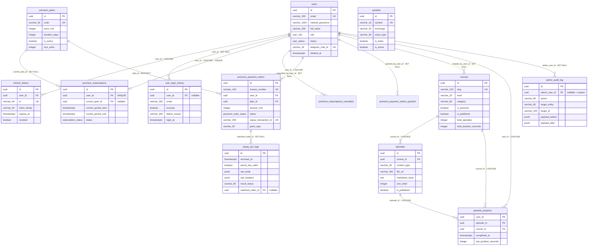

# CSDL — người dùng, thanh toán, bài học, audit

Chương này là **tài liệu tra cứu lược đồ CSDL** cho nhóm bảng nền tảng của IQX: danh tính người dùng (`users`, `refresh_tokens`, `user_login_history`), dòng tiền Premium (`premium_plans`, `premium_subscriptions`, `premium_payment_orders`, `sepay_ipn_logs`), nội dung bài học (`courses`, `episodes`, `episode_progress`), vết audit của admin (`admin_audit_log`) và bảng tham chiếu mã chứng khoán (`symbols`). Mọi cột, kiểu, default, ràng buộc, index và ENUM dưới đây được đọc trực tiếp từ `app/models/*.py` và đối chiếu với `alembic/versions/*.py`; nơi nào ORM và migration lệch nhau thì có mục riêng nêu rõ **DB thật là gì**. Bên TypeScript/NestJS dùng chương này để tái tạo schema bằng Drizzle + SQL DDL mà không cần đọc lại Python.

---

## Quy ước chung

### Naming convention cho constraint

Toàn bộ metadata SQLAlchemy dùng một `naming_convention` duy nhất (đọc từ `app/core/database.py`). Đây là lý do tên constraint trong DB có tiền tố cố định — phải giữ nguyên khi port sang TS, vì thông báo lỗi Postgres và mã xử lý lỗi trùng khoá đều dựa vào tên này.

| Loại | Mẫu | Ví dụ thực tế |
|---|---|---|
| Index | `ix_%(column_0_label)s` | `ix_users_email` |
| Unique | `uq_%(table_name)s_%(column_0_name)s` | `uq_premium_plans_code` |
| Check | `ck_%(table_name)s_%(constraint_name)s` | (xem mục "Sai lệch" — bảng `episodes`) |
| Foreign key | `fk_%(table_name)s_%(column_0_name)s_%(referred_table_name)s` | `fk_refresh_tokens_user_id_users` |
| Primary key | `pk_%(table_name)s` | `pk_users` |

### Mixin dùng lại

`app/core/database.py` định nghĩa hai mixin. **Rất quan trọng cho việc port:**

- `UUIDMixin` → cột `id uuid PRIMARY KEY`, giá trị sinh **ở tầng ứng dụng** bằng `uuid.uuid4()`. Trong DDL **không có** `DEFAULT gen_random_uuid()` (ngoại lệ duy nhất: `admin_audit_log.id`, xem bảng đó). Bên TS phải sinh UUID v4 trong code (ví dụ `crypto.randomUUID()`), **không** dựa vào default của DB.
- `TimestampMixin` → `created_at` + `updated_at`, cả hai `NOT NULL DEFAULT now()`. Vì mixin khai báo `mapped_column(server_default=func.now())` **không kèm type tường minh**, SQLAlchemy map `datetime` → `DateTime()` **không có timezone**. Migration xác nhận: `sa.Column("created_at", sa.DateTime(), ...)`. Nghĩa là các bảng dùng `TimestampMixin` có `timestamp WITHOUT TIME ZONE`.

`updated_at` dùng `onupdate=func.now()` — đây là **hành vi ORM-side**, SQLAlchemy tự thêm `updated_at = now()` vào câu `UPDATE`. **Không có trigger Postgres nào.** Do đó câu `UPDATE` viết tay (raw SQL) sẽ **không** tự cập nhật `updated_at`; trong source Python có chỗ phải set tay (ví dụ `PremiumService._set_user_role_premium` truyền `updated_at=func.now()` vào `values()`). Bên Drizzle phải dùng `.$onUpdate(() => new Date())` hoặc set tay tương ứng.

### Kiểu thời gian — bảng đối chiếu nhanh

Đây là điểm dễ sai nhất khi port. Không có quy tắc chung; phải theo từng bảng.

| Cột | Kiểu Postgres |
|---|---|
| `users.created_at` / `updated_at` | `timestamp` (không tz) |
| `users.*_at` còn lại (`phone_verified_at`, `email_verified_at`, `last_login_at`, `deleted_at`, `telegram_linked_at`) | `timestamptz` |
| `premium_plans.created_at` / `updated_at` | `timestamp` (không tz) |
| `premium_subscriptions.created_at` / `updated_at` | `timestamp` (không tz) |
| `premium_subscriptions.current_period_start` / `current_period_end` / `cancelled_at` | `timestamptz` |
| `premium_payment_orders.created_at` / `updated_at` | `timestamp` (không tz) |
| `premium_payment_orders.paid_at` | `timestamptz` |
| `symbols.created_at` / `updated_at` | `timestamp` (không tz) |
| `symbols.last_synced_at` | `timestamptz` |
| `refresh_tokens.expires_at` / `created_at` | `timestamptz` |
| `user_login_history.login_at` | `timestamptz` |
| `sepay_ipn_logs.received_at` | `timestamptz` |
| `courses` / `episodes` / `episode_progress` — mọi cột thời gian | `timestamptz` |
| `admin_audit_log.created_at` | `timestamptz` |

Hệ quả thực tế trong source: job `expiry_sweep` phải chuyển `datetime.now(UTC)` thành **naive** (`now.replace(tzinfo=None)`) trước khi so sánh, vì lẫn lộn giữa cột có tz và không tz. Bên TS/Drizzle nên chuẩn hoá: luôn ghi UTC, và cẩn thận khi so sánh cột `timestamp` với giá trị có offset.

### Drizzle — lưu ý về API

Ví dụ Drizzle bên dưới dùng dạng **trả về array** ở tham số thứ ba của `pgTable` (`(t) => [...]`), là dạng hiện hành. Bản Drizzle cũ dùng dạng trả về object (`(t) => ({ ... })`) — hai dạng tương đương về DDL.

Khi dùng `.references(() => users.id, { onDelete: 'cascade' })`, Drizzle **tự sinh tên FK constraint** và tên đó **không** khớp mẫu `fk_<table>_<col>_<reftable>`. Nếu muốn giữ đúng tên như Python đã tạo, dùng `foreignKey({ columns, foreignColumns, name })` trong array extras. Ví dụ mẫu:

```ts
import { foreignKey } from 'drizzle-orm/pg-core';

// trong array extras của refreshTokens
foreignKey({
  columns: [t.userId],
  foreignColumns: [users.id],
  name: 'fk_refresh_tokens_user_id_users',
}).onDelete('cascade'),
```

Các ví dụ dưới đây dùng `.references()` inline cho gọn; nếu cần đối chiếu 1:1 tên constraint với DB cũ thì đổi sang mẫu trên.

---

## Danh sách ENUM Postgres

Bốn ENUM native của Postgres thuộc chương này. **Thứ tự giá trị trong ENUM có ý nghĩa** — Postgres sắp xếp `ORDER BY <enum_col>` theo thứ tự khai báo, và giá trị thêm bằng `ALTER TYPE ... ADD VALUE` luôn nằm ở **cuối** (trừ khi dùng `BEFORE`/`AFTER`, mà source không dùng).

| Tên type | Giá trị (đúng thứ tự) | Migration tạo | Giá trị thêm sau |
|---|---|---|---|
| `user_role` | `admin`, `user`, `premium` | `000000000001` tạo với `('admin','user')` | `premium` thêm bởi `83fe4c37a788` (`ALTER TYPE user_role ADD VALUE IF NOT EXISTS 'premium'`) |
| `user_status` | `active`, `inactive`, `suspended`, `deleted` | `000000000001` | — |
| `subscription_status` | `active`, `expired`, `cancelled` | `fb7a64f07299` | — |
| `payment_order_status` | `pending`, `paid`, `failed`, `cancelled`, `refunded` | `fb7a64f07299` tạo với 4 giá trị đầu | `refunded` thêm bởi `66b36f343615` |

Ghi chú vận hành từ source: cả hai migration `ADD VALUE` đều chạy `op.execute("COMMIT")` trước, vì `ALTER TYPE ... ADD VALUE` không chạy được trong transaction block trên một số cấu hình Postgres. Bên TS, nếu dùng Drizzle migration, phải tách câu `ALTER TYPE` ra khỏi transaction tương tự.

`courses.level` và `episodes.content_type` **KHÔNG** là ENUM Postgres — chúng là `varchar` và chỉ được validate ở tầng Pydantic/service (`CourseLevel`, `EpisodeContentType` trong `app/models/lesson.py`). Riêng `content_type` bị siết thêm bằng CHECK constraint (xem bảng `episodes`).

### Type TypeScript cho ENUM

```ts
export type UserRole = 'admin' | 'user' | 'premium';
export type UserStatus = 'active' | 'inactive' | 'suspended' | 'deleted';
export type SubscriptionStatus = 'active' | 'expired' | 'cancelled';
export type PaymentOrderStatus = 'pending' | 'paid' | 'failed' | 'cancelled' | 'refunded';

/** varchar(20), không phải ENUM Postgres — validate ở tầng service. */
export type CourseLevel = 'beginner' | 'intermediate' | 'advanced';
/** varchar(20), không phải ENUM Postgres — thêm CHECK constraint ở bảng episodes. */
export type EpisodeContentType = 'pdf' | 'video' | 'text';
```

```ts
import { pgEnum } from 'drizzle-orm/pg-core';

export const userRoleEnum = pgEnum('user_role', ['admin', 'user', 'premium']);
export const userStatusEnum = pgEnum('user_status', ['active', 'inactive', 'suspended', 'deleted']);
export const subscriptionStatusEnum = pgEnum('subscription_status', ['active', 'expired', 'cancelled']);
export const paymentOrderStatusEnum = pgEnum('payment_order_status', [
  'pending', 'paid', 'failed', 'cancelled', 'refunded',
]);
```

---

## Bảng `users`

Bảng danh tính trung tâm của nền tảng. Mọi bảng khác trong chương này (và phần lớn hệ thống) đều FK về `users.id`. Xoá mềm bằng `status = 'deleted'` + `deleted_at`, **không** DELETE thật.

### Cột

| Cột | Kiểu Postgres | Nullable | Default | Ràng buộc | Ghi chú |
|---|---|---|---|---|---|
| `id` | `uuid` | NO | — (app sinh `uuid4`) | PK `pk_users` | Không có `gen_random_uuid()` ở DB |
| `email` | `varchar(320)` | NO | — | UNIQUE INDEX `ix_users_email` | Lưu lowercase (service `_record_login` gọi `.lower()`; đăng ký/đăng nhập chuẩn hoá về lowercase) |
| `hashed_password` | `varchar(1024)` | NO | — | — | Hash, không bao giờ trả ra API |
| `phone_number` | `varchar(30)` | YES | — | UNIQUE INDEX `ix_users_phone_number` | Số như user nhập |
| `phone_country_code` | `varchar(5)` | YES | — | — | Ví dụ `84` |
| `phone_national_number` | `varchar(20)` | YES | — | — | Phần sau mã quốc gia |
| `phone_e164` | `varchar(20)` | YES | — | UNIQUE CONSTRAINT `uq_users_phone_e164` | Dạng chuẩn hoá E.164 |
| `phone_verified_at` | `timestamptz` | YES | — | — | NULL = chưa xác thực SĐT |
| `full_name` | `varchar(200)` | NO | — | — | Thêm bởi `3819c1575feb`; **thay thế** cặp `first_name`/`last_name` cũ |
| `avatar_url` | `varchar(2048)` | YES | — | — | |
| `date_of_birth` | `date` | YES | — | — | Chỉ ngày, không giờ |
| `gender` | `varchar(20)` | YES | — | — | **Free text**, không ENUM, không CHECK; schema chỉ giới hạn `max_length=20` |
| `country` | `varchar(100)` | YES | — | — | |
| `province_state` | `varchar(100)` | YES | — | — | |
| `city` | `varchar(100)` | YES | — | — | |
| `district` | `varchar(100)` | YES | — | — | |
| `ward` | `varchar(100)` | YES | — | — | |
| `street_address` | `varchar(500)` | YES | — | — | |
| `postal_code` | `varchar(20)` | YES | — | — | |
| `role` | `user_role` | NO | `'user'` | ENUM | Được đồng bộ tự động bởi luồng Premium (xem "Hành vi") |
| `status` | `user_status` | NO | `'active'` | ENUM | |
| `telegram_chat_id` | `varchar(32)` | YES | — | UNIQUE INDEX `ix_users_telegram_chat_id` | Thêm bởi `a7b8c9d0e1f2` (hệ thống alert) |
| `telegram_linked_at` | `timestamptz` | YES | — | — | Thêm bởi `a7b8c9d0e1f2` |
| `is_email_verified` | `boolean` | NO | `false` | — | |
| `email_verified_at` | `timestamptz` | YES | — | — | |
| `last_login_at` | `timestamptz` | YES | — | — | Cập nhật ở mỗi lần login thành công |
| `deleted_at` | `timestamptz` | YES | — | — | Set khi soft-delete |
| `created_at` | `timestamp` (không tz) | NO | `now()` | — | |
| `updated_at` | `timestamp` (không tz) | NO | `now()` | — | ORM-side `onupdate` |

### Khoá, index, quan hệ

- **PK**: `pk_users (id)`.
- **Index/unique**: `ix_users_email` (UNIQUE), `ix_users_phone_number` (UNIQUE), `ix_users_telegram_chat_id` (UNIQUE), `uq_users_phone_e164` (UNIQUE CONSTRAINT). Lưu ý `phone_e164` chỉ có unique **constraint** (Postgres tự tạo index kèm theo), khác với `phone_number` dùng unique **index**.
- **Không có FK ra ngoài.** Bảng này là đích của rất nhiều FK.
- Quan hệ 1-n từ `users`: `refresh_tokens`, `user_login_history`, `premium_payment_orders`, `courses` (`created_by_user_id`), `episode_progress`, `admin_audit_log` (`admin_user_id`), và các cột "ai làm" (`premium_subscriptions.cancelled_by_user_id`, `premium_payment_orders.granted_by_user_id`).
- Quan hệ 1-1: `premium_subscriptions` (nhờ `uq_premium_subscriptions_user_id`).

### Hành vi & side-effect liên quan trực tiếp tới cột

- **Thuộc tính dẫn xuất `is_active`**: model Python có property `is_active` = `status == 'active'`. Đây **không** phải cột DB (cột `is_active` cũ của Prisma đã bị `488c85bb0b6a` drop). Bên TS phải tính, không lưu.
- **Đồng bộ `role` khi kích hoạt Premium**: `PremiumService._set_user_role_premium` chạy `UPDATE users SET role='premium', updated_at=now() WHERE id=:id` **rồi COMMIT ngay trong service** (không đợi transaction của request). Đây là side-effect cố hữu — port sang TS phải quyết định giữ hay bỏ, và nếu bỏ thì phải kiểm lại luồng retry của `_extend_subscription` (nó dựa vào commit này).
- **Hạ cấp `role` khi hết hạn**: job `expiry_sweep` (APScheduler, `IntervalTrigger(hours=1)`, timezone UTC, `max_instances=1`, `coalesce=True`) chạy `UPDATE users SET role='user' WHERE id=:id AND role='premium'`. Điều kiện `role='premium'` là chốt an toàn: **không bao giờ hạ cấp `admin`**.
- **Soft delete**: `AdminUserService.bulk_update` với op `soft_delete` set `status='deleted'` + `deleted_at=now()`. `UserService` khi tra cứu bỏ qua user có `status == 'deleted'`.
- **Ghi audit**: mọi mutation của admin lên `users` đều ghi một dòng `admin_audit_log` với `action` thuộc nhóm `user.*` (`user.create`, `user.update`, `user.delete`, `user.bulk_update`, `user.password_reset`, `user.verify_resend`, `user.export`).
- **Đăng ký tài khoản mới** kéo theo side-effect cấp trial: `UserService` gọi `PremiumService.grant_trial_if_eligible(created.id)` (xem `premium_subscriptions`).

### DDL

```sql
CREATE TYPE user_role AS ENUM ('admin', 'user', 'premium');
CREATE TYPE user_status AS ENUM ('active', 'inactive', 'suspended', 'deleted');

CREATE TABLE users (
    id                    uuid          NOT NULL,
    email                 varchar(320)  NOT NULL,
    hashed_password       varchar(1024) NOT NULL,
    phone_number          varchar(30),
    phone_country_code    varchar(5),
    phone_national_number varchar(20),
    phone_e164            varchar(20),
    phone_verified_at     timestamptz,
    full_name             varchar(200)  NOT NULL,
    avatar_url            varchar(2048),
    date_of_birth         date,
    gender                varchar(20),
    country               varchar(100),
    province_state        varchar(100),
    city                  varchar(100),
    district              varchar(100),
    ward                  varchar(100),
    street_address        varchar(500),
    postal_code           varchar(20),
    role                  user_role     NOT NULL DEFAULT 'user',
    status                user_status   NOT NULL DEFAULT 'active',
    telegram_chat_id      varchar(32),
    telegram_linked_at    timestamptz,
    is_email_verified     boolean       NOT NULL DEFAULT false,
    email_verified_at     timestamptz,
    last_login_at         timestamptz,
    deleted_at            timestamptz,
    created_at            timestamp     NOT NULL DEFAULT now(),
    updated_at            timestamp     NOT NULL DEFAULT now(),
    CONSTRAINT pk_users PRIMARY KEY (id),
    CONSTRAINT uq_users_phone_e164 UNIQUE (phone_e164)
);

CREATE UNIQUE INDEX ix_users_email            ON users (email);
CREATE UNIQUE INDEX ix_users_phone_number     ON users (phone_number);
CREATE UNIQUE INDEX ix_users_telegram_chat_id ON users (telegram_chat_id);
```

### Drizzle

```ts
import {
  pgTable, uuid, varchar, boolean, date, timestamp, uniqueIndex,
} from 'drizzle-orm/pg-core';

export const users = pgTable('users', {
  id: uuid('id').primaryKey(),                       // sinh app-side: crypto.randomUUID()
  email: varchar('email', { length: 320 }).notNull(),
  hashedPassword: varchar('hashed_password', { length: 1024 }).notNull(),

  phoneNumber: varchar('phone_number', { length: 30 }),
  phoneCountryCode: varchar('phone_country_code', { length: 5 }),
  phoneNationalNumber: varchar('phone_national_number', { length: 20 }),
  phoneE164: varchar('phone_e164', { length: 20 }),
  phoneVerifiedAt: timestamp('phone_verified_at', { withTimezone: true }),

  fullName: varchar('full_name', { length: 200 }).notNull(),
  avatarUrl: varchar('avatar_url', { length: 2048 }),
  dateOfBirth: date('date_of_birth'),
  gender: varchar('gender', { length: 20 }),

  country: varchar('country', { length: 100 }),
  provinceState: varchar('province_state', { length: 100 }),
  city: varchar('city', { length: 100 }),
  district: varchar('district', { length: 100 }),
  ward: varchar('ward', { length: 100 }),
  streetAddress: varchar('street_address', { length: 500 }),
  postalCode: varchar('postal_code', { length: 20 }),

  role: userRoleEnum('role').notNull().default('user'),
  status: userStatusEnum('status').notNull().default('active'),

  telegramChatId: varchar('telegram_chat_id', { length: 32 }),
  telegramLinkedAt: timestamp('telegram_linked_at', { withTimezone: true }),

  isEmailVerified: boolean('is_email_verified').notNull().default(false),
  emailVerifiedAt: timestamp('email_verified_at', { withTimezone: true }),
  lastLoginAt: timestamp('last_login_at', { withTimezone: true }),
  deletedAt: timestamp('deleted_at', { withTimezone: true }),

  createdAt: timestamp('created_at', { withTimezone: false }).notNull().defaultNow(),
  updatedAt: timestamp('updated_at', { withTimezone: false })
    .notNull().defaultNow().$onUpdate(() => new Date()),
}, (t) => [
  uniqueIndex('ix_users_email').on(t.email),
  uniqueIndex('ix_users_phone_number').on(t.phoneNumber),
  uniqueIndex('ix_users_telegram_chat_id').on(t.telegramChatId),
  uniqueIndex('uq_users_phone_e164').on(t.phoneE164),
]);
```

> Lưu ý: `uq_users_phone_e164` trong DB gốc là **UNIQUE CONSTRAINT**, ở đây mô phỏng bằng unique index cùng tên. Nếu cần đúng loại constraint, dùng `unique('uq_users_phone_e164').on(t.phoneE164)`.

### Type TS

```ts
export interface UserRow {
  id: string;
  email: string;
  hashedPassword: string;
  phoneNumber: string | null;
  phoneCountryCode: string | null;
  phoneNationalNumber: string | null;
  phoneE164: string | null;
  phoneVerifiedAt: Date | null;
  fullName: string;
  avatarUrl: string | null;
  dateOfBirth: string | null;      // 'YYYY-MM-DD'
  gender: string | null;
  country: string | null;
  provinceState: string | null;
  city: string | null;
  district: string | null;
  ward: string | null;
  streetAddress: string | null;
  postalCode: string | null;
  role: UserRole;
  status: UserStatus;
  telegramChatId: string | null;
  telegramLinkedAt: Date | null;
  isEmailVerified: boolean;
  emailVerifiedAt: Date | null;
  lastLoginAt: Date | null;
  deletedAt: Date | null;
  createdAt: Date;
  updatedAt: Date;
}
```

---

## Bảng `refresh_tokens`

Lưu metadata của mỗi refresh token đã phát hành để hỗ trợ **rotation** và **revocation**. Không lưu token gốc — chỉ lưu `jti` (JWT ID) và `token_family`.

### Cột

| Cột | Kiểu Postgres | Nullable | Default | Ràng buộc | Ghi chú |
|---|---|---|---|---|---|
| `id` | `uuid` | NO | — (app sinh) | PK `pk_refresh_tokens` | |
| `user_id` | `uuid` | NO | — | FK → `users.id` **ON DELETE CASCADE**; INDEX `ix_refresh_tokens_user_id` | |
| `jti` | `varchar(64)` | NO | — | UNIQUE INDEX `ix_refresh_tokens_jti` | Khớp claim `jti` trong JWT |
| `token_family` | `varchar(64)` | NO | — | INDEX `ix_refresh_tokens_token_family` | UUID4 dạng string, sinh mới ở mỗi lần **login**; giữ nguyên qua các lần rotate |
| `expires_at` | `timestamptz` | NO | — | — | Tính bằng `now() + REFRESH_TOKEN_EXPIRE_DAYS` |
| `revoked` | `boolean` | NO | `false` | — | |
| `created_at` | `timestamptz` | NO | **KHÔNG có default** | — | Model khai báo `nullable=False` mà không `server_default` → **ứng dụng phải set tay** ở mỗi INSERT |

### Khoá, index, quan hệ

- **PK**: `pk_refresh_tokens (id)`.
- **FK**: `fk_refresh_tokens_user_id_users (user_id) → users(id) ON DELETE CASCADE`. Xoá cứng user sẽ xoá sạch token.
- **Index**: `ix_refresh_tokens_jti` (UNIQUE), `ix_refresh_tokens_token_family`, `ix_refresh_tokens_user_id`.
- Quan hệ n-1 tới `users`.

### Hành vi (bắt buộc tái tạo)

Toàn bộ nằm trong `app/repositories/refresh_token.py` + `app/services/auth.py`:

1. **Login** → sinh `token_family` mới (`uuid4` dạng string), INSERT một dòng `revoked=false`.
2. **Rotate** (`POST /refresh`) — thứ tự kiểm tra, đúng thứ tự này:
   1. Decode refresh JWT. Hết hạn → 401 "Refresh token đã hết hạn". Sai chữ ký/định dạng → 401 "Refresh token không hợp lệ".
   2. `payload.type != 'refresh'` → 401 "Sai loại token".
   3. Thiếu `jti` hoặc `family` → 401 "Refresh token bị thiếu thuộc tính".
   4. Không tìm thấy dòng theo `jti` → 401 "Refresh token không được công nhận".
   5. `row.token_family != payload.family` → **revoke cả family** rồi 401 "Refresh token family không khớp".
   6. **Atomic claim**: `UPDATE refresh_tokens SET revoked=true WHERE jti=:jti AND revoked=false`. Nếu `rowcount == 0` → phát hiện **replay**, revoke cả family, 401 "Refresh token đã bị thu hồi (có thể bị tấn công replay)".
   7. Resolve user; không tồn tại → 401 "Tài khoản người dùng không còn khả dụng"; `status != 'active'` → 401 `Trạng thái tài khoản: <status>`.
   8. Phát cặp token mới **cùng `token_family`**, INSERT dòng mới.
3. **Logout** → `revoke_all_for_user(user_id)`: `UPDATE ... SET revoked=true WHERE user_id=:id`.
4. **Purge** (`purge_expired`): `DELETE` nơi `expires_at < now()`, và (khi truyền `include_revoked_before`) thêm điều kiện `revoked = true AND created_at < :cutoff`. Đây là **DELETE thật**, không soft-delete.

### DDL

```sql
CREATE TABLE refresh_tokens (
    id           uuid        NOT NULL,
    user_id      uuid        NOT NULL,
    jti          varchar(64) NOT NULL,
    token_family varchar(64) NOT NULL,
    expires_at   timestamptz NOT NULL,
    revoked      boolean     NOT NULL DEFAULT false,
    created_at   timestamptz NOT NULL,
    CONSTRAINT pk_refresh_tokens PRIMARY KEY (id),
    CONSTRAINT fk_refresh_tokens_user_id_users
        FOREIGN KEY (user_id) REFERENCES users (id) ON DELETE CASCADE
);

CREATE UNIQUE INDEX ix_refresh_tokens_jti          ON refresh_tokens (jti);
CREATE INDEX        ix_refresh_tokens_token_family ON refresh_tokens (token_family);
CREATE INDEX        ix_refresh_tokens_user_id      ON refresh_tokens (user_id);
```

### Drizzle

```ts
import { pgTable, uuid, varchar, boolean, timestamp, index, uniqueIndex } from 'drizzle-orm/pg-core';

export const refreshTokens = pgTable('refresh_tokens', {
  id: uuid('id').primaryKey(),
  userId: uuid('user_id').notNull()
    .references(() => users.id, { onDelete: 'cascade' }),
  jti: varchar('jti', { length: 64 }).notNull(),
  tokenFamily: varchar('token_family', { length: 64 }).notNull(),
  expiresAt: timestamp('expires_at', { withTimezone: true }).notNull(),
  revoked: boolean('revoked').notNull().default(false),
  // KHÔNG có defaultNow() — bản gốc buộc ứng dụng truyền giá trị.
  createdAt: timestamp('created_at', { withTimezone: true }).notNull(),
}, (t) => [
  uniqueIndex('ix_refresh_tokens_jti').on(t.jti),
  index('ix_refresh_tokens_token_family').on(t.tokenFamily),
  index('ix_refresh_tokens_user_id').on(t.userId),
]);
```

### Type TS

```ts
export interface RefreshTokenRow {
  id: string;
  userId: string;
  jti: string;
  tokenFamily: string;
  expiresAt: Date;
  revoked: boolean;
  createdAt: Date;
}
```

---

## Bảng `user_login_history`

Sổ **append-only**: một dòng cho **mỗi lần thử đăng nhập**, thành công hay thất bại. Dùng cho trang chi tiết user trong admin và điều tra bảo mật.

### Cột

| Cột | Kiểu Postgres | Nullable | Default | Ràng buộc | Ghi chú |
|---|---|---|---|---|---|
| `id` | `uuid` | NO | — (app sinh) | PK `pk_user_login_history` | |
| `user_id` | `uuid` | YES | — | FK → `users.id` **ON DELETE SET NULL**; INDEX | **NULL khi email không khớp user nào** |
| `email` | `varchar(320)` | NO | — | INDEX `ix_user_login_history_email` | Email đã submit, ghi lowercase; giữ lại cả khi login fail |
| `success` | `boolean` | NO | — | INDEX `ix_user_login_history_success` | Không có default — phải set tay |
| `failure_reason` | `varchar(200)` | YES | — | — | Giá trị thực tế trong source: `invalid_credentials`, và `status:<user_status>` (ví dụ `status:suspended`). NULL khi `success = true` |
| `ip` | `varchar(45)` | YES | — | — | Dài 45 để chứa IPv6 |
| `user_agent` | `varchar(500)` | YES | — | — | |
| `login_at` | `timestamptz` | NO | `now()` | INDEX `ix_user_login_history_login_at` | |

### Khoá, index, quan hệ

- **PK**: `pk_user_login_history (id)`.
- **FK**: `fk_user_login_history_user_id_users (user_id) → users(id) ON DELETE SET NULL` — cố ý giữ lịch sử khi user bị xoá cứng.
- **Index**: `ix_user_login_history_user_id`, `ix_user_login_history_email`, `ix_user_login_history_success`, `ix_user_login_history_login_at`, và composite `ix_user_login_history_user_login (user_id, login_at)`.
- Quan hệ n-1 tới `users` (optional).

### Hành vi

- Ghi bởi `AuthService._record_login` — thêm vào session, **không commit riêng**; commit thuộc transaction của request (`get_db`).
- `email` luôn được `.lower()` trước khi ghi.
- Truy vấn admin (`AdminUserService`) sắp xếp `ORDER BY login_at DESC`.
- Không có UPDATE/DELETE nào trên bảng này trong code ứng dụng.

### DDL

```sql
CREATE TABLE user_login_history (
    id             uuid         NOT NULL,
    user_id        uuid,
    email          varchar(320) NOT NULL,
    success        boolean      NOT NULL,
    failure_reason varchar(200),
    ip             varchar(45),
    user_agent     varchar(500),
    login_at       timestamptz  NOT NULL DEFAULT now(),
    CONSTRAINT pk_user_login_history PRIMARY KEY (id),
    CONSTRAINT fk_user_login_history_user_id_users
        FOREIGN KEY (user_id) REFERENCES users (id) ON DELETE SET NULL
);

CREATE INDEX ix_user_login_history_user_id    ON user_login_history (user_id);
CREATE INDEX ix_user_login_history_email      ON user_login_history (email);
CREATE INDEX ix_user_login_history_success    ON user_login_history (success);
CREATE INDEX ix_user_login_history_login_at   ON user_login_history (login_at);
CREATE INDEX ix_user_login_history_user_login ON user_login_history (user_id, login_at);
```

### Drizzle

```ts
export const userLoginHistory = pgTable('user_login_history', {
  id: uuid('id').primaryKey(),
  userId: uuid('user_id').references(() => users.id, { onDelete: 'set null' }),
  email: varchar('email', { length: 320 }).notNull(),
  success: boolean('success').notNull(),
  failureReason: varchar('failure_reason', { length: 200 }),
  ip: varchar('ip', { length: 45 }),
  userAgent: varchar('user_agent', { length: 500 }),
  loginAt: timestamp('login_at', { withTimezone: true }).notNull().defaultNow(),
}, (t) => [
  index('ix_user_login_history_user_id').on(t.userId),
  index('ix_user_login_history_email').on(t.email),
  index('ix_user_login_history_success').on(t.success),
  index('ix_user_login_history_login_at').on(t.loginAt),
  index('ix_user_login_history_user_login').on(t.userId, t.loginAt),
]);
```

### Type TS

```ts
export type LoginFailureReason =
  | 'invalid_credentials'
  | `status:${UserStatus}`;

export interface UserLoginHistoryRow {
  id: string;
  userId: string | null;
  email: string;
  success: boolean;
  failureReason: LoginFailureReason | string | null;
  ip: string | null;
  userAgent: string | null;
  loginAt: Date;
}
```

---

## Bảng `premium_plans`

Danh mục gói Premium có thể mua, kèm thời hạn và giá. Là bảng cấu hình do admin quản lý; xoá là **soft delete** (`is_active = false`).

### Cột

| Cột | Kiểu Postgres | Nullable | Default | Ràng buộc | Ghi chú |
|---|---|---|---|---|---|
| `id` | `uuid` | NO | — (app sinh) | PK `pk_premium_plans` | |
| `code` | `varchar(50)` | NO | — | UNIQUE CONSTRAINT `uq_premium_plans_code` | Mã nghiệp vụ, ví dụ `TRIAL_7D`. Không có index riêng ngoài unique |
| `name` | `varchar(200)` | NO | — | — | Tên hiển thị (tiếng Việt) |
| `description` | `text` | YES | — | — | |
| `price_vnd` | `integer` | NO | — | — | **integer 4 byte** → trần ~2.147 tỷ VND. Không phải `bigint` |
| `duration_days` | `integer` | NO | — | — | Số ngày cộng thêm khi kích hoạt |
| `is_active` | `boolean` | NO | `true` | — | `false` = ẩn khỏi danh sách bán |
| `sort_order` | `integer` | NO | `0` | — | Thấp hơn = đứng trước; gói trial seed `-1` |
| `created_at` | `timestamp` (không tz) | NO | `now()` | — | |
| `updated_at` | `timestamp` (không tz) | NO | `now()` | — | ORM-side `onupdate` |

### Khoá, index, quan hệ

- **PK**: `pk_premium_plans (id)`; **UNIQUE**: `uq_premium_plans_code (code)`.
- **Không có index thường nào** trên bảng này (migration `fb7a64f07299` không tạo).
- Quan hệ 1-n: `premium_subscriptions.current_plan_id` (SET NULL), `premium_payment_orders.plan_id` (RESTRICT).

### Hành vi

- `list_active()` (danh sách cho end-user): `WHERE is_active = true AND code <> 'TRIAL_7D' ORDER BY sort_order, price_vnd`. **Gói trial bị ẩn có chủ đích.**
- `list_all()` (admin): `ORDER BY sort_order, price_vnd`, không lọc.
- `create_plan`: nếu `code` đã tồn tại → lỗi 409 `Đã tồn tại gói với mã '<code>'`.
- `update_plan`: chỉ áp key đã gửi (`exclude_unset=True` ở endpoint); `None` tường minh **được giữ** để xoá field nullable như `description`. Không tìm thấy → 404 "gói Premium".
- **Xoá gói**: soft delete đặt `is_active = false`. Chặn cứng: **không được xoá `TRIAL_7D`** → 400 `Không thể xoá gói TRIAL_7D`.
- Audit: `premium.plan.create`, `premium.plan.update`, `premium.plan.delete`.

### DDL

```sql
CREATE TABLE premium_plans (
    id            uuid         NOT NULL,
    code          varchar(50)  NOT NULL,
    name          varchar(200) NOT NULL,
    description   text,
    price_vnd     integer      NOT NULL,
    duration_days integer      NOT NULL,
    is_active     boolean      NOT NULL DEFAULT true,
    sort_order    integer      NOT NULL DEFAULT 0,
    created_at    timestamp    NOT NULL DEFAULT now(),
    updated_at    timestamp    NOT NULL DEFAULT now(),
    CONSTRAINT pk_premium_plans PRIMARY KEY (id),
    CONSTRAINT uq_premium_plans_code UNIQUE (code)
);
```

### Drizzle

```ts
import { pgTable, uuid, varchar, text, integer, boolean, timestamp, unique } from 'drizzle-orm/pg-core';

export const premiumPlans = pgTable('premium_plans', {
  id: uuid('id').primaryKey(),
  code: varchar('code', { length: 50 }).notNull(),
  name: varchar('name', { length: 200 }).notNull(),
  description: text('description'),
  priceVnd: integer('price_vnd').notNull(),
  durationDays: integer('duration_days').notNull(),
  isActive: boolean('is_active').notNull().default(true),
  sortOrder: integer('sort_order').notNull().default(0),
  createdAt: timestamp('created_at', { withTimezone: false }).notNull().defaultNow(),
  updatedAt: timestamp('updated_at', { withTimezone: false })
    .notNull().defaultNow().$onUpdate(() => new Date()),
}, (t) => [
  unique('uq_premium_plans_code').on(t.code),
]);
```

### Type TS

```ts
export interface PremiumPlanRow {
  id: string;
  code: string;
  name: string;
  description: string | null;
  priceVnd: number;
  durationDays: number;
  isActive: boolean;
  sortOrder: number;
  createdAt: Date;
  updatedAt: Date;
}
```

---

## Bảng `premium_subscriptions`

Kỳ Premium **hiện tại** của một user. Ràng buộc **tối đa 1 dòng / user** (`uq_premium_subscriptions_user_id`) — đây là bảng "trạng thái hiện tại", không phải sổ lịch sử.

### Cột

| Cột | Kiểu Postgres | Nullable | Default | Ràng buộc | Ghi chú |
|---|---|---|---|---|---|
| `id` | `uuid` | NO | — (app sinh) | PK `pk_premium_subscriptions` | |
| `user_id` | `uuid` | NO | — | UNIQUE `uq_premium_subscriptions_user_id`; FK → `users.id` **CASCADE**; INDEX `ix_premium_subscriptions_user_id` | 1-1 với user |
| `current_plan_id` | `uuid` | YES | — | FK → `premium_plans.id` **SET NULL** | NULL khi gói bị xoá cứng |
| `current_period_start` | `timestamptz` | NO | — | — | |
| `current_period_end` | `timestamptz` | NO | — | — | Mốc quyết định "còn Premium hay không" |
| `status` | `subscription_status` | NO | `'active'` | ENUM | |
| `cancelled_at` | `timestamptz` | YES | — | — | Thêm bởi `8095374275be` |
| `cancelled_by_user_id` | `uuid` | YES | — | FK → `users.id` **SET NULL** | Admin đã huỷ; thêm bởi `8095374275be` |
| `cancel_reason` | `varchar(1000)` | YES | — | — | Thêm bởi `8095374275be` |
| `created_at` | `timestamp` (không tz) | NO | `now()` | — | |
| `updated_at` | `timestamp` (không tz) | NO | `now()` | — | ORM-side `onupdate` |

### Khoá, index, quan hệ

- **PK**: `pk_premium_subscriptions (id)`.
- **UNIQUE**: `uq_premium_subscriptions_user_id (user_id)` — đặt tên tường minh trong model, **không** theo naming convention tự động.
- **FK**: `fk_premium_subscriptions_user_id_users` (CASCADE), `fk_premium_subscriptions_current_plan_id_premium_plans` (SET NULL), `fk_premium_subscriptions_cancelled_by_user_id_users` (SET NULL).
- **Index**: `ix_premium_subscriptions_user_id` (không unique — **dư thừa** so với unique constraint ở trên, nhưng có thật trong DB).

### Hành vi (logic gia hạn — phải sao chép chính xác)

`PremiumService._extend_subscription(user_id, plan)`:

1. Gọi `atomic_extend_period`: `SELECT ... WHERE user_id=:id FOR UPDATE` (row lock trên Postgres).
   - Nếu **không** có dòng → trả `0`.
   - Nếu `current_period_end > now` (còn hiệu lực) → **cộng dồn**: `new_start = current_period_start` (giữ nguyên), `new_end = current_period_end + duration_days`.
   - Nếu đã hết hạn → **kỳ mới**: `new_start = now`, `new_end = now + duration_days`.
   - Luôn set `status = 'active'` và `current_plan_id = plan.id`.
2. Nếu `rows > 0` → đọc lại dòng, gọi `_set_user_role_premium`, trả về.
3. Nếu `rows == 0` → INSERT dòng mới (`status='active'`, `start=now`, `end=now+duration`).
   - Nếu INSERT ném `IntegrityError` (hai request đồng thời cùng INSERT) → **rollback session**, gọi lại `atomic_extend_period` với `now` mới, đọc lại, set role, trả về.
4. Mọi nhánh đều kết thúc bằng `UPDATE users SET role='premium'` + COMMIT.

`get_user_subscription(user_id)` — logic đọc trạng thái:
- Không có dòng **hoặc** `current_period_end < now` → `is_premium=false`, `is_trial=false`, `status` = status của dòng (nếu có) hoặc `null`.
- Ngược lại → `is_premium=true`; `is_trial = (plan.code === 'TRIAL_7D')`.
- Lưu ý: kiểm tra dựa vào **`current_period_end` so với now**, không dựa vào cột `status`. Dòng `status='active'` nhưng đã quá hạn vẫn trả `is_premium=false`.

`grant_trial_if_eligible(user_id)` — gọi khi tạo user mới:
- Nếu user **đã có bất kỳ** dòng subscription (kể cả `expired`/`cancelled`) → no-op, trả `null`. (Idempotent, chống cấp trial lặp.)
- Nếu không tìm được plan `TRIAL_7D` → **log warning + no-op** (không ném lỗi, đăng ký vẫn thành công).
- Ngược lại → gọi `_extend_subscription` với plan trial.

Job `expiry_sweep` (mỗi giờ):
1. `SELECT` các dòng `status='active' AND current_period_end < now` (so sánh bằng datetime **naive**).
2. Set `status='expired'` cho từng dòng.
3. Với mỗi `user_id`: nếu **không** còn dòng nào `status='active' AND current_period_end >= now` → `UPDATE users SET role='user' WHERE id=:id AND role='premium'`.
4. INSERT một dòng `admin_audit_log` với `admin_user_id = NULL`, `action='system.expiry_sweep'`, `payload_after = { expired_count, downgraded_count, ran_at }`, `note = "Auto-expired N subs; downgraded M users"`.
5. `COMMIT`.

Audit khác: `premium.subscription.cancel`, `subscription.cancel`, `subscription.extend`.

### DDL

```sql
CREATE TYPE subscription_status AS ENUM ('active', 'expired', 'cancelled');

CREATE TABLE premium_subscriptions (
    id                   uuid                NOT NULL,
    user_id              uuid                NOT NULL,
    current_plan_id      uuid,
    current_period_start timestamptz         NOT NULL,
    current_period_end   timestamptz         NOT NULL,
    status               subscription_status NOT NULL DEFAULT 'active',
    cancelled_at         timestamptz,
    cancelled_by_user_id uuid,
    cancel_reason        varchar(1000),
    created_at           timestamp           NOT NULL DEFAULT now(),
    updated_at           timestamp           NOT NULL DEFAULT now(),
    CONSTRAINT pk_premium_subscriptions PRIMARY KEY (id),
    CONSTRAINT uq_premium_subscriptions_user_id UNIQUE (user_id),
    CONSTRAINT fk_premium_subscriptions_user_id_users
        FOREIGN KEY (user_id) REFERENCES users (id) ON DELETE CASCADE,
    CONSTRAINT fk_premium_subscriptions_current_plan_id_premium_plans
        FOREIGN KEY (current_plan_id) REFERENCES premium_plans (id) ON DELETE SET NULL,
    CONSTRAINT fk_premium_subscriptions_cancelled_by_user_id_users
        FOREIGN KEY (cancelled_by_user_id) REFERENCES users (id) ON DELETE SET NULL
);

CREATE INDEX ix_premium_subscriptions_user_id ON premium_subscriptions (user_id);
```

### Drizzle

```ts
export const premiumSubscriptions = pgTable('premium_subscriptions', {
  id: uuid('id').primaryKey(),
  userId: uuid('user_id').notNull()
    .references(() => users.id, { onDelete: 'cascade' }),
  currentPlanId: uuid('current_plan_id')
    .references(() => premiumPlans.id, { onDelete: 'set null' }),
  currentPeriodStart: timestamp('current_period_start', { withTimezone: true }).notNull(),
  currentPeriodEnd: timestamp('current_period_end', { withTimezone: true }).notNull(),
  status: subscriptionStatusEnum('status').notNull().default('active'),
  cancelledAt: timestamp('cancelled_at', { withTimezone: true }),
  cancelledByUserId: uuid('cancelled_by_user_id')
    .references(() => users.id, { onDelete: 'set null' }),
  cancelReason: varchar('cancel_reason', { length: 1000 }),
  createdAt: timestamp('created_at', { withTimezone: false }).notNull().defaultNow(),
  updatedAt: timestamp('updated_at', { withTimezone: false })
    .notNull().defaultNow().$onUpdate(() => new Date()),
}, (t) => [
  unique('uq_premium_subscriptions_user_id').on(t.userId),
  index('ix_premium_subscriptions_user_id').on(t.userId),
]);
```

### Type TS

```ts
export interface PremiumSubscriptionRow {
  id: string;
  userId: string;
  currentPlanId: string | null;
  currentPeriodStart: Date;
  currentPeriodEnd: Date;
  status: SubscriptionStatus;
  cancelledAt: Date | null;
  cancelledByUserId: string | null;
  cancelReason: string | null;
  createdAt: Date;
  updatedAt: Date;
}
```

---

## Bảng `premium_payment_orders`

Một dòng cho **mỗi đơn / mỗi lần cấp Premium** — dù là thanh toán SePay thật, admin xác nhận tay, hay admin comp miễn phí. Đây là sổ audit dòng tiền, không bao giờ xoá.

### Cột

| Cột | Kiểu Postgres | Nullable | Default | Ràng buộc | Ghi chú |
|---|---|---|---|---|---|
| `id` | `uuid` | NO | — (app sinh) | PK `pk_premium_payment_orders` | |
| `invoice_number` | `varchar(100)` | NO | — | UNIQUE INDEX `ix_premium_payment_orders_invoice_number` | Định dạng: `IQX_<12 hex uppercase>` khi checkout; `GRANT_<12 hex uppercase>` khi admin cấp tay |
| `user_id` | `uuid` | NO | — | FK → `users.id` **CASCADE**; INDEX `ix_premium_payment_orders_user_id` | |
| `plan_id` | `uuid` | NO | — | FK → `premium_plans.id` **ON DELETE RESTRICT** | RESTRICT: **không thể xoá cứng** một gói đã có đơn |
| `amount_vnd` | `integer` | NO | — | — | `0` khi admin comp |
| `currency` | `varchar(3)` | NO | `'VND'` | — | Thực tế luôn `VND`; IPN từ chối mọi currency khác |
| `status` | `payment_order_status` | NO | `'pending'` | ENUM | |
| `sepay_transaction_id` | `varchar(200)` | YES | — | UNIQUE CONSTRAINT `uq_premium_payment_orders_sepay_transaction_id` | Khi IPN không gửi `transaction_id`, service ghi giá trị thay thế `unknown_<invoice_number>` để không vi phạm unique |
| `raw_ipn` | `text` | YES | — | — | JSON dump của payload IPN (chuỗi, không phải JSONB) |
| `paid_at` | `timestamptz` | YES | — | — | |
| `grant_type` | `varchar(20)` | YES | — | — | 3 giá trị trong source: `payment`, `admin_confirmed`, `admin_grant`. **Không có CHECK constraint** |
| `granted_by_user_id` | `uuid` | YES | — | FK → `users.id` **SET NULL** | Admin đã cấp |
| `grant_note` | `text` | YES | — | — | Bằng chứng / lý do do admin nhập |
| `created_at` | `timestamp` (không tz) | NO | `now()` | — | |
| `updated_at` | `timestamp` (không tz) | NO | `now()` | — | ORM-side `onupdate` |

### Khoá, index, quan hệ

- **PK**: `pk_premium_payment_orders (id)`.
- **UNIQUE**: `uq_premium_payment_orders_sepay_transaction_id`, và unique index `ix_premium_payment_orders_invoice_number`.
- **FK**: `fk_premium_payment_orders_user_id_users` (CASCADE), `fk_premium_payment_orders_plan_id_premium_plans` (**RESTRICT**), `fk_premium_payment_orders_granted_by_user_id_users` (SET NULL).
- **Index**: `ix_premium_payment_orders_invoice_number` (UNIQUE), `ix_premium_payment_orders_user_id`.
- Là đích của FK từ `sepay_ipn_logs.matched_order_id` (SET NULL).

### Hành vi

**Tạo đơn (checkout)**: `invoice_number = "IQX_" + uuid4().hex[:12].upper()`, `amount_vnd = plan.price_vnd`, `currency='VND'`, `status='pending'`. Nếu plan không tồn tại → 404; nếu `plan.is_active = false` → 400 `Gói này không còn khả dụng`.

**Atomic claim (dùng chung cho cả IPN và admin xác nhận tay)** — `claim_pending_order`:
```
UPDATE premium_payment_orders
   SET status='paid', paid_at=:paid_at, grant_type=:grant_type
       [, sepay_transaction_id=..., raw_ipn=..., granted_by_user_id=..., grant_note=...]
 WHERE invoice_number=:inv AND status='pending'
```
Tham số nào là `None` thì **cột đó không bị ghi đè** (không set NULL). `rowcount == 0` nghĩa là request khác đã claim → không được báo thành công, không gia hạn subscription. Chỉ **người thắng** claim mới gọi `_extend_subscription`.

**Phân biệt provenance (cố ý, phải giữ)**:
- IPN webhook → `grant_type='payment'`, có `sepay_transaction_id` + `raw_ipn`.
- Admin xác nhận tay (`admin_confirm_pending_payment`) → `grant_type='admin_confirmed'`, `granted_by_user_id`=admin, `grant_note`=bằng chứng, **không bịa** `sepay_transaction_id`/`raw_ipn`.
- Admin comp (`admin_grant_premium`) → tạo đơn `amount_vnd=0`, `invoice_number="GRANT_..."`, rồi `mark_admin_grant` set `grant_type='admin_grant'`.

**Điều kiện kích hoạt từ IPN — đúng thứ tự kiểm tra** (`PremiumService.process_ipn`, mỗi bước fail đều trả `{"success":"true","message":<lý do>}` và **không** lỗi HTTP):
1. `notification_type != 'ORDER_PAID'` → `ignored`
2. thiếu `order` hoặc `transaction` → `ignored`
3. `order.order_status != 'CAPTURED'` → `ignored`
4. `transaction.transaction_status != 'APPROVED'` → `ignored`
5. `order.order_currency != 'VND'` → `ignored`
6. `transaction.transaction_currency` có mà `!= 'VND'` → `currency_mismatch`
7. thiếu `order_invoice_number` → `ignored`
8. `transaction_id` đã ứng với một đơn `status='paid'` → `already_processed`
9. không tìm được đơn theo `invoice_number` → `order_not_found`
10. đơn đã `paid` → `already_processed`
11. `order_amount` parse lỗi (dùng `Decimal`, từ chối ≤ 0 và mọi phần thập phân khác `.00`) → `amount_invalid`
12. `order_amount != order.amount_vnd` → `amount_mismatch`
13. `transaction_amount` (nếu có) parse lỗi → `amount_invalid`; lệch → `amount_mismatch`
14. atomic claim; `rowcount==0` → `already_processed`; ngược lại gia hạn subscription → `processed`

**Housekeeping**: `cancel_pending_for_user(user_id)` → `UPDATE ... SET status='cancelled' WHERE user_id=:id AND status='pending'`.

**Audit**: `premium.grant`, `premium.order.mark_paid`, `premium.order.reconcile`, `premium.order.refund`, `premium.ipn.retry`, `system.ipn_reconcile_scan`.

### DDL

```sql
CREATE TYPE payment_order_status AS ENUM ('pending', 'paid', 'failed', 'cancelled', 'refunded');

CREATE TABLE premium_payment_orders (
    id                   uuid                 NOT NULL,
    invoice_number       varchar(100)         NOT NULL,
    user_id              uuid                 NOT NULL,
    plan_id              uuid                 NOT NULL,
    amount_vnd           integer              NOT NULL,
    currency             varchar(3)           NOT NULL DEFAULT 'VND',
    status               payment_order_status NOT NULL DEFAULT 'pending',
    sepay_transaction_id varchar(200),
    raw_ipn              text,
    paid_at              timestamptz,
    grant_type           varchar(20),
    granted_by_user_id   uuid,
    grant_note           text,
    created_at           timestamp            NOT NULL DEFAULT now(),
    updated_at           timestamp            NOT NULL DEFAULT now(),
    CONSTRAINT pk_premium_payment_orders PRIMARY KEY (id),
    CONSTRAINT uq_premium_payment_orders_sepay_transaction_id UNIQUE (sepay_transaction_id),
    CONSTRAINT fk_premium_payment_orders_user_id_users
        FOREIGN KEY (user_id) REFERENCES users (id) ON DELETE CASCADE,
    CONSTRAINT fk_premium_payment_orders_plan_id_premium_plans
        FOREIGN KEY (plan_id) REFERENCES premium_plans (id) ON DELETE RESTRICT,
    CONSTRAINT fk_premium_payment_orders_granted_by_user_id_users
        FOREIGN KEY (granted_by_user_id) REFERENCES users (id) ON DELETE SET NULL
);

CREATE UNIQUE INDEX ix_premium_payment_orders_invoice_number
    ON premium_payment_orders (invoice_number);
CREATE INDEX ix_premium_payment_orders_user_id
    ON premium_payment_orders (user_id);
```

### Drizzle

```ts
export const premiumPaymentOrders = pgTable('premium_payment_orders', {
  id: uuid('id').primaryKey(),
  invoiceNumber: varchar('invoice_number', { length: 100 }).notNull(),
  userId: uuid('user_id').notNull()
    .references(() => users.id, { onDelete: 'cascade' }),
  planId: uuid('plan_id').notNull()
    .references(() => premiumPlans.id, { onDelete: 'restrict' }),
  amountVnd: integer('amount_vnd').notNull(),
  currency: varchar('currency', { length: 3 }).notNull().default('VND'),
  status: paymentOrderStatusEnum('status').notNull().default('pending'),
  sepayTransactionId: varchar('sepay_transaction_id', { length: 200 }),
  rawIpn: text('raw_ipn'),
  paidAt: timestamp('paid_at', { withTimezone: true }),
  grantType: varchar('grant_type', { length: 20 }),
  grantedByUserId: uuid('granted_by_user_id')
    .references(() => users.id, { onDelete: 'set null' }),
  grantNote: text('grant_note'),
  createdAt: timestamp('created_at', { withTimezone: false }).notNull().defaultNow(),
  updatedAt: timestamp('updated_at', { withTimezone: false })
    .notNull().defaultNow().$onUpdate(() => new Date()),
}, (t) => [
  unique('uq_premium_payment_orders_sepay_transaction_id').on(t.sepayTransactionId),
  uniqueIndex('ix_premium_payment_orders_invoice_number').on(t.invoiceNumber),
  index('ix_premium_payment_orders_user_id').on(t.userId),
]);
```

### Type TS

```ts
export type GrantType = 'payment' | 'admin_confirmed' | 'admin_grant';

export interface PremiumPaymentOrderRow {
  id: string;
  invoiceNumber: string;
  userId: string;
  planId: string;
  amountVnd: number;
  currency: string;                 // thực tế luôn 'VND'
  status: PaymentOrderStatus;
  sepayTransactionId: string | null;
  rawIpn: string | null;            // JSON đã stringify, KHÔNG phải jsonb
  paidAt: Date | null;
  grantType: GrantType | null;
  grantedByUserId: string | null;
  grantNote: string | null;
  createdAt: Date;
  updatedAt: Date;
}
```

---

## Bảng `sepay_ipn_logs`

Sổ **append-only** ghi lại **mọi** callback IPN từ SePay, kể cả callback có `X-Secret-Key` sai. Phục vụ điều tra và luồng reconcile/retry của admin.

### Cột

| Cột | Kiểu Postgres | Nullable | Default | Ràng buộc | Ghi chú |
|---|---|---|---|---|---|
| `id` | `uuid` | NO | — (app sinh) | PK `pk_sepay_ipn_logs` | |
| `received_at` | `timestamptz` | NO | `now()` | INDEX `ix_sepay_ipn_logs_received_at` | |
| `secret_key_valid` | `boolean` | NO | — | INDEX `ix_sepay_ipn_logs_secret_key_valid` | Kết quả validate header `X-Secret-Key`. Không có default |
| `raw_body` | `jsonb` | YES | — | — | Body thô. **Model dùng `sa.JSON` (để test SQLite chạy được) nhưng migration tạo `JSONB` trên Postgres** |
| `raw_headers` | `jsonb` | YES | — | — | Headers đã **redact**: mọi header trong `{x-secret-key, authorization, cookie, set-cookie}` (so sánh lowercase) bị thay bằng `"***"` |
| `result_status` | `varchar(60)` | YES | — | INDEX `ix_sepay_ipn_logs_result_status` | Xem danh sách giá trị bên dưới |
| `matched_order_id` | `uuid` | YES | — | FK → `premium_payment_orders.id` **SET NULL**; INDEX | |
| `sepay_transaction_id` | `varchar(200)` | YES | — | INDEX `ix_sepay_ipn_logs_sepay_transaction_id` | **Không unique** (khác với bảng orders) |
| `error_message` | `text` | YES | — | — | Free text khi xử lý lỗi |

**Không có `created_at`/`updated_at`** — bảng này không dùng `TimestampMixin`; `received_at` thay vai trò đó.

### Giá trị `result_status` thực tế trong source

Từ endpoint `/sepay/ipn` và `PremiumService.process_ipn`:
`secret_invalid`, `invalid_json`, `invalid_payload`, `ignored`, `currency_mismatch`, `order_not_found`, `already_processed`, `amount_invalid`, `amount_mismatch`, `processed`. Ngoài ra `AdminIPNService` khi retry ghi `retried` nếu không có message cụ thể. Cột là `varchar(60)` tự do, **không có CHECK constraint**, nên phải chấp nhận `string`.

### Khoá, index, quan hệ

- **PK**: `pk_sepay_ipn_logs (id)`.
- **FK**: `fk_sepay_ipn_logs_matched_order_id_premium_payment_orders` → SET NULL.
- **Index**: `ix_sepay_ipn_logs_received_at`, `ix_sepay_ipn_logs_secret_key_valid`, `ix_sepay_ipn_logs_result_status`, `ix_sepay_ipn_logs_matched_order_id`, `ix_sepay_ipn_logs_sepay_transaction_id`, composite `ix_sepay_ipn_logs_received_status (received_at, result_status)`.
- Quan hệ n-1 tới `premium_payment_orders` (optional).

### Hành vi

- Ghi bởi `IPNLogService.record` — `add` + `flush` + `refresh`, **không commit riêng**.
- Endpoint IPN ghi log **trước cả khi** biết secret key có hợp lệ: nếu sai key thì ghi `secret_key_valid=false, result_status='secret_invalid'` rồi dừng.
- `AdminIPNService.retry`: **từ chối** retry nếu `result_status == 'processed'`; khi retry thì **tạo dòng log MỚI** (`SePayIPNLog(...)`) chứ không cập nhật dòng cũ — bảng vẫn append-only.
- Job `ipn_reconcile_scan` (`IntervalTrigger(hours=6)`) đối chiếu đơn `pending` treo với bảng này; nó **yêu cầu có dòng `sepay_ipn_logs` làm bằng chứng** — đây chính là lý do tồn tại luồng `admin_confirmed`.

### DDL

```sql
CREATE TABLE sepay_ipn_logs (
    id                   uuid        NOT NULL,
    received_at          timestamptz NOT NULL DEFAULT now(),
    secret_key_valid     boolean     NOT NULL,
    raw_body             jsonb,
    raw_headers          jsonb,
    result_status        varchar(60),
    matched_order_id     uuid,
    sepay_transaction_id varchar(200),
    error_message        text,
    CONSTRAINT pk_sepay_ipn_logs PRIMARY KEY (id),
    CONSTRAINT fk_sepay_ipn_logs_matched_order_id_premium_payment_orders
        FOREIGN KEY (matched_order_id) REFERENCES premium_payment_orders (id) ON DELETE SET NULL
);

CREATE INDEX ix_sepay_ipn_logs_received_at          ON sepay_ipn_logs (received_at);
CREATE INDEX ix_sepay_ipn_logs_secret_key_valid     ON sepay_ipn_logs (secret_key_valid);
CREATE INDEX ix_sepay_ipn_logs_result_status        ON sepay_ipn_logs (result_status);
CREATE INDEX ix_sepay_ipn_logs_matched_order_id     ON sepay_ipn_logs (matched_order_id);
CREATE INDEX ix_sepay_ipn_logs_sepay_transaction_id ON sepay_ipn_logs (sepay_transaction_id);
CREATE INDEX ix_sepay_ipn_logs_received_status      ON sepay_ipn_logs (received_at, result_status);
```

### Drizzle

```ts
import { jsonb } from 'drizzle-orm/pg-core';

export const sepayIpnLogs = pgTable('sepay_ipn_logs', {
  id: uuid('id').primaryKey(),
  receivedAt: timestamp('received_at', { withTimezone: true }).notNull().defaultNow(),
  secretKeyValid: boolean('secret_key_valid').notNull(),
  rawBody: jsonb('raw_body').$type<Record<string, unknown>>(),
  rawHeaders: jsonb('raw_headers').$type<Record<string, string>>(),
  resultStatus: varchar('result_status', { length: 60 }),
  matchedOrderId: uuid('matched_order_id')
    .references(() => premiumPaymentOrders.id, { onDelete: 'set null' }),
  sepayTransactionId: varchar('sepay_transaction_id', { length: 200 }),
  errorMessage: text('error_message'),
}, (t) => [
  index('ix_sepay_ipn_logs_received_at').on(t.receivedAt),
  index('ix_sepay_ipn_logs_secret_key_valid').on(t.secretKeyValid),
  index('ix_sepay_ipn_logs_result_status').on(t.resultStatus),
  index('ix_sepay_ipn_logs_matched_order_id').on(t.matchedOrderId),
  index('ix_sepay_ipn_logs_sepay_transaction_id').on(t.sepayTransactionId),
  index('ix_sepay_ipn_logs_received_status').on(t.receivedAt, t.resultStatus),
]);
```

### Type TS

```ts
export type IpnResultStatus =
  | 'secret_invalid' | 'invalid_json' | 'invalid_payload' | 'ignored'
  | 'currency_mismatch' | 'order_not_found' | 'already_processed'
  | 'amount_invalid' | 'amount_mismatch' | 'processed' | 'retried';

export interface SePayIpnLogRow {
  id: string;
  receivedAt: Date;
  secretKeyValid: boolean;
  rawBody: Record<string, unknown> | null;
  rawHeaders: Record<string, string> | null;   // đã redact -> '***'
  resultStatus: IpnResultStatus | string | null;
  matchedOrderId: string | null;
  sepayTransactionId: string | null;
  errorMessage: string | null;
}
```

---

## Bảng `courses`

Khoá học. Có hai cột **denormalized** (`total_episodes`, `total_duration_seconds`) được tính lại từ `episodes` sau mỗi thay đổi. Xoá là soft delete (`is_published = false`).

### Cột

| Cột | Kiểu Postgres | Nullable | Default | Ràng buộc | Ghi chú |
|---|---|---|---|---|---|
| `id` | `uuid` | NO | — (app sinh) | PK `pk_courses` | |
| `slug` | `varchar(120)` | NO | — | UNIQUE INDEX `ix_courses_slug` | Khoá tra cứu public |
| `title` | `varchar(200)` | NO | — | — | |
| `description` | `text` | YES | — | — | |
| `thumbnail_url` | `varchar(500)` | YES | — | — | |
| `level` | `varchar(20)` | NO | — | — | Giá trị `CourseLevel`: `beginner`/`intermediate`/`advanced`. **Không ENUM, không CHECK** — chỉ validate Pydantic |
| `category` | `varchar(60)` | NO | — | INDEX `ix_courses_category` | Free text |
| `is_premium` | `boolean` | NO | `false` | — | Gate nội dung |
| `is_published` | `boolean` | NO | `false` | — | |
| `total_episodes` | `integer` | NO | `0` | — | Denormalized |
| `total_duration_seconds` | `integer` | NO | `0` | — | Denormalized |
| `created_by_user_id` | `uuid` | YES | — | FK → `users.id` **SET NULL** | |
| `created_at` | `timestamptz` | NO | `now()` | INDEX `ix_courses_created_at` | **có timezone** |
| `updated_at` | `timestamptz` | NO | `now()` | — | ORM-side `onupdate` |

### Khoá, index, quan hệ

- **PK**: `pk_courses (id)`.
- **FK**: `fk_courses_created_by_user_id_users` → SET NULL.
- **Index**: `ix_courses_slug` (UNIQUE), `ix_courses_category`, `ix_courses_catalog (is_published, is_premium, category)`, `ix_courses_created_at`.
- Quan hệ 1-n tới `episodes` với `cascade="all, delete-orphan"` ở tầng ORM **và** `ON DELETE CASCADE` ở tầng DB.
- Quan hệ 1-n tới `episode_progress` qua `course_id` (CASCADE).

### Hành vi

- **Trùng slug** → 409 `Slug '<slug>' đã được sử dụng` (kiểm tra cả khi tạo và khi cập nhật, loại trừ chính bản ghi đang sửa).
- **Danh sách public**: bắt buộc `is_published = true`; filter tuỳ chọn theo `category`, `level`, `is_premium`; `search` dùng `ILIKE '%q%'` trên `title` OR `description`. Sắp xếp `ORDER BY created_at DESC`. Phân trang `page`/`page_size`, `total_pages = ceil(total/page_size)` (bằng `0` khi `total = 0`).
- **Danh sách admin**: giống trên nhưng không buộc `is_published`, thêm filter `is_published`.
- **Xoá**: `soft_delete` chỉ set `is_published = false`; **không** DELETE.
- **Cập nhật denorm**: sau mỗi create/update/delete/reorder episode, `refresh_course_denorms(course_id)` chạy
  `UPDATE courses SET total_episodes = COUNT(episodes.id), total_duration_seconds = COALESCE(SUM(episodes.duration_seconds), 0) WHERE id = :course_id`.
  Lưu ý: đếm **tất cả** episode, không lọc `is_published`.
- Audit: `lesson.course.create`, `lesson.course.update`, `lesson.course.delete`, `lesson.course.thumbnail`.

### DDL

```sql
CREATE TABLE courses (
    id                     uuid         NOT NULL,
    slug                   varchar(120) NOT NULL,
    title                  varchar(200) NOT NULL,
    description            text,
    thumbnail_url          varchar(500),
    level                  varchar(20)  NOT NULL,
    category               varchar(60)  NOT NULL,
    is_premium             boolean      NOT NULL DEFAULT false,
    is_published           boolean      NOT NULL DEFAULT false,
    total_episodes         integer      NOT NULL DEFAULT 0,
    total_duration_seconds integer      NOT NULL DEFAULT 0,
    created_by_user_id     uuid,
    created_at             timestamptz  NOT NULL DEFAULT now(),
    updated_at             timestamptz  NOT NULL DEFAULT now(),
    CONSTRAINT pk_courses PRIMARY KEY (id),
    CONSTRAINT fk_courses_created_by_user_id_users
        FOREIGN KEY (created_by_user_id) REFERENCES users (id) ON DELETE SET NULL
);

CREATE UNIQUE INDEX ix_courses_slug       ON courses (slug);
CREATE INDEX        ix_courses_category    ON courses (category);
CREATE INDEX        ix_courses_catalog     ON courses (is_published, is_premium, category);
CREATE INDEX        ix_courses_created_at  ON courses (created_at);
```

### Drizzle

```ts
export const courses = pgTable('courses', {
  id: uuid('id').primaryKey(),
  slug: varchar('slug', { length: 120 }).notNull(),
  title: varchar('title', { length: 200 }).notNull(),
  description: text('description'),
  thumbnailUrl: varchar('thumbnail_url', { length: 500 }),
  level: varchar('level', { length: 20 }).notNull().$type<CourseLevel>(),
  category: varchar('category', { length: 60 }).notNull(),
  isPremium: boolean('is_premium').notNull().default(false),
  isPublished: boolean('is_published').notNull().default(false),
  totalEpisodes: integer('total_episodes').notNull().default(0),
  totalDurationSeconds: integer('total_duration_seconds').notNull().default(0),
  createdByUserId: uuid('created_by_user_id')
    .references(() => users.id, { onDelete: 'set null' }),
  createdAt: timestamp('created_at', { withTimezone: true }).notNull().defaultNow(),
  updatedAt: timestamp('updated_at', { withTimezone: true })
    .notNull().defaultNow().$onUpdate(() => new Date()),
}, (t) => [
  uniqueIndex('ix_courses_slug').on(t.slug),
  index('ix_courses_category').on(t.category),
  index('ix_courses_catalog').on(t.isPublished, t.isPremium, t.category),
  index('ix_courses_created_at').on(t.createdAt),
]);
```

### Type TS

```ts
export interface CourseRow {
  id: string;
  slug: string;
  title: string;
  description: string | null;
  thumbnailUrl: string | null;
  level: CourseLevel;
  category: string;
  isPremium: boolean;
  isPublished: boolean;
  totalEpisodes: number;
  totalDurationSeconds: number;
  createdByUserId: string | null;
  createdAt: Date;
  updatedAt: Date;
}
```

---

## Bảng `episodes`

Tập học thuộc một khoá. Nội dung là **hoặc** markdown (`content_type='text'`) **hoặc** file đã upload (`pdf`/`video`) — loại trừ lẫn nhau, cưỡng chế bằng CHECK constraint.

### Cột

| Cột | Kiểu Postgres | Nullable | Default | Ràng buộc | Ghi chú |
|---|---|---|---|---|---|
| `id` | `uuid` | NO | — (app sinh) | PK `pk_episodes` | |
| `course_id` | `uuid` | NO | — | FK → `courses.id` **CASCADE**; INDEX `ix_episodes_course_id` | |
| `title` | `varchar(200)` | NO | — | — | |
| `description` | `text` | YES | — | — | |
| `content_type` | `varchar(20)` | NO | — | tham gia CHECK `ck_episodes_payload_shape` | `pdf` / `video` / `text` |
| `file_url` | `varchar(500)` | YES | — | tham gia CHECK | NULL khi `text`; **có thể NULL tạm** cho pdf/video đang chờ upload |
| `markdown_body` | `text` | YES | — | tham gia CHECK | NOT NULL khi `text`, phải NULL khi pdf/video |
| `duration_seconds` | `integer` | YES | — | — | Nguồn cộng dồn cho `courses.total_duration_seconds` |
| `file_size_bytes` | `bigint` | YES | — | — | **bigint**, không phải integer |
| `sort_order` | `integer` | NO | — | UNIQUE `(course_id, sort_order)` | Không có default — phải set tay |
| `is_published` | `boolean` | NO | `true` | — | Default DB là `true`, nhưng service tạo mới với `is_published = (content_type === 'text')` |
| `created_at` | `timestamptz` | NO | `now()` | — | |
| `updated_at` | `timestamptz` | NO | `now()` | — | ORM-side `onupdate` |

### CHECK constraint

Tên trong DB (do `bce6d181d7bd` tạo bằng raw SQL): **`ck_episodes_payload_shape`**.

```sql
(content_type = 'text' AND markdown_body IS NOT NULL AND file_url IS NULL)
OR (content_type IN ('pdf','video') AND markdown_body IS NULL)
```

Lịch sử: migration `3a7f2b1c4d9e` tạo bản **chặt hơn** tên `ck_episodes_ck_episodes_content_type_payload` (bị double-prefix bởi naming convention) với thêm điều kiện `file_url IS NOT NULL` cho pdf/video. `bce6d181d7bd` **drop** nó và tạo bản nới lỏng để phục vụ luồng upload 2 bước (tạo metadata trước, upload file sau). **Validation lúc publish được đẩy sang tầng service.**

Lưu ý phụ: CHECK này **không** chặn `content_type` nằm ngoài 3 giá trị hợp lệ nếu cả `markdown_body` và... — thực tế nó chặn, vì cả hai nhánh đều yêu cầu `content_type` thuộc `{'text'}` hoặc `{'pdf','video'}`. Nên CHECK cũng đóng luôn vai trò ràng buộc miền giá trị.

### Khoá, index, quan hệ

- **PK**: `pk_episodes (id)`.
- **FK**: `fk_episodes_course_id_courses` → CASCADE.
- **UNIQUE**: `uq_episodes_course_sort (course_id, sort_order)`.
- **Index**: `ix_episodes_course_id`, `ix_episodes_course_sort (course_id, sort_order)` (index thường, tồn tại **song song** với unique constraint cùng cột — dư thừa nhưng có thật).
- **CHECK**: `ck_episodes_payload_shape`.
- Quan hệ n-1 tới `courses`; 1-n tới `episode_progress` (CASCADE).

### Hành vi

- **Tạo mới**: `sort_order` mặc định là `max_sort_order(course_id) + 1` (`max_sort_order` trả `0` khi khoá học rỗng). `is_published = (content_type === 'text')` → pdf/video sinh ra ở trạng thái **chưa publish**.
- **Publish pdf/video mà chưa có `file_url`** → 400 (service, không phải DB). Điều kiện kiểm tra: `updates.is_published === true && content_type ∈ {pdf, video} && !file_url`.
- **Upload cho episode `text`** → 400 `Tập học dạng text không cần upload file`.
- **Upload lại** → xoá file cũ trên storage dựa vào `file_url` cũ, rồi ghi `file_url` mới.
- **Reorder atomic** (`reorder_atomic`) — kỹ thuật bắt buộc để không vi phạm `uq_episodes_course_sort`:
  1. `UPDATE episodes SET sort_order = -sort_order WHERE course_id=:cid AND id IN (:ids)` → flush.
  2. Với từng item: `UPDATE episodes SET sort_order = :new WHERE id = :id` → flush.
- Sau mọi mutation → `refresh_course_denorms(course_id)`.
- Audit: `lesson.episode.create`, `lesson.episode.update`, `lesson.episode.delete`, `lesson.episode.reorder`, `lesson.episode.upload`.

### DDL

```sql
CREATE TABLE episodes (
    id               uuid         NOT NULL,
    course_id        uuid         NOT NULL,
    title            varchar(200) NOT NULL,
    description      text,
    content_type     varchar(20)  NOT NULL,
    file_url         varchar(500),
    markdown_body    text,
    duration_seconds integer,
    file_size_bytes  bigint,
    sort_order       integer      NOT NULL,
    is_published     boolean      NOT NULL DEFAULT true,
    created_at       timestamptz  NOT NULL DEFAULT now(),
    updated_at       timestamptz  NOT NULL DEFAULT now(),
    CONSTRAINT pk_episodes PRIMARY KEY (id),
    CONSTRAINT uq_episodes_course_sort UNIQUE (course_id, sort_order),
    CONSTRAINT fk_episodes_course_id_courses
        FOREIGN KEY (course_id) REFERENCES courses (id) ON DELETE CASCADE,
    CONSTRAINT ck_episodes_payload_shape CHECK (
        (content_type = 'text' AND markdown_body IS NOT NULL AND file_url IS NULL)
        OR (content_type IN ('pdf','video') AND markdown_body IS NULL)
    )
);

CREATE INDEX ix_episodes_course_id   ON episodes (course_id);
CREATE INDEX ix_episodes_course_sort ON episodes (course_id, sort_order);
```

### Drizzle

```ts
import { bigint, check, sql } from 'drizzle-orm/pg-core'; // `sql` từ 'drizzle-orm'

export const episodes = pgTable('episodes', {
  id: uuid('id').primaryKey(),
  courseId: uuid('course_id').notNull()
    .references(() => courses.id, { onDelete: 'cascade' }),
  title: varchar('title', { length: 200 }).notNull(),
  description: text('description'),
  contentType: varchar('content_type', { length: 20 }).notNull().$type<EpisodeContentType>(),
  fileUrl: varchar('file_url', { length: 500 }),
  markdownBody: text('markdown_body'),
  durationSeconds: integer('duration_seconds'),
  fileSizeBytes: bigint('file_size_bytes', { mode: 'number' }),
  sortOrder: integer('sort_order').notNull(),
  isPublished: boolean('is_published').notNull().default(true),
  createdAt: timestamp('created_at', { withTimezone: true }).notNull().defaultNow(),
  updatedAt: timestamp('updated_at', { withTimezone: true })
    .notNull().defaultNow().$onUpdate(() => new Date()),
}, (t) => [
  unique('uq_episodes_course_sort').on(t.courseId, t.sortOrder),
  index('ix_episodes_course_id').on(t.courseId),
  index('ix_episodes_course_sort').on(t.courseId, t.sortOrder),
  check('ck_episodes_payload_shape', sql`
    (${t.contentType} = 'text' AND ${t.markdownBody} IS NOT NULL AND ${t.fileUrl} IS NULL)
    OR (${t.contentType} IN ('pdf','video') AND ${t.markdownBody} IS NULL)
  `),
]);
```

### Type TS

```ts
export interface EpisodeRow {
  id: string;
  courseId: string;
  title: string;
  description: string | null;
  contentType: EpisodeContentType;
  fileUrl: string | null;
  markdownBody: string | null;
  durationSeconds: number | null;
  fileSizeBytes: number | null;
  sortOrder: number;
  isPublished: boolean;
  createdAt: Date;
  updatedAt: Date;
}
```

---

## Bảng `episode_progress`

Tiến độ học của một user trên một tập. **Khoá chính composite** `(user_id, episode_id)` — không có cột `id`.

### Cột

| Cột | Kiểu Postgres | Nullable | Default | Ràng buộc | Ghi chú |
|---|---|---|---|---|---|
| `user_id` | `uuid` | NO | — | phần của PK; FK → `users.id` **CASCADE** | |
| `episode_id` | `uuid` | NO | — | phần của PK; FK → `episodes.id` **CASCADE** | |
| `course_id` | `uuid` | NO | — | FK → `courses.id` **CASCADE**; INDEX `ix_ep_progress_course_id` | **Denormalized** (suy ra được từ `episode_id`) để truy vấn tổng hợp theo khoá học không cần JOIN |
| `completed_at` | `timestamptz` | YES | — | — | NULL = chưa hoàn thành. **Chỉ ghi một lần**, không reset |
| `last_position_seconds` | `integer` | YES | — | — | Vị trí phát cuối (video) |
| `created_at` | `timestamptz` | NO | `now()` | — | |
| `updated_at` | `timestamptz` | NO | `now()` | — | ORM-side `onupdate` |

### Khoá, index, quan hệ

- **PK composite**: `pk_episode_progress (user_id, episode_id)`.
- **FK**: `fk_episode_progress_user_id_users` (CASCADE), `fk_episode_progress_episode_id_episodes` (CASCADE), `fk_episode_progress_course_id_courses` (CASCADE).
- **Index**: `ix_ep_progress_course_id`, `ix_ep_progress_user_course (user_id, course_id, completed_at)`. **Chú ý tiền tố tên là `ix_ep_progress_`, không phải `ix_episode_progress_`** (migration đặt tên rút gọn).

### Hành vi

- **Upsert** (`ProgressRepository.upsert`) — không dùng `ON CONFLICT`, mà read-then-write:
  1. `SELECT` theo `(user_id, episode_id)`.
  2. Không có → tạo dòng mới với `course_id`.
  3. `if completed === true && row.completed_at === null` → `completed_at = now()`. **Nếu đã có `completed_at` thì không ghi lại** (giữ mốc hoàn thành đầu tiên). Truyền `completed = false` **không** xoá `completed_at`.
  4. `if last_position_seconds !== null` → ghi đè.
  - Vì không dùng `ON CONFLICT`, hai request đồng thời có thể va PK → bên TS nên chuyển sang `INSERT ... ON CONFLICT (user_id, episode_id) DO UPDATE` để an toàn hơn (đây là **cải tiến**, không phải hành vi gốc).
- **Tính tổng tiến độ** (`compute_course_summary`): `completed` = số dòng có `completed_at != null` của cặp `(user_id, course_id)`; `total` = `courses.total_episodes` truyền vào; `percent = round(completed / total * 100, 1)`, và `percent = 0.0` khi `total <= 0`.

### DDL

```sql
CREATE TABLE episode_progress (
    user_id               uuid        NOT NULL,
    episode_id            uuid        NOT NULL,
    course_id             uuid        NOT NULL,
    completed_at          timestamptz,
    last_position_seconds integer,
    created_at            timestamptz NOT NULL DEFAULT now(),
    updated_at            timestamptz NOT NULL DEFAULT now(),
    CONSTRAINT pk_episode_progress PRIMARY KEY (user_id, episode_id),
    CONSTRAINT fk_episode_progress_user_id_users
        FOREIGN KEY (user_id) REFERENCES users (id) ON DELETE CASCADE,
    CONSTRAINT fk_episode_progress_episode_id_episodes
        FOREIGN KEY (episode_id) REFERENCES episodes (id) ON DELETE CASCADE,
    CONSTRAINT fk_episode_progress_course_id_courses
        FOREIGN KEY (course_id) REFERENCES courses (id) ON DELETE CASCADE
);

CREATE INDEX ix_ep_progress_course_id   ON episode_progress (course_id);
CREATE INDEX ix_ep_progress_user_course ON episode_progress (user_id, course_id, completed_at);
```

### Drizzle

```ts
import { primaryKey } from 'drizzle-orm/pg-core';

export const episodeProgress = pgTable('episode_progress', {
  userId: uuid('user_id').notNull()
    .references(() => users.id, { onDelete: 'cascade' }),
  episodeId: uuid('episode_id').notNull()
    .references(() => episodes.id, { onDelete: 'cascade' }),
  courseId: uuid('course_id').notNull()
    .references(() => courses.id, { onDelete: 'cascade' }),
  completedAt: timestamp('completed_at', { withTimezone: true }),
  lastPositionSeconds: integer('last_position_seconds'),
  createdAt: timestamp('created_at', { withTimezone: true }).notNull().defaultNow(),
  updatedAt: timestamp('updated_at', { withTimezone: true })
    .notNull().defaultNow().$onUpdate(() => new Date()),
}, (t) => [
  primaryKey({ name: 'pk_episode_progress', columns: [t.userId, t.episodeId] }),
  index('ix_ep_progress_course_id').on(t.courseId),
  index('ix_ep_progress_user_course').on(t.userId, t.courseId, t.completedAt),
]);
```

### Type TS

```ts
export interface EpisodeProgressRow {
  userId: string;
  episodeId: string;
  courseId: string;
  completedAt: Date | null;
  lastPositionSeconds: number | null;
  createdAt: Date;
  updatedAt: Date;
}
```

---

## Bảng `admin_audit_log`

Một dòng cho **mỗi mutation của admin** (và cho hành động hệ thống). **Append-only** — trong code ứng dụng không có UPDATE hay DELETE nào lên bảng này.

### Cột

| Cột | Kiểu Postgres | Nullable | Default | Ràng buộc | Ghi chú |
|---|---|---|---|---|---|
| `id` | `uuid` | NO | **`gen_random_uuid()`** | PK `pk_admin_audit_log` | **Bảng DUY NHẤT trong chương có server default cho `id`** (migration `8556b49b7203`). Model vẫn sinh `uuid4` ở app-side |
| `admin_user_id` | `uuid` | YES | — | FK → `users.id` **SET NULL**; INDEX | **NULL cho hành động hệ thống** (ví dụ `system.expiry_sweep`) |
| `action` | `varchar(80)` | NO | — | INDEX `ix_admin_audit_log_action` | Namespace kiểu `<domain>.<object>.<verb>` — danh sách đầy đủ bên dưới |
| `target_entity` | `varchar(60)` | YES | — | — | `user`, `subscription`, `plan`, `payment_order`, `vt_account`, ... NULL cho hành động toàn hệ thống |
| `target_id` | `varchar(100)` | YES | — | — | PK của đối tượng, **stringify** (chứa được UUID, int, code) |
| `payload_before` | `jsonb` | YES | — | — | **Chỉ các key đã đổi** (xem `diff_dict`). Model dùng `sa.JSON`, migration dùng `JSONB` |
| `payload_after` | `jsonb` | YES | — | — | Đối xứng với `payload_before` |
| `note` | `varchar(1000)` | YES | — | — | Free text do operator nhập; bắt buộc với một số op phá huỷ (cưỡng chế ở tầng schema/endpoint) |
| `ip` | `varchar(45)` | YES | — | — | `request.client.host` |
| `user_agent` | `varchar(500)` | YES | — | — | Header `user-agent` |
| `request_id` | `varchar(40)` | YES | — | — | Ưu tiên `request.state.request_id`, rồi header `x-request-id`, cuối cùng sinh `uuid4()` |
| `created_at` | `timestamptz` | NO | `now()` | INDEX `ix_admin_audit_log_created_at` | |

### Khoá, index, quan hệ

- **PK**: `pk_admin_audit_log (id)`.
- **FK**: `fk_admin_audit_log_admin_user_id_users` → SET NULL (giữ vết audit khi admin bị xoá).
- **Index** (6 cái): `ix_admin_audit_log_admin_user_id`, `ix_admin_audit_log_action`, `ix_admin_audit_log_created_at`, `ix_admin_audit_log_admin_created (admin_user_id, created_at)`, `ix_admin_audit_log_entity_target (target_entity, target_id)`, `ix_admin_audit_log_action_created (action, created_at)`.

### Danh sách `action` đầy đủ trong source

Quét toàn bộ `app/api` + `app/services`:

```
lesson.course.create        lesson.course.delete        lesson.course.thumbnail
lesson.course.update        lesson.episode.create       lesson.episode.delete
lesson.episode.reorder      lesson.episode.update       lesson.episode.upload
market_analysis.midday.run  market_analysis.premarket.run  market_analysis.run
premium.grant               premium.ipn.retry           premium.order.mark_paid
premium.order.reconcile     premium.order.refund        premium.plan.create
premium.plan.delete         premium.plan.update         premium.subscription.cancel
subscription.cancel         subscription.extend         system.expiry_sweep
system.ipn_reconcile_scan   system.job_run              user.bulk_update
user.create                 user.delete                 user.export
user.password_reset         user.update                 user.verify_resend
vt.account.freeze           vt.account.reset            vt.account.reset_all
vt.account.unfreeze         vt.cash.adjust              vt.config.update
```

Lưu ý có **hai** nhóm trùng nghĩa: `premium.subscription.cancel` và `subscription.cancel` cùng tồn tại. Đừng "dọn dẹp" khi port — bảng đã có dữ liệu cũ theo cả hai.

### Hành vi

- **`diff_dict(before, after)`** — hàm bắt buộc tái tạo chính xác:
  - Cả hai rỗng/null → trả `(null, null)`.
  - Lấy hợp của tất cả key; giữ **chỉ** key mà `before[k] !== after[k]` (so sánh Python `!=`; bên TS cần deep-compare cho object/array).
  - Nếu sau khi lọc cả hai đều rỗng → trả `(null, null)`.
- **`record(...)`** — `INSERT` + `flush` (+`refresh` để lấy `id`), **KHÔNG commit**. Commit thuộc transaction của request (`get_db`): audit row và mutation cùng vào hoặc cùng không vào.
- **Không được bắt-và-bỏ qua exception** trong `record()` — nếu ghi audit lỗi thì cả request phải fail.
- `ctx = null` → dòng hệ thống: `admin_user_id`, `ip`, `user_agent`, `request_id` đều NULL.
- **Truy vấn danh sách** (`AdminAuditService.list`): filter theo `admin_user_id` (=), `action_prefix` (`action LIKE '<prefix>%'`), `target_entity` (=), `target_id` (=), `date_from` (`created_at >= `), `date_to` (`created_at <` — **nửa mở**). `ORDER BY created_at DESC`, `LIMIT page_size OFFSET (page-1)*page_size`; default `page=1`, `page_size=50`; `total_pages = ceil(total/page_size)`, `0` khi `total = 0`.

### DDL

```sql
CREATE TABLE admin_audit_log (
    id             uuid          NOT NULL DEFAULT gen_random_uuid(),
    admin_user_id  uuid,
    action         varchar(80)   NOT NULL,
    target_entity  varchar(60),
    target_id      varchar(100),
    payload_before jsonb,
    payload_after  jsonb,
    note           varchar(1000),
    ip             varchar(45),
    user_agent     varchar(500),
    request_id     varchar(40),
    created_at     timestamptz   NOT NULL DEFAULT now(),
    CONSTRAINT pk_admin_audit_log PRIMARY KEY (id),
    CONSTRAINT fk_admin_audit_log_admin_user_id_users
        FOREIGN KEY (admin_user_id) REFERENCES users (id) ON DELETE SET NULL
);

CREATE INDEX ix_admin_audit_log_admin_user_id  ON admin_audit_log (admin_user_id);
CREATE INDEX ix_admin_audit_log_action         ON admin_audit_log (action);
CREATE INDEX ix_admin_audit_log_created_at     ON admin_audit_log (created_at);
CREATE INDEX ix_admin_audit_log_admin_created  ON admin_audit_log (admin_user_id, created_at);
CREATE INDEX ix_admin_audit_log_entity_target  ON admin_audit_log (target_entity, target_id);
CREATE INDEX ix_admin_audit_log_action_created ON admin_audit_log (action, created_at);
```

### Drizzle

```ts
export const adminAuditLog = pgTable('admin_audit_log', {
  id: uuid('id').primaryKey().defaultRandom(),   // -> gen_random_uuid()
  adminUserId: uuid('admin_user_id')
    .references(() => users.id, { onDelete: 'set null' }),
  action: varchar('action', { length: 80 }).notNull(),
  targetEntity: varchar('target_entity', { length: 60 }),
  targetId: varchar('target_id', { length: 100 }),
  payloadBefore: jsonb('payload_before').$type<Record<string, unknown>>(),
  payloadAfter: jsonb('payload_after').$type<Record<string, unknown>>(),
  note: varchar('note', { length: 1000 }),
  ip: varchar('ip', { length: 45 }),
  userAgent: varchar('user_agent', { length: 500 }),
  requestId: varchar('request_id', { length: 40 }),
  createdAt: timestamp('created_at', { withTimezone: true }).notNull().defaultNow(),
}, (t) => [
  index('ix_admin_audit_log_admin_user_id').on(t.adminUserId),
  index('ix_admin_audit_log_action').on(t.action),
  index('ix_admin_audit_log_created_at').on(t.createdAt),
  index('ix_admin_audit_log_admin_created').on(t.adminUserId, t.createdAt),
  index('ix_admin_audit_log_entity_target').on(t.targetEntity, t.targetId),
  index('ix_admin_audit_log_action_created').on(t.action, t.createdAt),
]);
```

### Type TS

```ts
export type AuditAction =
  | 'lesson.course.create' | 'lesson.course.update' | 'lesson.course.delete'
  | 'lesson.course.thumbnail'
  | 'lesson.episode.create' | 'lesson.episode.update' | 'lesson.episode.delete'
  | 'lesson.episode.reorder' | 'lesson.episode.upload'
  | 'market_analysis.run' | 'market_analysis.midday.run' | 'market_analysis.premarket.run'
  | 'premium.grant' | 'premium.ipn.retry'
  | 'premium.order.mark_paid' | 'premium.order.reconcile' | 'premium.order.refund'
  | 'premium.plan.create' | 'premium.plan.update' | 'premium.plan.delete'
  | 'premium.subscription.cancel'
  | 'subscription.cancel' | 'subscription.extend'
  | 'system.expiry_sweep' | 'system.ipn_reconcile_scan' | 'system.job_run'
  | 'user.create' | 'user.update' | 'user.delete' | 'user.bulk_update'
  | 'user.export' | 'user.password_reset' | 'user.verify_resend'
  | 'vt.account.freeze' | 'vt.account.unfreeze'
  | 'vt.account.reset' | 'vt.account.reset_all'
  | 'vt.cash.adjust' | 'vt.config.update';

export type AuditTargetEntity =
  | 'user' | 'subscription' | 'plan' | 'payment_order' | 'vt_account' | string;

export interface AdminAuditLogRow {
  id: string;
  adminUserId: string | null;      // NULL = hành động hệ thống
  action: AuditAction | string;
  targetEntity: AuditTargetEntity | null;
  targetId: string | null;
  payloadBefore: Record<string, unknown> | null;
  payloadAfter: Record<string, unknown> | null;
  note: string | null;
  ip: string | null;
  userAgent: string | null;
  requestId: string | null;
  createdAt: Date;
}

/** Ngữ cảnh audit dựng từ request (tương đương AuditContext của FastAPI). */
export interface AuditContext {
  adminId: string;
  ip: string | null;
  userAgent: string | null;
  requestId: string;
}
```

---

## Bảng `symbols`

Bảng tham chiếu mã chứng khoán / công ty **nội bộ**, để tìm kiếm từ DB thay vì gọi upstream mỗi request. Được nạp bởi service đồng bộ (`app/services/symbols.py`), **không** bởi migration.

### Cột

| Cột | Kiểu Postgres | Nullable | Default | Ràng buộc | Ghi chú |
|---|---|---|---|---|---|
| `id` | `uuid` | NO | — (app sinh) | PK `pk_symbols` | |
| `symbol` | `varchar(10)` | NO | — | UNIQUE CONSTRAINT `uq_symbols_symbol` **và** UNIQUE INDEX `ix_symbols_symbol` | Ticker uppercase; sync bỏ qua code dài > 10 hoặc chứa khoảng trắng |
| `name` | `varchar(500)` | YES | — | — | Tên đầy đủ |
| `short_name` | `varchar(255)` | YES | — | — | |
| `exchange` | `varchar(20)` | YES | — | INDEX `ix_symbols_exchange` | Ưu tiên `floor` từ search_bar, fallback `exchange` từ listing |
| `asset_type` | `varchar(50)` | **YES** | `'stock'` | INDEX `ix_symbols_asset_type` | Nullable ở DB nhưng sync luôn ghi `'stock'` khi thiếu |
| `is_index` | `boolean` | NO | `false` | INDEX `ix_symbols_is_index` | |
| `current_price_vnd` | `bigint` | YES | — | — | |
| `target_price_vnd` | `bigint` | YES | — | — | |
| `upside_pct` | `double precision` | YES | — | — | `sa.Float` → `double precision` |
| `logo_url` | `varchar(2048)` | YES | — | — | |
| `logo_source` | `varchar(30)` | YES | — | — | Giá trị trong source: `SIMPLIZE`, `VIETCAP`, hoặc NULL |
| `icb_lv1` | `varchar(100)` | YES | — | — | Phân ngành ICB cấp 1 (stringify) |
| `icb_lv2` | `varchar(100)` | YES | — | — | Phân ngành ICB cấp 2 (stringify) |
| `source` | `varchar(50)` | YES | — | — | Sync ghi `'VIETCAP_SEARCH_BAR'` |
| `source_url` | `varchar(2048)` | YES | — | — | |
| `last_synced_at` | `timestamptz` | YES | — | — | |
| `is_active` | `boolean` | NO | `true` | — | `false` = mã không còn trong upstream |
| `created_at` | `timestamp` (không tz) | NO | `now()` | — | |
| `updated_at` | `timestamp` (không tz) | NO | `now()` | — | ORM-side `onupdate` |

### Khoá, index, quan hệ

- **PK**: `pk_symbols (id)`.
- **UNIQUE**: `uq_symbols_symbol (symbol)` + UNIQUE INDEX `ix_symbols_symbol (symbol)` — **trùng lặp thật sự trong DB**, cả migration `a1b2c3d4e5f6` tạo cả hai.
- **Index**: `ix_symbols_exchange`, `ix_symbols_asset_type`, `ix_symbols_is_index`.
- **Không có FK nào** — bảng độc lập. Các bảng khác tham chiếu mã chứng khoán bằng cột `varchar` (ví dụ `alert_events.symbol`), **không** bằng FK.

### Hành vi

- **Đồng bộ** (`sync`): fetch từ Vietcap search_bar + listing, merge, upsert theo `symbol`. `source = 'VIETCAP_SEARCH_BAR'`, `last_synced_at = now`, `is_active = true`.
- **Logo fallback**: mặc định URL Simplize + `logo_source='SIMPLIZE'`. Khi `validate_logos=true` mà URL Simplize không hợp lệ → thử `logo_url` từ Vietcap (`logo_source='VIETCAP'`); nếu cũng không có → `logo_url=null`, `logo_source=null`. Cả hai trường hợp fallback đều tăng `logo_fallback_count`.
- **`deactivate_missing`** (tuỳ chọn): set `is_active=false` cho mã không còn trong lần fetch này. **Không DELETE.**
- **Tìm kiếm** (`SymbolRepository.search`): mặc định lọc `is_active = true` và **loại index** (`is_index = false`) trừ khi `include_indices=true`. Xếp hạng: khớp chính xác > khớp tiền tố > chứa. Ký tự wildcard trong query được escape (`\`, `%`, `_`) để chống wildcard injection.
- Lỗi trong sync **không ném exception** — được gom vào `summary.errors` và trả về.

### DDL

```sql
CREATE TABLE symbols (
    id                uuid             NOT NULL,
    symbol            varchar(10)      NOT NULL,
    name              varchar(500),
    short_name        varchar(255),
    exchange          varchar(20),
    asset_type        varchar(50)      DEFAULT 'stock',
    is_index          boolean          NOT NULL DEFAULT false,
    current_price_vnd bigint,
    target_price_vnd  bigint,
    upside_pct        double precision,
    logo_url          varchar(2048),
    logo_source       varchar(30),
    icb_lv1           varchar(100),
    icb_lv2           varchar(100),
    source            varchar(50),
    source_url        varchar(2048),
    last_synced_at    timestamptz,
    is_active         boolean          NOT NULL DEFAULT true,
    created_at        timestamp        NOT NULL DEFAULT now(),
    updated_at        timestamp        NOT NULL DEFAULT now(),
    CONSTRAINT pk_symbols PRIMARY KEY (id),
    CONSTRAINT uq_symbols_symbol UNIQUE (symbol)
);

CREATE UNIQUE INDEX ix_symbols_symbol     ON symbols (symbol);
CREATE INDEX        ix_symbols_exchange   ON symbols (exchange);
CREATE INDEX        ix_symbols_asset_type ON symbols (asset_type);
CREATE INDEX        ix_symbols_is_index   ON symbols (is_index);
```

### Drizzle

```ts
import { doublePrecision } from 'drizzle-orm/pg-core';

export const symbols = pgTable('symbols', {
  id: uuid('id').primaryKey(),
  symbol: varchar('symbol', { length: 10 }).notNull(),
  name: varchar('name', { length: 500 }),
  shortName: varchar('short_name', { length: 255 }),
  exchange: varchar('exchange', { length: 20 }),
  assetType: varchar('asset_type', { length: 50 }).default('stock'),  // nullable ở DB
  isIndex: boolean('is_index').notNull().default(false),
  currentPriceVnd: bigint('current_price_vnd', { mode: 'number' }),
  targetPriceVnd: bigint('target_price_vnd', { mode: 'number' }),
  upsidePct: doublePrecision('upside_pct'),
  logoUrl: varchar('logo_url', { length: 2048 }),
  logoSource: varchar('logo_source', { length: 30 }),
  icbLv1: varchar('icb_lv1', { length: 100 }),
  icbLv2: varchar('icb_lv2', { length: 100 }),
  source: varchar('source', { length: 50 }),
  sourceUrl: varchar('source_url', { length: 2048 }),
  lastSyncedAt: timestamp('last_synced_at', { withTimezone: true }),
  isActive: boolean('is_active').notNull().default(true),
  createdAt: timestamp('created_at', { withTimezone: false }).notNull().defaultNow(),
  updatedAt: timestamp('updated_at', { withTimezone: false })
    .notNull().defaultNow().$onUpdate(() => new Date()),
}, (t) => [
  unique('uq_symbols_symbol').on(t.symbol),
  uniqueIndex('ix_symbols_symbol').on(t.symbol),   // trùng lặp có chủ đích, giữ đúng DB gốc
  index('ix_symbols_exchange').on(t.exchange),
  index('ix_symbols_asset_type').on(t.assetType),
  index('ix_symbols_is_index').on(t.isIndex),
]);
```

### Type TS

```ts
export type LogoSource = 'SIMPLIZE' | 'VIETCAP';

export interface SymbolRow {
  id: string;
  symbol: string;
  name: string | null;
  shortName: string | null;
  exchange: string | null;
  assetType: string | null;        // default 'stock'
  isIndex: boolean;
  currentPriceVnd: number | null;
  targetPriceVnd: number | null;
  upsidePct: number | null;
  logoUrl: string | null;
  logoSource: LogoSource | null;
  icbLv1: string | null;
  icbLv2: string | null;
  source: string | null;           // sync ghi 'VIETCAP_SEARCH_BAR'
  sourceUrl: string | null;
  lastSyncedAt: Date | null;
  isActive: boolean;
  createdAt: Date;
  updatedAt: Date;
}
```

---

## Dữ liệu seed bắt buộc

### 1. Gói trial 7 ngày (`premium_plans`) — BẮT BUỘC

Từ migration `8823d69d4667_seed_trial_7d_plan.py`. Nếu thiếu dòng này, `grant_trial_if_eligible` chỉ log warning và **không** cấp trial cho user mới — đăng ký vẫn thành công nhưng user không có Premium.

| Cột | Giá trị seed |
|---|---|
| `id` | `gen_random_uuid()` |
| `code` | `TRIAL_7D` |
| `name` | `Dùng thử 7 ngày` |
| `description` | `Gói dùng thử Premium 7 ngày miễn phí, tự cấp khi đăng ký tài khoản mới.` |
| `price_vnd` | `0` |
| `duration_days` | `7` |
| `is_active` | `true` |
| `sort_order` | `-1` |
| `created_at` | `NOW()` |
| `updated_at` | `NOW()` |

```sql
INSERT INTO premium_plans
  (id, code, name, description, price_vnd, duration_days, is_active, sort_order, created_at, updated_at)
VALUES
  (gen_random_uuid(),
   'TRIAL_7D',
   'Dùng thử 7 ngày',
   'Gói dùng thử Premium 7 ngày miễn phí, tự cấp khi đăng ký tài khoản mới.',
   0, 7, true, -1, NOW(), NOW())
ON CONFLICT (code) DO NOTHING;
```

Ràng buộc nghiệp vụ đi kèm mã `TRIAL_7D` (đã nêu ở phần trên, nhắc lại để không bỏ sót):
- **Bị ẩn** khỏi `GET` danh sách gói cho end-user (`code <> 'TRIAL_7D'`).
- **Không được xoá** — endpoint xoá gói trả 400 `Không thể xoá gói TRIAL_7D`.
- `sort_order = -1` để nếu có bao giờ hiển thị thì đứng trước mọi gói khác.
- `is_trial` trong response subscription được tính bằng `plan.code === 'TRIAL_7D'` (so sánh chuỗi, không có cột `is_trial` trong DB).

### 2. Các bảng khác — KHÔNG có seed migration

- `users`: **không có** migration/script seed admin nào trong repo. Admin đầu tiên phải tạo tay (hoặc bằng script ngoài) — nếu bên TS cần seed admin thì đó là **tính năng mới**, không phải port.
- `symbols`: nạp bằng service sync từ upstream Vietcap, không phải seed migration.
- `courses` / `episodes`: không có seed.

---

## Sai lệch giữa ORM và DB thật (bẫy khi port)

Đây là những chỗ mà **đọc `app/models/*.py` sẽ ra kết quả khác với DB production**. Luôn tin migration.

| # | Vị trí | Model Python nói | DB thật (theo migration) | Việc cần làm ở TS |
|---|---|---|---|---|
| 1 | `episodes` CHECK | `name="ck_episodes_payload_shape"` → với naming convention `ck_%(table_name)s_%(constraint_name)s` sẽ thành `ck_episodes_ck_episodes_payload_shape` | **`ck_episodes_payload_shape`** (tạo bằng raw SQL trong `bce6d181d7bd`) | Dùng tên `ck_episodes_payload_shape` |
| 2 | `episode_progress.course_id` index | `index=True` → theo convention là `ix_episode_progress_course_id` | **`ix_ep_progress_course_id`** (migration `3a7f2b1c4d9e` đặt tên rút gọn) | Dùng `ix_ep_progress_course_id` |
| 3 | `sepay_ipn_logs.raw_body` / `raw_headers` | `sa.JSON` (để test SQLite chạy được) | **`jsonb`** | Dùng `jsonb` |
| 4 | `admin_audit_log.payload_before` / `payload_after` | `sa.JSON` | **`jsonb`** | Dùng `jsonb` |
| 5 | `admin_audit_log.id` | chỉ `default=uuid.uuid4` (app-side) | có thêm **`DEFAULT gen_random_uuid()`** | Giữ default DB **và** vẫn sinh app-side |
| 6 | `symbols.symbol` | `unique=True, index=True` | có **cả** `uq_symbols_symbol` **và** `ix_symbols_symbol` (unique) | Giữ cả hai để không lệch schema |
| 7 | `premium_subscriptions` | `UniqueConstraint("user_id")` + `index=True` | có **cả** unique constraint **và** index thường cùng cột | Giữ cả hai |
| 8 | `episodes` | `UniqueConstraint(course_id, sort_order)` + `Index(course_id, sort_order)` | có **cả** hai | Giữ cả hai |
| 9 | `TimestampMixin` | không nêu tz | `timestamp` **KHÔNG** timezone (users, premium_*, symbols) | Xem bảng đối chiếu kiểu thời gian ở đầu chương |
| 10 | `updated_at` | `onupdate=func.now()` | **không có trigger DB** | Bắt buộc `$onUpdate` hoặc set tay trong mọi UPDATE, kể cả raw SQL |
| 11 | `refresh_tokens.created_at` | `nullable=False`, không `server_default` | `NOT NULL` **không default** | Phải set tay khi INSERT |
| 12 | `users.first_name` / `last_name` | không còn trong model | **đã bị DROP** bởi `3819c1575feb`, thay bằng `full_name` | Chỉ dùng `full_name` |

Ngoài ra, `alembic/env.py` giới hạn autogenerate vào tập `MANAGED_TABLES` (lấy từ `Base.metadata.sorted_tables`) để bỏ qua các bảng legacy còn sót từ thời Prisma (`chat_messages`, `chat_rooms`, `payments`, `subscriptions`, `watchlists`, `virtual_accounts`, `message_reactions`, ...). Những bảng đó **không thuộc phạm vi rewrite** — không tạo lại chúng ở TS.

---

## Sơ đồ quan hệ (mermaid erDiagram)



> Ghi chú đọc sơ đồ: hai node `premium_subscriptions_cancelled` và `premium_payment_orders_granted` **không phải bảng thật** — chúng chỉ để biểu diễn quan hệ thứ hai từ `users` tới cùng một bảng (qua `cancelled_by_user_id` và `granted_by_user_id`), vì mermaid `erDiagram` không vẽ được hai cạnh giữa cùng một cặp node. `symbols` cố tình đứng riêng: bảng này **không có FK nào**.

---

## Thứ tự migration liên quan (để tái tạo tuần tự)

Chuỗi revision đọc từ `down_revision` của từng file, chỉ liệt kê các bước tác động tới các bảng trong chương này:

```
000000000001  initial_schema                     → CREATE users, refresh_tokens; TYPE user_role('admin','user'), user_status
488c85bb0b6a  add_refresh_tokens_table           → chuyển đổi từ schema Prisma (no-op trên DB mới)
fb7a64f07299  add_premium_tables                 → premium_plans, premium_payment_orders, premium_subscriptions;
                                                    TYPE payment_order_status(4 giá trị), subscription_status
218cd5d6ac36  add_virtual_trading_tables         → (ngoài phạm vi chương)
a1b2c3d4e5f6  add_symbols_table                  → symbols
8823d69d4667  seed_trial_7d_plan                 → SEED premium_plans TRIAL_7D
83fe4c37a788  add_premium_to_user_role_enum      → ALTER TYPE user_role ADD VALUE 'premium'
8556b49b7203  add_admin_audit_log                → admin_audit_log
8095374275be  add_subscription_cancelled_fields  → premium_subscriptions.cancelled_at / cancelled_by_user_id / cancel_reason
66b36f343615  add_refunded_to_payment_order_...  → ALTER TYPE payment_order_status ADD VALUE 'refunded'
d390a8737111  add_sepay_ipn_logs_table           → sepay_ipn_logs
97f9d297c95e  add_account_freeze_and_login_...   → user_login_history (+ cột freeze cho virtual_trading_accounts)
3a7f2b1c4d9e  add_lessons_tables                 → courses, episodes, episode_progress (CHECK bản chặt)
bce6d181d7bd  relax_episodes_check_for_pendin... → thay CHECK thành ck_episodes_payload_shape (bản nới lỏng)
3819c1575feb  merge_first_last_name_into_full... → users.full_name (NOT NULL), DROP first_name/last_name
...
a7b8c9d0e1f2  add_alerts_and_user_telegram       → users.telegram_chat_id (UNIQUE INDEX) + telegram_linked_at
```

Với một CSDL **mới** ở TS, chỉ cần tạo trạng thái **cuối cùng** như các khối DDL trong chương này; không cần diễn lại chuỗi migration. Chuỗi trên chỉ hữu ích khi phải đọc/di trú dữ liệu production hiện có.

---

## Điểm chưa xác định

- **`REFRESH_TOKEN_EXPIRE_DAYS`** — giá trị mặc định của biến env quyết định `refresh_tokens.expires_at`: **CHƯA XÁC ĐỊNH — cần đọc `app/core/config.py`** (chương cấu hình/env). Ở đây chỉ khẳng định công thức `expires_at = now() + REFRESH_TOKEN_EXPIRE_DAYS ngày`.
- **`APP_PUBLIC_URL`, `SEPAY_MERCHANT_ID`, `SEPAY_SECRET_KEY`, `SEPAY_CHECKOUT_URL`, `JOBS_ENABLED`, `ALERTS_ENABLED`** — tên biến env đã xác nhận có dùng trong `app/services/premium.py` và `app/services/jobs/__init__.py`, nhưng **giá trị mặc định CHƯA XÁC ĐỊNH — cần đọc `app/core/config.py`**.
- **Header xác thực IPN**: source dùng `X-Secret-Key`; giá trị so sánh lấy từ settings nào thì **CHƯA XÁC ĐỊNH — cần đọc `app/api/v1/endpoints/premium.py` (khoảng dòng 150–200) và `app/core/config.py`**.
- **Giới hạn `page_size`** cho các endpoint danh sách (`courses`, `admin_audit_log`, ...): default `page_size=50` cho audit log đã xác nhận trong service; trần tối đa **CHƯA XÁC ĐỊNH — cần đọc `app/schemas/common.py` và `app/schemas/lesson.py`**.
- **Storage backend cho `episodes.file_url` / `courses.thumbnail_url`** (thư mục `media/`, base URL, quy tắc đặt tên file): **CHƯA XÁC ĐỊNH — cần đọc `app/services/lesson/storage.py`**. Chương này chỉ mô tả cột lưu URL dạng `varchar`.
- **Ràng buộc bắt buộc `note`** cho các op phá huỷ (huỷ subscription, refund): source chú thích "mandatory for some destructive ops" nhưng cưỡng chế ở tầng schema; **danh sách op cụ thể CHƯA XÁC ĐỊNH — cần đọc `app/schemas/admin_subscriptions.py` và `app/schemas/admin_payments.py`**.
- **`AdminIPNService.reconcile` / `run_ipn_reconcile_scan`** — tiêu chí chính xác để coi một đơn `pending` là "đã thanh toán thật" khi đối chiếu với `sepay_ipn_logs`: **CHƯA XÁC ĐỊNH — cần đọc `app/services/jobs/ipn_reconcile.py` và `app/services/admin_ipn.py`**.
