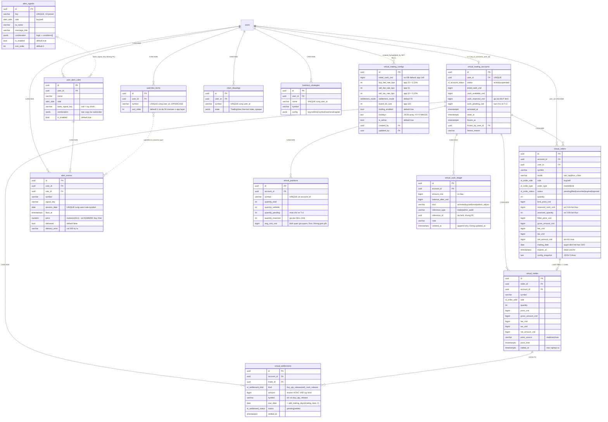

# CSDL — giao dịch ảo, cảnh báo, watchlist

Chương này đặc tả toàn bộ lược đồ Postgres của bốn nhóm nghiệp vụ: **giao dịch ảo** (7 bảng: tài khoản, lệnh, khớp, vị thế, sổ tiền, thanh toán T+N, cấu hình), **cảnh báo tín hiệu** (3 bảng + 2 cột Telegram trên `users`), **watchlist**, **bản vẽ biểu đồ** và **chiến lược backtest**. Mỗi bảng có đầy đủ: mục đích, bảng cột (kiểu PG chính xác, nullable, default, ràng buộc), khóa/index/unique, DDL `CREATE TABLE`, định nghĩa Drizzle `pgTable`, và — quan trọng nhất — **hành vi nghiệp vụ** đang chạy trên bản Python (công thức phí, làm tròn, giá vốn bình quân, vòng đời T+N, dedup cảnh báo). Đọc chương này là đủ để tạo lược đồ và tái hiện nghiệp vụ trong TypeScript/NestJS mà không cần mở lại source Python.

Nguồn đã đọc để viết chương này (đường dẫn tuyệt đối):

- `/Users/danhtrongit/Projects/IQX/backend/app/models/virtual_trading.py`
- `/Users/danhtrongit/Projects/IQX/backend/app/models/alert.py`
- `/Users/danhtrongit/Projects/IQX/backend/app/models/watchlist.py`
- `/Users/danhtrongit/Projects/IQX/backend/app/models/chart_drawing.py`
- `/Users/danhtrongit/Projects/IQX/backend/app/models/backtest_strategy.py`
- `/Users/danhtrongit/Projects/IQX/backend/app/core/database.py` (Base, `TimestampMixin`, `UUIDMixin`, naming convention)
- `/Users/danhtrongit/Projects/IQX/backend/app/repositories/virtual_trading.py`
- `/Users/danhtrongit/Projects/IQX/backend/app/repositories/alert.py`
- `/Users/danhtrongit/Projects/IQX/backend/app/repositories/watchlist.py`
- `/Users/danhtrongit/Projects/IQX/backend/app/services/virtual_trading/service.py`
- `/Users/danhtrongit/Projects/IQX/backend/app/services/virtual_trading/settlement.py`
- `/Users/danhtrongit/Projects/IQX/backend/app/services/virtual_trading/price_resolver.py`
- `/Users/danhtrongit/Projects/IQX/backend/app/services/admin_vt.py`
- `/Users/danhtrongit/Projects/IQX/backend/app/services/alerts/signals.py`, `seeder.py`, `scan.py`
- `/Users/danhtrongit/Projects/IQX/backend/app/services/ta/conditions.py`, `indicators.py`
- `/Users/danhtrongit/Projects/IQX/backend/app/services/telegram/linking.py`
- `/Users/danhtrongit/Projects/IQX/backend/app/schemas/virtual_trading/config.py`, `admin_vt.py`, `alert.py`, `watchlist.py`, `chart_drawing.py`, `backtest.py`
- Migration: `218cd5d6ac36`, `97f9d297c95e`, `c1d2e3f4a5b6`, `d4e5f6a7b8c9`, `e5f6a7b8c9d0`, `f6a7b8c9d0e1`, `a7b8c9d0e1f2`, `b3d5f0a1c2e4`, `ecc202a79e70`, `9a4c2f1e7b60`, `d7e8f9a0b1c2` (đều trong `/Users/danhtrongit/Projects/IQX/backend/alembic/versions/`)

---

## 1. Quy ước chung cho mọi bảng trong chương

### 1.1 Khóa chính

Mọi bảng dùng `UUIDMixin`: cột `id UUID NOT NULL PRIMARY KEY`. **Không có `DEFAULT gen_random_uuid()` ở tầng DB** — UUID v4 do tầng application sinh (`default=uuid.uuid4` trong SQLAlchemy). Bên NestJS/Drizzle phải sinh UUID ở app layer (`crypto.randomUUID()`) hoặc thêm `.defaultRandom()` (đây là **thay đổi so với bản Python**, chấp nhận được vì tương thích ngược).

### 1.2 Timestamp hàng (row-level)

`TimestampMixin` khai báo hai cột **không có `timezone=True`**:

| Cột | Kiểu PG | Nullable | Default | Ghi chú |
|---|---|---|---|---|
| `created_at` | `timestamp without time zone` | NO | `now()` (server_default) | |
| `updated_at` | `timestamp without time zone` | NO | `now()` (server_default) | `onupdate=func.now()` là **ORM-side**, không phải trigger DB |

Hai điểm bắt buộc chú ý khi viết lại:

1. Kiểu là `TIMESTAMP` **không timezone** (`sa.DateTime()` trong migration). Các mốc *nghiệp vụ* (`activated_at`, `traded_at`, `fired_at`, …) thì ngược lại — `timestamptz` (`sa.DateTime(timezone=True)`). Giữ đúng sự phân biệt này để dữ liệu cũ đọc ra không lệch múi giờ.
2. `updated_at` tự cập nhật là do SQLAlchemy phát sinh `SET updated_at = now()` trong câu UPDATE, **DB không có trigger**. Drizzle: dùng `.$onUpdate(() => new Date())`, hoặc thêm trigger. Nếu bỏ qua, `updated_at` sẽ đóng băng và làm hỏng logic phía FE (ví dụ `chart_drawings.updated_at` được trả về cho client).

Ngoại lệ: `virtual_cash_ledger` **không dùng** `TimestampMixin` — nó chỉ có `created_at timestamptz NOT NULL DEFAULT now()` và **không có** `updated_at` (bảng append-only).

### 1.3 Naming convention của constraint

`Base.metadata` khai báo convention (đọc từ `app/core/database.py`), Alembic áp dụng convention này cho các constraint không đặt tên tường minh:

```text
pk → pk_%(table_name)s
fk → fk_%(table_name)s_%(column_0_name)s_%(referred_table_name)s
uq → uq_%(table_name)s_%(column_0_name)s
ix → ix_%(column_0_label)s
ck → ck_%(table_name)s_%(constraint_name)s
```

Nhiều unique constraint trong chương này được đặt tên **thủ công** (ví dụ `uq_vt_accounts_user_id`, `uq_vt_positions_account_symbol`) nên **không** khớp convention — giữ nguyên tên đó nếu muốn migration cũ và mới đối chiếu được.

### 1.4 Không có CHECK constraint nào

Trong toàn bộ 13 bảng của chương này **không có một `CHECK` constraint nào**. Mọi ràng buộc miền giá trị (khối lượng > 0, tiền không âm, `quantity_total >= 0`, bội số lô…) đều nằm ở tầng application. Đây là rủi ro đã biết; xem §11.4 cho danh sách CHECK **đề xuất** (rõ ràng là đề xuất, không phải hiện trạng).

---

## 2. Kiểu số cho tiền · giá · khối lượng · tỷ lệ (ĐỌC TRƯỚC KHI CODE)

Đây là phần dễ làm sai nhất khi chuyển sang TypeScript.

### 2.1 Nguyên tắc gốc: **không dùng `NUMERIC` cho tiền**

Docstring của `app/models/virtual_trading.py` nói rõ:

> All monetary values stored as integer VND (BigInteger). Fee/tax rates stored as basis points (1 bps = 0.01%).

Nghĩa là:

| Loại giá trị | Kiểu PG | Đơn vị | Ví dụ |
|---|---|---|---|
| Tiền (số dư, tổng tiền, phí, thuế, net) | `bigint` (int8) | **đồng VND nguyên**, không thập phân | `1000000000` = 1 tỷ đồng |
| Giá cổ phiếu | `bigint` (int8) | **VND/cp nguyên** | `60600` = 60.600 đ/cp |
| Khối lượng | `integer` (int4) | số cổ phiếu | `100` |
| Tỷ lệ phí/thuế | `integer` (int4) | **basis point**, 1 bps = 0,01% | `15` = 0,15% |
| Giá trong `alert_events.price` | `numeric(18, 4)` | **ngoại lệ duy nhất** | xem §15 |

**Không có cột `NUMERIC`/`DECIMAL` nào trong 7 bảng giao dịch ảo.** Toàn bộ toán tiền là toán số nguyên → không có sai số dấu phẩy động, nhưng **phải giữ nguyên phép chia nguyên (floor/round) đúng như Python** nếu muốn số khớp bit-for-bit với dữ liệu cũ.

### 2.2 Bên TypeScript dùng gì

Driver `pg`/`postgres.js` trả `bigint` (int8) về dạng **string** theo mặc định để tránh mất chính xác. Với biên giá trị thực tế của hệ này thì `number` vẫn an toàn:

- Giá trị tiền lớn nhất một lệnh có thể tạo ra: `_MAX_GROSS_VND = 100_000_000_000` (1e11) — nhỏ hơn `Number.MAX_SAFE_INTEGER` (≈9,007e15) 5 bậc.
- Tích trung gian lớn nhất trong công thức phí: `amount * rate_bps` ≤ `1e11 * 1000` = 1e14 — vẫn dưới 9e15.

Khuyến nghị cụ thể:

```ts
// Drizzle: chọn mode 'number' cho tiện, an toàn với biên trên 1e11 của hệ này.
amountVnd: bigint('amount_vnd', { mode: 'number' }).notNull(),

// Nếu muốn tuyệt đối an toàn (và chấp nhận serialize thủ công ra JSON):
amountVnd: bigint('amount_vnd', { mode: 'bigint' }).notNull(),
```

Nếu chọn `mode: 'bigint'` thì phải thêm serializer JSON (`BigInt.prototype.toJSON`) vì `JSON.stringify` sẽ ném `TypeError` với `BigInt`. API hiện tại trả các cột này là **số nguyên JSON** (Pydantic `int`) — hợp đồng API phải giữ nguyên là number, **không đổi thành string**, nếu không sẽ vỡ frontend.

Type TS dùng xuyên chương:

```ts
/** VND nguyên. Luôn là số nguyên, không thập phân. */
type VndInt = number;

/** Giá VND/cổ phiếu, số nguyên. */
type PriceVnd = number;

/** Basis point: 1 bps = 0.01%. 15 bps = 0.15%. */
type Bps = number;
```

### 2.3 Công thức phí/thuế và cách làm tròn (bắt buộc giống hệt)

Hàm `_round_bps` trong `app/services/virtual_trading/service.py`:

```
_round_bps(amount, rate_bps) = (amount * rate_bps + 5000) DIV 10000
```

Đây là **round-half-up trên số nguyên**, không phải `Math.round` trên float. Bản TS:

```ts
/** Phí/thuế từ số tiền gộp và tỷ lệ bps. Round half-up, toán số nguyên. */
function roundBps(amount: VndInt, rateBps: Bps): VndInt {
  return Math.floor((amount * rateBps + 5000) / 10000);
}
```

Với `mode: 'bigint'`:

```ts
function roundBpsBig(amount: bigint, rateBps: bigint): bigint {
  return (amount * rateBps + 5000n) / 10000n; // chia bigint đã là truncate; amount ≥ 0 nên = floor
}
```

Áp dụng:

| Chiều | Gross | Phí | Thuế | Tiền ra/vào |
|---|---|---|---|---|
| MUA | `price_vnd * quantity` | `roundBps(gross, buy_fee_rate_bps)` | `0` (luôn bằng 0) | trừ `gross + fee` khỏi `cash_available_vnd`; `net_amount_vnd = -(gross + fee)` |
| BÁN | `price_vnd * quantity` | `roundBps(gross, sell_fee_rate_bps)` | `roundBps(gross, sell_tax_rate_bps)` | cộng `proceeds = gross - fee - tax`; `net_amount_vnd = +proceeds` |

Lưu ý dấu: `net_amount_vnd` **âm khi mua**, **dương khi bán**. Cột này là `bigint` có dấu, không phải unsigned.

### 2.4 Hằng số chặn (code constant, KHÔNG nằm trong DB)

Đọc từ `app/services/virtual_trading/service.py`:

| Hằng | Giá trị | Ý nghĩa | Lỗi khi vượt |
|---|---|---|---|
| `_MAX_QUANTITY` | `1_000_000` | KL tối đa mỗi lệnh | 422 `Khối lượng {q} vượt quá mức tối đa 1000000 mỗi lệnh` |
| `_MAX_LIMIT_PRICE_VND` | `10_000_000` | giá limit tối đa (VND/cp) | 422 |
| `_MAX_GROSS_VND` | `100_000_000_000` | gross tối đa mỗi lệnh | 422 |
| `_LEADERBOARD_HARD_CAP` | `200` | số tài khoản tối đa đánh giá cho leaderboard | — |
| `_VN_TZ` | `UTC+7` | múi giờ tính `trading_date` và `today` | — |

Trong `app/api/v1/endpoints/watchlist.py`: `_MAX_ITEMS = 50`.
Trong `app/services/alerts/scan.py`: `_WARMUP_DAYS = 420`, `_MIN_BARS = 60`.

### 2.5 KHÔNG có tham số "biên độ giá" (trần/sàn) trong CSDL

Bảng `virtual_trading_configs` **không có** cột biên độ giá, trần, sàn, hay bước giá. Đã grep toàn repo: `ceiling_price`/`floor_price` chỉ xuất hiện trong lớp market-data (`app/services/market_data/schemas.py`, `sources/vietcap*.py`) và **không được dùng để validate lệnh ảo**. Nghĩa là: lệnh limit chỉ bị chặn bởi `_MAX_LIMIT_PRICE_VND = 10_000_000`, không bị chặn theo ±7%/±10%/±15% của tham chiếu. Nếu bản TS muốn thêm biên độ, đó là **tính năng mới**, phải bổ sung cột config + migration mới.

---

## 3. Toàn bộ ENUM Postgres của chương

Tất cả đều là ENUM **native của Postgres** (tạo bằng `CREATE TYPE`), giá trị là **chuỗi lowercase** đúng như liệt kê (trừ `settlement_mode` là `T0`/`T2` in hoa). SQLAlchemy dùng `values_callable=lambda e: [m.value for m in e]` nên **giá trị lưu là `.value`, không phải tên hằng Python** — ví dụ lưu `'buy'` chứ không phải `'BUY'`.

| Tên type PG | Giá trị (đúng thứ tự khai báo) | Dùng ở |
|---|---|---|
| `settlement_mode` | `'T0'`, `'T2'` | `virtual_trading_configs.settlement_mode` |
| `vt_account_status` | `'active'`, `'suspended'` | `virtual_trading_accounts.status` |
| `vt_order_side` | `'buy'`, `'sell'` | `virtual_orders.side`, `virtual_trades.side` |
| `vt_order_type` | `'market'`, `'limit'` | `virtual_orders.order_type` |
| `vt_order_status` | `'pending'`, `'filled'`, `'cancelled'`, `'expired'`, `'rejected'` | `virtual_orders.status` |
| `vt_settlement_kind` | `'buy_qty_release'`, `'sell_cash_release'` | `virtual_settlements.kind` |
| `vt_settlement_status` | `'pending'`, `'settled'` | `virtual_settlements.status` |
| `alert_side` | `'buy'`, `'sell'` | `alert_signals.side`, `user_alert_rules.side` |

**Hai enum không được tạo bằng `CREATE TYPE`** (là `VARCHAR`/`TEXT` tự do trong DB, chỉ enum ở tầng code):

| Cột | Kiểu PG thực tế | Tập giá trị dùng trong code |
|---|---|---|
| `virtual_orders.mode` | `varchar` (không giới hạn độ dài) | `'san_tap'`, `'thuc_chien'` |
| `virtual_cash_ledger.kind` | `varchar(50)` | `'activate'`, `'buy'`, `'sell'`, `'reset'`, `'admin_adjust'` |
| `virtual_cash_ledger.reference_type` | `varchar(50)` | `'trade'`, `'admin_audit'` (và `NULL`) |
| `virtual_trades.price_source` | `varchar(50)` | `'realtime'`, `'close'` |

Union type TS cho toàn bộ:

```ts
type SettlementMode = 'T0' | 'T2';
type VtAccountStatus = 'active' | 'suspended';
type OrderSide = 'buy' | 'sell';
type OrderType = 'market' | 'limit';
type OrderStatus = 'pending' | 'filled' | 'cancelled' | 'expired' | 'rejected';
type SettlementKind = 'buy_qty_release' | 'sell_cash_release';
type SettlementStatus = 'pending' | 'settled';
type AlertSide = 'buy' | 'sell';

/** Cột varchar, KHÔNG phải enum PG. */
type OrderMode = 'san_tap' | 'thuc_chien';
/** Cột varchar(50), KHÔNG phải enum PG. Tập giá trị quan sát được trong code. */
type LedgerKind = 'activate' | 'buy' | 'sell' | 'reset' | 'admin_adjust';
type LedgerReferenceType = 'trade' | 'admin_audit';
/** Cột varchar(50). */
type PriceSource = 'realtime' | 'close';
```

Khai báo Drizzle (dùng lại cho tất cả bảng dưới đây):

```ts
import { pgEnum } from 'drizzle-orm/pg-core';

export const settlementModeEnum   = pgEnum('settlement_mode',      ['T0', 'T2']);
export const vtAccountStatusEnum  = pgEnum('vt_account_status',    ['active', 'suspended']);
export const vtOrderSideEnum      = pgEnum('vt_order_side',        ['buy', 'sell']);
export const vtOrderTypeEnum      = pgEnum('vt_order_type',        ['market', 'limit']);
export const vtOrderStatusEnum    = pgEnum('vt_order_status',      ['pending', 'filled', 'cancelled', 'expired', 'rejected']);
export const vtSettlementKindEnum = pgEnum('vt_settlement_kind',   ['buy_qty_release', 'sell_cash_release']);
export const vtSettlementStatusEnum = pgEnum('vt_settlement_status', ['pending', 'settled']);
export const alertSideEnum        = pgEnum('alert_side',           ['buy', 'sell']);
```

---

## 4. Bảng `virtual_trading_configs`

### 4.1 Đây là bảng cấu hình dạng gì

**Không phải key-value.** Đây là bảng **một-dòng-một-bộ-cấu-hình** (row-per-config-set): mỗi cột là một tham số riêng, kiểu chặt. Nhiều dòng có thể tồn tại, nhưng **chỉ dòng có `is_active = true` được đọc**.

Cách đọc/ghi (từ `VirtualTradingRepository`):

- `get_active_config()`: `SELECT * FROM virtual_trading_configs WHERE is_active IS TRUE` rồi `scalar_one_or_none()`.
  - 0 dòng → `None` → service gọi `create_default_config()` **tự tạo dòng mặc định** (lazy bootstrap, không cần seed).
  - **2+ dòng active → `scalar_one_or_none()` ném `MultipleResultsFound` → 500.** DB **không có** unique partial index chặn việc này. Bản TS nên (đề xuất, không phải hiện trạng) thêm `CREATE UNIQUE INDEX uq_vt_configs_single_active ON virtual_trading_configs (is_active) WHERE is_active;`
- `update_config(config, data, updated_by)`: patch từng field trên **dòng đang active** (không tạo dòng mới, không lưu version). `holidays` nhận `string[]` từ API rồi `JSON.stringify` vào cột `TEXT`. `settlement_mode` nhận `'T0'|'T2'`. Luôn set `updated_by = admin_id`.
- Không có API xóa config; không có lịch sử phiên bản (`created_by`/`updated_by` là toàn bộ audit trail tại bảng này; audit chi tiết nằm ở `admin_audit_log`, xem chương audit).

### 4.2 Toàn bộ tham số cấu hình + default

| Tham số | Kiểu PG | Nullable | DEFAULT ở DB | Default ở application | Ý nghĩa nghiệp vụ |
|---|---|---|---|---|---|
| `initial_cash_vnd` | `bigint` | NO | **không có** | `1_000_000_000` (1 tỷ VND) | Vốn ảo khởi tạo khi user kích hoạt tài khoản; cũng là mốc để tính `return_pct` |
| `buy_fee_rate_bps` | `integer` | NO | **không có** | `15` = 0,15% | Phí mua, tính trên gross |
| `sell_fee_rate_bps` | `integer` | NO | **không có** | `15` = 0,15% | Phí bán, tính trên gross |
| `sell_tax_rate_bps` | `integer` | NO | **không có** | `10` = 0,10% | Thuế TNCN khi bán, tính trên gross. **Chiều mua luôn `tax = 0`** |
| `settlement_mode` | `settlement_mode` | NO | `'T0'` | `SettlementMode.T0` | `T0` = tiền/CP về ngay khi khớp; `T2` = về sau **2 ngày giao dịch** |
| `board_lot_size` | `integer` | NO | **không có** | `100` | Lô giao dịch. `quantity % board_lot_size != 0` → 400 `Khối lượng phải là bội số của {n}` |
| `trading_enabled` | `boolean` | NO | `true` | `True` | Cầu dao tổng. `false` → chặn cả `activate_account` và `place_order` bằng 403 `Giao dịch ảo hiện đang bị tạm dừng` |
| `holidays` | `text` | YES | `NULL` | `None` | **JSON array chuỗi `"YYYY-MM-DD"`** lưu dưới dạng TEXT, ví dụ `["2026-04-30","2026-05-01"]`. Parse lỗi → coi như tập rỗng (fail-open, không ném lỗi) |
| `is_active` | `boolean` | NO | `true` | `True` | Cờ chọn dòng cấu hình đang dùng |
| `created_by` | `uuid` | YES | `NULL` | — | FK `users.id` ON DELETE SET NULL |
| `updated_by` | `uuid` | YES | `NULL` | — | FK `users.id` ON DELETE SET NULL |

**Cảnh báo migration cực quan trọng:** 5 cột `initial_cash_vnd`, `buy_fee_rate_bps`, `sell_fee_rate_bps`, `sell_tax_rate_bps`, `board_lot_size` là `NOT NULL` **nhưng không có DEFAULT ở DB** (migration `218cd5d6ac36` không đặt `server_default`). Các giá trị 1e9/15/15/10/100 **chỉ tồn tại trong code Python**. Bản TS phải cấp default ở tầng application (hoặc bổ sung DEFAULT ở DB), nếu không `INSERT` thiếu cột sẽ vi phạm NOT NULL.

Giới hạn validate của API admin (`app/schemas/virtual_trading/config.py`, `ConfigUpdate`):

| Field | Ràng buộc |
|---|---|
| `initial_cash_vnd` | `> 0` |
| `buy_fee_rate_bps` / `sell_fee_rate_bps` / `sell_tax_rate_bps` | `>= 0` và `<= 1000` (tối đa 10%) |
| `settlement_mode` | regex `^(T0\|T2)$` |
| `board_lot_size` | `> 0` |
| `trading_enabled` | boolean |
| `holidays` | `string[]` (không validate định dạng ngày ở schema) |

`ConfigResponse` trả `holidays` là `list[str]` (đã parse từ TEXT) và **không trả** `is_active`, `created_by`, `updated_by`.

### 4.3 PK / FK / index

- PK: `pk_virtual_trading_configs (id)`
- FK: `created_by → users.id` ON DELETE **SET NULL**; `updated_by → users.id` ON DELETE **SET NULL**
- Index: **không có index nào ngoài PK** (kể cả trên `is_active` — bảng chỉ vài dòng nên không cần)
- Unique: không có

### 4.4 DDL

```sql
CREATE TYPE settlement_mode AS ENUM ('T0', 'T2');

CREATE TABLE virtual_trading_configs (
    id                 UUID            NOT NULL,
    initial_cash_vnd   BIGINT          NOT NULL,
    buy_fee_rate_bps   INTEGER         NOT NULL,
    sell_fee_rate_bps  INTEGER         NOT NULL,
    sell_tax_rate_bps  INTEGER         NOT NULL,
    settlement_mode    settlement_mode NOT NULL DEFAULT 'T0',
    board_lot_size     INTEGER         NOT NULL,
    trading_enabled    BOOLEAN         NOT NULL DEFAULT true,
    holidays           TEXT,
    is_active          BOOLEAN         NOT NULL DEFAULT true,
    created_by         UUID,
    updated_by         UUID,
    created_at         TIMESTAMP       NOT NULL DEFAULT now(),
    updated_at         TIMESTAMP       NOT NULL DEFAULT now(),
    CONSTRAINT pk_virtual_trading_configs PRIMARY KEY (id),
    CONSTRAINT fk_virtual_trading_configs_created_by_users
        FOREIGN KEY (created_by) REFERENCES users (id) ON DELETE SET NULL,
    CONSTRAINT fk_virtual_trading_configs_updated_by_users
        FOREIGN KEY (updated_by) REFERENCES users (id) ON DELETE SET NULL
);
```

### 4.5 Drizzle

```ts
import { pgTable, uuid, bigint, integer, boolean, text, timestamp } from 'drizzle-orm/pg-core';
import { users } from './users';
import { settlementModeEnum } from './enums';

export const virtualTradingConfigs = pgTable('virtual_trading_configs', {
  id: uuid('id').primaryKey(),
  initialCashVnd:  bigint('initial_cash_vnd', { mode: 'number' }).notNull(),
  buyFeeRateBps:   integer('buy_fee_rate_bps').notNull(),
  sellFeeRateBps:  integer('sell_fee_rate_bps').notNull(),
  sellTaxRateBps:  integer('sell_tax_rate_bps').notNull(),
  settlementMode:  settlementModeEnum('settlement_mode').notNull().default('T0'),
  boardLotSize:    integer('board_lot_size').notNull(),
  tradingEnabled:  boolean('trading_enabled').notNull().default(true),
  /** JSON array chuỗi "YYYY-MM-DD" lưu dạng TEXT (không phải jsonb). */
  holidays:        text('holidays'),
  isActive:        boolean('is_active').notNull().default(true),
  createdBy:       uuid('created_by').references(() => users.id, { onDelete: 'set null' }),
  updatedBy:       uuid('updated_by').references(() => users.id, { onDelete: 'set null' }),
  createdAt: timestamp('created_at', { withTimezone: false }).notNull().defaultNow(),
  updatedAt: timestamp('updated_at', { withTimezone: false }).notNull().defaultNow().$onUpdate(() => new Date()),
});
```

```ts
interface VirtualTradingConfigRow {
  id: string;
  initialCashVnd: VndInt;
  buyFeeRateBps: Bps;
  sellFeeRateBps: Bps;
  sellTaxRateBps: Bps;
  settlementMode: SettlementMode;
  boardLotSize: number;
  tradingEnabled: boolean;
  /** raw TEXT; parse thành string[] "YYYY-MM-DD" */
  holidays: string | null;
  isActive: boolean;
  createdBy: string | null;
  updatedBy: string | null;
  createdAt: Date;
  updatedAt: Date;
}

/** Snapshot ghi vào virtual_orders.config_snapshot khi tạo lệnh. */
interface OrderConfigSnapshot {
  buy_fee_rate_bps: Bps;
  sell_fee_rate_bps: Bps;
  sell_tax_rate_bps: Bps;
  settlement_mode: SettlementMode;
  board_lot_size: number;
}
```

---

## 5. Bảng `virtual_trading_accounts`

### 5.1 Mục đích

Một tài khoản giao dịch ảo cho mỗi user (1–1, cưỡng chế bằng unique constraint). Giữ **ba ngăn tiền** và trạng thái đóng băng.

### 5.2 Cột

| Cột | Kiểu PG | Nullable | Default | Ràng buộc | Ghi chú |
|---|---|---|---|---|---|
| `id` | `uuid` | NO | app-side uuid4 | PK | |
| `user_id` | `uuid` | NO | — | FK `users.id` CASCADE, UNIQUE, INDEX | 1 tài khoản / 1 user |
| `status` | `vt_account_status` | NO | `'active'` | | `suspended` khi admin freeze |
| `initial_cash_vnd` | `bigint` | NO | không có DEFAULT | | Sao chép từ `config.initial_cash_vnd` lúc kích hoạt; mốc tính `return_pct`; **được ghi lại khi admin reset** |
| `cash_available_vnd` | `bigint` | NO | không có DEFAULT | | Tiền **tiêu được ngay** |
| `cash_reserved_vnd` | `bigint` | NO | không có DEFAULT (model default `0`) | | Tiền **bị giữ** bởi các lệnh MUA limit đang `pending` |
| `cash_pending_vnd` | `bigint` | NO | không có DEFAULT (model default `0`) | | Tiền **bán chờ về** theo T+2 (chỉ dùng khi `settlement_mode = T2`) |
| `scope_type` | `varchar(50)` | YES | `NULL` | | Dự phòng cho giải đấu/mùa. **Chưa có code nào ghi** |
| `scope_id` | `uuid` | YES | `NULL` | | Dự phòng, **không có FK** |
| `activated_at` | `timestamptz` | NO | — | | Thời điểm kích hoạt (UTC now) |
| `reset_at` | `timestamptz` | YES | `NULL` | | Lần admin reset gần nhất |
| `frozen_at` | `timestamptz` | YES | `NULL` | | Thêm bởi migration `97f9d297c95e`. `!= NULL` → chặn đặt lệnh |
| `frozen_by_user_id` | `uuid` | YES | `NULL` | FK `users.id` SET NULL | Admin thực hiện freeze |
| `freeze_reason` | `varchar(1000)` | YES | `NULL` | | Bắt buộc non-empty ở tầng service khi freeze |
| `created_at` | `timestamp` | NO | `now()` | | |
| `updated_at` | `timestamp` | NO | `now()` | | ORM-side onupdate |

Ba ngăn tiền — công thức tổng:

```
total_cash = cash_available_vnd + cash_reserved_vnd + cash_pending_vnd
NAV        = total_cash + Σ(giá hiện tại × quantity_total)
return_pct = (NAV - initial_cash_vnd) / initial_cash_vnd × 100   (làm tròn 2 chữ số; = 0.0 nếu initial_cash_vnd <= 0)
```

### 5.3 Hành vi

- **Kích hoạt** (`activate_account`): nếu đã có tài khoản → 409 `Tài khoản giao dịch ảo đã tồn tại`. Nếu `config.trading_enabled = false` → 403. Tạo dòng với `initial_cash_vnd = cash_available_vnd = config.initial_cash_vnd`, `cash_reserved_vnd = cash_pending_vnd = 0`, `activated_at = now(UTC)`; **đồng thời chèn 1 dòng ledger** `kind='activate'`, `amount_vnd = balance_after_vnd = initial_cash_vnd`, `note = "Số dư ban đầu theo cấu hình: {n} VND"`.
- **Khóa hàng khi giao dịch**: mọi thao tác ghi đọc tài khoản bằng `SELECT … FOR UPDATE` (`get_account_by_user_id_for_update`) → chống race giữa hai lệnh song song. Bản TS phải giữ nguyên (`.for('update')` trong Drizzle).
- **Chặn đặt lệnh**: kiểm tra theo thứ tự `status != 'active'` → 403 `Tài khoản đã bị tạm khóa`; rồi `frozen_at != NULL` → 403 `Tài khoản tạm khóa`.
- **Admin freeze** (`AdminVTService.freeze`): yêu cầu `reason` non-empty (400 nếu thiếu); nếu `frozen_at != NULL` → 400 `Tài khoản đã bị tạm khóa`; set `frozen_at = now(UTC)`, `frozen_by_user_id = admin`, `freeze_reason`, **và** `status = 'suspended'`; ghi audit `vt.account.freeze` (before/after).
- **Admin unfreeze**: nếu `frozen_at IS NULL` → 400 `Tài khoản đang không bị khóa`; xóa cả 3 cột freeze và `status = 'active'`; audit `vt.account.unfreeze`.
- **Admin cash adjust**: `amount_vnd != 0` (400 nếu = 0), `reason` bắt buộc; **không cho ra số dư âm** → 400 nếu `cash_available_vnd + amount_vnd < 0`; cộng vào `cash_available_vnd`; chèn ledger `kind='admin_adjust'`, `reference_type='admin_audit'`, `note=reason`; audit `vt.cash.adjust`.
- **Admin reset** (`reset_account`): **xóa cứng** theo thứ tự settlements → trades → orders → positions → ledger (theo `account_id`), rồi gán lại `initial_cash_vnd = cash_available_vnd = config.initial_cash_vnd`, `cash_reserved_vnd = cash_pending_vnd = 0`, `reset_at = now(UTC)`, và chèn ledger `kind='reset'`, `note="Tài khoản được đặt lại bởi quản trị {admin_id}"`. `reset_all_accounts` lặp qua **mọi** tài khoản.

### 5.4 DDL

```sql
CREATE TYPE vt_account_status AS ENUM ('active', 'suspended');

CREATE TABLE virtual_trading_accounts (
    id                  UUID              NOT NULL,
    user_id             UUID              NOT NULL,
    status              vt_account_status NOT NULL DEFAULT 'active',
    initial_cash_vnd    BIGINT            NOT NULL,
    cash_available_vnd  BIGINT            NOT NULL,
    cash_reserved_vnd   BIGINT            NOT NULL,
    cash_pending_vnd    BIGINT            NOT NULL,
    scope_type          VARCHAR(50),
    scope_id            UUID,
    activated_at        TIMESTAMPTZ       NOT NULL,
    reset_at            TIMESTAMPTZ,
    frozen_at           TIMESTAMPTZ,
    frozen_by_user_id   UUID,
    freeze_reason       VARCHAR(1000),
    created_at          TIMESTAMP         NOT NULL DEFAULT now(),
    updated_at          TIMESTAMP         NOT NULL DEFAULT now(),
    CONSTRAINT pk_virtual_trading_accounts PRIMARY KEY (id),
    CONSTRAINT uq_vt_accounts_user_id UNIQUE (user_id),
    CONSTRAINT fk_virtual_trading_accounts_user_id_users
        FOREIGN KEY (user_id) REFERENCES users (id) ON DELETE CASCADE,
    CONSTRAINT fk_virtual_trading_accounts_frozen_by_user_id_users
        FOREIGN KEY (frozen_by_user_id) REFERENCES users (id) ON DELETE SET NULL
);
CREATE INDEX ix_virtual_trading_accounts_user_id ON virtual_trading_accounts (user_id);
```

### 5.5 Drizzle

```ts
export const virtualTradingAccounts = pgTable('virtual_trading_accounts', {
  id: uuid('id').primaryKey(),
  userId: uuid('user_id').notNull().references(() => users.id, { onDelete: 'cascade' }),
  status: vtAccountStatusEnum('status').notNull().default('active'),
  initialCashVnd:   bigint('initial_cash_vnd',   { mode: 'number' }).notNull(),
  cashAvailableVnd: bigint('cash_available_vnd', { mode: 'number' }).notNull(),
  cashReservedVnd:  bigint('cash_reserved_vnd',  { mode: 'number' }).notNull(),
  cashPendingVnd:   bigint('cash_pending_vnd',   { mode: 'number' }).notNull(),
  scopeType: varchar('scope_type', { length: 50 }),
  scopeId: uuid('scope_id'),
  activatedAt: timestamp('activated_at', { withTimezone: true }).notNull(),
  resetAt:     timestamp('reset_at',     { withTimezone: true }),
  frozenAt:    timestamp('frozen_at',    { withTimezone: true }),
  frozenByUserId: uuid('frozen_by_user_id').references(() => users.id, { onDelete: 'set null' }),
  freezeReason: varchar('freeze_reason', { length: 1000 }),
  createdAt: timestamp('created_at', { withTimezone: false }).notNull().defaultNow(),
  updatedAt: timestamp('updated_at', { withTimezone: false }).notNull().defaultNow().$onUpdate(() => new Date()),
}, (t) => ({
  uqUserId: uniqueIndex('uq_vt_accounts_user_id').on(t.userId),
  ixUserId: index('ix_virtual_trading_accounts_user_id').on(t.userId),
}));
```

```ts
interface VirtualTradingAccountRow {
  id: string;
  userId: string;
  status: VtAccountStatus;
  initialCashVnd: VndInt;
  cashAvailableVnd: VndInt;
  cashReservedVnd: VndInt;
  cashPendingVnd: VndInt;
  scopeType: string | null;
  scopeId: string | null;
  activatedAt: Date;
  resetAt: Date | null;
  frozenAt: Date | null;
  frozenByUserId: string | null;
  freezeReason: string | null;
  createdAt: Date;
  updatedAt: Date;
}
```

---

## 6. Bảng `virtual_positions` — vị thế và giá vốn bình quân

### 6.1 Mục đích

Một dòng cho mỗi (tài khoản, mã CK) — vị thế hiện tại, tách khối lượng thành 4 ngăn, kèm giá vốn bình quân.

### 6.2 Cột

| Cột | Kiểu PG | Nullable | Default | Ràng buộc | Ý nghĩa |
|---|---|---|---|---|---|
| `id` | `uuid` | NO | app uuid4 | PK | |
| `account_id` | `uuid` | NO | — | FK accounts CASCADE, INDEX | |
| `symbol` | `varchar(10)` | NO | — | UNIQUE cùng `account_id` | Luôn UPPERCASE (service `.upper()` trước khi ghi) |
| `quantity_total` | `integer` | NO | không DEFAULT (model `0`) | | **Tổng CP đang sở hữu** = sellable + pending + reserved (bất biến kỳ vọng, DB không cưỡng chế) |
| `quantity_sellable` | `integer` | NO | không DEFAULT (model `0`) | | CP **bán được ngay** |
| `quantity_pending` | `integer` | NO | không DEFAULT (model `0`) | | CP **mua chờ về** T+2 (chỉ khi `T2`) |
| `quantity_reserved` | `integer` | NO | không DEFAULT (model `0`) | | CP **bị giữ** bởi lệnh BÁN limit đang `pending` |
| `avg_cost_vnd` | `bigint` | NO | không DEFAULT (model `0`) | | **Giá vốn bình quân, VND/cp, số nguyên** |
| `created_at` / `updated_at` | `timestamp` | NO | `now()` | | |

### 6.3 Cách tính giá vốn bình quân (ĐÚNG NGUYÊN VĂN)

Khi **MUA khớp** (trong `_fill_order_at_price`, nhánh `side == buy`):

```
old_total = position ? position.quantity_total : 0
old_cost  = position ? position.avg_cost_vnd   : 0
new_total = old_total + quantity
new_avg   = new_total > 0
            ? (old_cost * old_total + price_vnd * quantity) DIV new_total   // chia NGUYÊN, làm tròn xuống
            : 0
```

Bốn điểm phải giữ nguyên tuyệt đối:

1. **Chia nguyên (floor), không round.** Python dùng `//`. TS: `Math.floor(...)` — với `bigint` thì `/` đã là truncate và mọi số hạng ≥ 0 nên tương đương floor.
2. **Phí mua KHÔNG được vốn hóa.** Công thức chỉ dùng `price_vnd`, không cộng `fee`. Vì vậy `avg_cost_vnd` là **giá khớp bình quân**, không phải giá vốn kế toán.
3. **Bán KHÔNG thay đổi `avg_cost_vnd`.** Nhánh sell chỉ giảm `quantity_total`; giá vốn giữ nguyên → phù hợp với phương pháp bình quân gia quyền liên tục (moving average cost).
4. **Bán hết không reset dòng.** Khi `quantity_total` về `0`, dòng vẫn tồn tại với `avg_cost_vnd` của lần mua cuối. `get_portfolio` bỏ qua các dòng `quantity_total <= 0` khi hiển thị, nhưng dòng vẫn nằm trong DB và lần mua lại sau đó sẽ tính `new_avg` với `old_total = 0` → `new_avg = price_vnd * quantity / quantity = price_vnd`. Kết quả đúng, nhưng bản TS **không được** "tối ưu" bằng cách xóa dòng khi về 0 nếu muốn giữ y hệt hành vi.

Bất đối xứng cần biết khi viết lại: nhánh MUA đi qua `upsert_position(...)` (ghi cả 5 cột, tạo dòng nếu chưa có); nhánh BÁN **sửa trực tiếp** đối tượng đã `SELECT … FOR UPDATE` (chỉ đổi `quantity_*`).

### 6.4 Luồng cập nhật 4 ngăn khối lượng

| Sự kiện | `quantity_total` | `quantity_sellable` | `quantity_pending` | `quantity_reserved` |
|---|---|---|---|---|
| MUA khớp, `T0` | `+quantity` | `+quantity` | — | — |
| MUA khớp, `T2` | `+quantity` | — | `+quantity` | — |
| Đặt BÁN limit (pending) | — | `-quantity` | — | `+quantity` |
| BÁN limit khớp | `-quantity` | — | — | `-reserved_quantity` |
| BÁN market khớp | `-quantity` | `-quantity` | — | — |
| Hủy / hết hạn lệnh BÁN limit | — | `+reserved_quantity` | — | `-reserved_quantity` |
| Settlement `buy_qty_release` đến hạn | — | `+release` | `-release` | — |

`release = min(settlement.amount, position.quantity_pending)` — có kẹp trần để không đẩy `quantity_pending` xuống âm.

Kiểm tra toàn vẹn duy nhất ở tầng code (nhánh bán): nếu `quantity_total - quantity < 0` → 400 `Vi phạm toàn vẹn vị thế: bán {q} cổ phiếu sẽ làm tổng âm ({total} - {q})`.

### 6.5 DDL

```sql
CREATE TABLE virtual_positions (
    id                 UUID        NOT NULL,
    account_id         UUID        NOT NULL,
    symbol             VARCHAR(10) NOT NULL,
    quantity_total     INTEGER     NOT NULL,
    quantity_sellable  INTEGER     NOT NULL,
    quantity_pending   INTEGER     NOT NULL,
    quantity_reserved  INTEGER     NOT NULL,
    avg_cost_vnd       BIGINT      NOT NULL,
    created_at         TIMESTAMP   NOT NULL DEFAULT now(),
    updated_at         TIMESTAMP   NOT NULL DEFAULT now(),
    CONSTRAINT pk_virtual_positions PRIMARY KEY (id),
    CONSTRAINT uq_vt_positions_account_symbol UNIQUE (account_id, symbol),
    CONSTRAINT fk_virtual_positions_account_id_virtual_trading_accounts
        FOREIGN KEY (account_id) REFERENCES virtual_trading_accounts (id) ON DELETE CASCADE
);
CREATE INDEX ix_virtual_positions_account_id ON virtual_positions (account_id);
```

### 6.6 Drizzle

```ts
export const virtualPositions = pgTable('virtual_positions', {
  id: uuid('id').primaryKey(),
  accountId: uuid('account_id').notNull()
    .references(() => virtualTradingAccounts.id, { onDelete: 'cascade' }),
  symbol: varchar('symbol', { length: 10 }).notNull(),
  quantityTotal:    integer('quantity_total').notNull(),
  quantitySellable: integer('quantity_sellable').notNull(),
  quantityPending:  integer('quantity_pending').notNull(),
  quantityReserved: integer('quantity_reserved').notNull(),
  avgCostVnd: bigint('avg_cost_vnd', { mode: 'number' }).notNull(),
  createdAt: timestamp('created_at', { withTimezone: false }).notNull().defaultNow(),
  updatedAt: timestamp('updated_at', { withTimezone: false }).notNull().defaultNow().$onUpdate(() => new Date()),
}, (t) => ({
  uqAccountSymbol: uniqueIndex('uq_vt_positions_account_symbol').on(t.accountId, t.symbol),
  ixAccountId: index('ix_virtual_positions_account_id').on(t.accountId),
}));
```

```ts
interface VirtualPositionRow {
  id: string;
  accountId: string;
  symbol: string;
  quantityTotal: number;
  quantitySellable: number;
  quantityPending: number;
  quantityReserved: number;
  avgCostVnd: PriceVnd;
  createdAt: Date;
  updatedAt: Date;
}
```

---

## 7. Bảng `virtual_orders`

### 7.1 Mục đích

Sổ lệnh: mọi lệnh đặt (market khớp ngay, limit chờ khớp, lệnh bị từ chối). Giữ **snapshot cấu hình** tại thời điểm đặt lệnh để thay đổi config của admin không ảnh hưởng lệnh đang chờ.

### 7.2 Cột

| Cột | Kiểu PG | Nullable | Default | Ràng buộc | Ghi chú |
|---|---|---|---|---|---|
| `id` | `uuid` | NO | app uuid4 | PK | |
| `account_id` | `uuid` | NO | — | FK accounts CASCADE, INDEX | |
| `user_id` | `uuid` | NO | — | FK users CASCADE, INDEX | Trùng lặp có chủ đích để filter nhanh |
| `symbol` | `varchar(10)` | NO | — | INDEX | UPPERCASE |
| `mode` | `varchar` (không giới hạn) | NO | `'thuc_chien'` | | Thêm bởi migration `b3d5f0a1c2e4`. `'san_tap'` = Cấp 0 / free; `'thuc_chien'` = premium |
| `side` | `vt_order_side` | NO | — | | `buy` / `sell` |
| `order_type` | `vt_order_type` | NO | — | | `market` / `limit` |
| `status` | `vt_order_status` | NO | `'pending'` | | 5 trạng thái, xem §7.4 |
| `quantity` | `integer` | NO | — | | Phải là bội số `board_lot_size` |
| `limit_price_vnd` | `bigint` | YES | `NULL` | | Chỉ có với `order_type='limit'` |
| `reserved_cash_vnd` | `bigint` | NO | `0` | | Tiền đang giữ cho lệnh MUA limit; **về 0 khi lệnh kết thúc** |
| `reserved_quantity` | `integer` | NO | `0` | | CP đang giữ cho lệnh BÁN limit; **về 0 khi lệnh kết thúc** |
| `filled_price_vnd` | `bigint` | YES | `NULL` | | Giá khớp thực tế |
| `gross_amount_vnd` | `bigint` | YES | `NULL` | | `filled_price_vnd * quantity` |
| `fee_vnd` | `bigint` | YES | `NULL` | | |
| `tax_vnd` | `bigint` | YES | `NULL` | | Luôn `0` khi mua |
| `net_amount_vnd` | `bigint` | YES | `NULL` | | **Âm khi mua** (`-(gross+fee)`), **dương khi bán** (`proceeds`) |
| `trading_date` | `date` | NO | — | | Ngày giao dịch (theo `_VN_TZ`), quyết định hết hạn GFD |
| `expires_at` | `timestamptz` | YES | `NULL` | | **Cột tồn tại nhưng không có code nào ghi/đọc** — hết hạn tính theo `trading_date` |
| `rejection_reason` | `varchar(500)` | YES | `NULL` | | Lý do `rejected` (thường: không lấy được giá) |
| `cancel_reason` | `varchar(500)` | YES | `NULL` | | `'Người dùng hủy'` khi user cancel |
| `config_snapshot` | `text` | YES | `NULL` | | **JSON** (TEXT, không jsonb) — 5 khóa của `OrderConfigSnapshot` |
| `created_at` / `updated_at` | `timestamp` | NO | `now()` | | Sắp xếp danh sách lệnh theo `created_at DESC` |

### 7.3 `config_snapshot` — vì sao tồn tại

Khi tạo lệnh, service serialize đúng 5 khóa:

```json
{"buy_fee_rate_bps":15,"sell_fee_rate_bps":15,"sell_tax_rate_bps":10,"settlement_mode":"T0","board_lot_size":100}
```

Khi khớp một lệnh **pending** (limit), phí/thuế/chế độ thanh toán **đọc từ snapshot**, không đọc config hiện tại (`snap.get(key, fallback = config hiện tại)`). Nhờ vậy admin đổi phí giữa lúc lệnh chờ không làm lệch số tiền đã hứa với user.

`settlement_mode` trong snapshot là **`effective_settlement_mode`**, không phải config thô: `is_premium ? config.settlement_mode : 'T0'`. Tức là user không premium **luôn T0** dù admin bật T2 toàn hệ thống.

### 7.4 Vòng đời trạng thái

```
market + có giá        → filled   (khớp ngay trong cùng transaction)
market + không có giá  → rejected (rejection_reason = str(PriceUnavailableError), KHÔNG ném 4xx/5xx — trả về order rejected 201)
limit                  → pending  → filled     (refresh: giá thỏa điều kiện)
                                  → cancelled  (user gọi cancel)
                                  → expired    (refresh: order.trading_date < trading_date hiện tại — GFD)
```

- **Điều kiện khớp limit** (trong `refresh`): MUA khớp khi `price <= limit_price_vnd`; BÁN khớp khi `price >= limit_price_vnd`.
- **Không có job nền khớp lệnh.** Việc khớp/hết hạn/thanh toán chỉ xảy ra khi gọi `refresh()` (endpoint refresh, do client kích hoạt). `get_portfolio` là **read-only, không mutate**.
- **Giải phóng reserve khi kết thúc**: sau `flush()`, cả `reserved_cash_vnd` và `reserved_quantity` được set về `0` ở mọi nhánh terminal (filled / cancelled / expired) — nên **không được dùng hai cột này để dựng lại lịch sử**, chúng chỉ phản ánh reserve *đang hoạt động*.
- **Điều chỉnh chênh lệch khi khớp limit MUA**: `diff = total_cost - reserved_cash_vnd`; `diff > 0` → trừ thêm từ `cash_available_vnd` (thiếu tiền → 400 `Không đủ tiền sau khi giá thay đổi`); `diff < 0` → hoàn phần dư về `cash_available_vnd`. Luôn trừ `cash_reserved_vnd` đi đúng `reserved_cash_vnd`.
- **Thứ tự kiểm tra khi đặt lệnh** (`place_order`) — phải giữ nguyên vì mã lỗi khác nhau: (1) `trading_enabled` → 403; (2) bội số lô → 400; (3) limit thiếu giá/giá ≤ 0 → 400; (4) `quantity > 1_000_000` → 422; (5) `limit_price_vnd > 10_000_000` → 422; (6) validate mã thuộc HOSE/HNX/UPCOM → 422 nếu không niêm yết, **503 nếu nguồn kiểm tra lỗi** (fail-closed); (7) lock tài khoản → 404 nếu chưa có; (8) `status != active` → 403; (9) `frozen_at != NULL` → 403; (10) gross > 100e9 → 422 (kiểm tra **sau** khi có giá với market, **trước** khi tạo với limit).

### 7.5 DDL

```sql
CREATE TYPE vt_order_side   AS ENUM ('buy', 'sell');
CREATE TYPE vt_order_type   AS ENUM ('market', 'limit');
CREATE TYPE vt_order_status AS ENUM ('pending', 'filled', 'cancelled', 'expired', 'rejected');

CREATE TABLE virtual_orders (
    id                 UUID            NOT NULL,
    account_id         UUID            NOT NULL,
    user_id            UUID            NOT NULL,
    symbol             VARCHAR(10)     NOT NULL,
    side               vt_order_side   NOT NULL,
    order_type         vt_order_type   NOT NULL,
    status             vt_order_status NOT NULL DEFAULT 'pending',
    quantity           INTEGER         NOT NULL,
    limit_price_vnd    BIGINT,
    reserved_cash_vnd  BIGINT          NOT NULL DEFAULT 0,
    reserved_quantity  INTEGER         NOT NULL DEFAULT 0,
    filled_price_vnd   BIGINT,
    gross_amount_vnd   BIGINT,
    fee_vnd            BIGINT,
    tax_vnd            BIGINT,
    net_amount_vnd     BIGINT,
    trading_date       DATE            NOT NULL,
    expires_at         TIMESTAMPTZ,
    rejection_reason   VARCHAR(500),
    cancel_reason      VARCHAR(500),
    config_snapshot    TEXT,
    mode               VARCHAR         NOT NULL DEFAULT 'thuc_chien',
    created_at         TIMESTAMP       NOT NULL DEFAULT now(),
    updated_at         TIMESTAMP       NOT NULL DEFAULT now(),
    CONSTRAINT pk_virtual_orders PRIMARY KEY (id),
    CONSTRAINT fk_virtual_orders_account_id_virtual_trading_accounts
        FOREIGN KEY (account_id) REFERENCES virtual_trading_accounts (id) ON DELETE CASCADE,
    CONSTRAINT fk_virtual_orders_user_id_users
        FOREIGN KEY (user_id) REFERENCES users (id) ON DELETE CASCADE
);
CREATE INDEX ix_virtual_orders_account_id ON virtual_orders (account_id);
CREATE INDEX ix_virtual_orders_user_id    ON virtual_orders (user_id);
CREATE INDEX ix_virtual_orders_symbol     ON virtual_orders (symbol);
```

Ghi chú thứ tự cột: `mode` được `ALTER TABLE ADD COLUMN` ở migration sau nên trong DB thật nó nằm **cuối** (sau `updated_at`). Thứ tự cột không ảnh hưởng hành vi; DDL trên viết `mode` trước timestamps cho dễ đọc — nếu cần khớp tuyệt đối `pg_dump` thì đặt cuối.

### 7.6 Drizzle

```ts
export const virtualOrders = pgTable('virtual_orders', {
  id: uuid('id').primaryKey(),
  accountId: uuid('account_id').notNull()
    .references(() => virtualTradingAccounts.id, { onDelete: 'cascade' }),
  userId: uuid('user_id').notNull().references(() => users.id, { onDelete: 'cascade' }),
  symbol: varchar('symbol', { length: 10 }).notNull(),
  /** varchar KHÔNG giới hạn độ dài trong DB; giá trị hợp lệ: 'san_tap' | 'thuc_chien'. */
  mode: varchar('mode').notNull().default('thuc_chien').$type<OrderMode>(),
  side: vtOrderSideEnum('side').notNull(),
  orderType: vtOrderTypeEnum('order_type').notNull(),
  status: vtOrderStatusEnum('status').notNull().default('pending'),
  quantity: integer('quantity').notNull(),
  limitPriceVnd:    bigint('limit_price_vnd',   { mode: 'number' }),
  reservedCashVnd:  bigint('reserved_cash_vnd', { mode: 'number' }).notNull().default(0),
  reservedQuantity: integer('reserved_quantity').notNull().default(0),
  filledPriceVnd:  bigint('filled_price_vnd',  { mode: 'number' }),
  grossAmountVnd:  bigint('gross_amount_vnd',  { mode: 'number' }),
  feeVnd:          bigint('fee_vnd',           { mode: 'number' }),
  taxVnd:          bigint('tax_vnd',           { mode: 'number' }),
  netAmountVnd:    bigint('net_amount_vnd',    { mode: 'number' }),
  tradingDate: date('trading_date').notNull(),
  expiresAt: timestamp('expires_at', { withTimezone: true }),
  rejectionReason: varchar('rejection_reason', { length: 500 }),
  cancelReason:    varchar('cancel_reason',    { length: 500 }),
  /** JSON dạng TEXT — parse bằng JSON.parse, không phải jsonb. */
  configSnapshot: text('config_snapshot'),
  createdAt: timestamp('created_at', { withTimezone: false }).notNull().defaultNow(),
  updatedAt: timestamp('updated_at', { withTimezone: false }).notNull().defaultNow().$onUpdate(() => new Date()),
}, (t) => ({
  ixAccountId: index('ix_virtual_orders_account_id').on(t.accountId),
  ixUserId:    index('ix_virtual_orders_user_id').on(t.userId),
  ixSymbol:    index('ix_virtual_orders_symbol').on(t.symbol),
}));
```

```ts
interface VirtualOrderRow {
  id: string;
  accountId: string;
  userId: string;
  symbol: string;
  mode: OrderMode;
  side: OrderSide;
  orderType: OrderType;
  status: OrderStatus;
  quantity: number;
  limitPriceVnd: PriceVnd | null;
  reservedCashVnd: VndInt;
  reservedQuantity: number;
  filledPriceVnd: PriceVnd | null;
  grossAmountVnd: VndInt | null;
  feeVnd: VndInt | null;
  taxVnd: VndInt | null;
  netAmountVnd: VndInt | null;
  /** 'YYYY-MM-DD' */
  tradingDate: string;
  expiresAt: Date | null;
  rejectionReason: string | null;
  cancelReason: string | null;
  configSnapshot: string | null;
  createdAt: Date;
  updatedAt: Date;
}
```

---

## 8. Bảng `virtual_trades`

### 8.1 Mục đích

Bản ghi **khớp thực tế** (immutable). Một lệnh `filled` sinh **đúng 1** dòng trade (không có khớp từng phần trong hệ này).

### 8.2 Cột

| Cột | Kiểu PG | Nullable | Default | Ràng buộc | Ghi chú |
|---|---|---|---|---|---|
| `id` | `uuid` | NO | app uuid4 | PK | |
| `order_id` | `uuid` | NO | — | FK `virtual_orders.id` CASCADE, INDEX | |
| `account_id` | `uuid` | NO | — | FK accounts CASCADE, INDEX | |
| `symbol` | `varchar(10)` | NO | — | | |
| `side` | `vt_order_side` | NO | — | | dùng lại enum của order |
| `quantity` | `integer` | NO | — | | |
| `price_vnd` | `bigint` | NO | — | | Giá khớp, VND nguyên |
| `gross_amount_vnd` | `bigint` | NO | — | | |
| `fee_vnd` | `bigint` | NO | — | | |
| `tax_vnd` | `bigint` | NO | — | | `0` khi mua |
| `net_amount_vnd` | `bigint` | NO | — | | âm khi mua, dương khi bán |
| `price_source` | `varchar(50)` | NO | — | | `'realtime'` hoặc `'close'` — nguồn giá dùng để khớp |
| `price_time` | `timestamptz` | NO | — | | Mốc thời gian của **giá** (từ provider) |
| `traded_at` | `timestamptz` | NO | — | | Mốc **sự kiện nghiệp vụ** = `now(UTC)` lúc khớp; dùng để sắp xếp `list_trades` (`ORDER BY traded_at DESC`) |
| `created_at` / `updated_at` | `timestamp` | NO | `now()` | | **Thêm bởi migration `d4e5f6a7b8c9`** — migration `218cd5d6ac36` tạo bảng đã bỏ sót hai cột này khiến POST order lỗi 500 |

Phân biệt bắt buộc: `traded_at` (nghiệp vụ, timestamptz) ≠ `created_at` (row-level, timestamp không tz). API admin trả cả hai.

### 8.3 DDL

```sql
CREATE TABLE virtual_trades (
    id                UUID          NOT NULL,
    order_id          UUID          NOT NULL,
    account_id        UUID          NOT NULL,
    symbol            VARCHAR(10)   NOT NULL,
    side              vt_order_side NOT NULL,
    quantity          INTEGER       NOT NULL,
    price_vnd         BIGINT        NOT NULL,
    gross_amount_vnd  BIGINT        NOT NULL,
    fee_vnd           BIGINT        NOT NULL,
    tax_vnd           BIGINT        NOT NULL,
    net_amount_vnd    BIGINT        NOT NULL,
    price_source      VARCHAR(50)   NOT NULL,
    price_time        TIMESTAMPTZ   NOT NULL,
    traded_at         TIMESTAMPTZ   NOT NULL,
    created_at        TIMESTAMP     NOT NULL DEFAULT now(),
    updated_at        TIMESTAMP     NOT NULL DEFAULT now(),
    CONSTRAINT pk_virtual_trades PRIMARY KEY (id),
    CONSTRAINT fk_virtual_trades_order_id_virtual_orders
        FOREIGN KEY (order_id) REFERENCES virtual_orders (id) ON DELETE CASCADE,
    CONSTRAINT fk_virtual_trades_account_id_virtual_trading_accounts
        FOREIGN KEY (account_id) REFERENCES virtual_trading_accounts (id) ON DELETE CASCADE
);
CREATE INDEX ix_virtual_trades_order_id   ON virtual_trades (order_id);
CREATE INDEX ix_virtual_trades_account_id ON virtual_trades (account_id);
```

### 8.4 Drizzle

```ts
export const virtualTrades = pgTable('virtual_trades', {
  id: uuid('id').primaryKey(),
  orderId: uuid('order_id').notNull().references(() => virtualOrders.id, { onDelete: 'cascade' }),
  accountId: uuid('account_id').notNull()
    .references(() => virtualTradingAccounts.id, { onDelete: 'cascade' }),
  symbol: varchar('symbol', { length: 10 }).notNull(),
  side: vtOrderSideEnum('side').notNull(),
  quantity: integer('quantity').notNull(),
  priceVnd:        bigint('price_vnd',        { mode: 'number' }).notNull(),
  grossAmountVnd:  bigint('gross_amount_vnd', { mode: 'number' }).notNull(),
  feeVnd:          bigint('fee_vnd',          { mode: 'number' }).notNull(),
  taxVnd:          bigint('tax_vnd',          { mode: 'number' }).notNull(),
  netAmountVnd:    bigint('net_amount_vnd',   { mode: 'number' }).notNull(),
  priceSource: varchar('price_source', { length: 50 }).notNull().$type<PriceSource>(),
  priceTime: timestamp('price_time', { withTimezone: true }).notNull(),
  tradedAt:  timestamp('traded_at',  { withTimezone: true }).notNull(),
  createdAt: timestamp('created_at', { withTimezone: false }).notNull().defaultNow(),
  updatedAt: timestamp('updated_at', { withTimezone: false }).notNull().defaultNow().$onUpdate(() => new Date()),
}, (t) => ({
  ixOrderId:   index('ix_virtual_trades_order_id').on(t.orderId),
  ixAccountId: index('ix_virtual_trades_account_id').on(t.accountId),
}));
```

```ts
interface VirtualTradeRow {
  id: string;
  orderId: string;
  accountId: string;
  symbol: string;
  side: OrderSide;
  quantity: number;
  priceVnd: PriceVnd;
  grossAmountVnd: VndInt;
  feeVnd: VndInt;
  taxVnd: VndInt;
  netAmountVnd: VndInt;
  priceSource: PriceSource;
  priceTime: Date;
  tradedAt: Date;
  createdAt: Date;
  updatedAt: Date;
}
```

---

## 9. Bảng `virtual_settlements` — vòng đời T+N

### 9.1 Bảng này dùng để làm gì

Đây là **hàng đợi giải phóng** (release queue) cho chế độ `T2`. Khi khớp lệnh ở chế độ `T2`, tiền/cổ phiếu **không về ngay** mà bị "treo": tiền bán vào `cash_pending_vnd`, cổ phiếu mua vào `quantity_pending`. Mỗi lần treo như vậy tạo **một dòng `virtual_settlements`** ghi rõ "cái gì, bao nhiêu, đến ngày nào thì nhả". Đến hạn, dòng đó được xử lý và chuyển sang `settled`.

Ở chế độ `T0` (mặc định của hệ, và **bắt buộc** với user không premium) **không có dòng settlement nào** được tạo.

### 9.2 Cột và ý nghĩa

| Cột | Kiểu PG | Nullable | Default | Ràng buộc | Ý nghĩa |
|---|---|---|---|---|---|
| `id` | `uuid` | NO | app uuid4 | PK | |
| `account_id` | `uuid` | NO | — | FK accounts CASCADE, INDEX | |
| `trade_id` | `uuid` | NO | — | FK `virtual_trades.id` CASCADE (**không có index riêng**) | Trade sinh ra nghĩa vụ này |
| `kind` | `vt_settlement_kind` | NO | — | | `buy_qty_release` (nhả CP) / `sell_cash_release` (nhả tiền) |
| `amount` | `bigint` | NO | — | | **Đơn vị phụ thuộc `kind`**: với `buy_qty_release` là **số cổ phiếu**; với `sell_cash_release` là **VND** |
| `symbol` | `varchar(10)` | YES | `NULL` | | Chỉ set cho `buy_qty_release`; `NULL` cho `sell_cash_release` |
| `due_date` | `date` | NO | — | **INDEX** | **Cột quyết định ngày về.** Xem §9.3 |
| `status` | `vt_settlement_status` | NO | `'pending'` | | `pending` → `settled` (một chiều) |
| `settled_at` | `timestamptz` | YES | `NULL` | | `now(UTC)` khi xử lý xong |
| `created_at` / `updated_at` | `timestamp` | NO | `now()` | | |

Lưu ý cực dễ sai khi viết lại: **`amount` là cột đa nghĩa** (shares hay VND tùy `kind`). Bên TS nên bọc bằng discriminated union để compiler chặn nhầm lẫn:

```ts
type VirtualSettlementPayload =
  | { kind: 'buy_qty_release';  amount: number; symbol: string }   // amount = số cổ phiếu
  | { kind: 'sell_cash_release'; amount: VndInt; symbol: null };   // amount = VND
```

### 9.3 Cột quyết định ngày về: `due_date`

Công thức đúng nguyên văn từ `_fill_order_at_price`:

```
due_date = add_trading_days(order.trading_date, 2, holidays)
```

Trong đó (từ `app/services/virtual_trading/settlement.py`):

- `is_trading_day(d)` = `d.weekday() < 5` (Thứ Hai–Thứ Sáu) **và** `d.toISOString().slice(0,10)` không nằm trong tập `holidays`.
- `next_trading_day(d)` = cộng 1 ngày rồi cộng tiếp cho tới khi gặp ngày giao dịch → **luôn nhảy qua ngày `d`**, không trả về chính `d`.
- `add_trading_days(d, n)` = gọi `next_trading_day` **n lần**.
- `get_current_trading_date(today)` = `today` nếu là ngày giao dịch, ngược lại lùi dần từng ngày tới ngày giao dịch **gần nhất trong quá khứ**.

Hệ quả nghiệp vụ:

- **N luôn = 2, hard-code trong service**, không có tham số cấu hình "T+N". Enum `settlement_mode` chỉ có `T0` và `T2`. Muốn T+1 hoặc T+3 phải sửa code (và nên thêm cột config — **tính năng mới**).
- `due_date` tính từ **`trading_date` của lệnh** (ngày giao dịch tại thời điểm đặt lệnh, theo `_VN_TZ`), **không** từ `traded_at`.
- Ngày lễ lấy từ `config.holidays` (JSON array trong TEXT). Nếu parse lỗi → tập rỗng → chỉ trừ cuối tuần.

Ví dụ: `trading_date = 2026-08-13` (Thứ Năm), không lễ → `next` = 14/08 (Thứ Sáu) → `next` = 17/08 (Thứ Hai) ⇒ `due_date = 2026-08-17`.

### 9.4 Ai xử lý đến hạn, và làm gì

Xử lý nằm trong `VirtualTradingService.refresh(user_id)` — **theo yêu cầu (lazy), không phải cron**:

1. Truy vấn `get_due_settlements(account_id, today)`: `status = 'pending' AND due_date <= today` (với `today` = ngày hiện tại theo `_VN_TZ`, **không** phải `trading_date`).
2. Với mỗi dòng:
   - `buy_qty_release` **và** `symbol != NULL`: lấy position `FOR UPDATE`; `release = min(amount, position.quantity_pending)`; `quantity_pending -= release`; `quantity_sellable += release`. (Nếu không tìm thấy position → bỏ qua phần cập nhật nhưng **vẫn** đánh dấu settled.)
   - `sell_cash_release`: `account.cash_pending_vnd -= amount`; `account.cash_available_vnd += amount`. **Không kẹp trần** — nếu dữ liệu lệch, `cash_pending_vnd` có thể xuống âm.
3. Set `status = 'settled'`, `settled_at = now(UTC)`; tăng biến đếm `settlements_settled`.
4. Kết quả `refresh` trả về: `{ orders_filled, orders_expired, settlements_settled, warnings[] }`.

Thứ tự trong `refresh`: **(1) xử lý lệnh limit đang chờ (khớp/hết hạn) trước → (2) settle các dòng đến hạn sau.** Giữ đúng thứ tự này: một lệnh limit khớp trong bước 1 ở chế độ T2 sẽ tạo dòng settlement với `due_date` tương lai nên không bị settle ngay trong cùng lần refresh.

### 9.5 Quan hệ với cash ledger (điểm quan trọng, dễ hiểu sai)

**Việc settle KHÔNG ghi dòng nào vào `virtual_cash_ledger`.** Dòng ledger duy nhất cho một giao dịch được ghi **tại thời điểm khớp**:

```
amount_vnd        = net_amount_vnd của trade   (âm khi mua, dương khi bán)
balance_after_vnd = account.cash_available_vnd tại thời điểm đó
kind              = side.value  ('buy' | 'sell')
reference_type    = 'trade'
reference_id      = trade.id
```

Với **bán ở chế độ T2**, `proceeds` được cộng vào `cash_pending_vnd` (không vào `cash_available_vnd`) nhưng ledger vẫn ghi `amount_vnd = +proceeds` với `balance_after_vnd` là số dư khả dụng **chưa** tăng. Nghĩa là **bất biến "balance_after = balance_after kỳ trước + amount" KHÔNG đúng ở chế độ T2** — đó là hiện trạng đã đọc từ code, không phải suy đoán. Nếu bản TS muốn ledger cân đối, phải **thêm** dòng ledger khi settle (thay đổi hành vi, cần quyết định sản phẩm).

### 9.6 DDL

```sql
CREATE TYPE vt_settlement_kind   AS ENUM ('buy_qty_release', 'sell_cash_release');
CREATE TYPE vt_settlement_status AS ENUM ('pending', 'settled');

CREATE TABLE virtual_settlements (
    id          UUID                 NOT NULL,
    account_id  UUID                 NOT NULL,
    trade_id    UUID                 NOT NULL,
    kind        vt_settlement_kind   NOT NULL,
    amount      BIGINT               NOT NULL,
    symbol      VARCHAR(10),
    due_date    DATE                 NOT NULL,
    status      vt_settlement_status NOT NULL DEFAULT 'pending',
    settled_at  TIMESTAMPTZ,
    created_at  TIMESTAMP            NOT NULL DEFAULT now(),
    updated_at  TIMESTAMP            NOT NULL DEFAULT now(),
    CONSTRAINT pk_virtual_settlements PRIMARY KEY (id),
    CONSTRAINT fk_virtual_settlements_account_id_virtual_trading_accounts
        FOREIGN KEY (account_id) REFERENCES virtual_trading_accounts (id) ON DELETE CASCADE,
    CONSTRAINT fk_virtual_settlements_trade_id_virtual_trades
        FOREIGN KEY (trade_id) REFERENCES virtual_trades (id) ON DELETE CASCADE
);
CREATE INDEX ix_virtual_settlements_account_id ON virtual_settlements (account_id);
CREATE INDEX ix_virtual_settlements_due_date   ON virtual_settlements (due_date);
```

### 9.7 Drizzle

```ts
export const virtualSettlements = pgTable('virtual_settlements', {
  id: uuid('id').primaryKey(),
  accountId: uuid('account_id').notNull()
    .references(() => virtualTradingAccounts.id, { onDelete: 'cascade' }),
  tradeId: uuid('trade_id').notNull().references(() => virtualTrades.id, { onDelete: 'cascade' }),
  kind: vtSettlementKindEnum('kind').notNull(),
  /** buy_qty_release → số cổ phiếu; sell_cash_release → VND. */
  amount: bigint('amount', { mode: 'number' }).notNull(),
  symbol: varchar('symbol', { length: 10 }),
  dueDate: date('due_date').notNull(),
  status: vtSettlementStatusEnum('status').notNull().default('pending'),
  settledAt: timestamp('settled_at', { withTimezone: true }),
  createdAt: timestamp('created_at', { withTimezone: false }).notNull().defaultNow(),
  updatedAt: timestamp('updated_at', { withTimezone: false }).notNull().defaultNow().$onUpdate(() => new Date()),
}, (t) => ({
  ixAccountId: index('ix_virtual_settlements_account_id').on(t.accountId),
  ixDueDate:   index('ix_virtual_settlements_due_date').on(t.dueDate),
}));
```

```ts
interface VirtualSettlementRow {
  id: string;
  accountId: string;
  tradeId: string;
  kind: SettlementKind;
  amount: number;
  symbol: string | null;
  /** 'YYYY-MM-DD' */
  dueDate: string;
  status: SettlementStatus;
  settledAt: Date | null;
  createdAt: Date;
  updatedAt: Date;
}
```

---

## 10. Bảng `virtual_cash_ledger`

### 10.1 Mục đích

Sổ tiền **append-only** cho mục đích audit. Không có `updated_at`, không có API sửa/xóa (chỉ bị xóa hàng loạt khi admin reset tài khoản).

### 10.2 Cột

| Cột | Kiểu PG | Nullable | Default | Ràng buộc | Ghi chú |
|---|---|---|---|---|---|
| `id` | `uuid` | NO | app uuid4 | PK | |
| `account_id` | `uuid` | NO | — | FK accounts CASCADE, INDEX | |
| `amount_vnd` | `bigint` | NO | — | | **Có dấu**: âm = tiền ra, dương = tiền vào |
| `balance_after_vnd` | `bigint` | NO | — | | `cash_available_vnd` **sau** thao tác (xem cảnh báo §9.5) |
| `kind` | `varchar(50)` | NO | — | | `'activate'`, `'buy'`, `'sell'`, `'reset'`, `'admin_adjust'` |
| `reference_type` | `varchar(50)` | YES | `NULL` | | `'trade'` (khớp lệnh) hoặc `'admin_audit'` (điều chỉnh tay) |
| `reference_id` | `uuid` | YES | `NULL` | | **KHÔNG có FK** (đa hình) — với `reference_type='trade'` là `virtual_trades.id`; với `'admin_audit'` hiện **để trống** |
| `note` | `varchar(500)` | YES | `NULL` | | Câu tiếng Việt tự do (ví dụ `"Số dư ban đầu theo cấu hình: 1000000000 VND"`) |
| `created_at` | **`timestamptz`** | NO | `now()` | | **Khác các bảng khác**: có timezone; **không có** `updated_at` |

Bảng ghi 5 loại sự kiện:

| `kind` | Khi nào | `amount_vnd` | `reference_type` / `reference_id` |
|---|---|---|---|
| `activate` | Kích hoạt tài khoản | `+initial_cash_vnd` | `NULL` / `NULL` |
| `buy` | Lệnh mua khớp | `-(gross + fee)` | `'trade'` / `trade.id` |
| `sell` | Lệnh bán khớp | `+(gross - fee - tax)` | `'trade'` / `trade.id` |
| `reset` | Admin reset tài khoản | `+initial_cash_vnd` (mới) | `NULL` / `NULL` |
| `admin_adjust` | Admin điều chỉnh tiền | số tiền điều chỉnh (±) | `'admin_audit'` / `NULL` |

**Không ghi ledger** cho: giữ/nhả reserve của lệnh limit, hủy lệnh, hết hạn lệnh, và settle T+2. Đây là hiện trạng.

### 10.3 DDL

```sql
CREATE TABLE virtual_cash_ledger (
    id                 UUID        NOT NULL,
    account_id         UUID        NOT NULL,
    amount_vnd         BIGINT      NOT NULL,
    balance_after_vnd  BIGINT      NOT NULL,
    kind               VARCHAR(50) NOT NULL,
    reference_type     VARCHAR(50),
    reference_id       UUID,
    note               VARCHAR(500),
    created_at         TIMESTAMPTZ NOT NULL DEFAULT now(),
    CONSTRAINT pk_virtual_cash_ledger PRIMARY KEY (id),
    CONSTRAINT fk_virtual_cash_ledger_account_id_virtual_trading_accounts
        FOREIGN KEY (account_id) REFERENCES virtual_trading_accounts (id) ON DELETE CASCADE
);
CREATE INDEX ix_virtual_cash_ledger_account_id ON virtual_cash_ledger (account_id);
```

### 10.4 Drizzle

```ts
export const virtualCashLedger = pgTable('virtual_cash_ledger', {
  id: uuid('id').primaryKey(),
  accountId: uuid('account_id').notNull()
    .references(() => virtualTradingAccounts.id, { onDelete: 'cascade' }),
  amountVnd:        bigint('amount_vnd',        { mode: 'number' }).notNull(),
  balanceAfterVnd:  bigint('balance_after_vnd', { mode: 'number' }).notNull(),
  kind: varchar('kind', { length: 50 }).notNull().$type<LedgerKind>(),
  referenceType: varchar('reference_type', { length: 50 }).$type<LedgerReferenceType>(),
  /** Đa hình — KHÔNG có FK. */
  referenceId: uuid('reference_id'),
  note: varchar('note', { length: 500 }),
  /** timestamptz, khác các bảng khác. Bảng này KHÔNG có updated_at. */
  createdAt: timestamp('created_at', { withTimezone: true }).notNull().defaultNow(),
}, (t) => ({
  ixAccountId: index('ix_virtual_cash_ledger_account_id').on(t.accountId),
}));
```

```ts
interface VirtualCashLedgerRow {
  id: string;
  accountId: string;
  amountVnd: VndInt;
  balanceAfterVnd: VndInt;
  kind: LedgerKind;
  referenceType: LedgerReferenceType | null;
  referenceId: string | null;
  note: string | null;
  createdAt: Date;
}
```

---

## 11. Bất biến tiền/khối lượng và các luồng cập nhật

### 11.1 Bất biến kỳ vọng (DB không cưỡng chế)

```
1) quantity_total = quantity_sellable + quantity_pending + quantity_reserved
2) cash_available_vnd >= 0, cash_reserved_vnd >= 0, cash_pending_vnd >= 0
3) Σ reserved_cash_vnd của các order BUY pending  = cash_reserved_vnd
4) Σ reserved_quantity của các order SELL pending = Σ quantity_reserved của các position
5) Σ amount của settlements pending kind=sell_cash_release  = cash_pending_vnd
6) Σ amount của settlements pending kind=buy_qty_release cho 1 symbol = quantity_pending của symbol đó
```

### 11.2 Chống race

Mọi luồng ghi đều `SELECT … FOR UPDATE` **trước** khi tính: tài khoản (`get_account_by_user_id_for_update` / `get_account_for_update`), vị thế (`get_position_for_update`), lệnh khi hủy (`get_order_for_update`). Bản TS **bắt buộc** giữ pattern này (Drizzle: `.for('update')`), nếu không hai lệnh song song có thể tiêu cùng một khoản tiền.

Toàn bộ một lần đặt lệnh / hủy / refresh chạy trong **một transaction** (session của request; commit ở tầng dependency `get_db`, rollback khi có exception).

### 11.3 Thứ tự các bước khi khớp lệnh (giữ nguyên)

1. Xác định phí/thuế/settlement hiệu lực (snapshot nếu là lệnh pending, ngược lại live config + override).
2. Cập nhật tiền (mua) / vị thế (bán) — kiểm tra đủ tiền / đủ CP, ném 400 nếu thiếu.
3. Cập nhật vị thế (mua, qua `upsert_position` với `new_avg`) / cập nhật tiền (bán, vào `available` nếu T0 hoặc `pending` nếu T2).
4. Ghi/ cập nhật dòng `virtual_orders` (status = `filled`, các cột fill).
5. Chèn `virtual_trades`.
6. Nếu T2 → chèn `virtual_settlements` (`buy_qty_release` với `amount = quantity` + `symbol`, hoặc `sell_cash_release` với `amount = proceeds`, `symbol = NULL`).
7. Chèn `virtual_cash_ledger`.
8. `flush()`, rồi zero `reserved_cash_vnd` / `reserved_quantity` trên order.

### 11.4 CHECK constraint ĐỀ XUẤT (không phải hiện trạng)

Nếu bản TS muốn siết chặt (khuyến nghị, cần migration mới — **hiện tại DB không có**):

```sql
ALTER TABLE virtual_trading_accounts
  ADD CONSTRAINT ck_vt_accounts_cash_nonneg
  CHECK (cash_available_vnd >= 0 AND cash_reserved_vnd >= 0 AND cash_pending_vnd >= 0);

ALTER TABLE virtual_positions
  ADD CONSTRAINT ck_vt_positions_qty_split
  CHECK (quantity_total = quantity_sellable + quantity_pending + quantity_reserved
         AND quantity_total >= 0 AND avg_cost_vnd >= 0);

ALTER TABLE virtual_orders
  ADD CONSTRAINT ck_virtual_orders_quantity_positive CHECK (quantity > 0);

CREATE UNIQUE INDEX uq_vt_configs_single_active
  ON virtual_trading_configs (is_active) WHERE is_active;
```

---

## 12. Cột Telegram trên bảng `users` (migration `a7b8c9d0e1f2`)

Migration thêm cảnh báo cũng thêm 2 cột vào `users` (bảng `users` đầy đủ nằm ở chương CSDL người dùng; ở đây chỉ đặc tả 2 cột này).

| Cột | Kiểu PG | Nullable | Default | Ràng buộc | Ghi chú |
|---|---|---|---|---|---|
| `telegram_chat_id` | `varchar(32)` | YES | `NULL` | **UNIQUE INDEX** `ix_users_telegram_chat_id` | `chat.id` của Telegram lưu dưới dạng **chuỗi** (`str(chat_id)`) |
| `telegram_linked_at` | `timestamptz` | YES | `NULL` | | `now(UTC)` lúc liên kết thành công |

DDL:

```sql
ALTER TABLE users ADD COLUMN telegram_chat_id   VARCHAR(32);
ALTER TABLE users ADD COLUMN telegram_linked_at TIMESTAMPTZ;
CREATE UNIQUE INDEX ix_users_telegram_chat_id ON users (telegram_chat_id);
```

Drizzle (mảnh ghép vào bảng `users`):

```ts
telegramChatId: varchar('telegram_chat_id', { length: 32 }),
telegramLinkedAt: timestamp('telegram_linked_at', { withTimezone: true }),
// index: uniqueIndex('ix_users_telegram_chat_id').on(t.telegramChatId)
```

Hành vi liên kết (từ `app/services/telegram/linking.py`):

1. `mint_link_token(user_id)`: sinh token `secrets.token_urlsafe(24)`, lưu **Redis** khóa `tg_link:{token}` → `user_id`, TTL **600 giây (10 phút)**; trả `{token, deep_link}` với `deep_link = https://t.me/{TELEGRAM_BOT_USERNAME}?start={token}` (chuỗi rỗng nếu chưa cấu hình username).
2. Webhook `/start <token>`: `resolve_link_token` đọc **và xóa** khóa Redis (one-time). Token sai/hết hạn → nhắn lại `"Liên kết không hợp lệ hoặc đã hết hạn…"`.
3. Thành công → set `telegram_chat_id`, `telegram_linked_at`, commit, nhắn xác nhận.
4. **UNIQUE trên `telegram_chat_id`**: một chat Telegram chỉ gắn được **một** user. Liên kết chat đã dùng cho user khác sẽ vi phạm unique → lỗi ở tầng DB (bản TS nên xử lý tường minh: gỡ liên kết cũ hoặc trả lỗi 409).

---

## 13. Bảng `alert_signals`

### 13.1 Mục đích

10 **preset tín hiệu** toàn hệ thống do admin quản trị. User không sửa trực tiếp — họ "subscribe" và hệ thống **copy** combination sang `user_alert_rules` (copy-on-subscribe).

### 13.2 Cột

| Cột | Kiểu PG | Nullable | Default | Ràng buộc | Ghi chú |
|---|---|---|---|---|---|
| `id` | `uuid` | NO | app uuid4 | PK `pk_alert_signals` | |
| `key` | `varchar(40)` | NO | — | **UNIQUE INDEX** `ix_alert_signals_key` | slug `^[a-z0-9_]+$` (validate ở API admin) |
| `side` | `alert_side` | NO | — | | `buy` / `sell` |
| `ta_name` | `varchar(60)` | NO | — | | Tên kỹ thuật tiếng Anh, ví dụ `Pullback` |
| `message_title` | `varchar(200)` | NO | — | | Tiêu đề tiếng Việt hiển thị cho user; **cũng là `name` mặc định** khi user subscribe |
| `combination` | **`jsonb`** | NO | — | | `{logic, conditions[]}` — xem §13.4 |
| `is_enabled` | `boolean` | NO | `false`?→ **`true`** | | `server_default 'true'`; API user chỉ trả preset `is_enabled = true` |
| `sort_order` | `integer` | NO | `0` | | Thứ tự hiển thị; seeder gán `0..9` theo thứ tự khai báo |
| `created_at` / `updated_at` | `timestamp` | NO | `now()` | | |

Model dùng `sa.JSON` (để test SQLite chạy được) nhưng **migration dùng `JSONB`** → trên Postgres là `jsonb`.

### 13.3 10 preset được seed (idempotent, chạy lúc startup)

Từ `app/services/alerts/signals.py`. Seeder (`seed_alert_signals`) **không ghi đè** dòng đã có (trừ khi gọi với `overwrite=True`), vì admin có thể đã tinh chỉnh.

| # | `key` | `side` | `ta_name` | `message_title` | `combination` |
|---|---|---|---|---|---|
| 0 | `pullback` | buy | Pullback | Mua khi giá điều chỉnh nhẹ | AND: `uptrend is_true`, `dist_ma_20 < -0.03`, `rsi_14 < 45` |
| 1 | `breakout` | buy | Breakout | Mua khi giá vượt đỉnh | AND: `breakout_20d is_true`, `vol_zscore > 1.5` |
| 2 | `reversal` | buy | Reversal | Mua khi quay đầu tăng | OR: `bull_engulfing is_true`, `hammer is_true` |
| 3 | `squeeze` | buy | Squeeze | Mua trước khi bung khỏi vùng nén | AND: `bb_squeeze is_true`, `ma_20_slope > 0` |
| 4 | `continuation` | buy | Continuation | Mua khi đà tăng mạnh | AND: `ma_stack_bull is_true`, `macd_hist > 0`, `roc_20d > 0.05` |
| 5 | `overbought` | sell | Overbought | Bán khi giá đã tăng nóng | AND: `rsi_14 > 70`, `dist_ma_20 > 0.10` |
| 6 | `breakdown` | sell | Breakdown | Bán khi giá vỡ hỗ trợ | OR: `breakdown_20d is_true`, `bb_breakout_down is_true` |
| 7 | `top_reversal` | sell | Top Reversal | Bán khi nến đảo chiều giảm | OR: `bear_engulfing is_true`, `shooting_star is_true` |
| 8 | `squeeze_down` | sell | Squeeze Down | Bán khi bung nén xuống | AND: `bb_breakout_down is_true`, `vol_zscore > 1.0` |
| 9 | `trend_break` | sell | Trend Break | Bán khi gãy xu hướng | OR: `death_cross is_true`, `macd_bear_cross is_true` |

### 13.4 Hình dạng JSON của `combination`

```ts
type ConditionOp = '>' | '<' | '>=' | '<=' | '==' | 'cross_above' | 'cross_below' | 'is_true';

interface AlertCondition {
  /** Tên field: 1 trong 38 indicator hoặc 1 trong 5 raw field. */
  indicator: string;
  op: ConditionOp;
  /** number = ngưỡng; string = tên field khác (so field-vs-field); null với op 'is_true'. */
  value?: number | string | null;
  /** Toán tử nối với điều kiện TRƯỚC nó. Bỏ trống → dùng `logic` của combination. Điều kiện đầu tiên bỏ qua field này. */
  join?: 'AND' | 'OR' | null;
}

interface AlertCombination {
  logic: 'AND' | 'OR';   // default 'AND'
  conditions: AlertCondition[];  // default []
}
```

Tập field hợp lệ (từ `app/services/ta/indicators.py` — **38 indicator**, đúng thứ tự tính toán):

```
ma_5, ma_20, ma_50, ma_200, ma_stack_bull, uptrend, death_cross, ma_20_slope,
dist_ma_20, dist_ma_200, rsi_14, macd_hist, macd_bull_cross, macd_bear_cross,
roc_20d, atr_14, atr_pct, bb_width, bb_squeeze, bb_breakout_down, vol_ma_20,
vol_zscore, obv, obv_ma_20, high_20, high_52w, dist_52w_high, breakout_20d,
breakout_52w, low_20, low_52w, dist_52w_low, breakdown_20d, breakdown_52w,
hammer, bull_engulfing, bear_engulfing, shooting_star
```

**15 indicator nhị phân** (chỉ dùng được với `is_true`; dùng `cross_above`/`cross_below` sẽ bị `validate_combination` từ chối): `ma_stack_bull`, `uptrend`, `death_cross`, `macd_bull_cross`, `macd_bear_cross`, `bb_squeeze`, `bb_breakout_down`, `breakout_20d`, `breakout_52w`, `breakdown_20d`, `breakdown_52w`, `hammer`, `bull_engulfing`, `bear_engulfing`, `shooting_star`.

**5 raw field** cũng tham chiếu được: `close`, `open`, `high`, `low`, `volume`.

(Danh sách trên đếm được 38 tên; nếu cần chắc chắn 100% từng tên thì đối chiếu lại `INDICATORS` trong `/Users/danhtrongit/Projects/IQX/backend/app/services/ta/indicators.py` — đây là nguồn duy nhất.)

### 13.5 DDL

```sql
CREATE TYPE alert_side AS ENUM ('buy', 'sell');

CREATE TABLE alert_signals (
    id             UUID         NOT NULL,
    key            VARCHAR(40)  NOT NULL,
    side           alert_side   NOT NULL,
    ta_name        VARCHAR(60)  NOT NULL,
    message_title  VARCHAR(200) NOT NULL,
    combination    JSONB        NOT NULL,
    is_enabled     BOOLEAN      NOT NULL DEFAULT true,
    sort_order     INTEGER      NOT NULL DEFAULT 0,
    created_at     TIMESTAMP    NOT NULL DEFAULT now(),
    updated_at     TIMESTAMP    NOT NULL DEFAULT now(),
    CONSTRAINT pk_alert_signals PRIMARY KEY (id)
);
CREATE UNIQUE INDEX ix_alert_signals_key ON alert_signals (key);
```

### 13.6 Drizzle

```ts
import { jsonb } from 'drizzle-orm/pg-core';

export const alertSignals = pgTable('alert_signals', {
  id: uuid('id').primaryKey(),
  key: varchar('key', { length: 40 }).notNull(),
  side: alertSideEnum('side').notNull(),
  taName: varchar('ta_name', { length: 60 }).notNull(),
  messageTitle: varchar('message_title', { length: 200 }).notNull(),
  combination: jsonb('combination').notNull().$type<AlertCombination>(),
  isEnabled: boolean('is_enabled').notNull().default(true),
  sortOrder: integer('sort_order').notNull().default(0),
  createdAt: timestamp('created_at', { withTimezone: false }).notNull().defaultNow(),
  updatedAt: timestamp('updated_at', { withTimezone: false }).notNull().defaultNow().$onUpdate(() => new Date()),
}, (t) => ({
  ixKey: uniqueIndex('ix_alert_signals_key').on(t.key),
}));
```

```ts
interface AlertSignalRow {
  id: string;
  key: string;
  side: AlertSide;
  taName: string;
  messageTitle: string;
  combination: AlertCombination;
  isEnabled: boolean;
  sortOrder: number;
  createdAt: Date;
  updatedAt: Date;
}
```

---

## 14. Bảng `user_alert_rules`

### 14.1 Mục đích

Đăng ký cảnh báo của từng user. Hai đường tạo: (a) **subscribe preset** → copy `side` + `combination` + `base_signal_key = preset.key`, `name = body.name || preset.message_title`; (b) **rule tùy chỉnh** → bắt buộc có `name`, `side`, `combination` (400 nếu thiếu), `combination` phải qua `validate_combination` (400 nếu sai), `base_signal_key = NULL`.

Phạm vi quét là **watchlist của user** — v1 **không** có danh sách mã theo từng rule.

### 14.2 Cột

| Cột | Kiểu PG | Nullable | Default | Ràng buộc | Ghi chú |
|---|---|---|---|---|---|
| `id` | `uuid` | NO | app uuid4 | PK `pk_user_alert_rules` | |
| `user_id` | `uuid` | NO | — | FK `users.id` CASCADE, INDEX `ix_user_alert_rules_user_id` | |
| `name` | `varchar(120)` | NO | — | | Tên hiển thị, cũng dùng in-bold trong tin Telegram |
| `side` | `alert_side` | NO | — | | Copy từ preset hoặc do user chọn; **API update KHÔNG cho đổi `side`** |
| `base_signal_key` | `varchar(40)` | YES | `NULL` | **không có FK** tới `alert_signals.key` | `NULL` = rule tùy chỉnh. Được copy vào `alert_events.signal_key` khi bắn |
| `combination` | `jsonb` | NO | — | | Bản **copy** tại thời điểm subscribe — sửa preset sau đó **không** ảnh hưởng rule đã tạo |
| `is_enabled` | `boolean` | NO | `true` | | Job quét chỉ lấy `is_enabled = true` |
| `created_at` / `updated_at` | `timestamp` | NO | `now()` | | List rule sắp xếp `created_at ASC` |

**Không có unique constraint** trên `(user_id, base_signal_key)` → một user có thể subscribe **cùng một preset nhiều lần** (mỗi lần là một rule riêng, và mỗi rule dedup độc lập theo ngày → sẽ nhận nhiều tin trùng nội dung). Đây là hiện trạng; nếu muốn chặn thì thêm unique partial index (**tính năng mới**).

Toàn bộ endpoint `/alerts/*` yêu cầu **premium** (`PremiumUser` dependency). Không có giới hạn số rule mỗi user trong code hiện tại.

### 14.3 DDL

```sql
CREATE TABLE user_alert_rules (
    id               UUID         NOT NULL,
    user_id          UUID         NOT NULL,
    name             VARCHAR(120) NOT NULL,
    side             alert_side   NOT NULL,
    base_signal_key  VARCHAR(40),
    combination      JSONB        NOT NULL,
    is_enabled       BOOLEAN      NOT NULL DEFAULT true,
    created_at       TIMESTAMP    NOT NULL DEFAULT now(),
    updated_at       TIMESTAMP    NOT NULL DEFAULT now(),
    CONSTRAINT pk_user_alert_rules PRIMARY KEY (id),
    CONSTRAINT fk_user_alert_rules_user_id_users
        FOREIGN KEY (user_id) REFERENCES users (id) ON DELETE CASCADE
);
CREATE INDEX ix_user_alert_rules_user_id ON user_alert_rules (user_id);
```

### 14.4 Drizzle

```ts
export const userAlertRules = pgTable('user_alert_rules', {
  id: uuid('id').primaryKey(),
  userId: uuid('user_id').notNull().references(() => users.id, { onDelete: 'cascade' }),
  name: varchar('name', { length: 120 }).notNull(),
  side: alertSideEnum('side').notNull(),
  /** Không có FK tới alert_signals.key — chỉ là nhãn nguồn gốc. */
  baseSignalKey: varchar('base_signal_key', { length: 40 }),
  combination: jsonb('combination').notNull().$type<AlertCombination>(),
  isEnabled: boolean('is_enabled').notNull().default(true),
  createdAt: timestamp('created_at', { withTimezone: false }).notNull().defaultNow(),
  updatedAt: timestamp('updated_at', { withTimezone: false }).notNull().defaultNow().$onUpdate(() => new Date()),
}, (t) => ({
  ixUserId: index('ix_user_alert_rules_user_id').on(t.userId),
}));
```

```ts
interface UserAlertRuleRow {
  id: string;
  userId: string;
  name: string;
  side: AlertSide;
  baseSignalKey: string | null;
  combination: AlertCombination;
  isEnabled: boolean;
  createdAt: Date;
  updatedAt: Date;
}
```

---

## 15. Bảng `alert_events`

### 15.1 Mục đích

Log cảnh báo đã bắn **và** cơ chế **dedup một-lần-mỗi-ngày**. Unique constraint chính là khóa chống trùng, an toàn cả khi nhiều worker chạy song song (pattern *insert-before-send*).

### 15.2 Cột

| Cột | Kiểu PG | Nullable | Default | Ràng buộc | Ghi chú |
|---|---|---|---|---|---|
| `id` | `uuid` | NO | app uuid4 | PK `pk_alert_events` | |
| `user_id` | `uuid` | NO | — | FK `users.id` CASCADE, INDEX | |
| `rule_id` | `uuid` | NO | — | FK `user_alert_rules.id` CASCADE (tên constraint: `fk_alert_events_rule_id`), INDEX | |
| `symbol` | `varchar(20)` | NO | — | INDEX | UPPERCASE (`.upper()` trong `watchlist_symbols_by_user`) |
| `signal_key` | `varchar(40)` | YES | `NULL` | | Copy từ `rule.base_signal_key`; `NULL` với rule tùy chỉnh |
| `session_date` | `date` | NO | — | phần của UNIQUE | Ngày phiên theo `_VN_TZ` |
| `fired_at` | `timestamptz` | NO | — | | `now(UTC)` |
| `price` | **`numeric(18, 4)`** | YES | `NULL` | | **Cột NUMERIC duy nhất trong chương.** Giá đóng cửa nến cuối (`float(data.close[-1])`) — **đơn vị theo nguồn OHLCV đã điều chỉnh (kVND hay VND) CHƯA XÁC ĐỊNH — cần đọc `app/services/ta/data.py`** |
| `delivered` | `boolean` | NO | `false` | | `true` sau khi gửi Telegram thành công |
| `delivery_error` | `varchar(300)` | YES | `NULL` | | `str(exc)[:300]` — **cắt cứng 300 ký tự** |
| `created_at` / `updated_at` | `timestamp` | NO | `now()` | | |

### 15.3 Ràng buộc & dedup

- UNIQUE: `uq_alert_events_user_rule_symbol_date (user_id, rule_id, symbol, session_date)` → **mỗi rule bắn tối đa 1 lần / 1 mã / 1 ngày cho 1 user**.
- INDEX: `ix_alert_events_user_id`, `ix_alert_events_rule_id`, `ix_alert_events_symbol`.

Luồng bắn (`_fire` trong `app/services/alerts/scan.py`) — thứ tự **bắt buộc giữ nguyên**:

1. `exists(user_id, rule_id, symbol, today)` → nếu đã có thì `return false` (không gửi).
2. INSERT event với `delivered = false`, rồi **COMMIT ngay**. Nếu `IntegrityError` (worker khác chèn trước) → rollback, `return false`, **không gửi tin**. Đây là điểm chống gửi trùng.
3. Chỉ khi `user.telegram_chat_id` khác null: gửi tin Telegram. Thành công → `delivered = true`. Lỗi → `delivery_error = str(exc)[:300]` (**không** ném ra ngoài). Commit lần hai.

Nội dung tin: `"{emoji} <b>{rule.name}</b> — <b>{symbol}</b>\nGiá: {price:,.0f}"` với emoji `🟢` khi `side='buy'`, `🔴` khi `'sell'` (parse mode HTML).

Cổng thời gian của job quét (`is_market_open`): Thứ Hai–Thứ Sáu, `09:00–11:30` và `13:00–15:00` giờ ICT (`UTC+7`). **Lưu ý:** cổng này (đến 15:00) **khác** khung khớp lệnh của giao dịch ảo trong `price_resolver.is_trading_session` (`09:00–11:30` và `13:00–14:45`). Hai hằng số độc lập, không dùng chung — đừng "hợp nhất" khi viết lại. Job quét **không** loại trừ ngày lễ (chỉ loại cuối tuần), khác với lịch giao dịch của module giao dịch ảo.

### 15.4 Xử lý `numeric(18,4)` bên TypeScript

Driver `pg` trả `numeric` về **string** (để không mất chính xác). Drizzle `numeric()` cũng cho ra `string`.

```ts
// Đọc: giữ string rồi parse khi cần hiển thị
price: numeric('price', { precision: 18, scale: 4 }),  // → string | null

// API hiện tại trả `price: float | null` (Pydantic) → khi serialize phải Number(price)
const priceForApi = row.price === null ? null : Number(row.price);

// Ghi: truyền string để tránh float artifact
await db.insert(alertEvents).values({ /* … */ price: price.toFixed(4) });
```

**Không** dùng `parseFloat` rồi ghi lại chuỗi kết quả nếu cần chính xác tuyệt đối; với giá cổ phiếu VN thì 4 chữ số thập phân là quá thừa nên rủi ro thực tế thấp, nhưng hãy giữ `string` trong lớp repository và chỉ `Number(...)` ở lớp trả API.

### 15.5 DDL

```sql
CREATE TABLE alert_events (
    id              UUID           NOT NULL,
    user_id         UUID           NOT NULL,
    rule_id         UUID           NOT NULL,
    symbol          VARCHAR(20)    NOT NULL,
    signal_key      VARCHAR(40),
    session_date    DATE           NOT NULL,
    fired_at        TIMESTAMPTZ    NOT NULL,
    price           NUMERIC(18, 4),
    delivered       BOOLEAN        NOT NULL DEFAULT false,
    delivery_error  VARCHAR(300),
    created_at      TIMESTAMP      NOT NULL DEFAULT now(),
    updated_at      TIMESTAMP      NOT NULL DEFAULT now(),
    CONSTRAINT pk_alert_events PRIMARY KEY (id),
    CONSTRAINT uq_alert_events_user_rule_symbol_date
        UNIQUE (user_id, rule_id, symbol, session_date),
    CONSTRAINT fk_alert_events_user_id_users
        FOREIGN KEY (user_id) REFERENCES users (id) ON DELETE CASCADE,
    CONSTRAINT fk_alert_events_rule_id
        FOREIGN KEY (rule_id) REFERENCES user_alert_rules (id) ON DELETE CASCADE
);
CREATE INDEX ix_alert_events_user_id ON alert_events (user_id);
CREATE INDEX ix_alert_events_rule_id ON alert_events (rule_id);
CREATE INDEX ix_alert_events_symbol  ON alert_events (symbol);
```

### 15.6 Drizzle

```ts
import { numeric } from 'drizzle-orm/pg-core';

export const alertEvents = pgTable('alert_events', {
  id: uuid('id').primaryKey(),
  userId: uuid('user_id').notNull().references(() => users.id, { onDelete: 'cascade' }),
  ruleId: uuid('rule_id').notNull().references(() => userAlertRules.id, { onDelete: 'cascade' }),
  symbol: varchar('symbol', { length: 20 }).notNull(),
  signalKey: varchar('signal_key', { length: 40 }),
  sessionDate: date('session_date').notNull(),
  firedAt: timestamp('fired_at', { withTimezone: true }).notNull(),
  /** numeric → string trong JS. Cột NUMERIC duy nhất của chương. */
  price: numeric('price', { precision: 18, scale: 4 }),
  delivered: boolean('delivered').notNull().default(false),
  deliveryError: varchar('delivery_error', { length: 300 }),
  createdAt: timestamp('created_at', { withTimezone: false }).notNull().defaultNow(),
  updatedAt: timestamp('updated_at', { withTimezone: false }).notNull().defaultNow().$onUpdate(() => new Date()),
}, (t) => ({
  uqDedup: uniqueIndex('uq_alert_events_user_rule_symbol_date')
    .on(t.userId, t.ruleId, t.symbol, t.sessionDate),
  ixUserId: index('ix_alert_events_user_id').on(t.userId),
  ixRuleId: index('ix_alert_events_rule_id').on(t.ruleId),
  ixSymbol: index('ix_alert_events_symbol').on(t.symbol),
}));
```

```ts
interface AlertEventRow {
  id: string;
  userId: string;
  ruleId: string;
  symbol: string;
  signalKey: string | null;
  /** 'YYYY-MM-DD' */
  sessionDate: string;
  firedAt: Date;
  /** numeric(18,4) — string để giữ chính xác; API trả number. */
  price: string | null;
  delivered: boolean;
  deliveryError: string | null;
  createdAt: Date;
  updatedAt: Date;
}
```

---

## 16. Bảng `watchlist_items`

### 16.1 Mục đích

**Một** danh sách yêu thích duy nhất cho mỗi user (không có khái niệm nhiều watchlist/folder). Đây cũng là **universe quét cảnh báo**.

### 16.2 Cột

| Cột | Kiểu PG | Nullable | Default | Ràng buộc | Ghi chú |
|---|---|---|---|---|---|
| `id` | `uuid` | NO | app uuid4 | PK `pk_watchlist_items` | |
| `user_id` | `uuid` | NO | — | FK `users.id` CASCADE, INDEX | |
| `symbol` | `varchar(20)` | NO | — | INDEX, UNIQUE cùng `user_id` | **Luôn UPPERCASE** (repo `.upper()` ở mọi lối vào) |
| `sort_order` | `integer` | NO | `0` | | Thứ tự do user kéo-thả |
| `created_at` / `updated_at` | `timestamp` | NO | `now()` | | |

- UNIQUE: `uq_watchlist_items_user_symbol (user_id, symbol)`
- INDEX: `ix_watchlist_items_user_id`, `ix_watchlist_items_symbol`

### 16.3 Hành vi

- Đọc: `ORDER BY sort_order ASC, created_at ASC`.
- Thêm: `sort_order` mới = `COALESCE(MAX(sort_order), -1) + 1` (danh sách rỗng → `0`).
- Giới hạn **50 mã / user**, cưỡng chế ở endpoint: `count >= 50` → 400 `Danh sách yêu thích tối đa 50 mã`. **DB không cưỡng chế.**
- Xóa: `DELETE … WHERE user_id AND symbol` → trả `true` nếu `rowcount > 0`.
- Sắp xếp lại (`reorder`): với mỗi `symbols[i]` chạy `UPDATE … SET sort_order = i WHERE user_id AND symbol = upper(symbols[i])` — mã không thuộc watchlist bị **bỏ qua im lặng**, mã bị thiếu trong payload **giữ nguyên** `sort_order` cũ (có thể trùng số với mã khác — không có unique trên `sort_order`).

### 16.4 DDL

```sql
CREATE TABLE watchlist_items (
    id          UUID        NOT NULL,
    user_id     UUID        NOT NULL,
    symbol      VARCHAR(20) NOT NULL,
    sort_order  INTEGER     NOT NULL DEFAULT 0,
    created_at  TIMESTAMP   NOT NULL DEFAULT now(),
    updated_at  TIMESTAMP   NOT NULL DEFAULT now(),
    CONSTRAINT pk_watchlist_items PRIMARY KEY (id),
    CONSTRAINT uq_watchlist_items_user_symbol UNIQUE (user_id, symbol),
    CONSTRAINT fk_watchlist_items_user_id_users
        FOREIGN KEY (user_id) REFERENCES users (id) ON DELETE CASCADE
);
CREATE INDEX ix_watchlist_items_user_id ON watchlist_items (user_id);
CREATE INDEX ix_watchlist_items_symbol  ON watchlist_items (symbol);
```

### 16.5 Drizzle

```ts
export const watchlistItems = pgTable('watchlist_items', {
  id: uuid('id').primaryKey(),
  userId: uuid('user_id').notNull().references(() => users.id, { onDelete: 'cascade' }),
  symbol: varchar('symbol', { length: 20 }).notNull(),
  sortOrder: integer('sort_order').notNull().default(0),
  createdAt: timestamp('created_at', { withTimezone: false }).notNull().defaultNow(),
  updatedAt: timestamp('updated_at', { withTimezone: false }).notNull().defaultNow().$onUpdate(() => new Date()),
}, (t) => ({
  uqUserSymbol: uniqueIndex('uq_watchlist_items_user_symbol').on(t.userId, t.symbol),
  ixUserId: index('ix_watchlist_items_user_id').on(t.userId),
  ixSymbol: index('ix_watchlist_items_symbol').on(t.symbol),
}));
```

```ts
interface WatchlistItemRow {
  id: string;
  userId: string;
  symbol: string;
  sortOrder: number;
  createdAt: Date;
  updatedAt: Date;
}
```

---

## 17. Bảng `chart_drawings`

### 17.1 Mục đích

Lưu **state bản vẽ TradingView** của user cho từng mã, để refresh trang / đổi thiết bị vẫn còn bản vẽ. Một dòng cho mỗi `(user, symbol)`, **upsert** mỗi lần auto-save.

### 17.2 Cột

| Cột | Kiểu PG | Nullable | Default | Ràng buộc | Ghi chú |
|---|---|---|---|---|---|
| `id` | `uuid` | NO | app uuid4 | PK `pk_chart_drawings` | |
| `user_id` | `uuid` | NO | — | FK `users.id` CASCADE, INDEX | |
| `symbol` | `varchar(20)` | NO | — | INDEX, UNIQUE cùng `user_id` | UPPERCASE |
| `state` | **`jsonb`** | NO | — | | Payload đã serialize của Charting Library. Docstring model gọi là `LineToolsAndGroupsState` từ `getLineToolsState()`; **lưu ý bộ nhớ dự án ghi nhận hiện thực thực tế dùng `widget.save()`/`saved_data` — hình dạng chính xác do FE quyết định, backend coi là JSON tùy ý (opaque)** |
| `created_at` / `updated_at` | `timestamp` | NO | `now()` | | `updated_at` được **trả về API** → phải có `$onUpdate` |

- UNIQUE: `uq_chart_drawings_user_symbol (user_id, symbol)`
- INDEX: `ix_chart_drawings_user_id`, `ix_chart_drawings_symbol`

### 17.3 Hành vi

- `GET /chart-drawings/{symbol}`: không có dòng → **200** với `{symbol: upper(symbol), state: null, updated_at: null}` (**không phải 404**).
- `PUT /chart-drawings/{symbol}`: upsert theo `(user_id, symbol)`, **ghi đè toàn bộ** `state` (không merge).
- `DELETE /chart-drawings/{symbol}`: **204**, idempotent (không lỗi khi không tồn tại).
- **Không có giới hạn kích thước `state`** ở tầng code (chỉ giới hạn body request của web server). Bản TS nên thêm chặn kích thước (ví dụ 1 MB) — **đề xuất, không phải hiện trạng**.

### 17.4 DDL

```sql
CREATE TABLE chart_drawings (
    id          UUID        NOT NULL,
    user_id     UUID        NOT NULL,
    symbol      VARCHAR(20) NOT NULL,
    state       JSONB       NOT NULL,
    created_at  TIMESTAMP   NOT NULL DEFAULT now(),
    updated_at  TIMESTAMP   NOT NULL DEFAULT now(),
    CONSTRAINT pk_chart_drawings PRIMARY KEY (id),
    CONSTRAINT uq_chart_drawings_user_symbol UNIQUE (user_id, symbol),
    CONSTRAINT fk_chart_drawings_user_id_users
        FOREIGN KEY (user_id) REFERENCES users (id) ON DELETE CASCADE
);
CREATE INDEX ix_chart_drawings_user_id ON chart_drawings (user_id);
CREATE INDEX ix_chart_drawings_symbol  ON chart_drawings (symbol);
```

### 17.5 Drizzle

```ts
export const chartDrawings = pgTable('chart_drawings', {
  id: uuid('id').primaryKey(),
  userId: uuid('user_id').notNull().references(() => users.id, { onDelete: 'cascade' }),
  symbol: varchar('symbol', { length: 20 }).notNull(),
  /** Opaque JSON do frontend định hình. */
  state: jsonb('state').notNull().$type<Record<string, unknown>>(),
  createdAt: timestamp('created_at', { withTimezone: false }).notNull().defaultNow(),
  updatedAt: timestamp('updated_at', { withTimezone: false }).notNull().defaultNow().$onUpdate(() => new Date()),
}, (t) => ({
  uqUserSymbol: uniqueIndex('uq_chart_drawings_user_symbol').on(t.userId, t.symbol),
  ixUserId: index('ix_chart_drawings_user_id').on(t.userId),
  ixSymbol: index('ix_chart_drawings_symbol').on(t.symbol),
}));
```

```ts
interface ChartDrawingRow {
  id: string;
  userId: string;
  symbol: string;
  state: Record<string, unknown>;
  createdAt: Date;
  updatedAt: Date;
}

/** Response của GET — state/updated_at null khi chưa có bản vẽ. */
interface ChartDrawingResponse {
  symbol: string;
  state: Record<string, unknown> | null;
  updatedAt: Date | null;
}
```

---

## 18. Bảng `backtest_strategies`

### 18.1 Mục đích

Lưu cấu hình chiến lược backtest của user: lựa chọn factor mua/bán + cấu hình quản trị rủi ro. Một tên chiến lược duy nhất cho mỗi user.

### 18.2 Cột

| Cột | Kiểu PG | Nullable | Default | Ràng buộc | Ghi chú |
|---|---|---|---|---|---|
| `id` | `uuid` | NO | app uuid4 | PK `pk_backtest_strategies` | |
| `user_id` | `uuid` | NO | — | FK `users.id` CASCADE, INDEX | |
| `name` | `varchar(120)` | NO | — | UNIQUE cùng `user_id` | 1–120 ký tự (validate schema) |
| `symbol` | `varchar(20)` | YES | `NULL` | INDEX `ix_backtest_strategies_symbol` | Mã gắn kèm (tùy chọn) |
| `config` | **`jsonb`** | NO | — | | `{buy, sell, risk, symbol?, start?, end?, capital?}` — **cùng hình dạng payload mà endpoint run nhận** |
| `created_at` / `updated_at` | `timestamp` | NO | `now()` | | |

- UNIQUE: `uq_backtest_strategies_user_name (user_id, name)`
- INDEX: `ix_backtest_strategies_user_id`, `ix_backtest_strategies_symbol`

### 18.3 Hình dạng `config`

Lấy từ `app/schemas/backtest.py`. Lưu ý `config` được nhận vào là `dict[str, Any]` **không validate sâu** khi lưu (chỉ endpoint run mới validate qua `BacktestRunRequest`).

```ts
interface FactorSelection {
  /** id của factor/indicator trong catalog TA. */
  id: string;
  value?: number | null;
}

interface StrategySide {
  logic: 'AND' | 'OR';           // default 'AND'
  factors: FactorSelection[];    // default []
}

interface RiskInput {
  stopLoss: 'none' | 'atr' | 'fixed';                          // default 'atr'
  stopAtrMult: number;                                          // default 2.0
  stopFixedPct: number;                                         // default 0.05
  takeProfitPct?: number | null;                                // default null
  maxHolding?: number | null;                                   // default 60
  positionSize: 'all' | 'half' | 'quarter' | 'tenth' | 'fixed'; // default 'all'
  positionFixedAmount: number;                                  // default 10_000_000
  fee: 'standard' | 'low' | 'none';                             // default 'standard'
}

/** Nội dung cột config (khóa JSON là snake_case như Python: stop_loss, stop_atr_mult, …). */
interface BacktestStrategyConfig {
  buy: StrategySide;
  sell?: StrategySide;
  risk?: RiskInput;
  symbol?: string;
  /** 'YYYY-MM-DD' */
  start?: string;
  /** 'YYYY-MM-DD' */
  end?: string;
  /** default 100_000_000, bắt buộc > 0 khi chạy */
  capital?: number;
}
```

Ràng buộc của endpoint run (không áp dụng khi chỉ lưu): `symbol` được `strip().upper()` và không được rỗng; `start`/`end` phải parse được `date.fromisoformat(v[:10])` và **bị cắt còn 10 ký tự**; `capital > 0`.

### 18.4 DDL

```sql
CREATE TABLE backtest_strategies (
    id          UUID         NOT NULL,
    user_id     UUID         NOT NULL,
    name        VARCHAR(120) NOT NULL,
    symbol      VARCHAR(20),
    config      JSONB        NOT NULL,
    created_at  TIMESTAMP    NOT NULL DEFAULT now(),
    updated_at  TIMESTAMP    NOT NULL DEFAULT now(),
    CONSTRAINT pk_backtest_strategies PRIMARY KEY (id),
    CONSTRAINT uq_backtest_strategies_user_name UNIQUE (user_id, name),
    CONSTRAINT fk_backtest_strategies_user_id_users
        FOREIGN KEY (user_id) REFERENCES users (id) ON DELETE CASCADE
);
CREATE INDEX ix_backtest_strategies_user_id ON backtest_strategies (user_id);
CREATE INDEX ix_backtest_strategies_symbol  ON backtest_strategies (symbol);
```

### 18.5 Drizzle

```ts
export const backtestStrategies = pgTable('backtest_strategies', {
  id: uuid('id').primaryKey(),
  userId: uuid('user_id').notNull().references(() => users.id, { onDelete: 'cascade' }),
  name: varchar('name', { length: 120 }).notNull(),
  symbol: varchar('symbol', { length: 20 }),
  config: jsonb('config').notNull().$type<BacktestStrategyConfig>(),
  createdAt: timestamp('created_at', { withTimezone: false }).notNull().defaultNow(),
  updatedAt: timestamp('updated_at', { withTimezone: false }).notNull().defaultNow().$onUpdate(() => new Date()),
}, (t) => ({
  uqUserName: uniqueIndex('uq_backtest_strategies_user_name').on(t.userId, t.name),
  ixUserId: index('ix_backtest_strategies_user_id').on(t.userId),
  ixSymbol: index('ix_backtest_strategies_symbol').on(t.symbol),
}));
```

```ts
interface BacktestStrategyRow {
  id: string;
  userId: string;
  name: string;
  symbol: string | null;
  config: BacktestStrategyConfig;
  createdAt: Date;
  updatedAt: Date;
}
```

---

## 19. Tổng hợp quan hệ, cascade và thứ tự tạo bảng

### 19.1 Bảng cascade đầy đủ

| Bảng con | Cột | Bảng cha | ON DELETE |
|---|---|---|---|
| `virtual_trading_configs` | `created_by` | `users` | SET NULL |
| `virtual_trading_configs` | `updated_by` | `users` | SET NULL |
| `virtual_trading_accounts` | `user_id` | `users` | **CASCADE** |
| `virtual_trading_accounts` | `frozen_by_user_id` | `users` | SET NULL |
| `virtual_positions` | `account_id` | `virtual_trading_accounts` | **CASCADE** |
| `virtual_orders` | `account_id` | `virtual_trading_accounts` | **CASCADE** |
| `virtual_orders` | `user_id` | `users` | **CASCADE** |
| `virtual_trades` | `order_id` | `virtual_orders` | **CASCADE** |
| `virtual_trades` | `account_id` | `virtual_trading_accounts` | **CASCADE** |
| `virtual_settlements` | `account_id` | `virtual_trading_accounts` | **CASCADE** |
| `virtual_settlements` | `trade_id` | `virtual_trades` | **CASCADE** |
| `virtual_cash_ledger` | `account_id` | `virtual_trading_accounts` | **CASCADE** |
| `user_alert_rules` | `user_id` | `users` | **CASCADE** |
| `alert_events` | `user_id` | `users` | **CASCADE** |
| `alert_events` | `rule_id` | `user_alert_rules` | **CASCADE** |
| `watchlist_items` | `user_id` | `users` | **CASCADE** |
| `chart_drawings` | `user_id` | `users` | **CASCADE** |
| `backtest_strategies` | `user_id` | `users` | **CASCADE** |
| `alert_signals` | — | — | không có FK (bảng toàn cục) |
| `virtual_cash_ledger` | `reference_id` | (đa hình) | **không có FK** |
| `user_alert_rules` | `base_signal_key` | (`alert_signals.key`) | **không có FK** |
| `virtual_trading_accounts` | `scope_id` | (dự phòng) | **không có FK** |

Hệ quả: **xóa user → xóa sạch** tài khoản ảo, lệnh, khớp, vị thế, sổ tiền, settlement, rule, event, watchlist, bản vẽ, chiến lược (chuỗi cascade 2–3 tầng).

### 19.2 Bảng ở chương khác tham chiếu vào nhóm này

Cần biết vì chúng ảnh hưởng thao tác xóa/reset:

| Bảng ngoài | Trỏ tới | ON DELETE | Nguồn migration |
|---|---|---|---|
| `order_kehoach` (Cấp 1) | `virtual_orders.id` | CASCADE | `ecc202a79e70` |
| `order_ketso` (Cấp 1) | `virtual_orders.id` | CASCADE | `ecc202a79e70` |
| `cap0_order_kehoach` (Cấp 0) | `virtual_orders.id` | CASCADE | `9a4c2f1e7b60` |
| `portfolio_reports` | `virtual_trading_accounts.id` | CASCADE | `d7e8f9a0b1c2` |

Vì tất cả đều CASCADE, `reset_account` (xóa cứng orders/trades/positions/ledger/settlements theo `account_id`) không bị FK chặn — dữ liệu Cấp 0/Cấp 1 gắn với lệnh cũng bị xóa theo. **Đây là hành vi hiện tại**, phải giữ nếu không muốn reset thất bại.

### 19.3 Thứ tự tạo bảng (đúng ràng buộc FK)

```
users (chương khác)
  → virtual_trading_configs
  → virtual_trading_accounts
      → virtual_orders          (cũng cần users)
          → virtual_trades
              → virtual_settlements   (cũng cần virtual_trading_accounts)
      → virtual_positions
      → virtual_cash_ledger
  → alert_signals               (độc lập)
  → user_alert_rules
      → alert_events            (cũng cần users)
  → watchlist_items
  → chart_drawings
  → backtest_strategies
```

Các `CREATE TYPE` enum phải chạy **trước** các `CREATE TABLE` dùng chúng (migration Python tạo enum tường minh với `checkfirst=True` để tránh lỗi "type already exists" khi 2 bảng cùng dùng một type trong một migration — với Drizzle/`drizzle-kit` thì generator tự xử lý, nhưng nếu viết SQL tay thì phải nhớ).

---

## 20. Đối chiếu migration: những chỗ model và DDL lệch nhau

Ghi lại để bản TS không "kế thừa" nhầm giả định:

| Điểm | Model Python nói gì | DB thật (migration) |
|---|---|---|
| `virtual_trades.created_at/updated_at` | `TimestampMixin` → có | `218cd5d6ac36` **bỏ sót**, phải chờ `d4e5f6a7b8c9` thêm vào (từng gây 500 khi POST order) |
| `virtual_orders.mode` | `String`, default `'thuc_chien'` | Thêm bởi `b3d5f0a1c2e4` bằng `ADD COLUMN … VARCHAR NOT NULL DEFAULT 'thuc_chien'` (nằm cuối bảng) |
| `virtual_trading_accounts.frozen_*` | có 3 cột | Thêm bởi `97f9d297c95e`, kèm FK `frozen_by_user_id` SET NULL |
| `initial_cash_vnd`, `*_fee_rate_bps`, `sell_tax_rate_bps`, `board_lot_size` (configs) | `default=` (Python-side) | DDL `NOT NULL` **không có DEFAULT** → app phải cấp giá trị |
| `cash_reserved_vnd`, `cash_pending_vnd` (accounts) | `default=0` (Python-side) | DDL `NOT NULL` **không có DEFAULT** |
| `quantity_*`, `avg_cost_vnd` (positions) | `default=0` (Python-side) | DDL `NOT NULL` **không có DEFAULT** |
| `combination`, `state`, `config` | `sa.JSON` (để test SQLite) | **`JSONB`** trên Postgres |
| Độ dài `symbol` | VT: `String(10)`; alert/watchlist/chart/backtest: `String(20)` | Đúng như model — **không nhất quán giữa hai nhóm**, giữ nguyên để không phá dữ liệu |
| `virtual_orders.expires_at` | có cột | Có cột, **không code nào đọc/ghi** (dead column) |
| `virtual_trading_accounts.scope_type/scope_id` | có cột | Có cột, **không code nào ghi** (dead column, dự phòng giải đấu) |
| `virtual_settlements.trade_id` | FK | Có FK CASCADE nhưng **không có index** → JOIN theo `trade_id` sẽ seq-scan (đề xuất thêm index) |

---

## 21. Sơ đồ ERD



---

## 22. Danh sách CHƯA XÁC ĐỊNH / cần đọc thêm

Những điểm chương này **không** kết luận (không đoán):

1. **Đơn vị của `alert_events.price`** — code gán `float(data.close[-1])` từ `get_adjusted_ohlcv`. Nguồn OHLCV có thể trả kVND hoặc VND (`price_resolver` cho biết VNDIRECT trả kVND, VCI trả VND). CHƯA XÁC ĐỊNH — cần đọc `/Users/danhtrongit/Projects/IQX/backend/app/services/ta/data.py`.
2. **Hình dạng chính xác của `chart_drawings.state`** — docstring nói `getLineToolsState()`, ghi chú dự án nói `widget.save()/saved_data`. Backend không validate. CHƯA XÁC ĐỊNH — cần đọc code frontend (ngoài repo backend).
3. **Danh sách `id` factor hợp lệ trong `backtest_strategies.config.buy/sell.factors[].id`** — CHƯA XÁC ĐỊNH đầy đủ ở chương này; cần đọc `/Users/danhtrongit/Projects/IQX/backend/app/services/ta/catalog.py`.
4. **Chi tiết `validate_combination`** (điều kiện nào bị từ chối và với message gì) — chỉ mô tả sơ ở §13.4; cần đọc `/Users/danhtrongit/Projects/IQX/backend/app/services/ta/conditions.py` để đặc tả đủ cho chương TA/backtest.
5. **Lịch chạy chính xác của job quét cảnh báo** (chu kỳ APScheduler) — docstring nói "~every 10 min", nhưng cấu hình thật nằm ở scheduler; CHƯA XÁC ĐỊNH — cần đọc `/Users/danhtrongit/Projects/IQX/backend/app/services/jobs/`.
6. **Bảng `users` đầy đủ** (role, premium, verify…) — thuộc chương CSDL người dùng; ở đây chỉ đặc tả 2 cột Telegram.
7. **`virtual_trading_accounts.scope_type/scope_id`** và **`virtual_orders.expires_at`** — có cột nhưng không có code sử dụng; ý định thiết kế CHƯA XÁC ĐỊNH.

---

## 23. Bảng `ai_insight_history`

Lưu một payload AI theo mã và phiên: `id`, `symbol`, `session_date`, `payload`,
`created_at`, `updated_at`. Unique `uq_ai_insight_symbol_date` trên
`(symbol, session_date)`; `symbol` và `session_date` đều có index. `payload`
dùng JSON ở ORM (migration dùng JSONB trên PostgreSQL).

## 24. Bảng `analysis_history`

Một bài phân tích VN-Index đã sinh: `id`, `public_id`, `session_date`,
`generated_at`, `session_type`, `report_type`, `headline`, `tagline`,
`paragraphs`, `scenarios`, `watchlist`, `unexplained`, `meta`, `is_published`,
`created_at`, `updated_at`. `public_id` unique; `(session_date, report_type)`
unique tên `uq_analysis_session_date_report_type`.

## 25. Bảng `analysis_claims`

Mệnh đề kiểm chứng được trích từ bài phân tích: `id`, `analysis_id`,
`session_date`, `claim_text`, `claim_type`, `conditions`, `predicted_outcome`,
`status`, `verified_at`, `verification_note`, `expires_at`, `created_at`,
`updated_at`. `analysis_id` FK CASCADE tới `analysis_history`; index tổng hợp
`ix_analysis_claims_status_date` trên `(status, session_date)`.

## 26. Bảng `market_data_snapshot`

Snapshot giá quốc tế theo `(snapshot_date, symbol)` UNIQUE:
`id`, `snapshot_date`, `asset_category`, `symbol`, `name`, `last_price`,
`previous_close`, `change_value`, `change_percent`, `day_high`, `day_low`,
`volume`, `currency`, `market_state`, `market_time`, `source`, `stale`,
`fetched_at`. Có index theo `snapshot_date` và `asset_category`; `id` là
integer tự tăng, không dùng UUID mixin.

## 27. Bảng `sector_median_cache`

Cache median ngành ICB cấp 2 theo ngày: `id`, `icb_lv2`, `asof_date`,
`medians`, `peer_count`, `computed_at`. Unique `uq_sector_median_icb_asof` trên
`(icb_lv2, asof_date)`; `icb_lv2` và `asof_date` có index. `medians` dùng JSON
ở ORM (migration dùng JSONB trên PostgreSQL).
