# Lược đồ CSDL — Đấu trường Cấp 0-8 · Phân tích AI · Snapshot

Chương này đặc tả **20 bảng Postgres** thuộc ba khối: (1) hành trình học «Đấu trường» Cấp 0→8 (tiến trình từng cấp + hai bảng lõi `order_kehoach`/`order_ketso` mà mọi cấp đều bồi thêm cột), (2) lưu trữ bài phân tích AI (VN-Index hằng ngày, insight từng mã, báo cáo danh mục), (3) snapshot/cache dữ liệu ngoài. Mỗi bảng có: mục đích, bảng cột đầy đủ, PK/FK/index/unique, ENUM, DDL `CREATE TABLE` và định nghĩa Drizzle `pgTable`.

Nguồn sự thật: `app/models/cap0.py` … `cap8.py`, `market_analysis.py`, `ai_insight_history.py`, `portfolio_report.py`, `market_data_snapshot.py`, `sector_median_cache.py`, đối chiếu với 15 migration `cap*` cùng `b8c9d0e1f2a3`, `1e3983d571ab`, `c9d0e1f2a3b4`, `d7e8f9a0b1c2`, `f2b7b5c064a3`, `3f9a1c7be204`. Lược đồ mô tả ở đây là **trạng thái CUỐI sau tất cả migration**, không phải trạng thái lúc mỗi bảng mới sinh ra — nhiều cột đã bị drop/rename giữa đường (xem "Bẫy migration" ở từng bảng).

## Bảng tra nhanh

| # | Bảng | Khối | Khóa logic | Thuộc | Ghi chú 1 dòng |
|---|---|---|---|---|---|
| 1 | `cap0_progress` | Cấp 0 | `user_id` UNIQUE | Cấp 0 | 4 nhiệm vụ + 1 cổng hành vi `task4_debrief_done` |
| 2 | `user_placement` | Cấp 0 | `user_id` UNIQUE | Cấp 0 | kết quả xếp cấp khởi điểm 0/1/2 |
| 3 | `cap0_order_kehoach` | Cấp 0 | `order_id` UNIQUE | Cấp 0 | 1 chip «lý do đời thường» mỗi lệnh mua Cấp 0 |
| 4 | `cap1_progress` | Cấp 1 | `user_id` UNIQUE | Cấp 1 | 5 nhiệm vụ + 3 bộ đếm suy lại |
| 5 | `order_kehoach` | lõi | `order_id` UNIQUE | Cấp 1-8 | **38 cột** — Cấp 1 sinh, Cấp 2/3/4/6/7/8 bồi thêm |
| 6 | `order_ketso` | lõi | `order_id` UNIQUE | Cấp 1,2,5 | **23 cột** — Cấp 1 sinh, Cấp 2 + Cấp 5 bồi thêm |
| 7 | `cap2_progress` | Cấp 2 | `user_id` UNIQUE | Cấp 2 | 2 nhiệm vụ song song + 4 bộ đếm |
| 8 | `cap3_progress` | Cấp 3 | `user_id` UNIQUE | Cấp 3 | khẩu vị rủi ro (hồ sơ) + vốn ban đầu + 3 nhiệm vụ |
| 9 | `cap4_progress` | Cấp 4 | `user_id` UNIQUE | Cấp 4 | vũ khí / điểm mù theo lớp |
| 10 | `cap5_progress` | Cấp 5 | `user_id` UNIQUE | Cấp 5 | tỷ lệ «quyết định đúng» (đo quy trình) |
| 11 | `standby_decision` | Cấp 5 | không unique | Cấp 5 | «đứng ngoài có chủ đích», chấm sau 5 phiên |
| 12 | `cap6_progress` | Cấp 6 | `user_id` UNIQUE | Cấp 6 | tỷ lệ thắng nhóm khớp vs lệch gợi ý (nullable) |
| 13 | `cap7_progress` | Cấp 7 | `user_id` UNIQUE | Cấp 7 | tỷ lệ đọc lực đúng |
| 14 | `cap8_progress` | Cấp 8 | `user_id` UNIQUE | Cấp 8 | dồn ngành / tổng rủi ro (nullable) |
| 15 | `analysis_history` | AI | `(session_date, report_type)` UNIQUE | phân tích VN-Index | 1 bài/phiên/loại báo cáo |
| 16 | `analysis_claims` | AI | không unique | phân tích VN-Index | kịch bản kiểm chứng được, theo dõi qua ngày |
| 17 | `ai_insight_history` | AI | `(symbol, session_date)` UNIQUE | AI Insight từng mã | payload JSONB thô 6 lớp L1-L6 |
| 18 | `portfolio_reports` | AI | `(account_id, session_date)` UNIQUE | Người quản lý danh mục | day-cache báo cáo danh mục |
| 19 | `market_data_snapshot` | snapshot | `(snapshot_date, symbol)` UNIQUE | pipeline quốc tế | PK `SERIAL`, KHÔNG có `created_at` |
| 20 | `sector_median_cache` | cache | `(icb_lv2, asof_date)` UNIQUE | BCTC peer-median | trung vị ngành ICB lv2 theo ngày |

## Quy ước chung

Những điều dưới đây đúng cho **toàn bộ** 20 bảng và không nhắc lại ở từng mục.

**1. Naming convention của constraint** — `app/core/database.py` cấu hình `MetaData(naming_convention=...)`:

| Loại | Mẫu | Ví dụ |
|---|---|---|
| PK | `pk_%(table_name)s` | `pk_cap3_progress` |
| FK | `fk_%(table_name)s_%(column_0_name)s_%(referred_table_name)s` | `fk_cap3_progress_user_id_users` |
| UNIQUE | `uq_%(table_name)s_%(column_0_name)s` | `uq_cap3_progress_user_id` |
| INDEX | `ix_%(column_0_label)s` | `ix_cap3_progress_user_id` |
| CHECK | `ck_%(table_name)s_%(constraint_name)s` | — (không dùng ở nhóm này) |

Bản TS phải **giữ nguyên tên constraint**: mã lỗi trả về cho client được suy từ tên constraint bị vi phạm (ví dụ `uq_cap3_progress_user_id` → 409 "đã vào Cấp 3").

**2. ★ KHÔNG có CHECK constraint nào trong 20 bảng này.** Đã grep toàn bộ `app/models/` và `alembic/versions/`: `CheckConstraint` chỉ xuất hiện ở `app/models/lesson.py` (bảng `episodes`, ngoài phạm vi chương này). Mọi ràng buộc miền giá trị của các bảng `cap*` — `muc_tu_tin ∈ {1,2,3}`, `luc_doc_user ∈ {manh,can,yeu}`, `o_4 ∈ 4 ô`, `so_lop_dong_thuan ∈ [0,5]`, `hanh_vi_canh_bao ∈ 4 giá trị` — **được kiểm ở tầng service Python, KHÔNG ở tầng DB**. Khi viết lại bằNestJS: đây là chọn lựa có ý thức, nhưng nếu muốn siết thì thêm CHECK là an toàn (dữ liệu hiện tại đã thỏa) — chỉ cần biết rằng bản gốc **không** có, nên đừng viết test kỳ vọng DB chặn.

**3. Khóa chính UUID sinh ở tầng ứng dụng.** `UUIDMixin` khai báo `default=uuid.uuid4` (Python-side), migration chỉ có `sa.Column("id", sa.Uuid(), nullable=False)` — **không** `DEFAULT gen_random_uuid()` trong DB. Bản TS phải sinh UUID trong code (`crypto.randomUUID()`) hoặc thêm `.defaultRandom()` vào Drizzle; một `INSERT` SQL trần bỏ trống `id` sẽ lỗi NOT NULL. Ngoại lệ: `market_data_snapshot` dùng `INTEGER` autoincrement (`SERIAL`).

**4. ★ `created_at`/`updated_at` là `TIMESTAMP WITHOUT TIME ZONE`, mọi mốc nghiệp vụ là `TIMESTAMPTZ`.** `TimestampMixin` khai báo `Mapped[datetime]` không kèm `DateTime(timezone=True)`, nên migration sinh `sa.DateTime()` → `timestamp without time zone`, `DEFAULT now()`. Ngược lại `entered_at`, `graduated_at`, `task_*_done_at`, `closed_at`, `decided_at`, `cham_at`, `generated_at`, `verified_at`, `market_time`, `fetched_at`, `computed_at` đều `TIMESTAMPTZ`. Đây là **lệch kiểu thật trong prod**, không phải lỗi tài liệu — bản TS phải chép y nguyên nếu không muốn migration diff vô hạn.

**5. `updated_at` KHÔNG có trigger DB.** `onupdate=func.now()` là hành vi ORM: SQLAlchemy tự thêm `updated_at = now()` vào câu `UPDATE`. Một `UPDATE` viết tay bằng SQL thô **không** đụng tới cột này. Trong Drizzle: dùng `.$onUpdate(() => new Date())`, hoặc chấp nhận rằng `updated_at` đứng yên với các câu update raw.

**6. `Float` → `DOUBLE PRECISION`.** `sa.Float()` trên Postgres compile thành `FLOAT` = `double precision`. Trong Drizzle dùng `doublePrecision(...)`, KHÔNG phải `real(...)`.

**7. ★★ `Numeric` và chuyện `asdecimal` — đọc kỹ, đây là bẫy chuyển đổi lớn nhất của chương.**

| Cột | Kiểu PG | `asdecimal` | Python thấy | JSON hiện tại |
|---|---|---|---|---|
| `order_kehoach.luc_chi_so` | `NUMERIC(18,6)` | `False` | `float` | `number` |
| `order_kehoach.don_nganh_pct` | `NUMERIC(9,4)` | `False` | `float` | `number` |
| `order_kehoach.tong_rui_ro_pct` | `NUMERIC(9,4)` | `False` | `float` | `number` |
| `standby_decision.gia_luc_dung_ngoai` | `NUMERIC(18,4)` | `False` | `float` | `number` |
| `standby_decision.gia_sau_5_phien` | `NUMERIC(18,4)` | `False` | `float` | `number` |
| `market_data_snapshot.last_price` | `NUMERIC(18,6)` | **không đặt** | `Decimal` | phụ thuộc serializer |
| `market_data_snapshot.previous_close` | `NUMERIC(18,6)` | **không đặt** | `Decimal` | phụ thuộc serializer |
| `market_data_snapshot.change_value` | `NUMERIC(18,6)` | **không đặt** | `Decimal` | phụ thuộc serializer |
| `market_data_snapshot.change_percent` | `NUMERIC(10,4)` | **không đặt** | `Decimal` | phụ thuộc serializer |
| `market_data_snapshot.day_high` / `day_low` | `NUMERIC(18,6)` | **không đặt** | `Decimal` | phụ thuộc serializer |

Ý nghĩa: 5 cột của `order_kehoach`/`standby_decision` khai báo `Numeric(..., asdecimal=False)` nên SQLAlchemy tự `float()` — chúng đi qua service và Pydantic dưới dạng `float`, ra JSON là số thuần (`1.42`, `18.75`). 6 cột của `market_data_snapshot` KHÔNG đặt cờ đó, nên Python nhận `decimal.Decimal` — annotation `Mapped[float]` trong model là **sai so với runtime**, chỗ nào serialize phải tự ép.

Với `node-postgres`/Drizzle, `NUMERIC` mặc định về **`string`** (để không mất chính xác). Nên bản TS phải:
- Khai báo Drizzle: `numeric('luc_chi_so', { precision: 18, scale: 6 })` → type mặc định `string`.
- Ở lớp repository, ép về `number` cho **cả 11 cột** trước khi ra JSON: `v === null ? null : Number(v)`. Với `luc_chi_so` phải giữ đúng 1e-6 (service Python so sánh repost trùng ở đúng dung sai `1e-6`).
- **Không** trả `string` ra wire cho `luc_chi_so`/`don_nganh_pct`/`tong_rui_ro_pct`/`gia_luc_dung_ngoai`/`gia_sau_5_phien` — client hiện đang nhận `number`.
- Với `market_data_snapshot`: nếu muốn khớp byte-for-byte hành vi cũ thì phải xem serializer cụ thể của endpoint (CHƯA XÁC ĐỊNH ở chương này — xem `app/services/market_data/intl_snapshot.py` và schema của endpoint dữ liệu quốc tế); an toàn nhất là ép `number` và ghi rõ trong hợp đồng API.

**8. `JSON` vs `JSONB` — hai nhóm khác nhau, không trộn.**

| Nhóm | Bảng · cột | Kiểu PG thật |
|---|---|---|
| `sa.JSON()` → `JSON` | `order_kehoach.snapshot_lop_du_lieu`, `doc_5_lop`, `ai_5_lop`, `lop_mau_thuan`, `trong_so_goi_y`, `tuong_quan_cao_voi`, `danh_muc_canh_bao`; `order_ketso.verdict_provenance`; toàn bộ 6 cột JSON của `portfolio_reports` | `JSON` |
| `postgresql.JSONB()` → `JSONB` | `analysis_history.tagline`/`paragraphs`/`scenarios`/`watchlist`/`meta`; `analysis_claims.conditions`; `ai_insight_history.payload`; `sector_median_cache.medians` | `JSONB` |

Lý do lệch: các model dùng `sa.JSON` để test SQLite chạy được, còn 4 bảng AI/cache thì migration chỉ định `JSONB` thẳng. Trong Drizzle: `json(...)` cho nhóm trên, `jsonb(...)` cho nhóm dưới. Đừng "chuẩn hóa" hết thành `jsonb` — sẽ tạo migration diff và đổi hành vi so sánh (`JSON` giữ nguyên khoảng trắng/thứ tự khóa, `JSONB` thì không).

**9. Cột tên có chữ hoa PHẢI đặt trong dấu ngoặc kép.** `order_kehoach."lyDo"`, `order_kehoach."trangThai_luc_dat"`, `order_ketso."cham_SL_cuoi_phien"`, `"cham_SL_cat_dung_phien_ke"`, `"cham_SL_khong_cat"`, `"giu_cham_SL_bao_nhieu_phien"`, `"cham_TP_giu_lam_hut"`. Đây là tên **nguyên văn theo spec** (§9/§13), có comment `noqa: N815` trong source. Postgres hạ chữ mọi identifier không quote, nên `SELECT lyDo` sẽ báo "column lydo does not exist". Trong Drizzle, tên TS và tên cột là hai thứ khác nhau — dùng `lyDo: pgEnum(...)('lyDo')`, Drizzle tự quote.

**10. Unique trên `order_id` được thực thi bằng UNIQUE INDEX, không phải UNIQUE CONSTRAINT.** Model khai `unique=True, index=True`, nhưng migration chỉ tạo `CREATE UNIQUE INDEX ix_order_kehoach_order_id`. Cùng chuyện với `ix_order_ketso_order_id` và `ix_cap0_order_kehoach_order_id`. Hệ quả: **không có** `constraint_name = 'uq_order_kehoach_order_id'` để bắt trong error handler — phải bắt theo tên index.

**11. Thứ tự cột vật lý trong DB khác thứ tự trong model.** Cột thêm bởi migration sau được `ALTER TABLE ADD COLUMN` nên nằm ở cuối. Tài liệu này trình bày theo **thứ tự vật lý** (đúng thứ tự migration) để `CREATE TABLE` dựng lại giống hệt.

## Kiểu dữ liệu dùng chung

### 7 kiểu ENUM Postgres

Đây là **toàn bộ** ENUM native của nhóm bảng này. Từ Cấp 4 trở đi, dự án chủ ý **ngừng** tạo ENUM và chuyển sang `VARCHAR` + validate ở service (lý do ghi trong docstring `app/models/cap4.py`: tránh `ALTER TYPE` mỗi lần thêm giá trị, không có truy vấn nào lọc theo chúng trong SQL).

| Tên type PG | Giá trị (đúng thứ tự khai báo) | Dùng ở |
|---|---|---|
| `cap0_ly_do_doi_thuong` | `cong_ty_toi_biet`, `nguoi_quen_gioi_thieu`, `thay_tren_mang`, `gia_dang_tang`, `thu_cho_biet` | `cap0_order_kehoach.ly_do_doi_thuong` |
| `cap1_ly_do` | `ky_thuat`, `dong_tien`, `noi_bo`, `tin_tuc`, `dinh_gia` | `order_kehoach."lyDo"` |
| `cap1_trang_thai_luc_dat` | `ung_ho`, `trung_tinh`, `can_chu_y`, `nguoc_chieu` | `order_kehoach."trangThai_luc_dat"` |
| `cap1_cam_xuc` | `binh_tinh`, `so`, `hoi_tiec`, `khong_ro` | `order_ketso.cam_xuc` |
| `cap2_phuong_phap_sl_tp` | `ho_tro_khang_cu`, `bien_do_dao_dong` | `order_kehoach.phuong_phap_sl_tp` |
| `cap3_khau_vi_rui_ro` | `than_trong`, `can_bang`, `tan_cong` | `order_kehoach.khau_vi` **và** `cap3_progress.khau_vi` (2 bảng) |
| `cap3_cach_khoi_luong` | `linh_hoat`, `ky_luat` | `order_kehoach.cach_khoi_luong` |

★ `cap3_khau_vi_rui_ro` được **2 bảng** tham chiếu, nên migration `ee69ea647b02` tạo type với `create_type=False` rồi `.create(bind, checkfirst=True)` một lần duy nhất. Trong Drizzle: khai `pgEnum` một lần ở module dùng chung rồi import vào cả hai `pgTable` — nếu khai hai lần sẽ sinh `CREATE TYPE` trùng.

★ `values_callable=lambda e: [m.value for m in e]` trên mọi `Enum(...)` nghĩa là **giá trị lưu trong DB là `.value` (chữ thường, snake_case)**, KHÔNG phải tên member Python (`KY_THUAT`). Bỏ tham số này là bug kinh điển: SQLAlchemy mặc định lưu tên member.

### Union literal TypeScript

```ts
// ── Cấp 0 ────────────────────────────────────────────
export type LyDoDoiThuong =
  | 'cong_ty_toi_biet' | 'nguoi_quen_gioi_thieu' | 'thay_tren_mang'
  | 'gia_dang_tang'    | 'thu_cho_biet';

/** Nhãn hiển thị nguyên văn spec §4, thứ tự cố định — server trả kèm `ly_do_label`
 *  để FE không giữ bản map thứ hai dễ lệch. */
export const LY_DO_DOI_THUONG_LABELS: Record<LyDoDoiThuong, string> = {
  cong_ty_toi_biet:      'Công ty tôi biết',
  nguoi_quen_gioi_thieu: 'Người quen giới thiệu',
  thay_tren_mang:        'Thấy trên mạng',
  gia_dang_tang:         'Giá đang tăng',
  thu_cho_biet:          'Thử cho biết',
};

// ── Cấp 1 ────────────────────────────────────────────
/** 5 lý do mua — ĐỒNG THỜI là 5 "lớp" của Cấp 4/6 (LOP_KEYS suy ra từ đây). */
export type LyDo = 'ky_thuat' | 'dong_tien' | 'noi_bo' | 'tin_tuc' | 'dinh_gia';
export type LopKey = LyDo;                     // Cấp 4: LOP_KEYS = tuple(LyDo)
export type TrangThaiLucDat = 'ung_ho' | 'trung_tinh' | 'can_chu_y' | 'nguoc_chieu';
export type CamXuc = 'binh_tinh' | 'so' | 'hoi_tiec' | 'khong_ro';

export const LOP_LABELS: Record<LopKey, string> = {
  ky_thuat: 'Kỹ thuật', dong_tien: 'Dòng tiền', noi_bo: 'Nội bộ',
  tin_tuc: 'Tin tức',   dinh_gia: 'Định giá',
};

// ── Cấp 2 / Cấp 3 ────────────────────────────────────
export type PhuongPhapSlTp = 'ho_tro_khang_cu' | 'bien_do_dao_dong';
export type KhauViRuiRo = 'than_trong' | 'can_bang' | 'tan_cong';
export type CachKhoiLuong = 'linh_hoat' | 'ky_luat';
export type MucTuTin = 1 | 2 | 3;              // Thấp / Vừa / Cao — INTEGER, không ENUM

/** Trần %vốn mỗi lệnh theo khẩu vị (app/services/cap5/service.py KHAU_VI_TRAN_PCT). */
export const KHAU_VI_TRAN_PCT: Record<KhauViRuiRo, number> =
  { than_trong: 10, can_bang: 20, tan_cong: 30 };
export const KHAU_VI_LABELS: Record<KhauViRuiRo, string> =
  { than_trong: 'Thận trọng', can_bang: 'Cân bằng', tan_cong: 'Tấn công' };

// ── Cấp 4 ────────────────────────────────────────────
export type NhanDinhLop = 'ok' | 'neu' | 'bad';   // Ủng hộ / Trung tính / Ngược chiều

// ── Cấp 5 ────────────────────────────────────────────
export type Verdict = 'dung' | 'sai';
export type O4 = 'dung_thang' | 'dung_thua' | 'sai_thang' | 'sai_thua';
export type LyDoDungNgoai =
  | 'chua_du_co_so' | 'dinh_gia_dat' | 'cho_vung_mua_tot_hon'
  | 'du_lieu_nguoc_chieu' | 'du_vi_the_nhom';
export type KetQuaDungNgoai = 'ne_dung' | 'ne_hut' | 'trung_tinh';

export const LY_DO_DUNG_NGOAI_LABELS: Record<LyDoDungNgoai, string> = {
  chua_du_co_so:        'Chưa đủ cơ sở (lớp chưa ủng hộ)',
  dinh_gia_dat:         'Định giá đang đắt',
  cho_vung_mua_tot_hon: 'Chờ vùng mua tốt hơn',
  du_lieu_nguoc_chieu:  'Dữ liệu ngược chiều — rủi ro cao',
  du_vi_the_nhom:       'Đã đủ vị thế nhóm này',
};
export const KET_QUA_LABELS: Record<KetQuaDungNgoai, string> =
  { ne_dung: 'Né đúng', ne_hut: 'Né hụt', trung_tinh: 'Trung tính' };

// ── Cấp 6 ────────────────────────────────────────────
export type KieuCoPhieu =
  | 'ngan_hang' | 'tang_truong' | 'chu_ky'
  | 'phong_thu' | 'bat_dong_san' | 'dau_co_nho';

// ── Cấp 7 ────────────────────────────────────────────
export type LucDocUser = 'manh' | 'can' | 'yeu';
export type HanhViCo = 'cho_xac_nhan' | 'mua_duoi_theo';
/** DẪN XUẤT, không bao giờ lưu DB — hàm thuần của luc_chi_so. */
export type BandLuc = 'cau_ap_dao' | 'can_bang' | 'cung_ap_dao';

export const LUC_DOC_LABELS: Record<LucDocUser, string> =
  { manh: 'Cầu mạnh', can: 'Cân bằng', yeu: 'Cầu yếu' };
export const HANH_VI_CO_LABELS: Record<HanhViCo, string> = {
  cho_xac_nhan:  'Chờ xác nhận (chờ khớp thật)',
  mua_duoi_theo: 'Mua đuổi vào lệnh treo lớn',
};

// ── Cấp 8 ────────────────────────────────────────────
/** DẪN XUẤT — mã cảnh báo nằm TRONG mảng JSON danh_muc_canh_bao, không có cột riêng. */
export type LoaiCanhBao = 'don_nganh' | 'tuong_quan' | 'tong_rui_ro';
export type HanhViCanhBao = 'van_mua' | 'giam_kl' | 'chon_ma_khac' | 'khong_canh_bao';

export const LOAI_CANH_BAO_LABELS: Record<LoaiCanhBao, string> = {
  don_nganh:   'Dồn ngành',
  tuong_quan:  'Tương quan cao',
  tong_rui_ro: 'Tổng vốn ở rủi ro vượt trần khẩu vị',
};
export const HANH_VI_CANH_BAO_LABELS: Record<HanhViCanhBao, string> = {
  van_mua: 'Vẫn mua', giam_kl: 'Giảm khối lượng',
  chon_ma_khac: 'Chọn mã khác', khong_canh_bao: 'Không có cảnh báo',
};

// ── Phân tích AI ─────────────────────────────────────
export type ReportType = 'daily' | 'midday' | 'premarket';
export type SessionType =
  | 'narrow_rally' | 'broad_rally' | 'broad_selloff'
  | 'low_volatility' | 'derivatives_anomaly' | 'hidden_distribution';
export type ClaimType = 'scenario_up' | 'scenario_down';
export type ClaimStatus = 'pending' | 'confirmed' | 'refuted' | 'partial';
export type PortfolioReportMode = 'first' | 'full_changed' | 'light_unchanged';
export type AssetCategory =
  | 'us_index' | 'us_futures' | 'asia_index' | 'fx'
  | 'commodity' | 'bond' | 'crypto' | 'etf' | 'other';
```

### Nguyên tắc "nullable ≠ 0" — vì sao và hệ quả khi render

★★ Đây là quy tắc thiết kế **xuyên suốt** các bảng `cap*`, và là lỗi mà 3 migration riêng biệt (`9c2e4b71fa30`, `7b3c1e5a9d24`, và thiết kế gốc của `3c9f4a2b8d51`) tồn tại để sửa. Đọc kỹ trước khi khai bất kỳ cột số nào là `NOT NULL DEFAULT 0`.

| Cột | Nullable | `NULL` nghĩa là | `0` nghĩa là | Nếu gộp hai trạng thái |
|---|---|---|---|---|
| `cap3_progress.diem_ky_luat_tb_cap3` | ✔ | chưa có ngày giao dịch nào, hoặc có ngày nhưng chưa ngày nào có tình huống kỷ luật để chấm | điểm kỷ luật thật, tệ nhất có thể | Thẻ «Điểm kỷ luật» phía trên nói "chưa có dữ liệu", widget Thách thức ngay dưới in "0% / 80%" với thanh rỗng — user ngày đầu đọc thành "tôi vô kỷ luật nhất có thể" |
| `cap6_progress.ty_le_thang_khop` | ✔ | nhóm khớp gợi ý chưa có lệnh nào đã đóng | có lệnh đã đóng, không thắng lệnh nào | Hiện "thắng 0%" cho một kết quả user chưa từng nhận |
| `cap6_progress.ty_le_thang_lech` | ✔ | nhóm lệch gợi ý chưa có lệnh nào đã đóng | có lệnh đã đóng, không thắng lệnh nào | Như trên, tệ hơn vì lệch gợi ý **là dữ kiện trung tính**, hiện 0% biến nó thành lời phán xét |
| `cap8_progress.don_nganh_max_pct` | ✔ | chưa định giá được vị thế nào / nguồn giá chết | 0% dồn ngành — giá trị **ĐẠT** | Cổng tốt nghiệp ③ tự động PASS bằng dữ liệu bịa |
| `cap8_progress.tong_rui_ro_pct` | ✔ | chưa tính được | 0% vốn ở rủi ro — giá trị **ĐẠT** | Như trên |
| `order_kehoach.doc_luc_dung` | ✔ | chưa tới hạn chấm / không lấy được giá phiên đó / lệnh chưa khớp | đọc SAI (`false`) | `NULL` bị tính là sai → tỷ lệ đọc lực đúng bị kéo xuống bởi những lệnh hệ chưa chấm |
| `order_kehoach.tuong_quan_cao_voi` | ✔ | không tính được / không có cặp nào vượt ngưỡng | (không tồn tại — cột là JSON, không có "0") | `he_so = 0.0` hiện ra thành "hai mã không đi cùng nhịp" — một khẳng định không có cơ sở |
| `order_kehoach.danh_muc_canh_bao` | ✔ | lệnh **không** qua bước Kiểm tra danh mục | `[]` = đã kiểm tra, **không** cảnh báo nào bật | Hai trạng thái khác nhau: "chưa kiểm" vs "kiểm rồi, sạch" |
| `cap6_progress.khop_goi_y` (trên `order_kehoach`) | ✔ | chưa phân loại được kiểu cổ phiếu → không có gợi ý nào để khớp | `false` = user chọn ngoài gợi ý (**trung tính**, không bao giờ là "sai") | Biến "chưa phân loại" thành "chọn sai" |

**Hệ quả bắt buộc cho tầng render (bản TS phải giữ):**

1. Kiểu TS là `number | null`, **không** `number`. Không `?? 0`, không `|| 0`, không `Number(x)` trên `null`.
2. Component số phải có nhánh thứ ba: giá trị · `0` · `null`. `null` render `—` hoặc "chưa có dữ liệu", **không** render `0`, **không** render thanh progress rỗng.
3. Cổng tốt nghiệp so sánh với ngưỡng phải coi `null` là **chưa đạt nhưng chưa đánh giá** — không được `null >= 80 → false` rồi hiển thị "0% / 80%".
4. `null` bị **loại khỏi mẫu số** khi tính tỷ lệ, không được đếm là mẫu (0/1) cũng không đếm là sai.
5. Khi tổng hợp (ví dụ `tong_rui_ro_pct` của Cấp 8): vị thế **không biết** cắt lỗ bị loại khỏi tổng và **đếm riêng** (`so_vi_the_thieu_cat_lo`), không cộng 0 vào tổng. Cộng 0 làm tổng rủi ro thấp hơn thực tế — đúng cái sai mà Cấp 8 dạy để tránh.

### Shape của các cột JSON/JSONB

```ts
// ══ order_kehoach ════════════════════════════════════

/** snapshot_lop_du_lieu (JSON, Cấp 1) — ★ TỰ DO, do CLIENT gửi, server KHÔNG validate.
 *  `app/schemas/cap1.py`: `snapshot: dict[str, Any] | None`; service chỉ gán thẳng vào cột.
 *  Không có schema nào ràng buộc bên trong → bản TS giữ `Record<string, unknown> | null`. */
export type SnapshotLopDuLieu = Record<string, unknown>;

/** doc_5_lop / ai_5_lop (JSON, Cấp 4) — map từng lớp sang 1 trong 3 mức.
 *  Khóa hợp lệ = 5 giá trị LopKey; giá trị hợp lệ = 3 giá trị NhanDinhLop.
 *  Validate ở service TRƯỚC khi ghi (không phải free-form), khóa lạ bị BỎ. */
export type Doc5Lop = Partial<Record<LopKey, NhanDinhLop>>;

/** lop_mau_thuan (JSON, Cấp 6) — suy lại từ doc_5_lop, chuẩn hóa theo thứ tự LOP_KEYS.
 *  `nguon` cho biết dữ liệu lấy từ đâu ('doc_5_lop' khi có bản Cấp 4, hoặc bản
 *  client gửi khi lệnh không có Cấp 4 — xem app/services/cap6/service.py). */
export interface LopMauThuan {
  ung_ho: LopKey[];            // lớp user chấm 'ok', theo thứ tự LOP_KEYS
  ung_ho_ten: string[];        // nhãn tiếng Việt tương ứng
  nguoc_chieu: LopKey[];       // lớp user chấm 'bad'
  nguoc_chieu_ten: string[];
  trung_tinh: LopKey[];        // lớp user chấm 'neu' (KHÔNG có *_ten)
  co_mau_thuan: boolean;       // ≥1 ung_ho VÀ ≥1 nguoc_chieu — GHI LẠI, không chặn
  nguon: string;
}

/** trong_so_goi_y (JSON, Cấp 6) — bảng trọng số của kiểu + câu "vì sao".
 *  FE hiện `giai_thich` NGUYÊN VĂN; không bao giờ hiện gợi ý trơ (spec §C12c).
 *  Khi kiểu = null: mọi mảng là [] và `giai_thich` là câu "chưa phân loại". */
export interface TrongSoGoiY {
  symbol: string;
  nganh: string | null;
  kieu: KieuCoPhieu | null;
  kieu_ten: string | null;
  lop_uu_tien: LopKey[];
  lop_uu_tien_ten: string[];
  lop_it_tin: LopKey[];
  lop_it_tin_ten: string[];
  giai_thich: string;
}

/** tuong_quan_cao_voi (JSON, Cấp 8) — vị thế ĐÁNG KỂ tương quan cao nhất, hoặc null.
 *  ★ Chỉ được GHI khi cảnh báo tương quan thật sự bật (he_so > 0.7); ngược lại null. */
export interface TuongQuanCaoVoi { symbol: string; he_so: number; }

/** danh_muc_canh_bao (JSON, Cấp 8) — mảng mã cảnh báo THẬT SỰ bật lúc mua.
 *  [] = đã kiểm, sạch. null = lệnh không qua bước kiểm. */
export type DanhMucCanhBao = LoaiCanhBao[];

// ══ order_ketso ══════════════════════════════════════

/** verdict_provenance (JSON, Cấp 5) — các tín hiệu dẫn tới verdict của HỆ.
 *  FE hiện toàn bộ nguyên văn; verdict không bao giờ đứng trơ (spec §C12c). */
export interface VerdictProvenance {
  verdict_he: Verdict;
  giai_thich: string;
  signals: VerdictSignal[];    // đúng 4 phần tử, đúng thứ tự dưới đây
  computed_at: string;         // ISO-8601 UTC
}
export interface VerdictSignal {
  ma: 'co_so' | 'ky_luat_thoat' | 'khong_nhoi' | 'khoi_luong_khop';
  ten: string;                 // nhãn tiếng Việt
  dat: boolean | null;         // ★ null = "chưa có dữ liệu", BỊ LOẠI khỏi verdict,
                               //   KHÔNG phải "đạt" và cũng KHÔNG phải "không đạt"
  giai_thich: string;
}

// ══ analysis_history (JSONB) ═════════════════════════

export interface Tagline {
  direction: 'up' | 'down' | 'flat' | 'anomaly';
  marker: '◆' | '▲' | '▼' | '▬';
  text: string;                // ★ KHÔNG được chứa ký tự marker (validator BUG17)
}
export interface Paragraphs {
  structure: string;           // HTML inline: <span class="num">…</span> v.v.
  smart_money: string;
  market_health: string;
  historical_pattern?: string | null;
}
export interface Scenario {
  direction: 'up' | 'down';
  condition_html: string;
  outcome_html: string;
}
export interface WatchlistItem {
  ticker: string;              // "VCB"
  alert: boolean;              // true khi dòng tiền bất thường hoặc mâu thuẫn
  reason_html: string;
}
/** meta được LẮP ở persist_analysis, không phải AI trả nguyên: nó là
 *  {...output.meta, session_type_display, charts, pulse} — 3 khóa cuối luôn có
 *  mặt (có thể null). Phần còn lại tự do theo payload từng loại báo cáo. */
export interface AnalysisMeta {
  session_type_display: string | null;
  charts: unknown | null;
  pulse: unknown | null;
  [k: string]: unknown;
}

// ══ analysis_claims.conditions (JSONB) ═══════════════

/** Kết quả parse câu điều kiện của kịch bản. ★ CHỈ 4 khóa dưới đây được sinh
 *  (app/services/ai/market_analysis/memory.py::parse_scenario_condition);
 *  khóa nào không match regex thì KHÔNG xuất hiện. Object rỗng ⇒ claim bị BỎ,
 *  không ghi hàng nào. */
export interface ClaimConditions {
  vnindex_above?: number;
  vnindex_below?: number;
  foreign_sell_lt_vnd_billion?: number;   // đơn vị: TỶ VND
  foreign_sell_gt_vnd_billion?: number;   // đơn vị: TỶ VND
}

// ══ ai_insight_history.payload (JSONB) ═══════════════

/** ★ Là ai_json THÔ do model trả (đã bóc code fence), KHÔNG phải response đã build.
 *  Lưu thô để prompt phiên sau khớp đúng schema "PHIÊN TRƯỚC". 6 lớp L1-L6;
 *  fallback khi model trả không phải JSON có đúng hình dưới đây. */
export interface AiInsightPayload {
  L1: { xu_huong: string; statusLabel: string; diff: string };
  L2: { thanh_khoan: string; statusLabel: string; diff: string };
  L3: { khoi_ngoai: string; statusLabel: string; diff: string };
  L4: { noi_bo: string; statusLabel: string; diff: string };
  L5: { tong_quan: string; statusLabel: string; diff: string };
  L6: {
    trend: string; status: string; timeframe: string; narrative: string;
    diff: string; observations: Record<string, unknown>; watchLevels: unknown[];
    recommendation: string;
  };
  [k: string]: unknown;        // model có thể trả thêm khóa; lưu nguyên
}

// ══ portfolio_reports (JSON) ═════════════════════════

export interface PortfolioAnalysisJson {
  meta: {
    portfolio_id: string;      // 8 ký tự đầu của account_id
    date: string;              // "2026-08-17"
    mode: PortfolioReportMode;
    period: string;            // "kỳ 4"
    period_number: number;
  };
  overview: { positions: Array<{ ticker: string; weight: number; [k: string]: unknown }>; [k: string]: unknown };
  performance: Record<string, unknown>;
  allocation: Record<string, unknown>;
  concentration: Record<string, unknown>;
  risk: Record<string, unknown>;
  attribution: Record<string, unknown>;
  quality: Record<string, unknown>;
  behavior: Record<string, unknown>;
  scores: PortfolioScores;
  selected_insights: unknown[];
  progress: { prev_actions: unknown[] };
}
/** ★ Khi không đủ dữ liệu, analysis_json KHÔNG có hình trên mà là:
 *  { insufficient_data: true, reason: string } — và hàng KHÔNG được ghi
 *  (generator trả sớm, `persisted: false`). */
export interface PortfolioScores {
  overall: number;
  prev_overall: number | null;    // null ở kỳ đầu
  pillars: Record<string, unknown>;
}
/** narrative_json — 7 khóa BẮT BUỘC theo validator. */
export interface PortfolioNarrative {
  title: string; verdict: string; lede: string;
  layers: unknown; actions: Array<{ title?: string; [k: string]: unknown }>;
  watch: unknown; closing: string;
}
/** recommended_actions — SUY ra từ narrative.actions ở thời điểm ghi. */
export interface RecommendedAction {
  id: string;                  // "action_0", "action_1", …
  text: string;                // = narrative.actions[i].title, "" nếu thiếu
  status: 'open';              // luôn 'open' lúc tạo; diff kỳ sau đọc lại
}
/** watch_conditions — ★ generator luôn ghi `[]`. Cột tồn tại cho tương lai;
 *  hiện KHÔNG có nguồn nào điền. */
export type WatchConditions = unknown[];
/** holdings_snapshot — map ticker → tỷ trọng, chụp từ analysis.overview.positions. */
export type HoldingsSnapshot = Record<string, number>;

// ══ sector_median_cache.medians (JSONB) ══════════════

/** ★ ĐÚNG 8 khóa, cố định (app/services/bctc_dashboard/peer_median.py::_METRIC_FIELDS).
 *  Mỗi khóa `number | null`; đọc lại luôn merge lên bản all-null nên khóa
 *  thiếu trong DB vẫn ra `null`, không undefined. <3 peer có dữ liệu ⇒ all-null. */
export interface SectorMedians {
  pe: number | null;
  pb: number | null;
  roe: number | null;
  gross_margin: number | null;       // luôn null — không có ở ratio row
  revenue_growth: number | null;
  dividend_yield: number | null;     // ★ KHÔNG fallback sang "dividend" (đó là SỐ TIỀN, không phải yield)
  net_debt_ebitda: number | null;    // luôn null — không có ở ratio row
  dso: number | null;                // luôn null — không có ở ratio row
}
```

## Nhóm A — Cấp 0 «Nhập môn»

### `cap0_progress`

Tiến trình onboarding Cấp 0 của một user: mốc vào cấp, số dư ảo khởi tạo, 4 mốc hoàn thành nhiệm vụ, **một** cổng hành vi, và mốc tốt nghiệp. Một hàng cho mỗi user.

| Cột | Kiểu PG | Null | Default | Ràng buộc | Ghi chú |
|---|---|---|---|---|---|
| `id` | `UUID` | ✘ | — | PK | sinh ở tầng app (`uuid4`) |
| `user_id` | `UUID` | ✘ | — | FK → `users.id` ON DELETE CASCADE, UNIQUE, INDEX | 1 hàng/user |
| `entered_at` | `TIMESTAMPTZ` | ✘ | — | — | mốc bấm "vào Cấp 0" |
| `virtual_balance_init` | `BIGINT` | ✘ | `250000000` | — | 250.000.000 VND — **số nguyên VND**, không phải nghìn đồng |
| `task_1_done_at` | `TIMESTAMPTZ` | ✔ | — | — | ① Đặt lệnh mua đầu tiên |
| `task_2_done_at` | `TIMESTAMPTZ` | ✔ | — | — | ② Xem tab Nắm giữ |
| `task_3_done_at` | `TIMESTAMPTZ` | ✔ | — | — | ③ Xem tab Theo dõi |
| `task_4_done_at` | `TIMESTAMPTZ` | ✔ | — | — | ④ Bán một lệnh — kết sổ đầu tiên |
| `task4_debrief_done` | `BOOLEAN` | ✘ | `false` | — | **cổng hành vi DUY NHẤT**: màn Kết sổ đã đóng ở ④ |
| `graduated_at` | `TIMESTAMPTZ` | ✔ | — | — | `NULL` = chưa tốt nghiệp |
| `time_to_graduate_hours` | `DOUBLE PRECISION` | ✔ | — | — | giờ, số thực |
| `created_at` | `TIMESTAMP` | ✘ | `now()` | — | ★ KHÔNG timezone |
| `updated_at` | `TIMESTAMP` | ✘ | `now()` | — | ★ KHÔNG timezone, cập nhật ở tầng ORM |

- **PK**: `pk_cap0_progress (id)`
- **FK**: `fk_cap0_progress_user_id_users` → `users(id)` **ON DELETE CASCADE**
- **UNIQUE**: `uq_cap0_progress_user_id (user_id)`
- **INDEX**: `ix_cap0_progress_user_id (user_id)` — không unique, dư thừa với UNIQUE ở trên nhưng **có thật trong prod**, phải giữ
- **CHECK**: không có
- **ENUM**: không có

**Bẫy migration.** Hình dạng hiện tại là kết quả của 3 lần đổi (`b3d5f0a1c2e4` → `9a4c2f1e7b60` → `5c7d2e9a4f18`). Các cột **đã bị xóa vĩnh viễn**, đừng dựng lại: `task_5_done_at`, `task_6_done_at`, `task1_star_clicked`, `task5_sl_typed`, `task5_debrief_done` (đã rename thành `task4_debrief_done`). Cấp 0 hiện **không có** cắt lỗ/chốt lời và **không có** lý do phân tích.

```sql
CREATE TABLE cap0_progress (
    id                      UUID             NOT NULL,
    user_id                 UUID             NOT NULL,
    entered_at              TIMESTAMPTZ      NOT NULL,
    virtual_balance_init    BIGINT           NOT NULL DEFAULT 250000000,
    task_1_done_at          TIMESTAMPTZ,
    task_2_done_at          TIMESTAMPTZ,
    task_3_done_at          TIMESTAMPTZ,
    task_4_done_at          TIMESTAMPTZ,
    task4_debrief_done      BOOLEAN          NOT NULL DEFAULT false,
    graduated_at            TIMESTAMPTZ,
    time_to_graduate_hours  DOUBLE PRECISION,
    created_at              TIMESTAMP        NOT NULL DEFAULT now(),
    updated_at              TIMESTAMP        NOT NULL DEFAULT now(),
    CONSTRAINT pk_cap0_progress PRIMARY KEY (id),
    CONSTRAINT fk_cap0_progress_user_id_users
        FOREIGN KEY (user_id) REFERENCES users (id) ON DELETE CASCADE,
    CONSTRAINT uq_cap0_progress_user_id UNIQUE (user_id)
);
CREATE INDEX ix_cap0_progress_user_id ON cap0_progress (user_id);
```

```ts
import {
  pgTable, uuid, timestamp, bigint, boolean, doublePrecision,
  integer, index, uniqueIndex, unique, varchar, text, date, json, jsonb, numeric,
  pgEnum, serial,
} from 'drizzle-orm/pg-core';
import { users } from './users';

export const cap0Progress = pgTable('cap0_progress', {
  id: uuid('id').primaryKey(),
  userId: uuid('user_id').notNull()
    .references(() => users.id, { onDelete: 'cascade' }),
  enteredAt: timestamp('entered_at', { withTimezone: true }).notNull(),
  // ★ bigint mode:'number' — số dư VND vẫn nằm gọn trong Number.MAX_SAFE_INTEGER
  virtualBalanceInit: bigint('virtual_balance_init', { mode: 'number' })
    .notNull().default(250_000_000),
  task1DoneAt: timestamp('task_1_done_at', { withTimezone: true }),
  task2DoneAt: timestamp('task_2_done_at', { withTimezone: true }),
  task3DoneAt: timestamp('task_3_done_at', { withTimezone: true }),
  task4DoneAt: timestamp('task_4_done_at', { withTimezone: true }),
  task4DebriefDone: boolean('task4_debrief_done').notNull().default(false),
  graduatedAt: timestamp('graduated_at', { withTimezone: true }),
  timeToGraduateHours: doublePrecision('time_to_graduate_hours'),
  // ★ KHÔNG withTimezone — khớp `timestamp without time zone` trong prod
  createdAt: timestamp('created_at').notNull().defaultNow(),
  updatedAt: timestamp('updated_at').notNull().defaultNow().$onUpdate(() => new Date()),
}, (t) => ({
  uqUser: unique('uq_cap0_progress_user_id').on(t.userId),
  ixUser: index('ix_cap0_progress_user_id').on(t.userId),
}));
```

### `user_placement`

Kết quả bài xếp cấp: user tự khai đã giao dịch thật hay chưa, hệ chốt cấp khởi điểm. Một hàng cho mỗi user.

| Cột | Kiểu PG | Null | Default | Ràng buộc | Ghi chú |
|---|---|---|---|---|---|
| `id` | `UUID` | ✘ | — | PK | sinh ở tầng app |
| `user_id` | `UUID` | ✘ | — | FK → `users.id` CASCADE, UNIQUE, INDEX | 1 hàng/user |
| `has_traded_before` | `BOOLEAN` | ✘ | — | — | **không có default** — phải luôn truyền |
| `placed_level` | `INTEGER` | ✘ | — | — | 0 / 1 / 2 — ★ **không** CHECK, service tự chặn |
| `created_at` | `TIMESTAMP` | ✘ | `now()` | — | |
| `updated_at` | `TIMESTAMP` | ✘ | `now()` | — | |

- **PK**: `pk_user_placement (id)`
- **FK**: `fk_user_placement_user_id_users` → `users(id)` ON DELETE CASCADE
- **UNIQUE**: `uq_user_placement_user_id (user_id)`
- **INDEX**: `ix_user_placement_user_id (user_id)`
- **CHECK / ENUM**: không có

**Ghi chú khi viết lại.** `placed_level` là `INTEGER` chứ không phải enum, và miền giá trị `{0,1,2}` chỉ tồn tại trong comment source (`# 0/1/2`). Bản TS nên đặt kiểu `0 | 1 | 2` ở tầng DTO nhưng vẫn đọc ra `number` từ DB — một hàng cũ có giá trị khác sẽ không bị DB chặn.

```sql
CREATE TABLE user_placement (
    id                 UUID      NOT NULL,
    user_id            UUID      NOT NULL,
    has_traded_before  BOOLEAN   NOT NULL,
    placed_level       INTEGER   NOT NULL,
    created_at         TIMESTAMP NOT NULL DEFAULT now(),
    updated_at         TIMESTAMP NOT NULL DEFAULT now(),
    CONSTRAINT pk_user_placement PRIMARY KEY (id),
    CONSTRAINT fk_user_placement_user_id_users
        FOREIGN KEY (user_id) REFERENCES users (id) ON DELETE CASCADE,
    CONSTRAINT uq_user_placement_user_id UNIQUE (user_id)
);
CREATE INDEX ix_user_placement_user_id ON user_placement (user_id);
```

```ts
export const userPlacement = pgTable('user_placement', {
  id: uuid('id').primaryKey(),
  userId: uuid('user_id').notNull()
    .references(() => users.id, { onDelete: 'cascade' }),
  hasTradedBefore: boolean('has_traded_before').notNull(),
  placedLevel: integer('placed_level').notNull().$type<0 | 1 | 2>(),
  createdAt: timestamp('created_at').notNull().defaultNow(),
  updatedAt: timestamp('updated_at').notNull().defaultNow().$onUpdate(() => new Date()),
}, (t) => ({
  uqUser: unique('uq_user_placement_user_id').on(t.userId),
  ixUser: index('ix_user_placement_user_id').on(t.userId),
}));
```

### `cap0_order_kehoach`

Khối «Kế hoạch» tối giản của Cấp 0, ghi tại thời điểm MUA: đúng **một** chip lý do đời thường mỗi lệnh mua. Bảng vật lý **riêng**, cố tình không dùng chung `order_kehoach` của Cấp 1.

| Cột | Kiểu PG | Null | Default | Ràng buộc | Ghi chú |
|---|---|---|---|---|---|
| `id` | `UUID` | ✘ | — | PK | |
| `order_id` | `UUID` | ✘ | — | FK → `virtual_orders.id` CASCADE, UNIQUE INDEX | 1 hàng/lệnh |
| `ly_do_doi_thuong` | `cap0_ly_do_doi_thuong` | ✘ | — | ENUM | 1 trong 5 chip, **không có "đáp án đúng"** |
| `created_at` | `TIMESTAMP` | ✘ | `now()` | — | |
| `updated_at` | `TIMESTAMP` | ✘ | `now()` | — | |

- **PK**: `pk_cap0_order_kehoach (id)`
- **FK**: `fk_cap0_order_kehoach_order_id_virtual_orders` → `virtual_orders(id)` ON DELETE CASCADE
- **UNIQUE**: thực thi bằng **UNIQUE INDEX** `ix_cap0_order_kehoach_order_id`, **không** có UNIQUE CONSTRAINT
- **CHECK**: không có
- **ENUM**: `cap0_ly_do_doi_thuong` — 5 giá trị (xem mục ENUM chung)

**★ Vì sao không dùng chung `order_kehoach` của Cấp 1** (4 lý do, chép từ `Cap0Service.record_kehoach`):
1. `order_kehoach."lyDo"` / `"trangThai_luc_dat"` / `vung_mua` đều `NOT NULL` và thuộc bộ từ vựng **phân tích** của Cấp 1 — Cấp 0 không có gì để điền.
2. `order_kehoach.order_id` là UNIQUE, nên một hàng Cấp 0 sẽ làm kế hoạch Cấp 1 của **cùng lệnh đó** bị 409 về sau.
3. Nhiệm vụ ③ của Cấp 1 đếm `DISTINCT order_kehoach."lyDo"` — hàng Cấp 0 sẽ làm nhiễu bộ đếm.
4. Bộ chip `LyDoDoiThuong` cố tình **rời hẳn** khỏi `LyDo` của Cấp 1; test `tests/test_cap0.py` khẳng định hai tập không giao nhau.

**★★ Một lệnh Cấp 0 KHÔNG luôn là `san_tap`.** `virtual_orders.mode` được đặt theo **gói đăng ký** của user (`"thuc_chien" if is_premium else "san_tap"` trong `VirtualTradingService.place_order`), còn Cấp 0 miễn phí và mở cho mọi người — một premium subscriber đi qua Cấp 0 sinh ra hàng `thuc_chien`. **Không** truy vấn nào của Cấp 0 được lọc theo `mode`: từng làm vậy và nó ẩn bảng này khỏi toàn bộ nhóm user đó.

`mode` và mốc mua **cố tình không** nhân bản ở đây: cả hai đã có trên `virtual_orders` (`mode` / `created_at` / `trading_date`) và được suy ra lúc đọc, nên không thể lệch với lệnh mà chúng mô tả.

```sql
CREATE TYPE cap0_ly_do_doi_thuong AS ENUM (
    'cong_ty_toi_biet', 'nguoi_quen_gioi_thieu', 'thay_tren_mang',
    'gia_dang_tang', 'thu_cho_biet'
);

CREATE TABLE cap0_order_kehoach (
    id                UUID                   NOT NULL,
    order_id          UUID                   NOT NULL,
    ly_do_doi_thuong  cap0_ly_do_doi_thuong  NOT NULL,
    created_at        TIMESTAMP              NOT NULL DEFAULT now(),
    updated_at        TIMESTAMP              NOT NULL DEFAULT now(),
    CONSTRAINT pk_cap0_order_kehoach PRIMARY KEY (id),
    CONSTRAINT fk_cap0_order_kehoach_order_id_virtual_orders
        FOREIGN KEY (order_id) REFERENCES virtual_orders (id) ON DELETE CASCADE
);
CREATE UNIQUE INDEX ix_cap0_order_kehoach_order_id
    ON cap0_order_kehoach (order_id);
```

```ts
import { virtualOrders } from './virtual-trading';

export const cap0LyDoDoiThuongEnum = pgEnum('cap0_ly_do_doi_thuong', [
  'cong_ty_toi_biet', 'nguoi_quen_gioi_thieu', 'thay_tren_mang',
  'gia_dang_tang', 'thu_cho_biet',
]);

export const cap0OrderKehoach = pgTable('cap0_order_kehoach', {
  id: uuid('id').primaryKey(),
  orderId: uuid('order_id').notNull()
    .references(() => virtualOrders.id, { onDelete: 'cascade' }),
  lyDoDoiThuong: cap0LyDoDoiThuongEnum('ly_do_doi_thuong').notNull(),
  createdAt: timestamp('created_at').notNull().defaultNow(),
  updatedAt: timestamp('updated_at').notNull().defaultNow().$onUpdate(() => new Date()),
}, (t) => ({
  // ★ UNIQUE INDEX, KHÔNG phải unique constraint — tên phải đúng để bắt lỗi 409
  ixOrder: uniqueIndex('ix_cap0_order_kehoach_order_id').on(t.orderId),
}));
```

## Nhóm B — Hai bảng lõi + Cấp 1 «Học việc»

### `cap1_progress`

Tiến trình Cấp 1 của một user: mốc vào cấp, cờ đã xem tour, 5 mốc nhiệm vụ, 3 bộ đếm được **suy lại** từ dữ liệu nguồn, mốc tốt nghiệp. Một hàng cho mỗi user.

| Cột | Kiểu PG | Null | Default | Ràng buộc | Ghi chú |
|---|---|---|---|---|---|
| `id` | `UUID` | ✘ | — | PK | |
| `user_id` | `UUID` | ✘ | — | FK → `users.id` CASCADE, UNIQUE, INDEX | |
| `entered_at` | `TIMESTAMPTZ` | ✘ | — | — | |
| `da_xem_tour` | `BOOLEAN` | ✘ | `false` | — | tour của Cấp 1 (khác 3 tour đã rời Cấp 0) |
| `task_1_done_at` | `TIMESTAMPTZ` | ✔ | — | — | ① ghi Form Kế hoạch lần đầu |
| `task_2_done_at` | `TIMESTAMPTZ` | ✔ | — | — | ② (xem `app/services/cap1/service.py` cho mapping) |
| `task_3_done_at` | `TIMESTAMPTZ` | ✔ | — | — | ③ dùng đủ số lý do khác nhau |
| `task_4_done_at` | `TIMESTAMPTZ` | ✔ | — | — | ④ |
| `task_5_done_at` | `TIMESTAMPTZ` | ✔ | — | — | ⑤ «10 lệnh Thực chiến» (**từng là ⑥**) |
| `so_ly_do_da_dung` | `INTEGER` | ✘ | `0` | — | `COUNT(DISTINCT order_kehoach."lyDo")` |
| `so_lenh_ly_do_ung_ho` | `INTEGER` | ✘ | `0` | — | số lệnh có `trangThai_luc_dat = 'ung_ho'` |
| `so_lenh_thuc_chien` | `INTEGER` | ✘ | `0` | — | số lệnh `mode = 'thuc_chien'` |
| `graduated_at` | `TIMESTAMPTZ` | ✔ | — | — | |
| `time_to_graduate_hours` | `DOUBLE PRECISION` | ✔ | — | — | |
| `created_at` / `updated_at` | `TIMESTAMP` | ✘ | `now()` | — | |

- **PK**: `pk_cap1_progress (id)` · **FK**: `fk_cap1_progress_user_id_users` → `users(id)` CASCADE
- **UNIQUE**: `uq_cap1_progress_user_id (user_id)` · **INDEX**: `ix_cap1_progress_user_id (user_id)`
- **CHECK / ENUM**: không có

**★ 3 bộ đếm là CACHE, không phải nguồn sự thật.** `so_ly_do_da_dung` / `so_lenh_ly_do_ung_ho` / `so_lenh_thuc_chien` được `_recompute_counters` tính lại từ `order_kehoach` + `virtual_orders` sau **mỗi** lần ghi. Bản TS phải giữ đúng tính chất này: không bao giờ `UPDATE ... SET so_lenh_thuc_chien = so_lenh_thuc_chien + 1` (sẽ lệch khi có lệnh bị hủy/xóa), luôn `SELECT COUNT(...)` rồi ghi đè.

**Bẫy migration.** `4d8e6b2a1c93` xóa vĩnh viễn `task_6_done_at`, `so_lan_xem_danh_muc`, `last_danh_muc_view_date` (nhiệm vụ «Xem lại danh mục» bị cắt) và dồn ⑥ → ⑤. «Phân tích danh mục» còn là **công cụ** của cấp nhưng **không** còn là nhiệm vụ được chấm, nên không có cột đếm lượt xem nào nữa.

```sql
CREATE TABLE cap1_progress (
    id                      UUID             NOT NULL,
    user_id                 UUID             NOT NULL,
    entered_at              TIMESTAMPTZ      NOT NULL,
    da_xem_tour             BOOLEAN          NOT NULL DEFAULT false,
    task_1_done_at          TIMESTAMPTZ,
    task_2_done_at          TIMESTAMPTZ,
    task_3_done_at          TIMESTAMPTZ,
    task_4_done_at          TIMESTAMPTZ,
    task_5_done_at          TIMESTAMPTZ,
    so_ly_do_da_dung        INTEGER          NOT NULL DEFAULT 0,
    so_lenh_ly_do_ung_ho    INTEGER          NOT NULL DEFAULT 0,
    so_lenh_thuc_chien      INTEGER          NOT NULL DEFAULT 0,
    graduated_at            TIMESTAMPTZ,
    time_to_graduate_hours  DOUBLE PRECISION,
    created_at              TIMESTAMP        NOT NULL DEFAULT now(),
    updated_at              TIMESTAMP        NOT NULL DEFAULT now(),
    CONSTRAINT pk_cap1_progress PRIMARY KEY (id),
    CONSTRAINT fk_cap1_progress_user_id_users
        FOREIGN KEY (user_id) REFERENCES users (id) ON DELETE CASCADE,
    CONSTRAINT uq_cap1_progress_user_id UNIQUE (user_id)
);
CREATE INDEX ix_cap1_progress_user_id ON cap1_progress (user_id);
```

```ts
export const cap1Progress = pgTable('cap1_progress', {
  id: uuid('id').primaryKey(),
  userId: uuid('user_id').notNull()
    .references(() => users.id, { onDelete: 'cascade' }),
  enteredAt: timestamp('entered_at', { withTimezone: true }).notNull(),
  daXemTour: boolean('da_xem_tour').notNull().default(false),
  task1DoneAt: timestamp('task_1_done_at', { withTimezone: true }),
  task2DoneAt: timestamp('task_2_done_at', { withTimezone: true }),
  task3DoneAt: timestamp('task_3_done_at', { withTimezone: true }),
  task4DoneAt: timestamp('task_4_done_at', { withTimezone: true }),
  task5DoneAt: timestamp('task_5_done_at', { withTimezone: true }),
  soLyDoDaDung: integer('so_ly_do_da_dung').notNull().default(0),
  soLenhLyDoUngHo: integer('so_lenh_ly_do_ung_ho').notNull().default(0),
  soLenhThucChien: integer('so_lenh_thuc_chien').notNull().default(0),
  graduatedAt: timestamp('graduated_at', { withTimezone: true }),
  timeToGraduateHours: doublePrecision('time_to_graduate_hours'),
  createdAt: timestamp('created_at').notNull().defaultNow(),
  updatedAt: timestamp('updated_at').notNull().defaultNow().$onUpdate(() => new Date()),
}, (t) => ({
  uqUser: unique('uq_cap1_progress_user_id').on(t.userId),
  ixUser: index('ix_cap1_progress_user_id').on(t.userId),
}));
```

### `order_kehoach`

**Bảng lõi #1 — 38 cột.** Form Kế hoạch ghi tại thời điểm MUA, một hàng cho mỗi lệnh mua. Cấp 1 sinh ra 9 cột gốc; Cấp 2, 3, 4, 6, 7, 8 **bồi thêm cột vào chính bảng này** thay vì tạo bảng mới. Mọi cột thêm sau Cấp 1 đều `NULL`-able để hàng của cấp thấp hơn vẫn hợp lệ.

Trình bày theo **6 khối theo cấp**, đúng thứ tự vật lý trong DB.

**Khối Cấp 1 — cơ sở (`ecc202a79e70`)**

| Cột | Kiểu PG | Null | Default | Ghi chú |
|---|---|---|---|---|
| `id` | `UUID` | ✘ | — | PK |
| `order_id` | `UUID` | ✘ | — | FK → `virtual_orders.id` CASCADE, UNIQUE INDEX |
| `"lyDo"` | `cap1_ly_do` | ✘ | — | ★ tên có chữ hoa — phải quote. 1 trong 5 lý do mua |
| `"trangThai_luc_dat"` | `cap1_trang_thai_luc_dat` | ✘ | — | ★ quote. Verdict «AI Thanh tra» lúc đặt lệnh |
| `vung_mua` | `BIGINT` | ✘ | — | **VND nguyên**, service chặn `<= 0` (không phải CHECK) |
| `co_bam_doc_chi_tiet` | `BOOLEAN` | ✘ | `false` | user có bấm mở phần đọc chi tiết |
| `snapshot_lop_du_lieu` | `JSON` | ✔ | — | ★ **tự do, do client gửi, KHÔNG validate** |
| `created_at` | `TIMESTAMP` | ✘ | `now()` | |
| `updated_at` | `TIMESTAMP` | ✘ | `now()` | |

**Khối Cấp 2 — cắt lỗ / chốt lời (`f809de621bd0`)**

| Cột | Kiểu PG | Null | Default | Ghi chú |
|---|---|---|---|---|
| `phuong_phap_sl_tp` | `cap2_phuong_phap_sl_tp` | ✔ | — | 2 cách chọn 1 |
| `cat_lo` | `BIGINT` | ✔ | — | giá cắt lỗ, **VND nguyên** |
| `chot_loi` | `BIGINT` | ✔ | — | giá chốt lời, **VND nguyên** |

**Khối Cấp 3 — quản lý vốn (`ee69ea647b02`)**

| Cột | Kiểu PG | Null | Default | Ghi chú |
|---|---|---|---|---|
| `khau_vi` | `cap3_khau_vi_rui_ro` | ✔ | — | ★ **SNAPSHOT** khẩu vị lúc đặt lệnh — cố tình độc lập với `cap3_progress.khau_vi` để đổi hồ sơ về sau không viết lại lịch sử |
| `muc_tu_tin` | `INTEGER` | ✔ | — | 1/2/3 = Thấp/Vừa/Cao — **không** CHECK |
| `cach_khoi_luong` | `cap3_cach_khoi_luong` | ✔ | — | `linh_hoat` (khẩu vị × tự tin) / `ky_luat` (chia đều) |
| `khoi_luong` | `INTEGER` | ✔ | — | số cổ phiếu (nguyên) |
| `pct_von` | `DOUBLE PRECISION` | ✔ | — | **% vốn** (`20.0` = 20%), không phải tỷ lệ 0-1 |

**Khối Cấp 4 — đọc 5 lớp (`b76c7019f77b`)**

| Cột | Kiểu PG | Null | Default | Ghi chú |
|---|---|---|---|---|
| `doc_5_lop` | `JSON` | ✔ | — | `Partial<Record<LopKey, NhanDinhLop>>` — user tự chấm cả 5 lớp |
| `ai_5_lop` | `JSON` | ✔ | — | verdict 5 bậc của AI **rút về 3 mức** cùng vocabulary |
| `so_lop_dong_thuan` | `INTEGER` | ✔ | — | 0-5, số lớp AI đánh giá Ủng hộ («điểm đồng thuận») |
| `so_lop_khac_ai` | `INTEGER` | ✔ | — | ★ **ĐẾM TRUNG TÍNH** — không bao giờ được dùng để chấm đúng/sai |

**Khối Cấp 6 — đối chiếu (`1df8155bcd7c`)** — chỉ điền khi 5 lớp user tự chấm **mâu thuẫn** (≥1 `ok` VÀ ≥1 `bad`)

| Cột | Kiểu PG | Null | Default | Ghi chú |
|---|---|---|---|---|
| `kieu_co_phieu` | `VARCHAR(32)` | ✔ | — | 1 trong 6 kiểu, **server** suy từ `Symbol.icb_lv2`/`icb_lv1`. `NULL` = chưa phân loại |
| `lop_mau_thuan` | `JSON` | ✔ | — | `LopMauThuan` — suy lại từ `doc_5_lop` |
| `trong_so_goi_y` | `JSON` | ✔ | — | `TrongSoGoiY` — FE hiện `giai_thich` **nguyên văn** |
| `lop_quyet_dinh` | `VARCHAR(32)` | ✔ | — | lớp user CHỌN tin cho lệnh này |
| `khop_goi_y` | `BOOLEAN` | ✔ | — | ★ `false` = **dữ kiện trung tính**, KHÔNG BAO GIỜ là "sai". `NULL` = chưa phân loại kiểu ⇒ không có gợi ý để khớp |
| `ly_do_doi_chieu` | `TEXT` | ✔ | — | 1 dòng vì sao — **service bắt buộc** (422 nếu rỗng), nhưng cột vẫn nullable cho hàng Cấp 1-5 |

**Khối Cấp 7 — đọc sổ lệnh (`a4e21c0f9b73`)** — chỉ điền cho lệnh mua đặt **TRONG GIỜ** có đọc sổ

| Cột | Kiểu PG | Null | Default | Ghi chú |
|---|---|---|---|---|
| `luc_chi_so` | `NUMERIC(18,6)` | ✔ | — | tổng dư MUA / tổng dư BÁN (3 mức). ★ tính ở **CLIENT**, server không suy lại được. `asdecimal=False` ⇒ float/number |
| `luc_doc_user` | `VARCHAR(8)` | ✔ | — | `manh`/`can`/`yeu` — user tự đoán, **hệ không quyết thay** |
| `doc_luc_dung` | `BOOLEAN` | ✔ | — | điền SAU, **server** chấm từ giá thật sau 2 phiên. `NULL` = chưa chấm, **loại khỏi mẫu số** |
| `dien_bien_pct` | `DOUBLE PRECISION` | ✔ | — | % giá đóng cửa phiên chấm so với giá khớp lúc mua |
| `co_canh_giac_lenh_gia` | `BOOLEAN` | ✔ | — | ★ cờ **HEURISTIC đã hiện**, KHÔNG phải "hệ phát hiện lệnh giả" |
| `hanh_vi_co` | `VARCHAR(16)` | ✔ | — | `cho_xac_nhan`/`mua_duoi_theo`. non-NULL **khi và chỉ khi** `co_canh_giac_lenh_gia = true`; `mua_duoi_theo` **không bị phạt** |

**Khối Cấp 8 — kiểm tra danh mục (`3c9f4a2b8d51`)**

| Cột | Kiểu PG | Null | Default | Ghi chú |
|---|---|---|---|---|
| `don_nganh_pct` | `NUMERIC(9,4)` | ✔ | — | % danh mục ở **NGÀNH thô** của mã SAU lệnh này (KHÔNG đi qua 6 kiểu Cấp 6). `asdecimal=False` |
| `tuong_quan_cao_voi` | `JSON` | ✔ | — | `TuongQuanCaoVoi` hoặc `NULL`. ★ `NULL` = "không tính được / không cặp nào vượt ngưỡng", **KHÔNG** = "tương quan 0" |
| `tong_rui_ro_pct` | `NUMERIC(9,4)` | ✔ | — | tổng % vốn mất nếu MỌI cắt lỗ bị chạm, SAU lệnh này. ★ chỉ cộng vị thế **BIẾT** cắt lỗ |
| `danh_muc_canh_bao` | `JSON` | ✔ | — | mảng `LoaiCanhBao`. `[]` = kiểm rồi sạch; `NULL` = **không** qua bước kiểm |
| `hanh_vi_canh_bao` | `VARCHAR(16)` | ✔ | — | ★ cột **DUY NHẤT** của Cấp 8 lấy từ CLIENT. `van_mua` **không bị phạt** |

- **PK**: `pk_order_kehoach (id)`
- **FK**: `fk_order_kehoach_order_id_virtual_orders` → `virtual_orders(id)` ON DELETE CASCADE
- **UNIQUE**: **UNIQUE INDEX** `ix_order_kehoach_order_id (order_id)` — không có UNIQUE CONSTRAINT
- **CHECK**: không có (mọi miền giá trị kiểm ở service)
- **ENUM**: `cap1_ly_do`, `cap1_trang_thai_luc_dat`, `cap2_phuong_phap_sl_tp`, `cap3_khau_vi_rui_ro`, `cap3_cach_khoi_luong`

**Ghi chú khi viết lại — 6 bẫy cụ thể:**

1. **Ghi từng khối, không ghi cả hàng.** Cấp 1 `INSERT` hàng; Cấp 2/3/4/6/7/8 `UPDATE` khối của mình lên hàng **đã có** (404 nếu chưa có kế hoạch Cấp 1). Một `INSERT ... ON CONFLICT DO UPDATE` gộp hết sẽ xóa dữ liệu khối khác.
2. **Server tự suy lại, không tin client.** `kieu_co_phieu`, `trong_so_goi_y`, `khop_goi_y`, `lop_mau_thuan` (Cấp 6); `don_nganh_pct`, `tuong_quan_cao_voi`, `tong_rui_ro_pct`, `danh_muc_canh_bao` (Cấp 8) đều được **tính lại phía server** tại thời điểm ghi; bản sao trong request body bị **bỏ đi**. Chỉ `hanh_vi_canh_bao`, `lop_quyet_dinh`, `ly_do_doi_chieu`, `luc_doc_user`, `hanh_vi_co`, `luc_chi_so` là dữ liệu client.
3. **Có write-lock.** Cấp 6: đối chiếu chỉ sửa được **khi lệnh mua CHƯA khớp**; đã FILLED thì repost giống hệt là no-op, khác đi là **409**. Cấp 7: `luc_doc_user` bị **khóa** khi hạn chấm đã qua. Không có hai khóa này, user có thể chờ kết quả rồi dời lệnh thắng sang nhóm khớp gợi ý.
4. **Đơn vị.** `vung_mua`/`cat_lo`/`chot_loi` = VND nguyên (`BIGINT`); `khoi_luong` = số cổ phiếu; `pct_von`/`don_nganh_pct`/`tong_rui_ro_pct`/`dien_bien_pct` = **phần trăm** (`20.5` = 20,5%); `luc_chi_so` = **tỷ lệ** (`1.42` = dư mua gấp 1,42 lần dư bán).
5. **`NUMERIC` → phải ép `number`.** 3 cột `luc_chi_so`/`don_nganh_pct`/`tong_rui_ro_pct` ra `string` từ driver — xem Quy ước chung §7.
6. **`hanh_vi_co` và `co_canh_giac_lenh_gia` phải nhất quán.** Service **từ chối** tổ hợp lệch (`hanh_vi_co` non-NULL mà cờ false) chứ không tự sửa. Giữ nguyên hành vi: trả 4xx, đừng normalize.

```sql
CREATE TYPE cap1_ly_do AS ENUM
    ('ky_thuat', 'dong_tien', 'noi_bo', 'tin_tuc', 'dinh_gia');
CREATE TYPE cap1_trang_thai_luc_dat AS ENUM
    ('ung_ho', 'trung_tinh', 'can_chu_y', 'nguoc_chieu');
CREATE TYPE cap2_phuong_phap_sl_tp AS ENUM
    ('ho_tro_khang_cu', 'bien_do_dao_dong');
CREATE TYPE cap3_khau_vi_rui_ro AS ENUM
    ('than_trong', 'can_bang', 'tan_cong');
CREATE TYPE cap3_cach_khoi_luong AS ENUM ('linh_hoat', 'ky_luat');

CREATE TABLE order_kehoach (
    -- ── Cấp 1 ────────────────────────────────────────
    id                     UUID                     NOT NULL,
    order_id               UUID                     NOT NULL,
    "lyDo"                 cap1_ly_do               NOT NULL,
    "trangThai_luc_dat"    cap1_trang_thai_luc_dat  NOT NULL,
    vung_mua               BIGINT                   NOT NULL,
    co_bam_doc_chi_tiet    BOOLEAN                  NOT NULL DEFAULT false,
    snapshot_lop_du_lieu   JSON,
    created_at             TIMESTAMP                NOT NULL DEFAULT now(),
    updated_at             TIMESTAMP                NOT NULL DEFAULT now(),
    -- ── Cấp 2 ────────────────────────────────────────
    phuong_phap_sl_tp      cap2_phuong_phap_sl_tp,
    cat_lo                 BIGINT,
    chot_loi               BIGINT,
    -- ── Cấp 3 ────────────────────────────────────────
    khau_vi                cap3_khau_vi_rui_ro,
    muc_tu_tin             INTEGER,
    cach_khoi_luong        cap3_cach_khoi_luong,
    khoi_luong             INTEGER,
    pct_von                DOUBLE PRECISION,
    -- ── Cấp 4 ────────────────────────────────────────
    doc_5_lop              JSON,
    ai_5_lop               JSON,
    so_lop_dong_thuan      INTEGER,
    so_lop_khac_ai         INTEGER,
    -- ── Cấp 6 ────────────────────────────────────────
    kieu_co_phieu          VARCHAR(32),
    lop_mau_thuan          JSON,
    trong_so_goi_y         JSON,
    lop_quyet_dinh         VARCHAR(32),
    khop_goi_y             BOOLEAN,
    ly_do_doi_chieu        TEXT,
    -- ── Cấp 7 ────────────────────────────────────────
    luc_chi_so             NUMERIC(18, 6),
    luc_doc_user           VARCHAR(8),
    doc_luc_dung           BOOLEAN,
    dien_bien_pct          DOUBLE PRECISION,
    co_canh_giac_lenh_gia  BOOLEAN,
    hanh_vi_co             VARCHAR(16),
    -- ── Cấp 8 ────────────────────────────────────────
    don_nganh_pct          NUMERIC(9, 4),
    tuong_quan_cao_voi     JSON,
    tong_rui_ro_pct        NUMERIC(9, 4),
    danh_muc_canh_bao      JSON,
    hanh_vi_canh_bao       VARCHAR(16),
    CONSTRAINT pk_order_kehoach PRIMARY KEY (id),
    CONSTRAINT fk_order_kehoach_order_id_virtual_orders
        FOREIGN KEY (order_id) REFERENCES virtual_orders (id) ON DELETE CASCADE
);
CREATE UNIQUE INDEX ix_order_kehoach_order_id ON order_kehoach (order_id);
```

```ts
export const cap1LyDoEnum = pgEnum('cap1_ly_do',
  ['ky_thuat', 'dong_tien', 'noi_bo', 'tin_tuc', 'dinh_gia']);
export const cap1TrangThaiLucDatEnum = pgEnum('cap1_trang_thai_luc_dat',
  ['ung_ho', 'trung_tinh', 'can_chu_y', 'nguoc_chieu']);
export const cap2PhuongPhapSlTpEnum = pgEnum('cap2_phuong_phap_sl_tp',
  ['ho_tro_khang_cu', 'bien_do_dao_dong']);
/** ★ Khai MỘT lần — cap3_progress.khau_vi dùng lại chính enum này. */
export const cap3KhauViRuiRoEnum = pgEnum('cap3_khau_vi_rui_ro',
  ['than_trong', 'can_bang', 'tan_cong']);
export const cap3CachKhoiLuongEnum = pgEnum('cap3_cach_khoi_luong',
  ['linh_hoat', 'ky_luat']);

export const orderKehoach = pgTable('order_kehoach', {
  // ── Cấp 1 ──────────────────────────────────────────
  id: uuid('id').primaryKey(),
  orderId: uuid('order_id').notNull()
    .references(() => virtualOrders.id, { onDelete: 'cascade' }),
  // ★ tên cột có chữ hoa — Drizzle tự quote, nhưng chuỗi phải ĐÚNG hoa/thường
  lyDo: cap1LyDoEnum('lyDo').notNull(),
  trangThaiLucDat: cap1TrangThaiLucDatEnum('trangThai_luc_dat').notNull(),
  vungMua: bigint('vung_mua', { mode: 'number' }).notNull(),
  coBamDocChiTiet: boolean('co_bam_doc_chi_tiet').notNull().default(false),
  snapshotLopDuLieu: json('snapshot_lop_du_lieu').$type<SnapshotLopDuLieu>(),
  createdAt: timestamp('created_at').notNull().defaultNow(),
  updatedAt: timestamp('updated_at').notNull().defaultNow().$onUpdate(() => new Date()),
  // ── Cấp 2 ──────────────────────────────────────────
  phuongPhapSlTp: cap2PhuongPhapSlTpEnum('phuong_phap_sl_tp'),
  catLo: bigint('cat_lo', { mode: 'number' }),
  chotLoi: bigint('chot_loi', { mode: 'number' }),
  // ── Cấp 3 ──────────────────────────────────────────
  khauVi: cap3KhauViRuiRoEnum('khau_vi'),
  mucTuTin: integer('muc_tu_tin').$type<MucTuTin>(),
  cachKhoiLuong: cap3CachKhoiLuongEnum('cach_khoi_luong'),
  khoiLuong: integer('khoi_luong'),
  pctVon: doublePrecision('pct_von'),
  // ── Cấp 4 ──────────────────────────────────────────
  doc5Lop: json('doc_5_lop').$type<Doc5Lop>(),
  ai5Lop: json('ai_5_lop').$type<Doc5Lop>(),
  soLopDongThuan: integer('so_lop_dong_thuan'),
  soLopKhacAi: integer('so_lop_khac_ai'),
  // ── Cấp 6 ──────────────────────────────────────────
  kieuCoPhieu: varchar('kieu_co_phieu', { length: 32 }).$type<KieuCoPhieu>(),
  lopMauThuan: json('lop_mau_thuan').$type<LopMauThuan>(),
  trongSoGoiY: json('trong_so_goi_y').$type<TrongSoGoiY>(),
  lopQuyetDinh: varchar('lop_quyet_dinh', { length: 32 }).$type<LopKey>(),
  khopGoiY: boolean('khop_goi_y'),
  lyDoDoiChieu: text('ly_do_doi_chieu'),
  // ── Cấp 7 ──────────────────────────────────────────
  // ★ numeric → driver trả string; ép Number() ở repository trước khi ra JSON
  lucChiSo: numeric('luc_chi_so', { precision: 18, scale: 6 }),
  lucDocUser: varchar('luc_doc_user', { length: 8 }).$type<LucDocUser>(),
  docLucDung: boolean('doc_luc_dung'),
  dienBienPct: doublePrecision('dien_bien_pct'),
  coCanhGiacLenhGia: boolean('co_canh_giac_lenh_gia'),
  hanhViCo: varchar('hanh_vi_co', { length: 16 }).$type<HanhViCo>(),
  // ── Cấp 8 ──────────────────────────────────────────
  donNganhPct: numeric('don_nganh_pct', { precision: 9, scale: 4 }),
  tuongQuanCaoVoi: json('tuong_quan_cao_voi').$type<TuongQuanCaoVoi>(),
  tongRuiRoPct: numeric('tong_rui_ro_pct', { precision: 9, scale: 4 }),
  danhMucCanhBao: json('danh_muc_canh_bao').$type<DanhMucCanhBao>(),
  hanhViCanhBao: varchar('hanh_vi_canh_bao', { length: 16 }).$type<HanhViCanhBao>(),
}, (t) => ({
  ixOrder: uniqueIndex('ix_order_kehoach_order_id').on(t.orderId),
}));
```

### `order_ketso`

**Bảng lõi #2 — 23 cột.** Kết sổ ghi tại thời điểm BÁN, một hàng cho mỗi lệnh bán. Cấp 1 sinh 11 cột; Cấp 2 thêm 7 cờ/thước kỷ luật; Cấp 5 thêm 5 cột phân loại 4 ô.

**Khối Cấp 1 (`ecc202a79e70`)**

| Cột | Kiểu PG | Null | Default | Ghi chú |
|---|---|---|---|---|
| `id` | `UUID` | ✘ | — | PK |
| `order_id` | `UUID` | ✘ | — | FK → `virtual_orders.id` CASCADE, UNIQUE INDEX. ★ là lệnh **BÁN** |
| `gia_ra` | `BIGINT` | ✘ | — | giá thoát, **VND nguyên** |
| `so_phien_giu` | `INTEGER` | ✘ | — | số **phiên giao dịch** giữ (quy tắc Mon-Fri) |
| `so_ngay_lich` | `INTEGER` | ✘ | — | số **ngày lịch** giữ — khác `so_phien_giu` |
| `pnl_pct` | `DOUBLE PRECISION` | ✘ | — | **phần trăm** (`-3.2` = -3,2%) |
| `pnl_vnd` | `BIGINT` | ✘ | — | lãi/lỗ **VND nguyên**, có thể âm |
| `cam_xuc` | `cap1_cam_xuc` | ✔ | — | chỉ hỏi với lệnh "có chuyện" |
| `closed_at` | `TIMESTAMPTZ` | ✘ | — | mốc đóng vị thế |
| `created_at` / `updated_at` | `TIMESTAMP` | ✘ | `now()` | |

**Khối Cấp 2 — 4 vi phạm kỷ luật đo được (`f809de621bd0`)**

| Cột | Kiểu PG | Null | Default | Ghi chú |
|---|---|---|---|---|
| `"cham_SL_cuoi_phien"` | `BOOLEAN` | ✘ | `false` | ★ quote |
| `"cham_SL_cat_dung_phien_ke"` | `BOOLEAN` | ✘ | `false` | ★ quote |
| `"cham_SL_khong_cat"` | `BOOLEAN` | ✘ | `false` | ★ quote — vi phạm |
| `"giu_cham_SL_bao_nhieu_phien"` | `INTEGER` | ✔ | `0` | ★ quote. **Nullable nhưng có DEFAULT 0** — lệch với 6 cột cùng khối |
| `"cham_TP_giu_lam_hut"` | `BOOLEAN` | ✘ | `false` | ★ quote — vi phạm |
| `ban_som_khi_lo_nhe` | `BOOLEAN` | ✘ | `false` | vi phạm |
| `nhoi_lenh_khi_lo` | `BOOLEAN` | ✘ | `false` | vi phạm |

**Khối Cấp 5 — phân loại 4 ô (`c81a4d5e93f2`)**

| Cột | Kiểu PG | Null | Default | Ghi chú |
|---|---|---|---|---|
| `verdict_he` | `VARCHAR(8)` | ✔ | — | `dung`/`sai` — gợi ý của **hệ**, luôn tính lại server-side |
| `verdict_user` | `VARCHAR(8)` | ✔ | — | `dung`/`sai` — chốt của **user** |
| `verdict_provenance` | `JSON` | ✔ | — | `VerdictProvenance` — FE hiện nguyên văn |
| `o_4` | `VARCHAR(16)` | ✔ | — | `dung_thang`/`dung_thua`/`sai_thang`/`sai_thua` |
| `ly_do_sua` | `TEXT` | ✔ | — | **bắt buộc** khi `verdict_user != verdict_he` (422 nếu thiếu); set về `NULL` khi hai verdict trùng |

- **PK**: `pk_order_ketso (id)`
- **FK**: `fk_order_ketso_order_id_virtual_orders` → `virtual_orders(id)` ON DELETE CASCADE
- **UNIQUE**: **UNIQUE INDEX** `ix_order_ketso_order_id (order_id)`
- **CHECK**: không có · **ENUM**: `cap1_cam_xuc` (chỉ 1)

**★★ Nguyên tắc bất di bất dịch: `pnl_pct` KHÔNG BAO GIỜ ảnh hưởng verdict.** `verdict_he` được suy **chỉ** từ dữ liệu quy trình (cơ sở lúc đặt · kỷ luật thoát · không nhồi lệnh · khối lượng khớp khẩu vị). `pnl_pct` chỉ chọn **CỘT** của ma trận 4 ô:

| verdict cuối | `pnl_pct > 0` | `pnl_pct <= 0` |
|---|---|---|
| `dung` | `dung_thang` | `dung_thua` |
| `sai` | `sai_thang` | `sai_thua` |

Lệnh **thua** mà làm đúng quy trình là `dung_thua`; lệnh **thắng** mà phá kế hoạch là `sai_thang` — ô nguy hiểm nhất (may mắn bị nhầm thành kỹ năng). ★ `pnl_pct == 0` tính là **thua** (điều kiện là `> 0`, không phải `>= 0`) — khớp với `_is_win` của Cấp 4.

**Ghi chú khi viết lại — 5 bẫy:**

1. **`verdict_he` từ client là ADVISORY, bị bỏ.** API nhận nó cho đối xứng với FE nhưng **luôn tính lại**. Nếu tin client, user có thể tự "nói mình vào ô Đúng".
2. **Tín hiệu `dat = null` bị LOẠI khỏi verdict, không tính là đạt.** `verdict = 'dung'` khi **mọi** tín hiệu *áp dụng được* đều đạt; tín hiệu không có dữ liệu bị bỏ khỏi phép `all()`. `khoi_luong_khop` là tín hiệu duy nhất thường xuyên `null` (cần cả `pct_von` và khẩu vị).
3. **Repost cùng `order_id` là GHI ĐÈ, không phải 409.** Kết sổ là luồng UI user quay lại được ("Đồng ý" → "Tôi thấy khác"). `verdict_he` và `o_4` vẫn được suy lại, nên ghi đè không thể bịa ra ô.
4. **`giu_cham_SL_bao_nhieu_phien` nullable + default 0** — lệch với 6 cột boolean cùng khối (`NOT NULL DEFAULT false`). Chép y nguyên; đừng "sửa" thành NOT NULL.
5. **Cấp 5 chỉ `UPDATE`, không `INSERT`.** Hàng `order_ketso` do Cấp 1 (`POST /cap1/ketso`) tạo, cờ Cấp 2 đã nằm sẵn trên đó. Cấp 5 404 nếu chưa có hàng ("cần kết sổ Cấp 1 trước").

```sql
CREATE TYPE cap1_cam_xuc AS ENUM ('binh_tinh', 'so', 'hoi_tiec', 'khong_ro');

CREATE TABLE order_ketso (
    -- ── Cấp 1 ────────────────────────────────────────
    id                             UUID             NOT NULL,
    order_id                       UUID             NOT NULL,
    gia_ra                         BIGINT           NOT NULL,
    so_phien_giu                   INTEGER          NOT NULL,
    so_ngay_lich                   INTEGER          NOT NULL,
    pnl_pct                        DOUBLE PRECISION NOT NULL,
    pnl_vnd                        BIGINT           NOT NULL,
    cam_xuc                        cap1_cam_xuc,
    closed_at                      TIMESTAMPTZ      NOT NULL,
    created_at                     TIMESTAMP        NOT NULL DEFAULT now(),
    updated_at                     TIMESTAMP        NOT NULL DEFAULT now(),
    -- ── Cấp 2 (tên cột nguyên văn spec §13 — phải quote) ──
    "cham_SL_cuoi_phien"           BOOLEAN          NOT NULL DEFAULT false,
    "cham_SL_cat_dung_phien_ke"    BOOLEAN          NOT NULL DEFAULT false,
    "cham_SL_khong_cat"            BOOLEAN          NOT NULL DEFAULT false,
    "giu_cham_SL_bao_nhieu_phien"  INTEGER                   DEFAULT 0,
    "cham_TP_giu_lam_hut"          BOOLEAN          NOT NULL DEFAULT false,
    ban_som_khi_lo_nhe             BOOLEAN          NOT NULL DEFAULT false,
    nhoi_lenh_khi_lo               BOOLEAN          NOT NULL DEFAULT false,
    -- ── Cấp 5 ────────────────────────────────────────
    verdict_he                     VARCHAR(8),
    verdict_user                   VARCHAR(8),
    verdict_provenance             JSON,
    o_4                            VARCHAR(16),
    ly_do_sua                      TEXT,
    CONSTRAINT pk_order_ketso PRIMARY KEY (id),
    CONSTRAINT fk_order_ketso_order_id_virtual_orders
        FOREIGN KEY (order_id) REFERENCES virtual_orders (id) ON DELETE CASCADE
);
CREATE UNIQUE INDEX ix_order_ketso_order_id ON order_ketso (order_id);
```

```ts
export const cap1CamXucEnum = pgEnum('cap1_cam_xuc',
  ['binh_tinh', 'so', 'hoi_tiec', 'khong_ro']);

export const orderKetso = pgTable('order_ketso', {
  // ── Cấp 1 ──────────────────────────────────────────
  id: uuid('id').primaryKey(),
  orderId: uuid('order_id').notNull()
    .references(() => virtualOrders.id, { onDelete: 'cascade' }),
  giaRa: bigint('gia_ra', { mode: 'number' }).notNull(),
  soPhienGiu: integer('so_phien_giu').notNull(),
  soNgayLich: integer('so_ngay_lich').notNull(),
  pnlPct: doublePrecision('pnl_pct').notNull(),
  pnlVnd: bigint('pnl_vnd', { mode: 'number' }).notNull(),
  camXuc: cap1CamXucEnum('cam_xuc'),
  closedAt: timestamp('closed_at', { withTimezone: true }).notNull(),
  createdAt: timestamp('created_at').notNull().defaultNow(),
  updatedAt: timestamp('updated_at').notNull().defaultNow().$onUpdate(() => new Date()),
  // ── Cấp 2 — ★ chuỗi tên cột giữ đúng chữ HOA của spec ──
  chamSlCuoiPhien: boolean('cham_SL_cuoi_phien').notNull().default(false),
  chamSlCatDungPhienKe: boolean('cham_SL_cat_dung_phien_ke').notNull().default(false),
  chamSlKhongCat: boolean('cham_SL_khong_cat').notNull().default(false),
  // ★ nullable NHƯNG có default 0 — cố ý lệch, chép y nguyên
  giuChamSlBaoNhieuPhien: integer('giu_cham_SL_bao_nhieu_phien').default(0),
  chamTpGiuLamHut: boolean('cham_TP_giu_lam_hut').notNull().default(false),
  banSomKhiLoNhe: boolean('ban_som_khi_lo_nhe').notNull().default(false),
  nhoiLenhKhiLo: boolean('nhoi_lenh_khi_lo').notNull().default(false),
  // ── Cấp 5 ──────────────────────────────────────────
  verdictHe: varchar('verdict_he', { length: 8 }).$type<Verdict>(),
  verdictUser: varchar('verdict_user', { length: 8 }).$type<Verdict>(),
  verdictProvenance: json('verdict_provenance').$type<VerdictProvenance>(),
  o4: varchar('o_4', { length: 16 }).$type<O4>(),
  lyDoSua: text('ly_do_sua'),
}, (t) => ({
  ixOrder: uniqueIndex('ix_order_ketso_order_id').on(t.orderId),
}));
```

## Nhóm C — Tiến trình Cấp 2-8

Bảy bảng `capN_progress` (N = 2…8) có **cùng bộ xương**: `id`, `user_id` (FK CASCADE + UNIQUE + INDEX), `entered_at`, các `task_*_done_at`, các thước đo suy lại, `graduated_at`, `time_to_graduate_hours`, `created_at`, `updated_at`. Chỉ **phần thước đo** khác nhau. Mọi bảng đều **không có CHECK**.

### `cap2_progress`

Tiến trình Cấp 2 «Kỷ luật» — **2 nhiệm vụ làm song song**, không cái nào chặn cái nào: ① 10 lệnh Thực chiến có đặt cắt lỗ/chốt lời, ② thực hiện đúng khi giá chạm mốc 2 lần. Tốt nghiệp là 2/2.

| Cột | Kiểu PG | Null | Default | Ghi chú |
|---|---|---|---|---|
| `id` | `UUID` | ✘ | — | PK |
| `user_id` | `UUID` | ✘ | — | FK CASCADE, UNIQUE, INDEX |
| `entered_at` | `TIMESTAMPTZ` | ✘ | — | |
| `task_1_done_at` | `TIMESTAMPTZ` | ✔ | — | ① đạt khi `so_lenh_co_cl_tp >= 10` |
| `task_2_done_at` | `TIMESTAMPTZ` | ✔ | — | ② đạt khi `so_lan_thuc_hien_dung >= 2` |
| `so_lenh_co_cl_tp` | `INTEGER` | ✘ | `0` | lệnh MUA Thực chiến **đã khớp** có ĐỦ CẢ cắt lỗ VÀ chốt lời |
| `so_lan_cat_lo_dung` | `INTEGER` | ✘ | `0` | vế 🛑 |
| `so_lan_chot_loi_dung` | `INTEGER` | ✘ | `0` | vế 🎯 |
| `so_lan_thuc_hien_dung` | `INTEGER` | ✘ | `0` | ✅ tổng — **invariant**: `= so_lan_cat_lo_dung + so_lan_chot_loi_dung` |
| `graduated_at` | `TIMESTAMPTZ` | ✔ | — | |
| `time_to_graduate_hours` | `DOUBLE PRECISION` | ✔ | — | |
| `created_at` / `updated_at` | `TIMESTAMP` | ✘ | `now()` | |

- **PK** `pk_cap2_progress` · **FK** `fk_cap2_progress_user_id_users` → `users(id)` CASCADE
- **UNIQUE** `uq_cap2_progress_user_id` · **INDEX** `ix_cap2_progress_user_id` · **CHECK/ENUM**: không

**★ Điểm kỷ luật KHÔNG được lưu ở đây nữa.** `Cap2Service.diem_ky_luat` vẫn tính điểm theo ngày **lúc chạy** vì **Cấp 3 đọc nó** (`cap3_progress.diem_ky_luat_tb_cap3`), nhưng không còn state nào persist. Cột `chuoi_current`, `chuoi_record`, `last_chuoi_reset_at`, `task_3_done_at`, `task_4_done_at`, `task_5_done_at` đã bị **xóa vĩnh viễn** bởi `8f1a5c7d2e64` — đừng dựng lại.

**★ Invariant tổng phải được giữ ở tầng ghi.** DB không có CHECK, nên bản TS phải tính cả 3 số trong **một** hàm và ghi cùng lúc; đừng cho hai đường ghi khác nhau cập nhật riêng lẻ.

```sql
CREATE TABLE cap2_progress (
    id                      UUID             NOT NULL,
    user_id                 UUID             NOT NULL,
    entered_at              TIMESTAMPTZ      NOT NULL,
    task_1_done_at          TIMESTAMPTZ,
    task_2_done_at          TIMESTAMPTZ,
    graduated_at            TIMESTAMPTZ,
    time_to_graduate_hours  DOUBLE PRECISION,
    created_at              TIMESTAMP        NOT NULL DEFAULT now(),
    updated_at              TIMESTAMP        NOT NULL DEFAULT now(),
    so_lenh_co_cl_tp        INTEGER          NOT NULL DEFAULT 0,
    so_lan_cat_lo_dung      INTEGER          NOT NULL DEFAULT 0,
    so_lan_chot_loi_dung    INTEGER          NOT NULL DEFAULT 0,
    so_lan_thuc_hien_dung   INTEGER          NOT NULL DEFAULT 0,
    CONSTRAINT pk_cap2_progress PRIMARY KEY (id),
    CONSTRAINT fk_cap2_progress_user_id_users
        FOREIGN KEY (user_id) REFERENCES users (id) ON DELETE CASCADE,
    CONSTRAINT uq_cap2_progress_user_id UNIQUE (user_id)
);
CREATE INDEX ix_cap2_progress_user_id ON cap2_progress (user_id);
```

```ts
export const cap2Progress = pgTable('cap2_progress', {
  id: uuid('id').primaryKey(),
  userId: uuid('user_id').notNull()
    .references(() => users.id, { onDelete: 'cascade' }),
  enteredAt: timestamp('entered_at', { withTimezone: true }).notNull(),
  task1DoneAt: timestamp('task_1_done_at', { withTimezone: true }),
  task2DoneAt: timestamp('task_2_done_at', { withTimezone: true }),
  graduatedAt: timestamp('graduated_at', { withTimezone: true }),
  timeToGraduateHours: doublePrecision('time_to_graduate_hours'),
  createdAt: timestamp('created_at').notNull().defaultNow(),
  updatedAt: timestamp('updated_at').notNull().defaultNow().$onUpdate(() => new Date()),
  soLenhCoClTp: integer('so_lenh_co_cl_tp').notNull().default(0),
  soLanCatLoDung: integer('so_lan_cat_lo_dung').notNull().default(0),
  soLanChotLoiDung: integer('so_lan_chot_loi_dung').notNull().default(0),
  soLanThucHienDung: integer('so_lan_thuc_hien_dung').notNull().default(0),
}, (t) => ({
  uqUser: unique('uq_cap2_progress_user_id').on(t.userId),
  ixUser: index('ix_cap2_progress_user_id').on(t.userId),
}));
```

### `cap3_progress`

Tiến trình Cấp 3 «Bản lĩnh»: **khẩu vị rủi ro (hồ sơ)** + **vốn ban đầu** + 3 nhiệm vụ + thước đo «Thách thức Bản lĩnh».

| Cột | Kiểu PG | Null | Default | Ghi chú |
|---|---|---|---|---|
| `id` | `UUID` | ✘ | — | PK |
| `user_id` | `UUID` | ✘ | — | FK CASCADE, UNIQUE, INDEX |
| `entered_at` | `TIMESTAMPTZ` | ✘ | — | |
| `khau_vi_da_dat` | `BOOLEAN` | ✘ | `false` | đã đặt khẩu vị lần đầu chưa |
| `khau_vi` | `cap3_khau_vi_rui_ro` | ✔ | — | ★ **hồ sơ SỐNG, sửa được** — bảng này là nơi duy nhất giữ nó |
| `von_ban_dau` | `BIGINT` | ✘ | `100000000` | **VND nguyên** — mẫu số của mọi "% vốn" của Cấp 3 |
| `task_1_done_at` | `TIMESTAMPTZ` | ✔ | — | |
| `task_2_done_at` | `TIMESTAMPTZ` | ✔ | — | |
| `task_3_done_at` | `TIMESTAMPTZ` | ✔ | — | |
| `so_lenh_cap3` | `INTEGER` | ✘ | `0` | lệnh đã đóng từ `entered_at` |
| `lai_pct_cap3` | `DOUBLE PRECISION` | ✘ | `0` | **phần trăm** trên `von_ban_dau` |
| `diem_ky_luat_tb_cap3` | `DOUBLE PRECISION` | **✔** | **không có** | ★★ `NULL` = **CHƯA BIẾT**, không phải 0 |
| `graduated_at` | `TIMESTAMPTZ` | ✔ | — | |
| `time_to_graduate_hours` | `DOUBLE PRECISION` | ✔ | — | |
| `created_at` / `updated_at` | `TIMESTAMP` | ✘ | `now()` | |

- **PK** `pk_cap3_progress` · **FK** `fk_cap3_progress_user_id_users` → `users(id)` CASCADE
- **UNIQUE** `uq_cap3_progress_user_id` · **INDEX** `ix_cap3_progress_user_id` · **CHECK**: không
- **ENUM**: `cap3_khau_vi_rui_ro` (**chia sẻ** với `order_kehoach.khau_vi`)

**★★ `diem_ky_luat_tb_cap3` — vì sao nullable ≠ 0.** Cột này từng là `NOT NULL DEFAULT 0`; migration `9c2e4b71fa30` đổi thành nullable **và bỏ default**. Hai trạng thái bị gộp làm một số:
- **chưa biết** — user vừa vào Cấp 3, chưa có ngày giao dịch nào; hoặc có ngày nhưng chưa ngày nào mang tình huống kỷ luật để chấm;
- **0%** — điểm kỷ luật thật, tệ nhất có thể.

Hệ quả nhìn thấy được trên **cùng một màn hình**: thẻ «Điểm kỷ luật» đầu tab Hành trình nói đúng "chưa có dữ liệu", còn widget Thách thức Bản lĩnh ngay dưới in "🔲 Điểm kỷ luật ≥ 80% — 0% / 80%" với thanh rỗng và "Trung bình giai đoạn Cấp 3: 0.0%". User ngày đầu đọc thành *"tôi vô kỷ luật nhất có thể"*. Cấp 2 đã mô hình hóa đúng (`diem` là `float | None`), nên trung bình của nó phải giữ nguyên tính chất đó.

Khi render: `null` → `—` / "chưa có dữ liệu", **không** thanh progress, **không** so `null >= 80`. Trong TS: `diemKyLuatTbCap3: number | null` và tuyệt đối không `?? 0`.

**★ Không back-fill.** Migration cố ý **để nguyên** các giá trị `0.0` cũ: một số 0 thật không phân biệt được với 0 sentinel, và `Cap3Service._recompute_progress` tính lại cột này từ `order_ketso` trên **mọi** lần đọc hàng progress — nên `GET /cap3/progress` đầu tiên sau deploy sẽ ghi đè bằng giá trị trung thực (trung bình thật, hoặc `NULL`).

**★ `von_ban_dau` lấy từ tài khoản ảo THẬT của user.** Giá trị được resolve từ `VirtualTradingAccount.initial_cash_vnd` khi vào Cấp 3 và **re-sync mỗi lần recompute**. Hằng `VON_BAN_DAU_MAC_DINH = 100_000_000` (cũng là server default của cột) **chỉ** là fallback cho user chưa có tài khoản ảo. Con số 100.000.000đ trong spec là **ví dụ minh họa**, không phải số sản phẩm dùng — `create_default_config` mở tài khoản ở **1.000.000.000đ**. Hard-code hằng spec từng khiến Cấp 3 báo lợi nhuận **gấp 10 lần** con số `AccountStrip` hiện cho cùng giao dịch, và gợi ý khối lượng chỉ bằng 2% số tiền user thật có.

**★ Vì sao khẩu vị + vốn ở đây, không ở `users`.** Repo không có model Profile/Settings riêng — `users` kiêm luôn bảng profile. Nhưng `users` là model nền bị auth, admin, xác thực điện thoại, liên kết telegram chạm vào khắp app; thêm field chỉ dành cho Cấp 3 vào đó làm tăng bán kính ảnh hưởng (migration, serializer, admin tooling) mà không có lợi ích chia sẻ nào, khi đã có sẵn chỗ 1-hàng-1-user đúng mục đích.

**★ `cap3_progress.khau_vi` vs `order_kehoach.khau_vi` — hai thứ KHÁC NHAU.** Cột ở bảng này là **hồ sơ sống, sửa được**. Cột trên `order_kehoach` là **snapshot per-order** của khẩu vị đang hiệu lực lúc lệnh được đặt (spec §7 "Khẩu vị rủi ro lúc đặt" hiện trong Kết sổ) — thường trùng nhau nhưng **cố tình độc lập**, để user đổi hồ sơ về sau không viết lại lịch sử. Cấp 5 khi chấm tín hiệu `khoi_luong_khop` **ưu tiên snapshot**, chỉ fallback về hồ sơ khi snapshot `NULL`.

```sql
CREATE TABLE cap3_progress (
    id                      UUID                 NOT NULL,
    user_id                 UUID                 NOT NULL,
    entered_at              TIMESTAMPTZ          NOT NULL,
    khau_vi_da_dat          BOOLEAN              NOT NULL DEFAULT false,
    khau_vi                 cap3_khau_vi_rui_ro,
    von_ban_dau             BIGINT               NOT NULL DEFAULT 100000000,
    task_1_done_at          TIMESTAMPTZ,
    task_2_done_at          TIMESTAMPTZ,
    task_3_done_at          TIMESTAMPTZ,
    so_lenh_cap3            INTEGER              NOT NULL DEFAULT 0,
    lai_pct_cap3            DOUBLE PRECISION     NOT NULL DEFAULT 0,
    -- ★ nullable, KHÔNG default: NULL = "chưa biết", 0 = điểm thật tệ nhất
    diem_ky_luat_tb_cap3    DOUBLE PRECISION,
    graduated_at            TIMESTAMPTZ,
    time_to_graduate_hours  DOUBLE PRECISION,
    created_at              TIMESTAMP            NOT NULL DEFAULT now(),
    updated_at              TIMESTAMP            NOT NULL DEFAULT now(),
    CONSTRAINT pk_cap3_progress PRIMARY KEY (id),
    CONSTRAINT fk_cap3_progress_user_id_users
        FOREIGN KEY (user_id) REFERENCES users (id) ON DELETE CASCADE,
    CONSTRAINT uq_cap3_progress_user_id UNIQUE (user_id)
);
CREATE INDEX ix_cap3_progress_user_id ON cap3_progress (user_id);
```

```ts
export const cap3Progress = pgTable('cap3_progress', {
  id: uuid('id').primaryKey(),
  userId: uuid('user_id').notNull()
    .references(() => users.id, { onDelete: 'cascade' }),
  enteredAt: timestamp('entered_at', { withTimezone: true }).notNull(),
  khauViDaDat: boolean('khau_vi_da_dat').notNull().default(false),
  // ★ dùng LẠI enum đã khai ở order_kehoach — không khai lần thứ hai
  khauVi: cap3KhauViRuiRoEnum('khau_vi'),
  vonBanDau: bigint('von_ban_dau', { mode: 'number' }).notNull().default(100_000_000),
  task1DoneAt: timestamp('task_1_done_at', { withTimezone: true }),
  task2DoneAt: timestamp('task_2_done_at', { withTimezone: true }),
  task3DoneAt: timestamp('task_3_done_at', { withTimezone: true }),
  soLenhCap3: integer('so_lenh_cap3').notNull().default(0),
  laiPctCap3: doublePrecision('lai_pct_cap3').notNull().default(0),
  /** ★★ number | null — NULL là "chưa biết". Không .default(0), không ?? 0. */
  diemKyLuatTbCap3: doublePrecision('diem_ky_luat_tb_cap3'),
  graduatedAt: timestamp('graduated_at', { withTimezone: true }),
  timeToGraduateHours: doublePrecision('time_to_graduate_hours'),
  createdAt: timestamp('created_at').notNull().defaultNow(),
  updatedAt: timestamp('updated_at').notNull().defaultNow().$onUpdate(() => new Date()),
}, (t) => ({
  uqUser: unique('uq_cap3_progress_user_id').on(t.userId),
  ixUser: index('ix_cap3_progress_user_id').on(t.userId),
}));
```

### `cap4_progress`

Tiến trình Cấp 4 «Thuần thục»: 3 nhiệm vụ + thước đo «Thách thức Thuần thục» (vũ khí / điểm mù theo lớp, đo bằng **kết quả thật**).

| Cột | Kiểu PG | Null | Default | Ghi chú |
|---|---|---|---|---|
| `id` | `UUID` | ✘ | — | PK |
| `user_id` | `UUID` | ✘ | — | FK CASCADE, UNIQUE, INDEX |
| `entered_at` | `TIMESTAMPTZ` | ✘ | — | |
| `task_1_done_at` / `task_2_done_at` / `task_3_done_at` | `TIMESTAMPTZ` | ✔ | — | không bao giờ bị un-set |
| `so_lenh_doc_du_5lop` | `INTEGER` | ✘ | `0` | số lệnh đã đọc đủ 5 lớp |
| `vu_khi_lop` | `VARCHAR(32)` | ✔ | — | lớp đọc chuẩn nhất — `NULL` **cho tới khi có ≥3 lệnh đã đóng cho lớp đó** |
| `diem_mu_lop` | `VARCHAR(32)` | ✔ | — | lớp đọc kém nhất — cùng ngưỡng ≥3 |
| `ty_le_thang_dong_thuan_cao` | `DOUBLE PRECISION` | ✘ | `0` | % thắng thật của lệnh có ≥3 lớp AI Ủng hộ |
| `graduated_at` | `TIMESTAMPTZ` | ✔ | — | |
| `time_to_graduate_hours` | `DOUBLE PRECISION` | ✔ | — | |
| `created_at` / `updated_at` | `TIMESTAMP` | ✘ | `now()` | |

- **PK** `pk_cap4_progress` · **FK** `fk_cap4_progress_user_id_users` → `users(id)` CASCADE
- **UNIQUE** `uq_cap4_progress_user_id` · **INDEX** `ix_cap4_progress_user_id` · **CHECK/ENUM**: không

**★★ NGUYÊN TẮC SỐNG CÒN:** `order_kehoach.so_lop_khac_ai` là **bộ đếm TRUNG TÍNH** của "góc nhìn khác AI" — nó được lưu và hiển thị, nhưng **KHÔNG có gì trong Cấp 4 chấm user đúng/sai so với AI**. Chất lượng đọc chỉ đo bằng kết quả thị trường thật (`order_ketso.pnl_pct`). Bản TS không được thêm bất kỳ điểm/badge/cảnh báo nào dựa trên `so_lop_khac_ai`.

**★ `vu_khi_lop`/`diem_mu_lop` là chuỗi thường, không enum.** Giá trị là một `LopKey`, được **suy lại và ghi đè mỗi lần recompute**, và đã bị service ràng buộc vào `LOP_KEYS`. Enum PG không mua được gì. `NULL` = chưa đủ dữ liệu (cần ≥3 lệnh/lớp), **không** phải "không có vũ khí".

**★ `ty_le_thang_dong_thuan_cao` là `NOT NULL DEFAULT 0`** — khác `cap6`/`cap8`. Ở đây `0` được coi là chấp nhận được vì nó luôn có mẫu số (tổng lệnh đồng thuận cao, có thể = 0 ⇒ tỷ lệ 0). Nếu bản TS muốn phân biệt "chưa có lệnh đồng thuận cao nào" thì đó là **thay đổi hành vi** — phải quyết định có ý thức, đừng lặng lẽ đổi.

```sql
CREATE TABLE cap4_progress (
    id                          UUID             NOT NULL,
    user_id                     UUID             NOT NULL,
    entered_at                  TIMESTAMPTZ      NOT NULL,
    task_1_done_at              TIMESTAMPTZ,
    task_2_done_at              TIMESTAMPTZ,
    task_3_done_at              TIMESTAMPTZ,
    so_lenh_doc_du_5lop         INTEGER          NOT NULL DEFAULT 0,
    vu_khi_lop                  VARCHAR(32),
    diem_mu_lop                 VARCHAR(32),
    ty_le_thang_dong_thuan_cao  DOUBLE PRECISION NOT NULL DEFAULT 0,
    graduated_at                TIMESTAMPTZ,
    time_to_graduate_hours      DOUBLE PRECISION,
    created_at                  TIMESTAMP        NOT NULL DEFAULT now(),
    updated_at                  TIMESTAMP        NOT NULL DEFAULT now(),
    CONSTRAINT pk_cap4_progress PRIMARY KEY (id),
    CONSTRAINT fk_cap4_progress_user_id_users
        FOREIGN KEY (user_id) REFERENCES users (id) ON DELETE CASCADE,
    CONSTRAINT uq_cap4_progress_user_id UNIQUE (user_id)
);
CREATE INDEX ix_cap4_progress_user_id ON cap4_progress (user_id);
```

```ts
export const cap4Progress = pgTable('cap4_progress', {
  id: uuid('id').primaryKey(),
  userId: uuid('user_id').notNull()
    .references(() => users.id, { onDelete: 'cascade' }),
  enteredAt: timestamp('entered_at', { withTimezone: true }).notNull(),
  task1DoneAt: timestamp('task_1_done_at', { withTimezone: true }),
  task2DoneAt: timestamp('task_2_done_at', { withTimezone: true }),
  task3DoneAt: timestamp('task_3_done_at', { withTimezone: true }),
  soLenhDocDu5Lop: integer('so_lenh_doc_du_5lop').notNull().default(0),
  vuKhiLop: varchar('vu_khi_lop', { length: 32 }).$type<LopKey>(),
  diemMuLop: varchar('diem_mu_lop', { length: 32 }).$type<LopKey>(),
  tyLeThangDongThuanCao: doublePrecision('ty_le_thang_dong_thuan_cao')
    .notNull().default(0),
  graduatedAt: timestamp('graduated_at', { withTimezone: true }),
  timeToGraduateHours: doublePrecision('time_to_graduate_hours'),
  createdAt: timestamp('created_at').notNull().defaultNow(),
  updatedAt: timestamp('updated_at').notNull().defaultNow().$onUpdate(() => new Date()),
}, (t) => ({
  uqUser: unique('uq_cap4_progress_user_id').on(t.userId),
  ixUser: index('ix_cap4_progress_user_id').on(t.userId),
}));
```

### `cap5_progress`

Tiến trình Cấp 5 «Lão luyện»: 3 nhiệm vụ + thước đo «Thách thức Lão luyện» (tách QUYẾT ĐỊNH khỏi KẾT QUẢ).

| Cột | Kiểu PG | Null | Default | Ghi chú |
|---|---|---|---|---|
| `id` | `UUID` | ✘ | — | PK |
| `user_id` | `UUID` | ✘ | — | FK CASCADE, UNIQUE, INDEX |
| `entered_at` | `TIMESTAMPTZ` | ✘ | — | |
| `task_1_done_at` / `task_2_done_at` / `task_3_done_at` | `TIMESTAMPTZ` | ✔ | — | |
| `so_lenh_phan_loai` | `INTEGER` | ✘ | `0` | lệnh đã có `o_4` — nguồn: `order_ketso.o_4` |
| `so_lan_dung_ngoai_da_cham` | `INTEGER` | ✘ | `0` | nguồn: `standby_decision.ket_qua IS NOT NULL` |
| `ty_le_quyet_dinh_dung` | `DOUBLE PRECISION` | ✘ | `0` | % lệnh ở ô `dung_*` / tổng đã phân loại — ★ **đo QUY TRÌNH**, không phải tỷ lệ thắng |
| `graduated_at` | `TIMESTAMPTZ` | ✔ | — | |
| `time_to_graduate_hours` | `DOUBLE PRECISION` | ✔ | — | |
| `created_at` / `updated_at` | `TIMESTAMP` | ✘ | `now()` | |

- **PK** `pk_cap5_progress` · **FK** `fk_cap5_progress_user_id_users` → `users(id)` CASCADE
- **UNIQUE** `uq_cap5_progress_user_id` · **INDEX** `ix_cap5_progress_user_id` · **CHECK/ENUM**: không

**★ Ngưỡng tốt nghiệp (nhiệm vụ ③, cả 3 điều kiện phải đúng cùng lúc):** `so_lenh_phan_loai >= 20` **VÀ** `so_lan_dung_ngoai_da_cham >= 5` **VÀ** `ty_le_quyet_dinh_dung >= 70.0`. Hằng nằm ở `app/services/cap5/service.py`.

**★ Không thưởng số lượng.** Nhiệm vụ ③ cần **≥5** quyết định đứng ngoài **đã chấm** và không hơn — không có gì thưởng cho việc log thật nhiều.

```sql
CREATE TABLE cap5_progress (
    id                          UUID             NOT NULL,
    user_id                     UUID             NOT NULL,
    entered_at                  TIMESTAMPTZ      NOT NULL,
    task_1_done_at              TIMESTAMPTZ,
    task_2_done_at              TIMESTAMPTZ,
    task_3_done_at              TIMESTAMPTZ,
    so_lenh_phan_loai           INTEGER          NOT NULL DEFAULT 0,
    so_lan_dung_ngoai_da_cham   INTEGER          NOT NULL DEFAULT 0,
    ty_le_quyet_dinh_dung       DOUBLE PRECISION NOT NULL DEFAULT 0,
    graduated_at                TIMESTAMPTZ,
    time_to_graduate_hours      DOUBLE PRECISION,
    created_at                  TIMESTAMP        NOT NULL DEFAULT now(),
    updated_at                  TIMESTAMP        NOT NULL DEFAULT now(),
    CONSTRAINT pk_cap5_progress PRIMARY KEY (id),
    CONSTRAINT fk_cap5_progress_user_id_users
        FOREIGN KEY (user_id) REFERENCES users (id) ON DELETE CASCADE,
    CONSTRAINT uq_cap5_progress_user_id UNIQUE (user_id)
);
CREATE INDEX ix_cap5_progress_user_id ON cap5_progress (user_id);
```

```ts
export const cap5Progress = pgTable('cap5_progress', {
  id: uuid('id').primaryKey(),
  userId: uuid('user_id').notNull()
    .references(() => users.id, { onDelete: 'cascade' }),
  enteredAt: timestamp('entered_at', { withTimezone: true }).notNull(),
  task1DoneAt: timestamp('task_1_done_at', { withTimezone: true }),
  task2DoneAt: timestamp('task_2_done_at', { withTimezone: true }),
  task3DoneAt: timestamp('task_3_done_at', { withTimezone: true }),
  soLenhPhanLoai: integer('so_lenh_phan_loai').notNull().default(0),
  soLanDungNgoaiDaCham: integer('so_lan_dung_ngoai_da_cham').notNull().default(0),
  tyLeQuyetDinhDung: doublePrecision('ty_le_quyet_dinh_dung').notNull().default(0),
  graduatedAt: timestamp('graduated_at', { withTimezone: true }),
  timeToGraduateHours: doublePrecision('time_to_graduate_hours'),
  createdAt: timestamp('created_at').notNull().defaultNow(),
  updatedAt: timestamp('updated_at').notNull().defaultNow().$onUpdate(() => new Date()),
}, (t) => ({
  uqUser: unique('uq_cap5_progress_user_id').on(t.userId),
  ixUser: index('ix_cap5_progress_user_id').on(t.userId),
}));
```

### `standby_decision`

Một quyết định «đứng ngoài có chủ đích» — **KHÔNG giao dịch**, được ghi như một quyết định hạng nhất, chấm né đúng / né hụt / trung tính sau khi trôi qua 5 phiên giao dịch. **Nhiều hàng cho mỗi user** (bảng duy nhất của nhóm Cấp không unique theo `user_id`).

| Cột | Kiểu PG | Null | Default | Ghi chú |
|---|---|---|---|---|
| `id` | `UUID` | ✘ | — | PK |
| `user_id` | `UUID` | ✘ | — | FK → `users.id` CASCADE, INDEX (**không** unique) |
| `symbol` | `VARCHAR(20)` | ✘ | — | mã cổ phiếu, chữ HOA (`"HPG"`) — service tự `.upper()` |
| `decided_at` | `TIMESTAMPTZ` | ✘ | — | mốc quyết định — cửa sổ 5 phiên tính **từ đây** |
| `reason` | `VARCHAR(32)` | ✘ | — | 1 trong 5 `LyDoDungNgoai` — validate ở service |
| `gia_luc_dung_ngoai` | `NUMERIC(18,4)` | ✘ | — | ★ resolve **SERVER-side**, không nhận từ client; fail-closed nếu không có nguồn giá. `asdecimal=False` |
| `cham_at` | `TIMESTAMPTZ` | ✔ | — | mốc **thực sự được chấm**. `NULL` = chưa chấm |
| `gia_sau_5_phien` | `NUMERIC(18,4)` | ✔ | — | `NULL` khi không lấy được giá phiên đích |
| `ket_qua` | `VARCHAR(16)` | ✔ | — | `ne_dung`/`ne_hut`/`trung_tinh`. `NULL` = chưa tới hạn **hoặc** chưa chấm được |
| `created_at` / `updated_at` | `TIMESTAMP` | ✘ | `now()` | |

- **PK**: `pk_standby_decision (id)`
- **FK**: `fk_standby_decision_user_id_users` → `users(id)` ON DELETE CASCADE
- **INDEX**: `ix_standby_decision_user_id (user_id)` + **composite** `ix_standby_decision_user_decided (user_id, decided_at)`
- **UNIQUE / CHECK / ENUM**: không có

**★ `cham_at` là mốc ĐÃ CHẤM, không phải hạn đến kỳ.** Phiên đích được suy **lúc chạy** từ `decided_at` + 5 phiên giao dịch, nên không phải back-fill gì nếu luật cửa sổ đổi, và "đã chấm" là **một** phép kiểm `NULL` không thể bất đồng với `ket_qua`.

**★ Quyết định không chấm được thì để KHÔNG CHẤM, không đoán.** `gia_sau_5_phien`/`ket_qua` giữ `NULL` khi lịch sử giá phiên đích không có — và hàng đó **không** được tính vào nhiệm vụ ③.

**★ Ngưỡng chấm** (`app/services/cap5/service.py`): so `gia_sau_5_phien` với `gia_luc_dung_ngoai` — `≤ +2%` → `ne_dung`; `≥ +5%` → `ne_hut`; ở giữa → `trung_tinh`. Dải giữa là "không bao giờ phạt vùng nhập nhằng" có chủ ý. Cửa sổ 5 phiên dùng helper ngày giao dịch có sẵn (`add_trading_days`, cùng quy tắc Mon-Fri mà `so_phien_giu` của Cấp 1 dùng) — **không** tạo calendar mới.

**★ Chấm là lazy compute-on-read, KHÔNG có cron.** Mỗi lần đọc `/cap5/progress` hoặc `/cap5/dung-ngoai` sẽ chấm mọi quyết định đã trôi qua 5 phiên; `/cap5/dung-ngoai/cham` gọi cùng routine một cách tường minh. Bản TS phải giữ mô hình này, hoặc nếu chuyển sang job thì phải bảo đảm đọc vẫn thấy trạng thái mới nhất.

**★ Vì sao `NUMERIC(18,4)` chứ không `BIGINT`.** Demo trading lưu giá lệnh dạng VND nguyên (`BIGINT`), nhưng snapshot đứng ngoài được so với **giá đóng cửa đã điều chỉnh**, có thể mang phần thập phân.

```sql
CREATE TABLE standby_decision (
    id                  UUID           NOT NULL,
    user_id             UUID           NOT NULL,
    symbol              VARCHAR(20)    NOT NULL,
    decided_at          TIMESTAMPTZ    NOT NULL,
    reason              VARCHAR(32)    NOT NULL,
    gia_luc_dung_ngoai  NUMERIC(18, 4) NOT NULL,
    cham_at             TIMESTAMPTZ,
    gia_sau_5_phien     NUMERIC(18, 4),
    ket_qua             VARCHAR(16),
    created_at          TIMESTAMP      NOT NULL DEFAULT now(),
    updated_at          TIMESTAMP      NOT NULL DEFAULT now(),
    CONSTRAINT pk_standby_decision PRIMARY KEY (id),
    CONSTRAINT fk_standby_decision_user_id_users
        FOREIGN KEY (user_id) REFERENCES users (id) ON DELETE CASCADE
);
CREATE INDEX ix_standby_decision_user_id ON standby_decision (user_id);
CREATE INDEX ix_standby_decision_user_decided
    ON standby_decision (user_id, decided_at);
```

```ts
export const standbyDecision = pgTable('standby_decision', {
  id: uuid('id').primaryKey(),
  userId: uuid('user_id').notNull()
    .references(() => users.id, { onDelete: 'cascade' }),
  symbol: varchar('symbol', { length: 20 }).notNull(),
  decidedAt: timestamp('decided_at', { withTimezone: true }).notNull(),
  reason: varchar('reason', { length: 32 }).notNull().$type<LyDoDungNgoai>(),
  // ★ numeric → string từ driver; ép Number() ở repository
  giaLucDungNgoai: numeric('gia_luc_dung_ngoai', { precision: 18, scale: 4 }).notNull(),
  chamAt: timestamp('cham_at', { withTimezone: true }),
  giaSau5Phien: numeric('gia_sau_5_phien', { precision: 18, scale: 4 }),
  ketQua: varchar('ket_qua', { length: 16 }).$type<KetQuaDungNgoai>(),
  createdAt: timestamp('created_at').notNull().defaultNow(),
  updatedAt: timestamp('updated_at').notNull().defaultNow().$onUpdate(() => new Date()),
}, (t) => ({
  ixUser: index('ix_standby_decision_user_id').on(t.userId),
  ixUserDecided: index('ix_standby_decision_user_decided').on(t.userId, t.decidedAt),
}));
```

### `cap6_progress`

Tiến trình Cấp 6 «Đối chiếu»: 3 nhiệm vụ + thước đo «Thách thức Đối chiếu» (khi 5 lớp mâu thuẫn thì tin lớp nào, và điều đó tùy loại cổ phiếu).

| Cột | Kiểu PG | Null | Default | Ghi chú |
|---|---|---|---|---|
| `id` | `UUID` | ✘ | — | PK |
| `user_id` | `UUID` | ✘ | — | FK CASCADE, UNIQUE, INDEX |
| `entered_at` | `TIMESTAMPTZ` | ✘ | — | |
| `task_1_done_at` / `task_2_done_at` / `task_3_done_at` | `TIMESTAMPTZ` | ✔ | — | |
| `so_lenh_doi_chieu` | `INTEGER` | ✘ | `0` | số lệnh Thực chiến có khối Đối chiếu |
| `so_kieu_da_gap` | `INTEGER` | ✘ | `0` | `COUNT(DISTINCT kieu_co_phieu)` |
| `ty_le_thang_khop` | `DOUBLE PRECISION` | **✔** | **không có** | ★★ `NULL` = nhóm khớp **chưa có lệnh đã đóng nào** |
| `ty_le_thang_lech` | `DOUBLE PRECISION` | **✔** | **không có** | ★★ `NULL` = nhóm lệch **chưa có lệnh đã đóng nào** |
| `graduated_at` | `TIMESTAMPTZ` | ✔ | — | |
| `time_to_graduate_hours` | `DOUBLE PRECISION` | ✔ | — | |
| `created_at` / `updated_at` | `TIMESTAMP` | ✘ | `now()` | |

- **PK** `pk_cap6_progress` · **FK** `fk_cap6_progress_user_id_users` → `users(id)` CASCADE
- **UNIQUE** `uq_cap6_progress_user_id` · **INDEX** `ix_cap6_progress_user_id` · **CHECK/ENUM**: không

**★★ `ty_le_thang_khop`/`ty_le_thang_lech` — vì sao nullable ≠ 0.** Hai cột được tạo `NOT NULL DEFAULT 0`; migration `7b3c1e5a9d24` đổi thành nullable **và bỏ default**. Một nhóm **không có lệnh đã đóng nào** từng được lưu — và được `GET /cap6/progress` trả về — là `0.0`: không phân biệt được với nhóm **CÓ** lệnh đã đóng mà **không thắng lệnh nào**. Đây là hai phát biểu **trái ngược**, và phát biểu thứ hai là cái đọc lên như một **lời phán xét về user**.

Tệ hơn ở Cấp 6 so với Cấp 3: `khop_goi_y = false` (nhóm lệch) **vốn là dữ kiện trung tính**, nên hiện "nhóm lệch thắng 0%" biến một sự thật vô tội thành bằng chứng user chọn sai. Không có gì trong Cấp 6 phạt việc lệch gợi ý — tác dụng duy nhất là chọn nhóm nào trong phép so tỷ lệ thắng, mà trọng tài là kết quả thị trường thật.

Hai cột này khớp với `cap8_progress.don_nganh_max_pct`/`tong_rui_ro_pct` (nullable đúng vì lý do này) và với `GET /cap6/thach-thuc`, endpoint **vẫn luôn** trả `nhom_khop.ty_le_thang` nullable bên cạnh cờ `du_du_lieu`.

**★ Không back-fill.** Mọi hàng cũ được tính lại từ `order_kehoach ⋈ order_ketso` ở lần đọc kế tiếp (`_recompute_progress` chạy trên **mọi** lần đọc và ghi của Cấp 6), nên một `0` cũ tự thành `NULL` lần đầu user mở cấp.

**★ Ngưỡng ≥3 lệnh mỗi nhóm trước khi ĐƯỢC SO SÁNH nằm ở service, không ở DB.** `ty_le_thang_*` có thể có giá trị từ 1 lệnh; nhưng khối ⑮ chỉ **hiện phép so** khi cả hai nhóm có ≥3.

**★★ Nguyên tắc: bảng trọng số là GỢI Ý, không phải luật.** `KIEU_CO_PHIEU` (6 kiểu × `lop_uu_tien`/`lop_it_tin`/`giai_thich`) là **DATA, không phải logic** — nó là nguồn sự thật duy nhất cho cả `GET /cap6/goi-y` và `trong_so_goi_y`/`khop_goi_y` mà server suy lúc ghi, nên hai bên không thể bất đồng. Spec cho phép sửa bảng này về sau. Bảng trọng số nguyên văn (bản TS phải chép đủ 6 hàng, kể cả câu `giai_thich`):

| kiểu | `ten` | `lop_uu_tien` | `lop_it_tin` |
|---|---|---|---|
| `ngan_hang` | Ngân hàng | `dinh_gia`, `noi_bo` | `ky_thuat` |
| `tang_truong` | Tăng trưởng / công nghệ | `ky_thuat`, `tin_tuc`, `dong_tien` | `dinh_gia` |
| `chu_ky` | Chu kỳ / công nghiệp | `dong_tien`, `dinh_gia` | `ky_thuat` |
| `phong_thu` | Phòng thủ / tiêu dùng | `dinh_gia`, `noi_bo` | `ky_thuat` |
| `bat_dong_san` | Bất động sản | `noi_bo`, `tin_tuc`, `dong_tien` | `dinh_gia` |
| `dau_co_nho` | Đầu cơ / vốn hóa nhỏ | `dong_tien`, `ky_thuat` | `dinh_gia`, `noi_bo` |

Câu `giai_thich` (FE hiện **nguyên văn**, không bao giờ hiện gợi ý trơ — spec §C12c):
- `ngan_hang`: "Ngân hàng định giá theo P/B và chất lượng tài sản — tín hiệu kỹ thuật ngắn hạn ít tin cậy hơn cho nhóm này."
- `tang_truong`: "Với nhóm tăng trưởng, P/E cao là bình thường; đà giá và câu chuyện dẫn dắt — định giá đơn thuần ít tin cậy hơn."
- `chu_ky`: "Nhóm chu kỳ vào/ra theo chu kỳ ngành và dòng tiền lớn; định giá phải đọc theo chu kỳ — một tín hiệu kỹ thuật đơn lẻ ít tin cậy hơn."
- `phong_thu`: "Nhóm phòng thủ ít biến động: giá trị và dữ liệu nội bộ ổn định chi phối — tín hiệu kỹ thuật ít tin cậy hơn."
- `bat_dong_san`: "Bất động sản do pháp lý/dự án và dòng tiền lớn chi phối — định giá đơn thuần ít tin cậy hơn cho nhóm này."
- `dau_co_nho`: "Nhóm đầu cơ biến động mạnh: dòng tiền và đà giá dẫn dắt, còn định giá và dữ liệu nội bộ thường thiếu — rủi ro cao, cân nhắc kỹ."

**★ `dau_co_nho` là kiểu DUY NHẤT không phải một ngành** — nó là thuộc tính vốn hóa/biến động và **chưa có nguồn server-side trong repo này**; chỉ tới được qua fallback client đã ghi tài liệu, cho mã có ngành không xác định. 5 kiểu còn lại được server suy từ `Symbol.icb_lv2`/`icb_lv1`.

**★ Kiểm bất biến lúc import.** Python có `_assert_lop_keys()` chạy khi import: fail nếu bảng trọng số nhắc một lớp Cấp 4 không biết, nếu một kiểu vừa `lop_uu_tien` vừa `lop_it_tin` cùng một lớp, hoặc nếu thiếu bảng trọng số cho kiểu nào. Bản TS nên có test tương đương — đây là hàng rào chống lệch vocabulary.

**★ Bước Đối chiếu KHÔNG bị chặn ở server.** `co_mau_thuan` được tính và lưu (để ⑭/⑮ và FE đọc), nhưng ghi đối chiếu cho một lệnh **không** mâu thuẫn **không phải lỗi**: trigger là luật UI, một 4xx ở server sẽ chỉ biến một suy ngẫm vô hại thành luồng vỡ.

```sql
CREATE TABLE cap6_progress (
    id                      UUID             NOT NULL,
    user_id                 UUID             NOT NULL,
    entered_at              TIMESTAMPTZ      NOT NULL,
    task_1_done_at          TIMESTAMPTZ,
    task_2_done_at          TIMESTAMPTZ,
    task_3_done_at          TIMESTAMPTZ,
    so_lenh_doi_chieu       INTEGER          NOT NULL DEFAULT 0,
    so_kieu_da_gap          INTEGER          NOT NULL DEFAULT 0,
    -- ★ nullable, KHÔNG default: NULL = "nhóm chưa có lệnh đã đóng nào"
    ty_le_thang_khop        DOUBLE PRECISION,
    ty_le_thang_lech        DOUBLE PRECISION,
    graduated_at            TIMESTAMPTZ,
    time_to_graduate_hours  DOUBLE PRECISION,
    created_at              TIMESTAMP        NOT NULL DEFAULT now(),
    updated_at              TIMESTAMP        NOT NULL DEFAULT now(),
    CONSTRAINT pk_cap6_progress PRIMARY KEY (id),
    CONSTRAINT fk_cap6_progress_user_id_users
        FOREIGN KEY (user_id) REFERENCES users (id) ON DELETE CASCADE,
    CONSTRAINT uq_cap6_progress_user_id UNIQUE (user_id)
);
CREATE INDEX ix_cap6_progress_user_id ON cap6_progress (user_id);
```

```ts
export const cap6Progress = pgTable('cap6_progress', {
  id: uuid('id').primaryKey(),
  userId: uuid('user_id').notNull()
    .references(() => users.id, { onDelete: 'cascade' }),
  enteredAt: timestamp('entered_at', { withTimezone: true }).notNull(),
  task1DoneAt: timestamp('task_1_done_at', { withTimezone: true }),
  task2DoneAt: timestamp('task_2_done_at', { withTimezone: true }),
  task3DoneAt: timestamp('task_3_done_at', { withTimezone: true }),
  soLenhDoiChieu: integer('so_lenh_doi_chieu').notNull().default(0),
  soKieuDaGap: integer('so_kieu_da_gap').notNull().default(0),
  /** ★★ number | null — NULL là "nhóm chưa có lệnh đã đóng nào", KHÔNG phải 0%. */
  tyLeThangKhop: doublePrecision('ty_le_thang_khop'),
  tyLeThangLech: doublePrecision('ty_le_thang_lech'),
  graduatedAt: timestamp('graduated_at', { withTimezone: true }),
  timeToGraduateHours: doublePrecision('time_to_graduate_hours'),
  createdAt: timestamp('created_at').notNull().defaultNow(),
  updatedAt: timestamp('updated_at').notNull().defaultNow().$onUpdate(() => new Date()),
}, (t) => ({
  uqUser: unique('uq_cap6_progress_user_id').on(t.userId),
  ixUser: index('ix_cap6_progress_user_id').on(t.userId),
}));
```

### `cap7_progress`

Tiến trình Cấp 7 «Đọc sổ lệnh»: 3 nhiệm vụ + thước đo «Thách thức Đọc sổ lệnh».

| Cột | Kiểu PG | Null | Default | Ghi chú |
|---|---|---|---|---|
| `id` | `UUID` | ✘ | — | PK |
| `user_id` | `UUID` | ✘ | — | FK CASCADE, UNIQUE, INDEX |
| `entered_at` | `TIMESTAMPTZ` | ✘ | — | |
| `task_1_done_at` / `task_2_done_at` / `task_3_done_at` | `TIMESTAMPTZ` | ✔ | — | ① chỉ cần **1 lần** ghi được đọc lực |
| `so_lenh_doc_luc` | `INTEGER` | ✘ | `0` | lệnh có `luc_doc_user IS NOT NULL` |
| `so_lan_khong_duoi_theo_co` | `INTEGER` | ✘ | `0` | ★ đếm lệnh có `co_canh_giac_lenh_gia` **VÀ** `hanh_vi_co = 'cho_xac_nhan'` — **không** phải "khác `mua_duoi_theo`": lệnh có cờ mà `hanh_vi_co IS NULL` **không** được tính |
| `ty_le_doc_luc_dung` | `DOUBLE PRECISION` | ✘ | `0` | % lệnh **ĐÃ CHẤM** mà đoán đúng |
| `graduated_at` | `TIMESTAMPTZ` | ✔ | — | |
| `time_to_graduate_hours` | `DOUBLE PRECISION` | ✔ | — | |
| `created_at` / `updated_at` | `TIMESTAMP` | ✘ | `now()` | |

- **PK** `pk_cap7_progress` · **FK** `fk_cap7_progress_user_id_users` → `users(id)` CASCADE
- **UNIQUE** `uq_cap7_progress_user_id` · **INDEX** `ix_cap7_progress_user_id` · **CHECK/ENUM**: không

**★★ Lệnh không chấm được KHÔNG nằm trong mẫu số.** `ty_le_doc_luc_dung` chỉ tính trên các lệnh có `order_kehoach.doc_luc_dung IS NOT NULL`. Lệnh chưa lấy được giá lịch sử **không bao giờ** được tính là sai. Cột giữ `0.0` cho tới khi có thứ gì thật sự được chấm; ngưỡng "≥3 lệnh đã chấm mới ĐƯỢC HIỆN tỷ lệ" nằm ở service (dưới 3 → chỉ đếm, ẩn thống kê).

**★★ Nguyên tắc 1 — hệ KHÔNG quyết thay.** Hệ tính `luc_chi_so` và luôn hiện tổng thô + câu "vì sao"; **USER** tự chọn `manh`/`can`/`yeu`. Đọc sổ là **SOFT**: không bao giờ bắt buộc để đặt lệnh, nên `luc_doc_user` nullable và `NULL` **không phải** thất bại — chỉ là lệnh user không đọc sổ.

**★★ Nguyên tắc 2 — cờ là GIÁO DỤC, không phải khẳng định phát hiện.** `co_canh_giac_lenh_gia` ghi lại rằng một cờ **heuristic** đã hiện (khối lượng một mức bất thường lớn so với các mức khác), **KHÔNG** phải IQX phát hiện lệnh giả. Phát hiện chính xác cần tick data liên tục và **ngoài phạm vi** (spec §9). `hanh_vi_co = 'mua_duoi_theo'` là nhắc nhở nhẹ ở Kết sổ, **không bao giờ là hình phạt** — tác dụng duy nhất là bị loại khỏi bộ đếm "không đuổi theo cờ".

**★★ Nguyên tắc 3 — time-lock là thứ làm `doc_luc_dung` đáng tin.** `luc_chi_so` tính ở **CLIENT** từ dữ liệu sổ lệnh realtime mà server không giữ lúc nhận request, nên không thể suy lại phía server. Cái giữ cho thước đo tốt nghiệp lành mạnh là: (a) phán đoán bị **chốt TRƯỚC khi kết quả tồn tại**, và (b) `doc_luc_dung` do **server** chấm từ lịch sử giá thật **`SO_PHIEN_CHAM_LUC = 2` phiên** sau khi mua. Service khóa ghi khi hạn chấm đã qua.

**★ Band Lực là DẪN XUẤT, không lưu.** `BandLuc` (`cau_ap_dao`/`can_bang`/`cung_ap_dao`) là hàm thuần của `luc_chi_so`; cut-off là hằng có tài liệu trong `app/services/cap7/service.py`: `NGUONG_CAU_AP_DAO = 1.5` và `NGUONG_CUNG_AP_DAO = 1.0 / 1.5` (≈ `0.6667` — **suy ra từ hằng kia**, không phải số rời, nên hai ngưỡng luôn đối xứng nghịch đảo). Đây là nguồn sự thật duy nhất mà FE render lại chứ không tự bịa ngưỡng — bản TS phải giữ cả phép chia, đừng hard-code `0.67`.

**★ Dead band khi chấm.** `NGUONG_DEAD_BAND_PCT = 1.0`: `dien_bien_pct > +1%` → đoán `manh` là đúng; `< -1%` → `yeu` đúng; `|dien_bien_pct| <= 1%` → `can` đúng. Không có dead band thì "cân bằng" là phán đoán không thể sai — nên nó **phải** tồn tại.

```sql
CREATE TABLE cap7_progress (
    id                          UUID             NOT NULL,
    user_id                     UUID             NOT NULL,
    entered_at                  TIMESTAMPTZ      NOT NULL,
    task_1_done_at              TIMESTAMPTZ,
    task_2_done_at              TIMESTAMPTZ,
    task_3_done_at              TIMESTAMPTZ,
    so_lenh_doc_luc             INTEGER          NOT NULL DEFAULT 0,
    so_lan_khong_duoi_theo_co   INTEGER          NOT NULL DEFAULT 0,
    ty_le_doc_luc_dung          DOUBLE PRECISION NOT NULL DEFAULT 0,
    graduated_at                TIMESTAMPTZ,
    time_to_graduate_hours      DOUBLE PRECISION,
    created_at                  TIMESTAMP        NOT NULL DEFAULT now(),
    updated_at                  TIMESTAMP        NOT NULL DEFAULT now(),
    CONSTRAINT pk_cap7_progress PRIMARY KEY (id),
    CONSTRAINT fk_cap7_progress_user_id_users
        FOREIGN KEY (user_id) REFERENCES users (id) ON DELETE CASCADE,
    CONSTRAINT uq_cap7_progress_user_id UNIQUE (user_id)
);
CREATE INDEX ix_cap7_progress_user_id ON cap7_progress (user_id);
```

```ts
export const cap7Progress = pgTable('cap7_progress', {
  id: uuid('id').primaryKey(),
  userId: uuid('user_id').notNull()
    .references(() => users.id, { onDelete: 'cascade' }),
  enteredAt: timestamp('entered_at', { withTimezone: true }).notNull(),
  task1DoneAt: timestamp('task_1_done_at', { withTimezone: true }),
  task2DoneAt: timestamp('task_2_done_at', { withTimezone: true }),
  task3DoneAt: timestamp('task_3_done_at', { withTimezone: true }),
  soLenhDocLuc: integer('so_lenh_doc_luc').notNull().default(0),
  soLanKhongDuoiTheoCo: integer('so_lan_khong_duoi_theo_co').notNull().default(0),
  tyLeDocLucDung: doublePrecision('ty_le_doc_luc_dung').notNull().default(0),
  graduatedAt: timestamp('graduated_at', { withTimezone: true }),
  timeToGraduateHours: doublePrecision('time_to_graduate_hours'),
  createdAt: timestamp('created_at').notNull().defaultNow(),
  updatedAt: timestamp('updated_at').notNull().defaultNow().$onUpdate(() => new Date()),
}, (t) => ({
  uqUser: unique('uq_cap7_progress_user_id').on(t.userId),
  ixUser: index('ix_cap7_progress_user_id').on(t.userId),
}));
```

### `cap8_progress`

Tiến trình Cấp 8 «Quản trị rủi ro danh mục» — **cấp cuối** của chương trình: 3 nhiệm vụ + 2 bộ đếm + ảnh chụp trạng thái đóng cửa của danh mục.

| Cột | Kiểu PG | Null | Default | Ghi chú |
|---|---|---|---|---|
| `id` | `UUID` | ✘ | — | PK |
| `user_id` | `UUID` | ✘ | — | FK CASCADE, UNIQUE, INDEX |
| `entered_at` | `TIMESTAMPTZ` | ✘ | — | |
| `task_1_done_at` / `task_2_done_at` / `task_3_done_at` | `TIMESTAMPTZ` | ✔ | — | |
| `so_lenh_kiem_tra` | `INTEGER` | ✘ | `0` | lệnh đã qua bước Kiểm tra danh mục |
| `so_lan_mua_bat_chap_canh_bao` | `INTEGER` | ✘ | `0` | ★ **LIFETIME** — **không** phải thước đo của cổng ② |
| `don_nganh_max_pct` | `DOUBLE PRECISION` | **✔** | **không có** | ★★ `NULL` = chưa tính được; `0` là giá trị **ĐẠT** |
| `tong_rui_ro_pct` | `DOUBLE PRECISION` | **✔** | **không có** | ★★ như trên |
| `graduated_at` | `TIMESTAMPTZ` | ✔ | — | |
| `time_to_graduate_hours` | `DOUBLE PRECISION` | ✔ | — | |
| `created_at` / `updated_at` | `TIMESTAMP` | ✘ | `now()` | |

- **PK** `pk_cap8_progress` · **FK** `fk_cap8_progress_user_id_users` → `users(id)` CASCADE
- **UNIQUE** `uq_cap8_progress_user_id` · **INDEX** `ix_cap8_progress_user_id` · **CHECK/ENUM**: không

**★★ `don_nganh_max_pct`/`tong_rui_ro_pct` nullable, KHÔNG server_default — có chủ ý.** `0.0` là giá trị **ĐẠT** cho cả hai (0% dồn ngành và 0% vốn ở rủi ro đều là trạng thái tốt), nên nếu "chưa tính được" lưu được thành 0 thì điều kiện tốt nghiệp ③ **tự động PASS bằng dữ liệu bịa**. Đây là dạng lỗi nghiêm trọng hơn Cấp 3/Cấp 6: ở kia hậu quả là hiển thị sai; ở đây là **gian lận tốt nghiệp**.

Hai cột là **snapshot trạng thái đóng**, refresh mỗi khi danh mục được định giá. `NULL` xảy ra khi: không có vị thế nào định giá được, hoặc nguồn giá chết.

**★★ `so_lan_mua_bat_chap_canh_bao` KHÔNG phải thước đo của cổng tốt nghiệp.** Điều kiện ② dùng **cửa sổ TRƯỢT** ("≤ 2 lần trong 15 lệnh gần nhất") tính ở service. Cột này lưu con số **all-time trung thực** mà tab Hành trình hiện **bên cạnh** con số cửa sổ. Đọc cột này như thước đo cổng ② là bug.

**★★ Nguyên tắc 1 — CẢNH BÁO MỀM, KHÔNG CỔNG CỨNG.** Bước kiểm **không bao giờ** chặn nút MUA. `hanh_vi_canh_bao = 'van_mua'` là lựa chọn hạng nhất, **KHÔNG bị phạt**: tác dụng duy nhất là lệnh đó vào bộ đếm "mua bất chấp cảnh báo" mà nhiệm vụ ③ giới hạn ở 2 lần/15 lệnh. Không có gì khác trong hệ coi nó là vi phạm, và **UI không được style nó như đáp án sai**.

**★★ Nguyên tắc 2 — vị thế KHÔNG có cắt lỗ mang rủi ro KHÔNG BIẾT, không phải rủi ro bằng 0.** `tong_rui_ro_pct` là tổng trên các vị thế **biết** cắt lỗ. Vị thế không có cắt lỗ bị **LOẠI** khỏi tổng và báo riêng bằng **số đếm** (`so_vi_the_thieu_cat_lo` trong API). Lặng lẽ cộng 0 cho chúng làm tổng rủi ro **thấp hơn thực tế** — đúng thất bại mà cấp này dạy để tránh. Cùng luật cho vị thế không resolve được giá: trọng số không biết ⇒ loại và đếm, không bao giờ giả định (`so_vi_the_thieu_gia`).

**★★ Nguyên tắc 3 — tương quan `0.0` KHÔNG phải "không tương quan".** Hàm `correlation()` dùng chung trả `0.0` cho input suy biến (<2 điểm, phương sai 0). Nên `order_kehoach.tuong_quan_cao_voi` **chỉ** được ghi qua `tuong_quan_an_toan`, hàm trả `None` ("chưa đủ dữ liệu") trừ khi **cả hai** chuỗi có ít nhất `TUONG_QUAN_MIN_PHIEN = 60` phiên khớp ngày **và** không chuỗi nào phẳng. `NULL` ở đó nghĩa là "không tính được", **không bao giờ** là "không có quan hệ".

**★★ Nguyên tắc 4 — server suy lại, không tin lời client.** 4 trong 5 cột Cấp 8 trên `order_kehoach` được tính lại server-side lúc ghi từ danh mục thật; bản sao trong request body bị **bỏ**. Chỉ `hanh_vi_canh_bao` từ client (chỉ user biết mình bấm nút nào) — và giá trị đó bị **đối chiếu chéo** với cảnh báo vừa tính lại: `khong_canh_bao` khi **có** cảnh báo, hoặc `van_mua` khi **không** có cảnh báo, là **mâu thuẫn** và bị **TỪ CHỐI (400)** chứ không lặng lẽ normalize — normalize theo hướng nào cũng làm sai bộ đếm kỷ luật, theo hai chiều ngược nhau.

**Hằng ngưỡng (`app/services/cap8/service.py`):** `NGUONG_DON_NGANH_PCT = 40.0` · `NGUONG_TUONG_QUAN = 0.7` · `TUONG_QUAN_MIN_TY_TRONG_PCT = 5.0` · `TUONG_QUAN_MIN_PHIEN = 60` · `TUONG_QUAN_MAX_VI_THE = 8` · `SO_PHIEN_LICH_SU = RISK_LOOKBACK_DAYS`.

```sql
CREATE TABLE cap8_progress (
    id                            UUID             NOT NULL,
    user_id                       UUID             NOT NULL,
    entered_at                    TIMESTAMPTZ      NOT NULL,
    task_1_done_at                TIMESTAMPTZ,
    task_2_done_at                TIMESTAMPTZ,
    task_3_done_at                TIMESTAMPTZ,
    so_lenh_kiem_tra              INTEGER          NOT NULL DEFAULT 0,
    so_lan_mua_bat_chap_canh_bao  INTEGER          NOT NULL DEFAULT 0,
    -- ★ NULLABLE và KHÔNG server_default: 0.0 là giá trị ĐẠT cho cả hai,
    --   nên "chưa tính được" không được phép lưu thành 0.
    don_nganh_max_pct             DOUBLE PRECISION,
    tong_rui_ro_pct               DOUBLE PRECISION,
    graduated_at                  TIMESTAMPTZ,
    time_to_graduate_hours        DOUBLE PRECISION,
    created_at                    TIMESTAMP        NOT NULL DEFAULT now(),
    updated_at                    TIMESTAMP        NOT NULL DEFAULT now(),
    CONSTRAINT pk_cap8_progress PRIMARY KEY (id),
    CONSTRAINT fk_cap8_progress_user_id_users
        FOREIGN KEY (user_id) REFERENCES users (id) ON DELETE CASCADE,
    CONSTRAINT uq_cap8_progress_user_id UNIQUE (user_id)
);
CREATE INDEX ix_cap8_progress_user_id ON cap8_progress (user_id);
```

```ts
export const cap8Progress = pgTable('cap8_progress', {
  id: uuid('id').primaryKey(),
  userId: uuid('user_id').notNull()
    .references(() => users.id, { onDelete: 'cascade' }),
  enteredAt: timestamp('entered_at', { withTimezone: true }).notNull(),
  task1DoneAt: timestamp('task_1_done_at', { withTimezone: true }),
  task2DoneAt: timestamp('task_2_done_at', { withTimezone: true }),
  task3DoneAt: timestamp('task_3_done_at', { withTimezone: true }),
  soLenhKiemTra: integer('so_lenh_kiem_tra').notNull().default(0),
  /** ★ LIFETIME. Cổng ② dùng cửa sổ trượt 15 lệnh — tính ở service. */
  soLanMuaBatChapCanhBao: integer('so_lan_mua_bat_chap_canh_bao').notNull().default(0),
  /** ★★ number | null — NULL là "chưa tính được"; 0 là giá trị ĐẠT. */
  donNganhMaxPct: doublePrecision('don_nganh_max_pct'),
  tongRuiRoPct: doublePrecision('tong_rui_ro_pct'),
  graduatedAt: timestamp('graduated_at', { withTimezone: true }),
  timeToGraduateHours: doublePrecision('time_to_graduate_hours'),
  createdAt: timestamp('created_at').notNull().defaultNow(),
  updatedAt: timestamp('updated_at').notNull().defaultNow().$onUpdate(() => new Date()),
}, (t) => ({
  uqUser: unique('uq_cap8_progress_user_id').on(t.userId),
  ixUser: index('ix_cap8_progress_user_id').on(t.userId),
}));
```

## Nhóm D — Phân tích AI

### `analysis_history`

Một bài nhận định VN-Index đã xuất bản, khóa theo `(session_date, report_type)`. Ba loại báo cáo cùng ngày cùng tồn tại: `daily` (đóng cửa), `midday` (cập nhật phiên sáng), `premarket` (sáng nay cần lưu ý).

| Cột | Kiểu PG | Null | Default | Ràng buộc | Ghi chú |
|---|---|---|---|---|---|
| `id` | `UUID` | ✘ | — | PK | |
| `public_id` | `VARCHAR(50)` | ✘ | — | UNIQUE | id đọc được cho URL: `"vnindex-2026-08-17"`; tiền tố là `vnindex` cho `daily`, còn lại lấy chính `report_type` (`"midday-2026-08-17"`) |
| `session_date` | `DATE` | ✘ | — | INDEX, phần của UNIQUE composite | ngày phiên |
| `generated_at` | `TIMESTAMPTZ` | ✘ | `now()` | — | mốc sinh bài; **ghi đè** khi upsert |
| `session_type` | `VARCHAR(30)` | ✘ | — | INDEX | 1 trong 6 loại phiên (bên dưới) |
| `report_type` | `VARCHAR(16)` | ✘ | `'daily'` | INDEX, phần của UNIQUE composite | `daily`/`midday`/`premarket` |
| `headline` | `TEXT` | ✘ | — | — | ≤ 80 ký tự (luật prompt, **không** CHECK) |
| `tagline` | `JSONB` | ✘ | — | — | `Tagline` — `{direction, marker, text}` |
| `paragraphs` | `JSONB` | ✘ | — | — | `Paragraphs` — chuỗi **HTML inline** |
| `scenarios` | `JSONB` | ✘ | — | — | `Scenario[]` — 2-3 kịch bản có điều kiện |
| `watchlist` | `JSONB` | ✔ | — | — | `WatchlistItem[]` — 0-4 mã |
| `unexplained` | `TEXT` | ✔ | — | — | ★ cột **TEXT** nhưng midday phát ra `dict` → được `json.dumps(..., ensure_ascii=False)` thành chuỗi trước khi ghi |
| `meta` | `JSONB` | ✔ | — | — | `AnalysisMeta` — lắp ở tầng persist, không phải AI trả nguyên |
| `is_published` | `BOOLEAN` | ✘ | `true` | — | luôn được set `true` khi persist |
| `created_at` / `updated_at` | `TIMESTAMP` | ✘ | `now()` | — | |

- **PK**: `pk_analysis_history (id)`
- **UNIQUE**: `uq_analysis_history_public_id (public_id)`; `uq_analysis_session_date_report_type (session_date, report_type)`
- **INDEX**: `ix_analysis_history_session_date`, `ix_analysis_history_session_type`, `ix_analysis_history_report_type`
- **FK / CHECK / ENUM**: không có (`session_type`/`report_type` là `VARCHAR`, không phải PG enum)

**★ `report_type` — ĐỦ 3 giá trị, không hơn:**

| Giá trị | Báo cáo | `use_memory` | `persist_claims` | Ghi chú |
|---|---|---|---|---|
| `daily` | nhận định đóng cửa (mặc định) | ✔ | ✔ | **loại duy nhất** sinh hàng `analysis_claims` |
| `midday` | "Cập nhật phiên sáng" | ✘ | ✘ | không có kịch bản để theo dõi |
| `premarket` | "Sáng nay cần lưu ý" | ✘ | ✘ | có `postprocess` riêng |

Nguồn: `DAILY_CONFIG` / `MIDDAY_CONFIG` / `PREMARKET_CONFIG` trong `app/services/ai/market_analysis/generator.py`. Truy vấn "bài hôm qua" của memory và của midday/premarket payload **đều lọc `report_type == "daily"`** để hàng midday cùng ngày không nổi lên như bài trước.

**★ `session_type` — ĐỦ 6 giá trị** (`classify_session`, xét theo **thứ tự ưu tiên**, dừng ở khớp đầu tiên):

| Giá trị | Nhãn hiển thị | Điều kiện (ưu tiên giảm dần) |
|---|---|---|
| `derivatives_anomaly` | Đáo hạn phái sinh | ngày đáo hạn phái sinh, **hoặc** `intraday_range_pct > 1.5` và `abs(last_30min_change_pct) > 0.7` |
| `broad_selloff` | Giảm sâu | `change_pct < -2.0` **và** `advances/declines < 0.3` **và** khối ngoại net `< -500` tỷ |
| `hidden_distribution` | Rút tiền ngầm | `abs(change_pct) < 0.5` **và** ≥2/3 điều kiện: (net ngoại `< 0` và `abs > 500` tỷ) · A/D `< 0.6` · `streak_count >= 3` |
| `broad_rally` | Tăng lan tỏa | `change_pct > 1.0` **và** A/D `> 3.0` **và** `top3_pct < 50` |
| `narrow_rally` | Tăng phân hóa | `change_pct > 0.5` **và** `top3_pct > 50` **và** A/D `< 1.5` |
| `low_volatility` | Đi ngang | `abs(change_pct) < 0.3` **và** `ratio_vs_ma20` có giá trị và `< 0.7` |

Fallback khi không khớp gì: `narrow_rally` nếu `change_pct > 0`, ngược lại `low_volatility`. Nhãn hiển thị được ghi vào `meta.session_type_display`, **không** thành cột.

**★ Upsert theo `(session_date, report_type)`, KHÔNG insert mới.** `persist_analysis` tìm hàng cũ; nếu có thì `setattr` toàn bộ field lên hàng đó và (chỉ khi `persist_claims`) `DELETE` mọi `analysis_claims` của nó trước khi tạo lại. Bản TS phải giữ đúng: xóa claim cũ rồi tạo mới, **không** upsert từng claim.

**Bẫy migration.** `b8c9d0e1f2a3` tạo bảng với UNIQUE **chỉ trên `session_date`**; `1e3983d571ab` thêm `report_type`, **drop** `uq_analysis_history_session_date` và tạo `uq_analysis_session_date_report_type` composite, đồng thời thêm `server_default now()` cho `generated_at` (khớp lại model). Nếu bản TS chỉ nhìn migration đầu sẽ chặn mất midday/premarket cùng ngày.

**Ví dụ JSON thật (một hàng `daily`):**

```json
{
  "id": "3f2a91c4-7b6e-4d18-9a05-c1e8b47f2d63",
  "public_id": "vnindex-2026-08-17",
  "session_date": "2026-08-17",
  "generated_at": "2026-08-17T08:12:44.318000Z",
  "session_type": "hidden_distribution",
  "report_type": "daily",
  "headline": "VN-Index gần như đứng yên, nhưng khối ngoại rút phiên thứ 5",
  "tagline": {
    "direction": "anomaly",
    "marker": "◆",
    "text": "Bề mặt lặng, dòng tiền rút"
  },
  "paragraphs": {
    "structure": "VN-Index đóng cửa <span class=\"num\">1,815.42</span> điểm, <span class=\"down-text\">−0.12%</span>, nhưng độ rộng nghiêng hẳn về phía giảm với <span class=\"num\">148</span> mã tăng so với <span class=\"num\">271</span> mã giảm.",
    "smart_money": "Khối ngoại bán ròng <span class=\"num\">613.8</span> tỷ, phiên thứ <span class=\"num\">5</span> liên tiếp; VCB và HPG dẫn đầu phía bán, FPT là mã duy nhất được mua ròng trên <span class=\"num\">80</span> tỷ.",
    "market_health": "Chỉ <span class=\"num\">41%</span> mã còn trên MA20, giảm từ <span class=\"num\">53%</span> phiên trước; thanh khoản <span class=\"num\">17,240</span> tỷ, thấp hơn MA20 <span class=\"num\">8%</span>.",
    "historical_pattern": null
  },
  "scenarios": [
    {
      "direction": "up",
      "condition_html": "Nếu VN-Index giữ trên <strong>1,805</strong> và khối ngoại bán dưới <strong>300</strong> tỷ",
      "outcome_html": "vùng <strong>1,830</strong> có thể được thử lại."
    },
    {
      "direction": "down",
      "condition_html": "Nếu mất <strong>1,798</strong>",
      "outcome_html": "áp lực có thể mở rộng về <strong>1,772</strong>."
    }
  ],
  "watchlist": [
    { "ticker": "VNM", "alert": true,  "reason_html": "— giá tăng 2.1% trong khi khối ngoại bán ròng 94 tỷ." },
    { "ticker": "FPT", "alert": false, "reason_html": "— mua ròng 5 phiên liền, đang giữ trên MA20." }
  ],
  "unexplained": "HNX giảm <span class=\"num\">3.37%</span> (HNX chủ yếu là cổ phiếu vốn hóa vừa và nhỏ) trong khi VN-Index chỉ giảm 0.12% — chênh lệch này không có nguyên nhân trong dữ liệu phiên.",
  "meta": {
    "session_type_display": "Rút tiền ngầm",
    "charts": null,
    "pulse": null,
    "session_type": "hidden_distribution"
  },
  "is_published": true
}
```

```sql
CREATE TABLE analysis_history (
    id            UUID        NOT NULL,
    public_id     VARCHAR(50) NOT NULL,
    session_date  DATE        NOT NULL,
    generated_at  TIMESTAMPTZ NOT NULL DEFAULT now(),
    session_type  VARCHAR(30) NOT NULL,
    headline      TEXT        NOT NULL,
    tagline       JSONB       NOT NULL,
    paragraphs    JSONB       NOT NULL,
    scenarios     JSONB       NOT NULL,
    watchlist     JSONB,
    unexplained   TEXT,
    meta          JSONB,
    is_published  BOOLEAN     NOT NULL DEFAULT true,
    created_at    TIMESTAMP   NOT NULL DEFAULT now(),
    updated_at    TIMESTAMP   NOT NULL DEFAULT now(),
    report_type   VARCHAR(16) NOT NULL DEFAULT 'daily',
    CONSTRAINT pk_analysis_history PRIMARY KEY (id),
    CONSTRAINT uq_analysis_history_public_id UNIQUE (public_id),
    CONSTRAINT uq_analysis_session_date_report_type
        UNIQUE (session_date, report_type)
);
CREATE INDEX ix_analysis_history_session_date ON analysis_history (session_date);
CREATE INDEX ix_analysis_history_session_type ON analysis_history (session_type);
CREATE INDEX ix_analysis_history_report_type  ON analysis_history (report_type);
```

```ts
export const analysisHistory = pgTable('analysis_history', {
  id: uuid('id').primaryKey(),
  publicId: varchar('public_id', { length: 50 }).notNull(),
  sessionDate: date('session_date', { mode: 'string' }).notNull(),
  generatedAt: timestamp('generated_at', { withTimezone: true }).notNull().defaultNow(),
  sessionType: varchar('session_type', { length: 30 }).notNull().$type<SessionType>(),
  headline: text('headline').notNull(),
  tagline: jsonb('tagline').notNull().$type<Tagline>(),
  paragraphs: jsonb('paragraphs').notNull().$type<Paragraphs>(),
  scenarios: jsonb('scenarios').notNull().$type<Scenario[]>(),
  watchlist: jsonb('watchlist').$type<WatchlistItem[]>(),
  /** ★ TEXT — midday phát dict thì phải JSON.stringify TRƯỚC khi ghi. */
  unexplained: text('unexplained'),
  meta: jsonb('meta').$type<AnalysisMeta>(),
  isPublished: boolean('is_published').notNull().default(true),
  createdAt: timestamp('created_at').notNull().defaultNow(),
  updatedAt: timestamp('updated_at').notNull().defaultNow().$onUpdate(() => new Date()),
  reportType: varchar('report_type', { length: 16 })
    .notNull().default('daily').$type<ReportType>(),
}, (t) => ({
  uqPublicId: unique('uq_analysis_history_public_id').on(t.publicId),
  uqDateReport: unique('uq_analysis_session_date_report_type')
    .on(t.sessionDate, t.reportType),
  ixDate: index('ix_analysis_history_session_date').on(t.sessionDate),
  ixType: index('ix_analysis_history_session_type').on(t.sessionType),
  ixReport: index('ix_analysis_history_report_type').on(t.reportType),
}));
```

### `analysis_claims`

Một tuyên bố kiểm chứng được (kịch bản) trích từ một bài phân tích, theo dõi qua các phiên để bài hôm sau xác nhận / phủ định nó. **Chỉ báo cáo `daily` sinh ra hàng ở bảng này.**

| Cột | Kiểu PG | Null | Default | Ràng buộc | Ghi chú |
|---|---|---|---|---|---|
| `id` | `UUID` | ✘ | — | PK | |
| `analysis_id` | `UUID` | ✘ | — | FK → `analysis_history.id` **CASCADE**, INDEX | |
| `session_date` | `DATE` | ✘ | — | INDEX, phần composite | = `session_date` của bài |
| `claim_text` | `TEXT` | ✘ | — | — | `"<condition_html> → <outcome_html>"` — **giữ nguyên HTML** |
| `claim_type` | `VARCHAR(30)` | ✘ | — | — | ★ chỉ 2 giá trị: `scenario_up` (kịch bản **đầu tiên**, index 0) / `scenario_down` (mọi kịch bản còn lại) |
| `conditions` | `JSONB` | ✘ | — | — | `ClaimConditions` — đúng 4 khóa có thể có |
| `predicted_outcome` | `TEXT` | ✔ | — | — | `outcome_html` |
| `status` | `VARCHAR(20)` | ✘ | `'pending'` | phần composite | `pending`/`confirmed`/`refuted`/`partial` |
| `verified_at` | `TIMESTAMPTZ` | ✔ | — | — | set khi status rời `pending` |
| `verification_note` | `TEXT` | ✔ | — | — | ví dụ `"Tất cả điều kiện đúng: Index 1815.42, KN net -613.8 tỷ"` |
| `expires_at` | `DATE` | ✔ | — | — | `session_date + 5 ngày` (`CLAIM_EXPIRY_DAYS = 5`) |
| `created_at` / `updated_at` | `TIMESTAMP` | ✘ | `now()` | — | |

- **PK**: `pk_analysis_claims (id)`
- **FK**: `fk_analysis_claims_analysis_id_analysis_history` → `analysis_history(id)` ON DELETE CASCADE
- **INDEX**: `ix_analysis_claims_analysis_id`, `ix_analysis_claims_session_date`, **composite** `ix_analysis_claims_status_date (status, session_date)`
- **UNIQUE / CHECK / ENUM**: không có

**★ `claim_type` đặt theo VỊ TRÍ, không theo hướng thật của kịch bản.** `extract_claims` gán `scenario_up` cho `i == 0` và `scenario_down` cho mọi `i > 0` — **không** đọc `scenario.direction`. Nghĩa là một bài có 3 kịch bản sinh ra `scenario_up`, `scenario_down`, `scenario_down`. Đây là hành vi thật; đừng "sửa" khi viết lại.

**★ Kịch bản không parse được thì BỎ, không ghi hàng.** `parse_scenario_condition` trả object rỗng khi không regex nào khớp → `continue`, không tạo claim. Nên số hàng `analysis_claims` ≤ số kịch bản trong bài.

**★ 4 điều kiện kiểm chứng được, đơn vị tuyệt đối phải giữ:**

| Khóa | Regex nguồn (đã lowercase, đã strip HTML) | Đơn vị |
|---|---|---|
| `vnindex_above` | `(giữ trên\|vượt\|trên)\s*([\d.,]+)` | điểm |
| `vnindex_below` | `(mất\|dưới\|về)\s*([\d.,]+)` | điểm |
| `foreign_sell_lt_vnd_billion` | `(kn\|khối ngoại\|ngoại)\s*bán\s*(dưới\|<)\s*([\d.,]+)\s*tỷ` | **TỶ VND** |
| `foreign_sell_gt_vnd_billion` | `(kn\|khối ngoại\|ngoại)\s*bán\s*(trên\|>)\s*([\d.,]+)\s*tỷ` | **TỶ VND** |

**★ Luật xác minh (`verify_claim`), thứ tự kiểm đúng như sau:**
1. Không có `vnindex.close` hôm nay → `{status: "still_pending", note: "Thiếu dữ liệu index hôm nay"}` — **thoát ngay**.
2. `today_foreign_sell = abs(net)` **chỉ khi** `net < 0`, ngược lại `0.0`.
3. Kiểm từng điều kiện **có mặt** trong `conditions` (bỏ khóa vắng).
4. Không điều kiện nào kiểm được → `{status: "still_pending", note: "Không có điều kiện verify được"}`.
5. **Tất cả** đúng → `confirmed` · **không cái nào** đúng → `refuted` · còn lại → `partial`.

`note` được ghép `f"Index {today_index:.2f}, KN net {net_b:.1f} tỷ"` (bỏ phần KN nếu `net_b is None`) rồi thêm tiền tố "Tất cả điều kiện đúng: " / "Điều kiện không thỏa: " / "Một phần điều kiện đúng: ".

**★ Xác minh xảy ra lúc build memory context**, không phải job riêng — `build_memory_context` vừa đọc claim đang `pending` vừa **ghi** status update cho chúng.

```json
{
  "id": "b7c4d219-3ea8-4f57-8d02-91ab6ce4f7d5",
  "analysis_id": "3f2a91c4-7b6e-4d18-9a05-c1e8b47f2d63",
  "session_date": "2026-08-17",
  "claim_text": "Nếu VN-Index giữ trên <strong>1,805</strong> và khối ngoại bán dưới <strong>300</strong> tỷ → vùng <strong>1,830</strong> có thể được thử lại.",
  "claim_type": "scenario_up",
  "conditions": { "vnindex_above": 1805, "foreign_sell_lt_vnd_billion": 300 },
  "predicted_outcome": "vùng <strong>1,830</strong> có thể được thử lại.",
  "status": "partial",
  "verified_at": "2026-08-18T08:11:02.774000Z",
  "verification_note": "Một phần điều kiện đúng: Index 1812.60, KN net -431.5 tỷ",
  "expires_at": "2026-08-22"
}
```

```sql
CREATE TABLE analysis_claims (
    id                 UUID        NOT NULL,
    analysis_id        UUID        NOT NULL,
    session_date       DATE        NOT NULL,
    claim_text         TEXT        NOT NULL,
    claim_type         VARCHAR(30) NOT NULL,
    conditions         JSONB       NOT NULL,
    predicted_outcome  TEXT,
    status             VARCHAR(20) NOT NULL DEFAULT 'pending',
    verified_at        TIMESTAMPTZ,
    verification_note  TEXT,
    expires_at         DATE,
    created_at         TIMESTAMP   NOT NULL DEFAULT now(),
    updated_at         TIMESTAMP   NOT NULL DEFAULT now(),
    CONSTRAINT pk_analysis_claims PRIMARY KEY (id),
    CONSTRAINT fk_analysis_claims_analysis_id_analysis_history
        FOREIGN KEY (analysis_id) REFERENCES analysis_history (id) ON DELETE CASCADE
);
CREATE INDEX ix_analysis_claims_analysis_id  ON analysis_claims (analysis_id);
CREATE INDEX ix_analysis_claims_session_date ON analysis_claims (session_date);
CREATE INDEX ix_analysis_claims_status_date  ON analysis_claims (status, session_date);
```

```ts
export const analysisClaims = pgTable('analysis_claims', {
  id: uuid('id').primaryKey(),
  analysisId: uuid('analysis_id').notNull()
    .references(() => analysisHistory.id, { onDelete: 'cascade' }),
  sessionDate: date('session_date', { mode: 'string' }).notNull(),
  claimText: text('claim_text').notNull(),
  claimType: varchar('claim_type', { length: 30 }).notNull().$type<ClaimType>(),
  conditions: jsonb('conditions').notNull().$type<ClaimConditions>(),
  predictedOutcome: text('predicted_outcome'),
  status: varchar('status', { length: 20 }).notNull().default('pending').$type<ClaimStatus>(),
  verifiedAt: timestamp('verified_at', { withTimezone: true }),
  verificationNote: text('verification_note'),
  expiresAt: date('expires_at', { mode: 'string' }),
  createdAt: timestamp('created_at').notNull().defaultNow(),
  updatedAt: timestamp('updated_at').notNull().defaultNow().$onUpdate(() => new Date()),
}, (t) => ({
  ixAnalysis: index('ix_analysis_claims_analysis_id').on(t.analysisId),
  ixDate: index('ix_analysis_claims_session_date').on(t.sessionDate),
  ixStatusDate: index('ix_analysis_claims_status_date').on(t.status, t.sessionDate),
}));
```

### `ai_insight_history`

Một payload AI Insight cho mỗi `(mã, ngày phiên)`. Dùng để bài phiên sau có bối cảnh "PHIÊN TRƯỚC" khớp đúng schema prompt.

| Cột | Kiểu PG | Null | Default | Ràng buộc | Ghi chú |
|---|---|---|---|---|---|
| `id` | `UUID` | ✘ | — | PK | |
| `symbol` | `VARCHAR(10)` | ✘ | — | INDEX, phần composite | mã VN chữ HOA (`"FPT"`) — **10 ký tự**, ngắn hơn `standby_decision.symbol` (20) |
| `session_date` | `DATE` | ✘ | — | INDEX, phần composite | |
| `payload` | `JSONB` | ✘ | — | — | `AiInsightPayload` — ★ **ai_json THÔ**, không phải response đã build |
| `created_at` / `updated_at` | `TIMESTAMP` | ✘ | `now()` | — | |

- **PK**: `pk_ai_insight_history (id)`
- **UNIQUE**: `uq_ai_insight_symbol_date (symbol, session_date)`
- **INDEX**: `ix_ai_insight_history_symbol`, `ix_ai_insight_history_session_date`
- **FK / CHECK / ENUM**: không có — ★ **không** FK sang `symbols`

**★ Lưu payload THÔ là có chủ ý.** `save_insight` được gọi với `ai_json` — JSON model trả về sau khi bóc markdown fence — **không** phải `result` đã qua `build_insight_response`. Lý do: prompt phiên sau chèn khối "PHIÊN TRƯỚC" và nó phải khớp schema mà model được dạy để đọc. Nếu bản TS lưu response đã build, khối "PHIÊN TRƯỚC" sẽ lệch schema và chất lượng diff giảm âm thầm.

**★ Fallback khi model trả không phải JSON.** Service log warning và ghi payload tối giản: L1-L5 mỗi lớp `{<khóa nội dung>: "—", statusLabel: "—", diff: "lần đầu"}`, L5 lấy `analysis_text[:500]` làm `tong_quan`, L6 có `trend/status/timeframe = "—"`, `narrative = analysis_text[:500]`, `diff = "lần đầu"`, `observations = {}`, `watchLevels = []`, `recommendation = "Quan sát thêm"`. Bản TS phải giữ đúng fallback này — nó là dữ liệu **được persist**, nên khác biệt sẽ hiện lên ở khối PHIÊN TRƯỚC hôm sau.

**★ Đọc "phiên trước" là `session_date < today ORDER BY session_date DESC LIMIT 1`**, **không** phải `today - 1 day`. Cuối tuần / nghỉ lễ vẫn tìm đúng phiên gần nhất có dữ liệu.

**★ `save_insight` tự COMMIT.** Hàm gọi `db.commit()` bên trong. Bản TS nếu bọc trong transaction lớn hơn phải quyết định rõ ranh giới — hành vi gốc là commit riêng.

```json
{
  "id": "e1d47a83-6c02-4b19-a7f5-2d908be4c136",
  "symbol": "FPT",
  "session_date": "2026-08-17",
  "payload": {
    "L1": { "xu_huong": "Giá đóng cửa 138,500đ, giữ trên MA20 phiên thứ 6", "statusLabel": "Tăng", "diff": "mạnh hơn phiên trước" },
    "L2": { "thanh_khoan": "4.2 triệu cổ phiếu, cao hơn MA20 18%", "statusLabel": "Tích cực", "diff": "cải thiện" },
    "L3": { "khoi_ngoai": "Mua ròng 84.3 tỷ, phiên thứ 5 liên tiếp", "statusLabel": "Ủng hộ", "diff": "duy trì" },
    "L4": { "noi_bo": "Không có giao dịch nội bộ trong 10 phiên", "statusLabel": "Trung tính", "diff": "không đổi" },
    "L5": { "tong_quan": "Dòng tiền ngoại và thanh khoản cùng ủng hộ, chưa có tín hiệu phân phối.", "statusLabel": "Tích cực", "diff": "giữ nguyên" },
    "L6": {
      "trend": "Tăng trung hạn",
      "status": "Trên MA20 và MA50",
      "timeframe": "10 phiên",
      "narrative": "FPT duy trì đà tăng với hỗ trợ từ khối ngoại; vùng 134,000đ là hỗ trợ gần nhất.",
      "diff": "không đổi so với phiên trước",
      "observations": { "ma20": "trên", "ma50": "trên" },
      "watchLevels": [134000, 142000],
      "recommendation": "Quan sát thêm"
    }
  }
}
```

```sql
CREATE TABLE ai_insight_history (
    id            UUID        NOT NULL,
    symbol        VARCHAR(10) NOT NULL,
    session_date  DATE        NOT NULL,
    payload       JSONB       NOT NULL,
    created_at    TIMESTAMP   NOT NULL DEFAULT now(),
    updated_at    TIMESTAMP   NOT NULL DEFAULT now(),
    CONSTRAINT pk_ai_insight_history PRIMARY KEY (id),
    CONSTRAINT uq_ai_insight_symbol_date UNIQUE (symbol, session_date)
);
CREATE INDEX ix_ai_insight_history_symbol       ON ai_insight_history (symbol);
CREATE INDEX ix_ai_insight_history_session_date ON ai_insight_history (session_date);
```

```ts
export const aiInsightHistory = pgTable('ai_insight_history', {
  id: uuid('id').primaryKey(),
  symbol: varchar('symbol', { length: 10 }).notNull(),
  sessionDate: date('session_date', { mode: 'string' }).notNull(),
  /** ★ ai_json THÔ do model trả — KHÔNG phải response đã build. */
  payload: jsonb('payload').notNull().$type<AiInsightPayload>(),
  createdAt: timestamp('created_at').notNull().defaultNow(),
  updatedAt: timestamp('updated_at').notNull().defaultNow().$onUpdate(() => new Date()),
}, (t) => ({
  uqSymbolDate: unique('uq_ai_insight_symbol_date').on(t.symbol, t.sessionDate),
  ixSymbol: index('ix_ai_insight_history_symbol').on(t.symbol),
  ixDate: index('ix_ai_insight_history_session_date').on(t.sessionDate),
}));
```

### `portfolio_reports`

Báo cáo «Người quản lý danh mục» đã persist, khóa theo `(account_id, session_date)` — đây là **day-cache**: một tài khoản có tối đa 1 báo cáo mỗi ngày.

| Cột | Kiểu PG | Null | Default | Ràng buộc | Ghi chú |
|---|---|---|---|---|---|
| `id` | `UUID` | ✘ | — | PK | |
| `account_id` | `UUID` | ✘ | — | FK → `virtual_trading_accounts.id` **CASCADE**, INDEX, phần composite | ★ FK sang **account**, không phải user |
| `session_date` | `DATE` | ✘ | — | INDEX, phần composite | |
| `period_number` | `INTEGER` | ✘ | `1` (**app-side**) | — | ★ default `1` chỉ ở model Python (`default=1`); migration **không** có `server_default` ⇒ `INSERT` bỏ trống sẽ lỗi NOT NULL. Thực tế = `COUNT(báo cáo của account) + 1` |
| `mode` | `VARCHAR(20)` | ✘ | — | — | `first` / `full_changed` / `light_unchanged` |
| `analysis_json` | `JSON` | ✘ | — | — | `PortfolioAnalysisJson` — phần định lượng |
| `narrative_json` | `JSON` | ✔ | — | — | `PortfolioNarrative` — `NULL` khi AI thất bại (fail-closed) |
| `scores` | `JSON` | ✔ | — | — | `PortfolioScores` = `analysis.scores`, **nhân bản có chủ ý** để kỳ sau đọc `prev_overall` mà không parse cả `analysis_json` |
| `recommended_actions` | `JSON` | ✔ | — | — | `RecommendedAction[]` — suy từ `narrative.actions` lúc ghi |
| `watch_conditions` | `JSON` | ✔ | — | — | ★ generator **luôn** ghi `[]`; hiện **không** có nguồn nào điền |
| `holdings_snapshot` | `JSON` | ✔ | — | — | `Record<ticker, weight>` — dùng để so danh mục có đổi hay không |
| `model_used` | `VARCHAR(50)` | ✔ | — | — | tên model AI |
| `generation_time_ms` | `INTEGER` | ✔ | — | — | ms |
| `valid` | `BOOLEAN` | ✘ | `true` | — | qua validator hay không |
| `created_at` / `updated_at` | `TIMESTAMP` | ✘ | `now()` | — | |

- **PK**: `pk_portfolio_reports (id)`
- **FK**: `fk_portfolio_reports_account_id_virtual_trading_accounts` → `virtual_trading_accounts(id)` ON DELETE CASCADE
- **UNIQUE**: `uq_portfolio_reports_account_date (account_id, session_date)`
- **INDEX**: `ix_portfolio_reports_account_id`, `ix_portfolio_reports_session_date`, **composite** `ix_portfolio_reports_account_date (account_id, session_date)` — ★ **dư thừa** với UNIQUE cùng cột, nhưng **có thật trong prod**, phải giữ để migration không diff
- **CHECK / ENUM**: không có

**★ `mode` quyết định độ sâu của báo cáo:**

| Giá trị | Khi nào | Ý nghĩa |
|---|---|---|
| `first` | không có báo cáo kỳ trước | kỳ đầu, không có `prev_overall`, không diff action |
| `full_changed` | danh mục **đã đổi** so với `holdings_snapshot` kỳ trước | phân tích đầy đủ |
| `light_unchanged` | danh mục **không đổi** | bản nhẹ |

**★ Không đủ dữ liệu ⇒ KHÔNG ghi hàng.** `generator.generate_report` trả sớm qua `_insufficient(reason, t0)` với `meta.persisted = false` và `analysis = {insufficient_data: true, reason}`. Nghĩa là hình `PortfolioAnalysisJson` **chỉ** đúng cho hàng đã persist; đừng viết reader giả định `analysis_json.meta` luôn tồn tại nếu bạn cũng cache trạng thái insufficient.

**★ `recommended_actions` là dữ liệu ĐÔNG CỨNG.** Sinh từ `narrative.actions` **tại thời điểm ghi**: `[{id: "action_0", text: <actions[i].title ?? "">, status: "open"}, …]`. Kỳ sau `_diff_prev_actions` đọc lại mảng này và đánh dấu action là "done" bằng cách **scan text tìm ticker** đã từng giữ mà nay giảm đáng kể / biến mất — action **không** mang ticker có cấu trúc. Bản TS phải giữ nguyên cách này nếu muốn kết quả diff giống.

**★ `scores.prev_overall` lấy từ `prev.scores.overall`** của hàng kỳ trước, `null` ở kỳ đầu — lại một chỗ `null ≠ 0`.

```json
{
  "id": "9a3c58e1-42fd-4b07-8e96-71cd0af35b28",
  "account_id": "c48f10b2-9d75-4e63-a1f8-5b2704ed9c31",
  "session_date": "2026-08-17",
  "period_number": 4,
  "mode": "full_changed",
  "analysis_json": {
    "meta": { "portfolio_id": "c48f10b2", "date": "2026-08-17", "mode": "full_changed", "period": "kỳ 4", "period_number": 4 },
    "overview": { "positions": [
      { "ticker": "FPT", "weight": 34.2 },
      { "ticker": "VCB", "weight": 28.5 },
      { "ticker": "HPG", "weight": 21.1 },
      { "ticker": "VNM", "weight": 16.2 }
    ] },
    "scores": { "overall": 71.4, "prev_overall": 64.8, "pillars": { "phan_tan": 62.0, "ky_luat": 80.0 } }
  },
  "narrative_json": {
    "title": "Danh mục đã bớt dồn vào một ngành",
    "verdict": "Cải thiện",
    "lede": "Tỷ trọng FPT giảm từ 41% về 34.2%, danh mục phân tán hơn kỳ trước.",
    "layers": {},
    "actions": [
      { "title": "Xem lại tỷ trọng FPT — vẫn là vị thế lớn nhất ở 34.2%" },
      { "title": "Đặt cắt lỗ cho VNM — vị thế duy nhất chưa có mốc" }
    ],
    "watch": {},
    "closing": "Điểm cần giữ là kỷ luật cắt lỗ, không phải thêm mã mới."
  },
  "scores": { "overall": 71.4, "prev_overall": 64.8, "pillars": { "phan_tan": 62.0, "ky_luat": 80.0 } },
  "recommended_actions": [
    { "id": "action_0", "text": "Xem lại tỷ trọng FPT — vẫn là vị thế lớn nhất ở 34.2%", "status": "open" },
    { "id": "action_1", "text": "Đặt cắt lỗ cho VNM — vị thế duy nhất chưa có mốc", "status": "open" }
  ],
  "watch_conditions": [],
  "holdings_snapshot": { "FPT": 34.2, "VCB": 28.5, "HPG": 21.1, "VNM": 16.2 },
  "model_used": "deepseek-v4-pro",
  "generation_time_ms": 8412,
  "valid": true
}
```

```sql
CREATE TABLE portfolio_reports (
    id                   UUID        NOT NULL,
    account_id           UUID        NOT NULL,
    session_date         DATE        NOT NULL,
    period_number        INTEGER     NOT NULL,
    mode                 VARCHAR(20) NOT NULL,
    analysis_json        JSON        NOT NULL,
    narrative_json       JSON,
    scores               JSON,
    recommended_actions  JSON,
    watch_conditions     JSON,
    holdings_snapshot    JSON,
    model_used           VARCHAR(50),
    generation_time_ms   INTEGER,
    valid                BOOLEAN     NOT NULL DEFAULT true,
    created_at           TIMESTAMP   NOT NULL DEFAULT now(),
    updated_at           TIMESTAMP   NOT NULL DEFAULT now(),
    CONSTRAINT pk_portfolio_reports PRIMARY KEY (id),
    CONSTRAINT fk_portfolio_reports_account_id_virtual_trading_accounts
        FOREIGN KEY (account_id) REFERENCES virtual_trading_accounts (id)
        ON DELETE CASCADE,
    CONSTRAINT uq_portfolio_reports_account_date UNIQUE (account_id, session_date)
);
CREATE INDEX ix_portfolio_reports_account_id   ON portfolio_reports (account_id);
CREATE INDEX ix_portfolio_reports_session_date ON portfolio_reports (session_date);
-- ★ dư thừa với UNIQUE ở trên nhưng CÓ THẬT trong prod — giữ nguyên
CREATE INDEX ix_portfolio_reports_account_date
    ON portfolio_reports (account_id, session_date);
```

```ts
import { virtualTradingAccounts } from './virtual-trading';

export const portfolioReports = pgTable('portfolio_reports', {
  id: uuid('id').primaryKey(),
  accountId: uuid('account_id').notNull()
    .references(() => virtualTradingAccounts.id, { onDelete: 'cascade' }),
  sessionDate: date('session_date', { mode: 'string' }).notNull(),
  /** ★ KHÔNG server default — phải luôn truyền (= COUNT trước đó + 1). */
  periodNumber: integer('period_number').notNull(),
  mode: varchar('mode', { length: 20 }).notNull().$type<PortfolioReportMode>(),
  analysisJson: json('analysis_json').notNull().$type<PortfolioAnalysisJson>(),
  narrativeJson: json('narrative_json').$type<PortfolioNarrative>(),
  scores: json('scores').$type<PortfolioScores>(),
  recommendedActions: json('recommended_actions').$type<RecommendedAction[]>(),
  /** ★ generator luôn ghi [] — chưa có nguồn nào điền. */
  watchConditions: json('watch_conditions').$type<WatchConditions>(),
  holdingsSnapshot: json('holdings_snapshot').$type<HoldingsSnapshot>(),
  modelUsed: varchar('model_used', { length: 50 }),
  generationTimeMs: integer('generation_time_ms'),
  valid: boolean('valid').notNull().default(true),
  createdAt: timestamp('created_at').notNull().defaultNow(),
  updatedAt: timestamp('updated_at').notNull().defaultNow().$onUpdate(() => new Date()),
}, (t) => ({
  uqAccountDate: unique('uq_portfolio_reports_account_date')
    .on(t.accountId, t.sessionDate),
  ixAccount: index('ix_portfolio_reports_account_id').on(t.accountId),
  ixDate: index('ix_portfolio_reports_session_date').on(t.sessionDate),
  // ★ dư thừa nhưng có thật trong prod
  ixAccountDate: index('ix_portfolio_reports_account_date')
    .on(t.accountId, t.sessionDate),
}));
```

## Nhóm E — Snapshot & cache

### `market_data_snapshot`

Một snapshot giá theo `(snapshot_date, symbol)` lấy từ nguồn ngoài (mặc định Yahoo Finance). Dùng cho pipeline dữ liệu quốc tế trước giờ mở cửa.

★ **Bảng DUY NHẤT trong chương này không dùng `UUIDMixin` và không dùng `TimestampMixin`**: PK là `INTEGER` autoincrement (`SERIAL`), và **không có** `created_at`/`updated_at` — thay vào đó là `fetched_at`.

| Cột | Kiểu PG | Null | Default | Ràng buộc | Ghi chú |
|---|---|---|---|---|---|
| `id` | `SERIAL` (`INTEGER` autoincr.) | ✘ | seq | PK | ★ **không** UUID |
| `snapshot_date` | `DATE` | ✘ | — | INDEX, phần composite | ngày snapshot |
| `asset_category` | `VARCHAR(32)` | ✘ | — | INDEX | 8 nhóm + `other` (fallback) |
| `symbol` | `VARCHAR(32)` | ✘ | — | phần composite | ★ mã **Yahoo** (`"^GSPC"`, `"VND=X"`, `"BZ=F"`), không phải mã VN |
| `name` | `VARCHAR(128)` | ✘ | — | — | tên hiển thị; fallback = chính `symbol` |
| `last_price` | `NUMERIC(18,6)` | ✘ | — | — | ★ `Decimal` ở Python (không `asdecimal=False`) |
| `previous_close` | `NUMERIC(18,6)` | ✘ | — | — | ★ `Decimal` |
| `change_value` | `NUMERIC(18,6)` | ✘ | — | — | ★ `Decimal` |
| `change_percent` | `NUMERIC(10,4)` | ✘ | — | — | ★ `Decimal`; **phần trăm** (`-0.3421` = -0,3421%) |
| `day_high` | `NUMERIC(18,6)` | ✔ | — | — | ★ `Decimal` hoặc `null` |
| `day_low` | `NUMERIC(18,6)` | ✔ | — | — | ★ `Decimal` hoặc `null` |
| `volume` | `BIGINT` | ✔ | — | — | |
| `currency` | `VARCHAR(8)` | ✔ | — | — | `"USD"`, `"VND"`, `"JPY"` |
| `market_state` | `VARCHAR(16)` | ✔ | — | — | trạng thái phiên do nguồn báo |
| `market_time` | `TIMESTAMPTZ` | ✔ | — | — | parse từ chuỗi ISO; `NULL` nếu parse lỗi (chỉ log warning) |
| `source` | `VARCHAR(32)` | ✘ | `'yahoo'` | — | ★ default có ở **cả** model (`default=`) và DB (`server_default`) |
| `stale` | `BOOLEAN` | ✘ | `false` | — | hàng được **copy** từ ngày trước vì hôm nay thiếu dữ liệu |
| `fetched_at` | `TIMESTAMPTZ` | ✘ | `now()` | — | thay cho `created_at` |

- **PK**: `pk_market_data_snapshot (id)`
- **UNIQUE**: `uq_snapshot_date_symbol (snapshot_date, symbol)`
- **INDEX**: `ix_market_data_snapshot_snapshot_date (snapshot_date)`, `ix_market_data_snapshot_asset_category (asset_category)`
- **FK / CHECK / ENUM**: không có

**★★ Đây là bảng để CHÚ Ý về `Decimal`.** 6 cột `NUMERIC` ở bảng này **không** khai `asdecimal=False` (khác 5 cột của `order_kehoach`/`standby_decision`), nên Python nhận `decimal.Decimal` dù annotation là `Mapped[float]`. Với TS/Drizzle, `numeric` ra `string` — bản viết lại phải ép `Number()` (hoặc dùng thư viện decimal) một cách **tường minh** ở lớp repository và ghi rõ trong hợp đồng API. Hình dạng JSON gốc của các cột này phụ thuộc serializer của endpoint dữ liệu quốc tế — **CHƯA XÁC ĐỊNH ở chương này, xem `app/services/market_data/intl_snapshot.py`** và schema của endpoint tương ứng.

**★ `asset_category` — 8 nhóm + fallback.** Suy từ `CATEGORY_BY_SYMBOL` (`app/services/market_data/intl_symbols.py`): `us_index`, `us_futures`, `asia_index`, `fx`, `commodity`, `bond`, `crypto`, `etf`. Mã không có trong bảng tra → log warning và ghi `"other"`. Bản TS phải giữ fallback `"other"`, đừng throw.

**★ Guard NOT NULL trước khi upsert.** `persist_snapshot_rows` **lọc trước** những hàng parse thiếu bất kỳ trong 4 field bắt buộc (`last_price`, `previous_close`, `change_value`, `change_percent`) và log các mã bị loại; chúng đi tiếp vào nhánh stale/missing. Bỏ guard này sẽ làm cả batch fail bằng lỗi NOT NULL.

**★ Cơ chế stale-copy.** Mã được yêu cầu nhưng không có dữ liệu hôm nay được **copy từ hàng snapshot gần nhất** với `stale = true`, hoặc báo `missing` nếu không có gì để copy. Hàm trả `{upserted, stale_copied, missing}`. Khi mã có dữ liệu thật thì `stale` được set lại `false`.

**★ Upsert theo `(snapshot_date, symbol)`**: tìm hàng, có thì update in-place (kể cả `asset_category` và `name`), không thì insert.

```json
{
  "id": 84213,
  "snapshot_date": "2026-08-17",
  "asset_category": "fx",
  "symbol": "VND=X",
  "name": "USD/VND",
  "last_price": "25842.000000",
  "previous_close": "25818.000000",
  "change_value": "24.000000",
  "change_percent": "0.0930",
  "day_high": "25861.000000",
  "day_low": "25810.000000",
  "volume": null,
  "currency": "VND",
  "market_state": "REGULAR",
  "market_time": "2026-08-17T00:32:11+00:00",
  "source": "yahoo",
  "stale": false,
  "fetched_at": "2026-08-17T00:15:03.482000Z"
}
```

```sql
CREATE TABLE market_data_snapshot (
    id              SERIAL         NOT NULL,
    snapshot_date   DATE           NOT NULL,
    asset_category  VARCHAR(32)    NOT NULL,
    symbol          VARCHAR(32)    NOT NULL,
    name            VARCHAR(128)   NOT NULL,
    last_price      NUMERIC(18, 6) NOT NULL,
    previous_close  NUMERIC(18, 6) NOT NULL,
    change_value    NUMERIC(18, 6) NOT NULL,
    change_percent  NUMERIC(10, 4) NOT NULL,
    day_high        NUMERIC(18, 6),
    day_low         NUMERIC(18, 6),
    volume          BIGINT,
    currency        VARCHAR(8),
    market_state    VARCHAR(16),
    market_time     TIMESTAMPTZ,
    source          VARCHAR(32)    NOT NULL DEFAULT 'yahoo',
    stale           BOOLEAN        NOT NULL DEFAULT false,
    fetched_at      TIMESTAMPTZ    NOT NULL DEFAULT now(),
    CONSTRAINT pk_market_data_snapshot PRIMARY KEY (id),
    CONSTRAINT uq_snapshot_date_symbol UNIQUE (snapshot_date, symbol)
);
CREATE INDEX ix_market_data_snapshot_snapshot_date
    ON market_data_snapshot (snapshot_date);
CREATE INDEX ix_market_data_snapshot_asset_category
    ON market_data_snapshot (asset_category);
```

```ts
export const marketDataSnapshot = pgTable('market_data_snapshot', {
  // ★ SERIAL, không phải UUID — bảng duy nhất của chương dùng số tăng dần
  id: serial('id').primaryKey(),
  snapshotDate: date('snapshot_date', { mode: 'string' }).notNull(),
  assetCategory: varchar('asset_category', { length: 32 })
    .notNull().$type<AssetCategory>(),
  // ★ mã YAHOO ("^GSPC", "VND=X"), không phải mã VN
  symbol: varchar('symbol', { length: 32 }).notNull(),
  name: varchar('name', { length: 128 }).notNull(),
  // ★★ numeric KHÔNG asdecimal=False ở bản Python ⇒ Decimal; ở TS ra string.
  //    Phải ép Number() tường minh — xem Quy ước chung §7.
  lastPrice: numeric('last_price', { precision: 18, scale: 6 }).notNull(),
  previousClose: numeric('previous_close', { precision: 18, scale: 6 }).notNull(),
  changeValue: numeric('change_value', { precision: 18, scale: 6 }).notNull(),
  changePercent: numeric('change_percent', { precision: 10, scale: 4 }).notNull(),
  dayHigh: numeric('day_high', { precision: 18, scale: 6 }),
  dayLow: numeric('day_low', { precision: 18, scale: 6 }),
  volume: bigint('volume', { mode: 'number' }),
  currency: varchar('currency', { length: 8 }),
  marketState: varchar('market_state', { length: 16 }),
  marketTime: timestamp('market_time', { withTimezone: true }),
  source: varchar('source', { length: 32 }).notNull().default('yahoo'),
  stale: boolean('stale').notNull().default(false),
  // ★ KHÔNG có created_at/updated_at — fetched_at thay thế
  fetchedAt: timestamp('fetched_at', { withTimezone: true }).notNull().defaultNow(),
}, (t) => ({
  uqDateSymbol: unique('uq_snapshot_date_symbol').on(t.snapshotDate, t.symbol),
  ixDate: index('ix_market_data_snapshot_snapshot_date').on(t.snapshotDate),
  ixCategory: index('ix_market_data_snapshot_asset_category').on(t.assetCategory),
}));
```

### `sector_median_cache`

Trung vị các tỷ số định giá/hiệu quả theo **ngành ICB cấp 2**, một hàng cho mỗi `(icb_lv2, asof_date)`. Đọc lại khi cache hit để mỗi ngành chỉ fetch peer tối đa **một lần mỗi ngày**.

★ Bảng dùng `UUIDMixin` nhưng **KHÔNG dùng `TimestampMixin`** — không có `created_at`/`updated_at`, chỉ `computed_at`.

| Cột | Kiểu PG | Null | Default | Ràng buộc | Ghi chú |
|---|---|---|---|---|---|
| `id` | `UUID` | ✘ | — | PK | |
| `icb_lv2` | `VARCHAR(100)` | ✘ | — | INDEX, phần composite | tên ngành ICB cấp 2 (chuỗi, **không** mã) |
| `asof_date` | `DATE` | ✘ | — | INDEX, phần composite | |
| `medians` | `JSONB` | ✘ | — | — | `SectorMedians` — **đúng 8 khóa**, mỗi khóa `number` hoặc `null` |
| `peer_count` | `INTEGER` | ✘ | `0` | — | số peer có dữ liệu dùng được |
| `computed_at` | `TIMESTAMPTZ` | ✘ | `now()` | — | thay cho `created_at` |

- **PK**: `pk_sector_median_cache (id)`
- **UNIQUE**: `uq_sector_median_icb_asof (icb_lv2, asof_date)`
- **INDEX**: `ix_sector_median_cache_icb_lv2`, `ix_sector_median_cache_asof_date`
- **FK / CHECK / ENUM**: không có

**★ 8 khóa của `medians`, cố định** (`_METRIC_FIELDS`): `pe`, `pb`, `roe`, `gross_margin`, `revenue_growth`, `dividend_yield`, `net_debt_ebitda`, `dso`. Ba khóa `gross_margin`, `net_debt_ebitda`, `dso` **không có trong ratio row của peer** nên trên thực tế luôn `null` — chúng **suy giảm về `null` chứ không được tính lại từ báo cáo tài chính từng peer**.

**★ `dividend_yield` KHÔNG có fallback sang `dividend`.** Field `dividend` là **SỐ TIỀN cổ tức**, không phải tỷ suất; lấy trung vị của nó là **sai đơn vị**. Để `null` khi không có yield thật. Đừng "cải tiến" chỗ này.

**★ Suy giảm: <3 peer có dữ liệu ⇒ `medians` all-null, KHÔNG raise.** `_MIN_PEERS = 3`. `peer_count` vẫn được ghi trung thực (có thể là 0, 1, 2) để tầng trên biết vì sao trống.

**★ Đọc lại luôn merge lên bản all-null:** `{..._empty_medians(), ...stored}`. Nên một khóa thiếu trong DB (schema cũ, hoặc `medians` không phải dict) ra `null`, **không** `undefined`. Bản TS phải giữ: đừng trả `undefined` cho khóa vắng.

**★ Chống đua bằng advisory lock giao dịch.** `_lock_key(icb_lv2, asof)` = 8 byte đầu của `SHA-256("<icb_lv2>|<asof ISO>")` đọc dạng **signed big-endian 64-bit**, dùng cho `pg_advisory_xact_lock(bigint)` — **chỉ trên Postgres** (`_is_postgres` kiểm dialect). Đây là `_xact_` (khóa theo transaction, tự nhả khi commit/rollback), **không** phải khóa cấp session — dùng khóa session ở đây từng gây leak khóa qua connection pool trong prod.

**Giới hạn fetch peer**: `_CONCURRENCY = 5`, `_SCREEN_PAGE_SIZE = 100`, `_SCREEN_MAX_PAGES = 15` — chặn trên có chủ ý để một ngành lớn không gọi provider vô hạn.

```json
{
  "id": "7c9e1b34-58af-4d20-b6e7-03fa4c81d95e",
  "icb_lv2": "Ngân hàng",
  "asof_date": "2026-08-17",
  "medians": {
    "pe": 9.42,
    "pb": 1.68,
    "roe": 18.75,
    "gross_margin": null,
    "revenue_growth": 12.4,
    "dividend_yield": 2.15,
    "net_debt_ebitda": null,
    "dso": null
  },
  "peer_count": 17,
  "computed_at": "2026-08-17T02:41:18.903000Z"
}
```

```sql
CREATE TABLE sector_median_cache (
    id           UUID         NOT NULL,
    icb_lv2      VARCHAR(100) NOT NULL,
    asof_date    DATE         NOT NULL,
    medians      JSONB        NOT NULL,
    peer_count   INTEGER      NOT NULL DEFAULT 0,
    computed_at  TIMESTAMPTZ  NOT NULL DEFAULT now(),
    CONSTRAINT pk_sector_median_cache PRIMARY KEY (id),
    CONSTRAINT uq_sector_median_icb_asof UNIQUE (icb_lv2, asof_date)
);
CREATE INDEX ix_sector_median_cache_icb_lv2   ON sector_median_cache (icb_lv2);
CREATE INDEX ix_sector_median_cache_asof_date ON sector_median_cache (asof_date);
```

```ts
export const sectorMedianCache = pgTable('sector_median_cache', {
  id: uuid('id').primaryKey(),
  icbLv2: varchar('icb_lv2', { length: 100 }).notNull(),
  asofDate: date('asof_date', { mode: 'string' }).notNull(),
  /** ★ đúng 8 khóa, mỗi khóa number | null. Đọc lại phải merge lên bản all-null. */
  medians: jsonb('medians').notNull().$type<SectorMedians>(),
  peerCount: integer('peer_count').notNull().default(0),
  // ★ KHÔNG có created_at/updated_at — computed_at thay thế
  computedAt: timestamp('computed_at', { withTimezone: true }).notNull().defaultNow(),
}, (t) => ({
  uqIcbAsof: unique('uq_sector_median_icb_asof').on(t.icbLv2, t.asofDate),
  ixIcb: index('ix_sector_median_cache_icb_lv2').on(t.icbLv2),
  ixAsof: index('ix_sector_median_cache_asof_date').on(t.asofDate),
}));
```

## Sơ đồ quan hệ

Ba bảng ngoài phạm vi chương này nhưng bị FK trỏ tới được vẽ mờ: `users`, `virtual_orders`, `virtual_trading_accounts`. Bốn bảng của nhóm AI/cache (`ai_insight_history`, `market_data_snapshot`, `sector_median_cache`, và `analysis_history` với `analysis_claims`) **không** nối vào `users`.

```mermaid
erDiagram
    users ||--o| cap0_progress       : "1-1 (CASCADE)"
    users ||--o| user_placement      : "1-1 (CASCADE)"
    users ||--o| cap1_progress       : "1-1 (CASCADE)"
    users ||--o| cap2_progress       : "1-1 (CASCADE)"
    users ||--o| cap3_progress       : "1-1 (CASCADE)"
    users ||--o| cap4_progress       : "1-1 (CASCADE)"
    users ||--o| cap5_progress       : "1-1 (CASCADE)"
    users ||--o| cap6_progress       : "1-1 (CASCADE)"
    users ||--o| cap7_progress       : "1-1 (CASCADE)"
    users ||--o| cap8_progress       : "1-1 (CASCADE)"
    users ||--o{ standby_decision    : "1-N (CASCADE)"

    virtual_orders ||--o| cap0_order_kehoach : "1-1 unique idx (CASCADE)"
    virtual_orders ||--o| order_kehoach      : "1-1 unique idx (CASCADE) — lenh MUA"
    virtual_orders ||--o| order_ketso        : "1-1 unique idx (CASCADE) — lenh BAN"

    virtual_trading_accounts ||--o{ portfolio_reports : "1-N (CASCADE)"

    analysis_history ||--o{ analysis_claims : "1-N (CASCADE), chi report_type=daily"

    ai_insight_history {
        uuid id PK
        varchar symbol "UNIQUE voi session_date"
        date session_date
        jsonb payload "ai_json THO L1-L6"
    }
    market_data_snapshot {
        serial id PK
        date snapshot_date "UNIQUE voi symbol"
        varchar symbol "ma Yahoo"
        varchar asset_category
        numeric last_price "Decimal - KHONG asdecimal=False"
        boolean stale
    }
    sector_median_cache {
        uuid id PK
        varchar icb_lv2 "UNIQUE voi asof_date"
        date asof_date
        jsonb medians "8 khoa, number|null"
        integer peer_count
    }
    order_kehoach {
        uuid id PK
        uuid order_id FK
        enum lyDo "Cap1 - ten co chu HOA"
        enum trangThai_luc_dat "Cap1 - ten co chu HOA"
        bigint vung_mua "Cap1 - VND"
        bigint cat_lo "Cap2"
        bigint chot_loi "Cap2"
        enum khau_vi "Cap3 - SNAPSHOT"
        double pct_von "Cap3 - phan tram"
        json doc_5_lop "Cap4"
        integer so_lop_khac_ai "Cap4 - TRUNG TINH"
        varchar kieu_co_phieu "Cap6 - server suy tu nganh"
        boolean khop_goi_y "Cap6 - false la TRUNG TINH"
        numeric luc_chi_so "Cap7 - client tinh"
        boolean doc_luc_dung "Cap7 - server cham, NULL=chua cham"
        numeric don_nganh_pct "Cap8"
        json danh_muc_canh_bao "Cap8 - [] khac NULL"
        varchar hanh_vi_canh_bao "Cap8 - tu CLIENT"
    }
    order_ketso {
        uuid id PK
        uuid order_id FK
        bigint gia_ra "Cap1 - VND"
        double pnl_pct "Cap1 - phan tram"
        bigint pnl_vnd "Cap1 - VND"
        enum cam_xuc "Cap1"
        boolean cham_SL_khong_cat "Cap2 - ten co chu HOA"
        varchar verdict_he "Cap5 - server suy lai"
        varchar verdict_user "Cap5 - user chot"
        json verdict_provenance "Cap5"
        varchar o_4 "Cap5 - 4 o"
    }
```



## Mỗi cấp dùng bảng nào

| Cấp | Bảng RIÊNG (mới) | Cột BỒI vào bảng lõi | Bảng ngoài đọc/ghi |
|---|---|---|---|
| **Cấp 0** «Nhập môn» | `cap0_progress`, `cap0_order_kehoach`, `user_placement` | — (không đụng `order_kehoach`/`order_ketso`) | `virtual_orders`, `virtual_trading_accounts` |
| **Cấp 1** «Học việc» | `cap1_progress` | **sinh** `order_kehoach` (9 cột) + `order_ketso` (11 cột) | `virtual_orders` |
| **Cấp 2** «Kỷ luật» | `cap2_progress` | `order_kehoach` +3: `phuong_phap_sl_tp`, `cat_lo`, `chot_loi` · `order_ketso` +7 cờ kỷ luật | — |
| **Cấp 3** «Bản lĩnh» | `cap3_progress` | `order_kehoach` +5: `khau_vi`, `muc_tu_tin`, `cach_khoi_luong`, `khoi_luong`, `pct_von` | `virtual_trading_accounts` (`initial_cash_vnd` → `von_ban_dau`) |
| **Cấp 4** «Thuần thục» | `cap4_progress` | `order_kehoach` +4: `doc_5_lop`, `ai_5_lop`, `so_lop_dong_thuan`, `so_lop_khac_ai` | `order_ketso` (đọc `pnl_pct`) |
| **Cấp 5** «Lão luyện» | `cap5_progress`, `standby_decision` | `order_ketso` +5: `verdict_he`, `verdict_user`, `verdict_provenance`, `o_4`, `ly_do_sua` | `order_kehoach` (đọc quy trình Cấp 1-4), `cap3_progress` (khẩu vị fallback) |
| **Cấp 6** «Đối chiếu» | `cap6_progress` | `order_kehoach` +6: `kieu_co_phieu`, `lop_mau_thuan`, `trong_so_goi_y`, `lop_quyet_dinh`, `khop_goi_y`, `ly_do_doi_chieu` | `symbols` (`icb_lv2`/`icb_lv1` → kiểu), `order_ketso` (đọc kết quả) |
| **Cấp 7** «Đọc sổ lệnh» | `cap7_progress` | `order_kehoach` +6: `luc_chi_so`, `luc_doc_user`, `doc_luc_dung`, `dien_bien_pct`, `co_canh_giac_lenh_gia`, `hanh_vi_co` | lịch sử giá (chấm server-side) |
| **Cấp 8** «Quản trị rủi ro danh mục» | `cap8_progress` | `order_kehoach` +5: `don_nganh_pct`, `tuong_quan_cao_voi`, `tong_rui_ro_pct`, `danh_muc_canh_bao`, `hanh_vi_canh_bao` | `symbols` (ngành thô), danh mục ảo, lịch sử giá (tương quan) |

**Bảng đọc chéo giữa các cấp** (bản TS phải cho phép, đừng tách module cứng):

| Người đọc | Đọc gì của ai | Vì sao |
|---|---|---|
| `cap3_progress.diem_ky_luat_tb_cap3` | điểm kỷ luật **ngày** của Cấp 2 (tính lúc chạy, không persist) | Cấp 2 đã bỏ state, nhưng Cấp 3 vẫn cần trung bình |
| Cấp 5 tín hiệu `khoi_luong_khop` | `order_kehoach.khau_vi` (snapshot) → fallback `cap3_progress.khau_vi` | snapshot thắng để hồ sơ đổi không viết lại lịch sử |
| Cấp 5 tín hiệu `co_so` | `order_kehoach."trangThai_luc_dat"` (Cấp 1) **HOẶC** `so_lop_dong_thuan >= 3` (Cấp 4) | hai cách đạt, OR với nhau |
| Cấp 5 tín hiệu `ky_luat_thoat`/`khong_nhoi` | 4 cờ Cấp 2 trên `order_ketso` | `false` được đọc là "không vi phạm" — giống mọi nơi khác của Cấp 2 |
| Cấp 6 `lop_mau_thuan` | `order_kehoach.doc_5_lop` (Cấp 4) | bản client chỉ là fallback khi không có Cấp 4 |
| Cấp 6 vocabulary lớp | `LOP_KEYS` của Cấp 4 = `LyDo` của Cấp 1 | một nguồn duy nhất, không thể lệch |
| Cấp 8 trần khẩu vị | `KHAU_VI_TRAN_PCT` (Cấp 3/5) | cảnh báo `tong_rui_ro` so với trần khẩu vị |

## Ghi chú tổng hợp khi viết lại

**1. Ghép cặp lệnh BÁN ↔ lệnh MUA là một xấp xỉ, phải chép y nguyên.** `order_ketso.order_id` là lệnh **BÁN**; dữ liệu quy trình nằm một phần trên `order_ketso` (cờ Cấp 2, verdict Cấp 5) và một phần trên `order_kehoach` của lệnh **MUA** khớp cặp. Quy tắc khớp (`Cap1Service._find_matching_buy`, được Cấp 4/5/6 mirror y hệt): **lệnh MUA đã FILLED gần nhất, cùng account + cùng mã, tại hoặc trước thời điểm BÁN**. Đây chính là xấp xỉ đã sinh ra `pnl_pct` của hàng đó. Nếu bản TS đổi quy tắc khớp, `pnl_pct` cũ và verdict mới sẽ nói về hai lệnh khác nhau.

**2. Mọi số dẫn xuất được TÍNH LẠI ở mỗi lần đọc và mỗi lần ghi.** Không cấp nào tin bộ đếm đã lưu: `_recompute_progress` / `_recompute_counters` chạy trên cả read và write. Điều này có ba hệ quả cho bản NestJS:
- Endpoint `GET /capN/progress` **có side-effect ghi DB** — không được đánh dấu là read-only transaction, không được cache HTTP.
- Không bao giờ `UPDATE ... SET counter = counter + 1`; luôn `SELECT COUNT/AVG(...)` rồi ghi đè.
- Migration cố ý **không back-fill** bộ đếm (xem `8f1a5c7d2e64`, `9c2e4b71fa30`, `7b3c1e5a9d24`): lần ghi/đọc đầu sau deploy làm chúng đúng. Đừng viết script back-fill — đó sẽ là bản triển khai thứ hai, dễ lệch, của một luật service đã sở hữu.

**3. Ba loại "server không tin client" phải giữ đúng.**
- **Bỏ đi:** `verdict_he` (Cấp 5); `kieu_co_phieu`/`trong_so_goi_y`/`khop_goi_y` (Cấp 6); `don_nganh_pct`/`tuong_quan_cao_voi`/`tong_rui_ro_pct`/`danh_muc_canh_bao` (Cấp 8) — nhận cho đối xứng API rồi **discard**, tính lại server-side.
- **Nhận nhưng đối chiếu chéo:** `hanh_vi_canh_bao` (Cấp 8) — `khong_canh_bao` khi có cảnh báo, hoặc `van_mua` khi không có, bị **400**, không normalize.
- **Nhận thẳng (không thể suy lại):** `luc_chi_so`, `luc_doc_user`, `hanh_vi_co` (Cấp 7); `verdict_user`, `ly_do_sua` (Cấp 5); `lop_quyet_dinh`, `ly_do_doi_chieu` (Cấp 6); `snapshot_lop_du_lieu` (Cấp 1). Với nhóm này, thứ giữ dữ liệu đáng tin là **time-lock/write-lock**, không phải validate.

**4. Hai write-lock KHÔNG được bỏ.**
- **Cấp 6:** khối Đối chiếu sửa được **chỉ khi lệnh mua chưa FILLED**. Đã FILLED: repost giống hệt = no-op, khác đi = **409**. Không có lock này, user chờ kết quả rồi dời lệnh thắng sang nhóm khớp gợi ý.
- **Cấp 7:** `luc_doc_user` bị khóa khi hạn chấm (2 phiên) đã qua. So sánh idempotent của `luc_chi_so` ở dung sai **đúng `1e-6`** (khớp `NUMERIC(18,6)`).
- Ngược lại **Cấp 5 cố tình KHÔNG khóa**: repost Kết sổ là ghi đè, vì luồng UI cho user quay lại một bước. An toàn vì `verdict_he` và `o_4` luôn suy lại.

**5. Đơn vị — bảng tra để không nhân/chia sai.**

| Nhóm cột | Đơn vị | Ví dụ |
|---|---|---|
| `vung_mua`, `cat_lo`, `chot_loi`, `gia_ra`, `pnl_vnd`, `virtual_balance_init`, `von_ban_dau` | **VND nguyên** (`BIGINT`) | `138500` = 138.500đ |
| `gia_luc_dung_ngoai`, `gia_sau_5_phien` | VND, **có thập phân** (giá đã điều chỉnh) | `24518.7500` |
| `khoi_luong` | số cổ phiếu (nguyên) | `1200` |
| `pnl_pct`, `pct_von`, `lai_pct_cap3`, `dien_bien_pct`, `don_nganh_pct`, `tong_rui_ro_pct`, `don_nganh_max_pct`, `ty_le_*`, `diem_ky_luat_tb_cap3` | **phần trăm** (không phải 0-1) | `20.5` = 20,5% |
| `luc_chi_so` | **tỷ lệ** dư mua / dư bán | `1.42` |
| `he_so` (trong `tuong_quan_cao_voi`) | hệ số tương quan **-1…1** | `0.83` |
| `foreign_sell_*_vnd_billion` (trong `conditions`) | **TỶ VND** | `300` = 300 tỷ |
| `change_percent` (`market_data_snapshot`) | phần trăm | `0.0930` = 0,093% |
| `time_to_graduate_hours` | **giờ** | `52.75` |
| `generation_time_ms` | **milliseconds** | `8412` |
| `so_phien_giu` | **phiên giao dịch** (Mon-Fri) | `7` |
| `so_ngay_lich` | **ngày lịch** | `9` |

**6. Sắp xếp — thứ tự mặc định phải khớp, không được để DB tự quyết.**

| Truy vấn | `ORDER BY` |
|---|---|
| «phiên trước» của AI Insight | `session_date DESC` rồi `LIMIT 1`, lọc `session_date < today` |
| bài phân tích gần nhất (memory) | `session_date DESC`, lọc `report_type = 'daily'` |
| snapshot quốc tế | `asset_category, symbol` (theo `load_latest_snapshot`) |
| các lớp trong `lop_mau_thuan`, `lop_uu_tien`, `lop_it_tin` | **thứ tự canonical `LOP_KEYS`** = `ky_thuat, dong_tien, noi_bo, tin_tuc, dinh_gia` — không phải thứ tự user nhập |
| chip lý do Cấp 0 | thứ tự cố định của `LY_DO_DOI_THUONG_LABELS` (spec §4) |
| đối tác tương quan Cấp 8 | `ty_trong_pct DESC`, cắt `TUONG_QUAN_MAX_VI_THE = 8` |
| `standby_decision` của một user | `(user_id, decided_at)` — index composite đã dựng cho việc này |

**7. Thứ tự kiểm (validation order) mà bản TS phải giữ.** Đổi thứ tự làm đổi mã lỗi client nhận được.
- **Cấp 1 `record_kehoach`:** progress tồn tại (404) → lệnh tồn tại & thuộc user (404) → lệnh là BUY (400) → enum hợp lệ (400) → `vung_mua > 0` (400) → chưa có kế hoạch (409) → mới INSERT.
- **Cấp 5 `record_ketso`:** progress (404) → `verdict_user ∈ {dung,sai}` (400) → `ly_do_sua` không rỗng nếu có truyền (400) → lệnh tồn tại & là SELL (404/400) → `order_ketso` tồn tại (404 "cần kết sổ Cấp 1 trước") → **tính lại** `verdict_he` → override mà thiếu lý do (**422**) → ghi.
- **Cấp 6 `record_kehoach`:** progress (404) → `order_kehoach` tồn tại (404) → `ly_do_doi_chieu` rỗng (**422**) → freeze check nếu đã FILLED (409) → suy lại kiểu/trọng số/khớp → ghi.
- **Cấp 8 `record_kehoach`:** progress (404) → `order_kehoach` (404) → tính lại cảnh báo → mâu thuẫn `hanh_vi_canh_bao` (**400**) → ghi.

Lưu ý: 400 (BadRequest) và 422 (UnprocessableEntity) là **hai mã khác nhau** trong hệ này, không dùng lẫn. 422 dành cho "yêu cầu hợp lệ về hình thức nhưng thiếu một dòng lý do bắt buộc".

**8. `ON DELETE CASCADE` ở mọi FK — hệ quả xóa user.** Xóa một hàng `users` xóa theo: 10 hàng progress (Cấp 0-8 + `user_placement`) và mọi `standby_decision`. Nhưng `cap0_order_kehoach`/`order_kehoach`/`order_ketso` **không** trỏ tới `users` — chúng cascade từ `virtual_orders`. Nên xóa user **không** trực tiếp xóa kế hoạch/kết sổ; chúng chỉ mất khi `virtual_orders` mất (theo cascade của bảng đó — **CHƯA XÁC ĐỊNH ở chương này, xem chương lược đồ demo trading**). Bản TS phải kiểm chuỗi cascade này trước khi tin rằng "xóa user là sạch".

**9. `analysis_claims` bị xóa-rồi-tạo-lại khi upsert bài.** `persist_analysis` với `persist_claims=True` `DELETE` mọi claim của bài rồi `INSERT` lại từ `extract_claims`. Nghĩa là **`id` claim thay đổi** sau mỗi lần regenerate cùng ngày, và mọi `status`/`verified_at` đã có **bị mất**. Đây là hành vi thật; nếu bản TS muốn giữ lịch sử xác minh thì đó là **thay đổi nghiệp vụ**, phải quyết định có ý thức.

**10. Checklist rà soát cuối (dùng khi review PR schema TS):**

- [ ] 7 `pgEnum` khai đúng giá trị **và** đúng thứ tự; `cap3_khau_vi_rui_ro` khai **một** lần dùng cho **hai** bảng.
- [ ] 3 cột tên có chữ hoa của `order_kehoach` + 5 của `order_ketso` giữ đúng chuỗi hoa/thường.
- [ ] `created_at`/`updated_at` **không** `withTimezone`; mọi mốc nghiệp vụ **có** `withTimezone`.
- [ ] `updated_at` có `$onUpdate`.
- [ ] 11 cột `numeric` được ép `Number()` ở repository; 5 cột `asdecimal=False` ra JSON là `number`.
- [ ] Nhóm `json` (11 cột) vs nhóm `jsonb` (8 cột) không bị trộn.
- [ ] 9 cột nullable-mang-nghĩa-"chưa biết" có type `| null` và **không** có `.default(0)`: `cap3_progress.diem_ky_luat_tb_cap3`, `cap6_progress.ty_le_thang_khop`, `cap6_progress.ty_le_thang_lech`, `cap8_progress.don_nganh_max_pct`, `cap8_progress.tong_rui_ro_pct`, `order_kehoach.doc_luc_dung`, `order_kehoach.khop_goi_y`, `order_kehoach.tuong_quan_cao_voi`, `order_kehoach.danh_muc_canh_bao`.
- [ ] `order_kehoach.danh_muc_canh_bao`: reader phân biệt `null` vs `[]`.
- [ ] `order_ketso."giu_cham_SL_bao_nhieu_phien"` nullable **và** default 0 (lệch có chủ ý).
- [ ] `portfolio_reports.period_number` **không** có server default — luôn truyền.
- [ ] `market_data_snapshot.id` là `serial`, bảng **không** có `created_at`/`updated_at`.
- [ ] `sector_median_cache` **không** có `created_at`/`updated_at`.
- [ ] 3 index dư thừa nhưng có thật vẫn được khai: `ix_capN_progress_user_id` (song song UNIQUE), `ix_portfolio_reports_account_date` (song song UNIQUE), `ix_user_placement_user_id`.
- [ ] Unique trên `order_id` là **UNIQUE INDEX** với đúng tên `ix_*`, không phải constraint `uq_*`.
- [ ] **Không** thêm CHECK constraint nào (bản gốc không có) trừ khi đó là quyết định có ý thức, được ghi lại.


