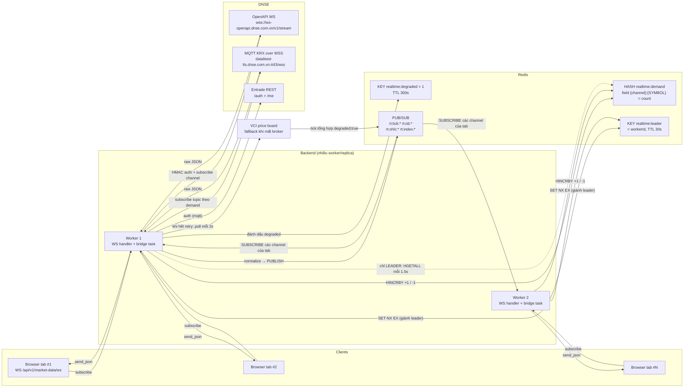

# Realtime WebSocket

Chương này đặc tả toàn bộ hệ thống dữ liệu thị trường realtime của IQX: một endpoint WebSocket công khai (`/api/v1/market-data/ws`) mà frontend nối vào bằng JSON thuần, và "cầu nối DNSE" (bridge) phía sau — một tiến trình được bầu leader qua Redis, giữ đúng MỘT kết nối tới DNSE (MQTT KRX legacy hoặc OpenAPI WS), chuẩn hoá payload rồi fan-out qua Redis pub/sub. Mọi tên field, tên Redis key, MQTT topic, tên channel OpenAPI, đơn vị giá và giá trị mặc định trong chương này được đọc trực tiếp từ source Python; bản TypeScript/NestJS phải giữ **nguyên hợp đồng JSON** để frontend hiện tại chạy được mà không sửa một dòng nào.

> Đường dẫn file trong chương này là đường dẫn tương đối tính từ repo root `/Users/danhtrongit/Projects/IQX/backend`.

---

## 1. Phạm vi chương & bản đồ file nguồn

| File source | Dòng | Vai trò |
|---|---|---|
| `app/api/v1/endpoints/realtime_ws.py` | 148 | Endpoint WS, class `_Connection`, enforce cap số mã, forward Redis → client |
| `app/services/realtime/__init__.py` | 42 | Lifespan hook `startup()` / `shutdown()` cho bridge |
| `app/services/realtime/bridge.py` | 506 | Leader election, vòng reconnect, reconcile demand → topic, degraded mode |
| `app/services/realtime/demand.py` | 90 | Ref-count demand `(symbol, channel)` trên Redis hash |
| `app/services/realtime/pubsub.py` | 59 | Wrapper publish/subscribe Redis pub/sub |
| `app/services/realtime/schemas.py` | 27 | Pydantic `ClientMessage` + `Channel` literal |
| `app/services/realtime/topics.py` | 44 | Builder MQTT topic + tên Redis channel |
| `app/services/realtime/normalize.py` | 182 | Chuẩn hoá payload DNSE (cả 2 transport) sang schema IQX |
| `app/services/realtime/dnse_auth.py` | 109 | Auth Entrade (`/auth` → JWT, `/me` → investorId), cache token |
| `app/services/realtime/openapi_stream.py` | 303 | Transport DNSE OpenAPI WS (HMAC handshake, subscribe frame, `T` dispatch) |
| `app/core/config.py` | 150–168 | Toàn bộ biến `REALTIME_*` / `DNSE_*` |
| `app/api/v1/router.py` | 41, 57 | Đăng ký router (prefix `/api/v1`) |
| `app/main.py` | 63–70 | Gọi `rt_startup()` / `rt_shutdown()` trong lifespan |

Test vector (dùng làm bộ nghiệm thu khi port sang TS — xem §16):

- `tests/test_realtime_normalize.py` (122 dòng) — payload MQTT thật, capture live 2026-06-11.
- `tests/test_realtime_normalize_openapi.py` (242 dòng) — payload đúng theo docs OpenAPI (`connect.md`).
- `tests/test_realtime_openapi_stream.py` (195 dòng) — HMAC vector cố định, frame shape, `resolve_transport`, `_cap_demand`.

Thư viện Python đang dùng (để đối chiếu khi chọn thư viện TS): `redis[hiredis]>=5.0,<7.0` (pub/sub + lock), `aiomqtt>=2.3,<3.0` (MQTT v5 over WSS), `websockets` (import lazy trong `openapi_stream.connect()`; **không** khai báo tường minh trong `pyproject.toml` — vào qua `uvicorn[standard]`/`fastapi[standard]`).

---

## 2. Endpoint WebSocket & vòng đời kết nối

### 2.1 Đường dẫn & quyền truy cập

| Thuộc tính | Giá trị |
|---|---|
| Đường dẫn đầy đủ | `/api/v1/market-data/ws` |
| Nguồn | `@router.websocket("/market-data/ws")` + `APIRouter(prefix="/api/v1")` trong `app/api/v1/router.py:48` |
| Router tag | `Realtime` (chỉ để nhóm; FastAPI **không** mô tả route WebSocket trong OpenAPI → endpoint này không có trong `openapi.json`) |
| Auth | **KHÔNG** — public, không `Depends`, không đọc header `Authorization`, không đọc cookie, không query param token |
| Subprotocol | Không dùng (`ws.accept()` gọi không tham số) |
| Định dạng frame | Text JSON hai chiều (`receive_json()` / `send_json()`) |

Lý do public được ghi thẳng trong docstring endpoint: "Access is public (matches the existing public price-board)" — bảng giá REST hiện tại cũng public, nên WS không gắt hơn; đổi lại mỗi connection bị chặn cứng bằng `REALTIME_WS_MAX_SYMBOLS_PER_CONN`.

**Middleware KHÔNG áp lên WS.** `RequestIDMiddleware` và `SlowAPIMiddleware` đều dựa trên `BaseHTTPMiddleware`, và `CORSMiddleware` cũng chỉ xử lý scope `http` (hành vi Starlette). Hệ quả cần biết khi port:

- Không có rate limit trên endpoint WS (khác hẳn các endpoint REST).
- Không kiểm tra `Origin` — mọi website đều mở được kết nối này.
- Không có header `X-Request-ID` trong log của session WS.

Nếu bản TS muốn siết, đó là **thay đổi hành vi có chủ ý** — phải ghi vào changelog, không nên âm thầm thêm guard.

### 2.2 Khi `REALTIME_ENABLED=false`

```
if not settings.REALTIME_ENABLED:
    await ws.close(code=1013)   # try again later
    return
```

- Close code **1013 = "Try Again Later"** (RFC 6455 / IANA WebSocket Close Code Registry). Ý nghĩa: server tạm thời không phục vụ được, client **nên thử lại sau**, không phải lỗi vĩnh viễn của client. Chọn 1013 thay vì 1008 (policy violation) hay 1011 (internal error) là cố ý: frontend được phép retry với backoff mà không cần báo lỗi cho người dùng.
- `close()` được gọi **TRƯỚC** `accept()`. Theo ASGI, close trước accept = từ chối handshake; tuỳ server (uvicorn) client có thể chỉ thấy HTTP `403` chứ không nhận được close code 1013. **Khuyến nghị cho bản TS**: `accept()` rồi mới `close(1013)` để client luôn đọc đúng code — đây là cải thiện có chủ ý, hành vi quan sát được ở phía client tốt hơn bản Python.

### 2.3 Khi `REDIS_ENABLED=false` nhưng `REALTIME_ENABLED=true`

Đây là tổ hợp cấu hình sai nhưng **không** bị chặn ở endpoint:

1. `app/services/realtime/__init__.py:startup()` log warning `"Realtime requires Redis; REDIS_ENABLED=false — skipping bridge"` và **không** khởi động bridge.
2. Endpoint WS vẫn `accept()` bình thường.
3. `demand.add()` / `demand.remove()` thấy `get_redis_client() is None` → no-op im lặng.
4. `pubsub.subscribe()` thấy client None → generator return ngay → forwarder task kết thúc lập tức.
5. Kết quả: client kết nối được, `ping`/`pong` chạy, `subscribe` trả về không lỗi, nhưng **không bao giờ nhận được data frame nào**. Không có message cảnh báo nào gửi cho client.

Bản TS nên giữ nguyên tính fail-safe này (Redis chết không được làm sập API), nhưng nên log warning ở lần subscribe đầu tiên.

### 2.4 Vòng lặp session (thứ tự chính xác)

1. Đọc settings; nếu `REALTIME_ENABLED=false` → close 1013, kết thúc.
2. `await ws.accept()`.
3. Tạo `_Connection` (state per-connection: `subs`, `_redis_channels`, `_forward_task`, `asyncio.Lock`).
4. Vòng `while True`:
   a. `raw = await ws.receive_json()`.
   b. Validate bằng `ClientMessage.model_validate(raw)`. `ValidationError` → gửi `{"type":"error","detail":"invalid message"}` rồi **`continue`** (KHÔNG đóng kết nối).
   c. `action == "ping"` → gửi `{"type":"pong"}`.
   d. `action == "subscribe"` → `conn.subscribe(msg.normalized_symbols(), list(msg.channels))`.
   e. `action == "unsubscribe"` → `conn.unsubscribe(...)`.
5. `WebSocketDisconnect` → thoát êm.
6. Exception khác → `logger.debug("ws session error")`, thoát.
7. `finally: await conn.close()` — **luôn** chạy: cancel forwarder task + `demand.remove()` cho từng cặp đang giữ.

**Cạm bẫy quan trọng:** frame không phải text-JSON hợp lệ (JSON rác, frame binary) làm `receive_json()` ném exception → rơi vào nhánh 6 → **session bị kết thúc**. Chỉ JSON hợp lệ nhưng sai schema mới được trả lỗi mềm ở nhánh 4b. Bản TS phải phân biệt đúng hai trường hợp này:

| Input từ client | Hành vi server |
|---|---|
| `{"action":"ping"}` | `{"type":"pong"}` |
| `{"action":"bogus"}` | `{"type":"error","detail":"invalid message"}`, session tiếp tục |
| `{"action":"subscribe","channels":["foo"]}` | `{"type":"error","detail":"invalid message"}`, session tiếp tục |
| `not-json` | Session **kết thúc** (server đóng kết nối) |
| Frame binary | Session **kết thúc** |

---

## 3. Giao thức client → server

### 3.1 Schema `ClientMessage` (`app/services/realtime/schemas.py`)

| Field | Type Python | Bắt buộc | Default | Ghi chú |
|---|---|---|---|---|
| `action` | `Literal["subscribe","unsubscribe","ping"]` | **CÓ** | — | Giá trị khác → `invalid message` |
| `symbols` | `list[str]` | Không | `[]` | Được normalize (§3.3) |
| `channels` | `list[Channel]` | Không | `["tick"]` | `Channel = "tick" \| "orderbook" \| "ohlc" \| "index"` |

Pydantic mặc định (không set `extra="forbid"`) → **field lạ bị bỏ qua im lặng**, ví dụ `{"action":"ping","foo":1}` vẫn hợp lệ.

Type TS tương ứng:

```ts
type RtChannel = 'tick' | 'orderbook' | 'ohlc' | 'index';
type RtAction = 'subscribe' | 'unsubscribe' | 'ping';

interface RtClientMessage {
  action: RtAction;          // bắt buộc
  symbols?: string[];        // default []
  channels?: RtChannel[];    // default ['tick']
}
```

### 3.2 Ví dụ JSON client → server

```json
{"action":"subscribe","symbols":["FPT","HPG"],"channels":["tick","orderbook"]}
```

```json
{"action":"subscribe","symbols":["VNINDEX","VN30"],"channels":["index"]}
```

```json
{"action":"unsubscribe","symbols":["HPG"],"channels":["orderbook"]}
```

```json
{"action":"ping"}
```

Ngữ nghĩa: `subscribe` tạo **tích Descartes** `symbols × channels`. Ví dụ trên = 4 cặp: `(FPT,tick)`, `(FPT,orderbook)`, `(HPG,tick)`, `(HPG,orderbook)`.

`unsubscribe` cũng là tích Descartes, và **chỉ giảm demand cho cặp connection đang thực sự giữ** (`if pair in self.subs`). Client spam `unsubscribe` cho cặp chưa subscribe **không** làm âm ref-count — đây là lá chắn quan trọng, bản TS phải giữ.

`ping` bỏ qua hoàn toàn `symbols` / `channels`.

### 3.3 Normalize symbol (`ClientMessage.normalized_symbols()`)

Thuật toán chính xác, theo thứ tự:

1. Với mỗi phần tử: `str(s).strip().upper()` — **trim khoảng trắng hai đầu + UPPERCASE**.
2. Bỏ chuỗi rỗng sau khi trim.
3. **Loại trùng nhưng GIỮ THỨ TỰ xuất hiện đầu tiên** (dùng list + kiểm tra `not in`, không dùng `set`).

```ts
function normalizedSymbols(symbols: string[] | undefined): string[] {
  const seen: string[] = [];
  for (const s of symbols ?? []) {
    const u = String(s).trim().toUpperCase();
    if (u && !seen.includes(u)) seen.push(u);
  }
  return seen;
}
```

Không có validate độ dài, không có regex chặn ký tự lạ, không kiểm tra mã có tồn tại trong bảng `symbols` hay không. Mã rác (ví dụ `"ZZZZZ"`) sẽ:

- được ghi demand vào Redis hash,
- khiến leader subscribe một MQTT topic vô nghĩa (broker im lặng),
- **chiếm 1 slot trong cap của connection và 1 slot trong `REALTIME_MAX_SYMBOLS`**.

Bản TS nên giữ nguyên hành vi (không validate) hoặc thêm regex `^[A-Z0-9]{1,12}$` — nếu thêm thì phải coi là thay đổi hành vi có chủ ý.

`channels` **không** được normalize: `"TICK"` in hoa → `ValidationError` → `invalid message`. Chỉ chữ thường đúng chính tả mới hợp lệ.

---

## 4. Giao thức server → client

Có đúng **6 loại message**. Tên field lấy từ `app/services/realtime/normalize.py`; tất cả đều là snake_case.

### 4.1 Bảng tổng hợp

| `type` | Sinh ra bởi | Redis channel nguồn | Field khoá định danh |
|---|---|---|---|
| `tick` | `normalize_tick()` hoặc degraded VCI poll | `rt:tick:{SYMBOL}` | `symbol` |
| `orderbook` | `normalize_orderbook()` | `rt:ob:{SYMBOL}` | `symbol` |
| `ohlc` | `normalize_ohlc()` | `rt:ohlc:{SYMBOL}` | `symbol` |
| `index` | `normalize_index()` | `rt:index:{CODE}` | **`code`** (KHÔNG phải `symbol`) |
| `pong` | Endpoint, trả lời `ping` | — | — |
| `error` | Endpoint | — | `detail` |

### 4.2 Quy ước đơn vị (bắt buộc đọc trước khi port)

Docstring `normalize.py` ghi rõ, và test vector khoá lại:

| Loại giá trị | Đơn vị DNSE gửi | Đơn vị IQX trả cho client | Phép biến đổi |
|---|---|---|---|
| Giá cổ phiếu (`matchPrice`, `open/high/low/close`, giá bậc orderbook) | nghìn đồng (`73.4`) | **VND tuyệt đối** (`73400`) | `round(value × 1000)` |
| Giá phái sinh / chỉ số | điểm | **điểm, KHÔNG nhân** | giữ nguyên |
| Khối lượng (`matchQtty`, `volume`, `totalVolumeTraded`, `qtty`/`quantity`) | số cổ phiếu (tuyệt đối) | giữ nguyên | không đổi |
| `grossTradeAmount` của frame index OpenAPI | **tỷ đồng** (`18650.467`) | VND tuyệt đối | `× 1e9` |
| `sendingTime` (MQTT) | ISO8601 UTC có ms, hậu tố `Z` | giữ nguyên chuỗi | passthrough |
| `time` / `transactTime` (OpenAPI) | `{"Seconds":…,"Nanos":…}` | ISO8601 UTC `…THH:MM:SS.mmmZ` | §4.3 |
| `time` / `lastUpdated` của OHLC | epoch **giây** (số hoặc chuỗi) | epoch giây (integer) | `int(float(v))` |

Lý do nhân 1000 cho cổ phiếu: khớp schema bảng giá REST hiện có (`close_price`, `reference_price`, …) mà frontend đã dùng — tuyệt đối không được đổi.

**Cạm bẫy làm tròn:** `_to_vnd` dùng `round()` của Python = *round-half-to-even* (banker's rounding); `Math.round()` của JS = *round-half-up*. Với giá 4 chữ số thập phân (`24.3335 × 1000 = 24333.5`) hai bên cho kết quả khác nhau (Python `24334`? phụ thuộc biểu diễn nhị phân; JS luôn `24334`). Chênh 1 VND, không ảnh hưởng nghiệp vụ, nhưng nếu port lại test vector Python thì phải biết. Khuyến nghị TS: `Math.round(v * 1000)` và ghi chú sai lệch này.

**Parse an toàn:** helper `_f()` chuyển mọi giá trị sang float, `None`/chuỗi rác/`TypeError`/`ValueError` → **`0.0`** (không ném lỗi, không trả `null`). Nghĩa là field số **không bao giờ null** trong payload server → client.

```ts
function toNum(v: unknown): number {
  if (v === null || v === undefined) return 0;
  const n = typeof v === 'number' ? v : Number(v);
  return Number.isFinite(n) ? n : 0;
}
```

### 4.3 Chuẩn hoá thời gian (`_time_value`)

- Nếu value là **object**: đọc `Seconds` (hoặc `seconds`). Nếu `Seconds <= 0` hoặc thiếu → trả **`null`** (không bịa timestamp). Ngược lại `Nanos` (hoặc `nanos`) `// 1_000_000` → millis, format `YYYY-MM-DDTHH:MM:SS.mmmZ` theo **UTC**, millis luôn 3 chữ số zero-pad.
- Nếu value là chuỗi hoặc `null` → **passthrough nguyên xi**.

Test vector: `{"Seconds":1779762571,"Nanos":101000000}` → `"2026-05-26T02:29:31.101Z"`; `{"Seconds":1779762571}` → `"2026-05-26T02:29:31.000Z"`; `{}` → `null`.

Hệ quả về type: nếu upstream gửi `time` là **số epoch thô** (không phải object, không phải chuỗi), giá trị được truyền nguyên → field `time` có thể là `number`. Vì vậy hợp đồng thực tế là `string | number | null` cho `tick`/`orderbook`/`index`.

### 4.4 `tick`

```ts
interface RtTickMessage {
  type: 'tick';
  symbol: string;                        // raw.symbol, mặc định '' nếu thiếu
  price: number;                         // VND tuyệt đối (CP) hoặc điểm (phái sinh/chỉ số)
  volume: number;                        // raw.matchQtty — khối lượng khớp của tick này
  side: 'B' | 'S' | 'unknown';           // 'SIDE_BUY'/'BUY' → 'B'; 'SIDE_SELL'/'SELL' → 'S'
  total_volume: number;                  // raw.totalVolumeTraded — KL luỹ kế trong phiên
  time: string | number | null;          // raw.sendingTime || raw.time, qua _time_value
  session?: string | null;               // raw.tradingSessionId — CHỈ có ở tick từ broker
  degraded?: true;                       // CHỈ có ở tick sinh từ VCI polling (§12)
}
```

Chi tiết hành vi:

- `side` được suy bằng **substring không phân biệt hoa/thường**: chứa `"BUY"` → `B`, chứa `"SELL"` → `S`, còn lại (kể cả thiếu field) → `"unknown"`. Vì vậy `"SIDE_BUY"` (MQTT) và `"SELL"` (OpenAPI) đều map đúng.
- `time` ưu tiên `sendingTime`, fallback `time`. Dùng toán tử `or` → `sendingTime` rỗng/`""` cũng bị coi là thiếu.
- `session`: broker tick **luôn có key này** (giá trị có thể `null` nếu thiếu `tradingSessionId`). Degraded tick **không có key `session`** và có thêm `degraded: true`.
- Frame OpenAPI loại `T:"t"` (Trade thường) **không có** `side` → luôn `"unknown"`; vì thế bridge đăng ký channel `tick_extra` (`T:"te"`) để lấy được `side` (xem §9.3).

Ví dụ thật (nguồn MQTT, cổ phiếu):

```json
{"type":"tick","symbol":"FPT","price":73400,"volume":10.0,"side":"B","total_volume":63210.0,"time":"2026-06-11T02:42:05.184Z","session":"TRADING_SESSION_ID_40"}
```

Ví dụ thật (nguồn OpenAPI, cổ phiếu HPG, `time` dạng `{Seconds,Nanos}`):

```json
{"type":"tick","symbol":"HPG","price":24350,"volume":40.0,"side":"unknown","total_volume":1184240.0,"time":"2026-05-26T02:29:31.101Z","session":"40"}
```

Ví dụ phái sinh (không nhân 1000):

```json
{"type":"tick","symbol":"41I1G6000","price":2022.5,"volume":1.0,"side":"S","total_volume":55913.0,"time":"2026-05-26T03:40:22.072Z","session":"40"}
```

### 4.5 `orderbook`

```ts
interface RtOrderbookLevel {
  price: number;    // VND tuyệt đối (CP) hoặc điểm (phái sinh)
  volume: number;   // raw qtty HOẶC quantity
}

interface RtOrderbookMessage {
  type: 'orderbook';
  symbol: string;
  bids: RtOrderbookLevel[];       // từ raw.bid  — giữ nguyên thứ tự upstream
  asks: RtOrderbookLevel[];       // từ raw.offer — DNSE gọi 'offer', IQX đổi tên thành 'asks'
  time: string | number | null;
}
```

Hành vi:

- DNSE dùng `bid` / **`offer`** (không phải `ask`). Bridge đổi tên `offer` → `asks` cho client.
- Key khối lượng mỗi bậc: thử `qtty` trước (MQTT + SDK); nếu **`is None`** thì thử `quantity` (docs OpenAPI). Lưu ý dùng kiểm tra `is None`, nên `qtty: 0` vẫn được giữ là 0 (không fallback sang `quantity`).
- Thiếu `bid`/`offer` → mảng rỗng (`raw.get("bid") or []`), không null.
- **Không** giới hạn số bậc — bao nhiêu bậc upstream gửi thì forward hết (bảng giá REST của VCI mới cắt 3 bậc).

Ví dụ thật (MQTT, FPT):

```json
{"type":"orderbook","symbol":"FPT","bids":[{"price":73300,"volume":3010.0},{"price":73200,"volume":5940.0}],"asks":[{"price":73400,"volume":270.0}],"time":"2026-06-11T02:42:06.182Z"}
```

Ví dụ thật (OpenAPI, phái sinh, key `quantity`):

```json
{"type":"orderbook","symbol":"41I1G6000","bids":[{"price":2023.4,"volume":9.0},{"price":2023.3,"volume":22.0},{"price":2023.2,"volume":15.0}],"asks":[{"price":2023.6,"volume":3.0},{"price":2023.7,"volume":62.0},{"price":2023.8,"volume":16.0}],"time":"2026-05-26T03:45:43.736Z"}
```

### 4.6 `ohlc`

```ts
interface RtOhlcMessage {
  type: 'ohlc';
  symbol: string;
  time: number;          // epoch GIÂY (int) — mở nến
  open: number;          // VND tuyệt đối (CP) hoặc điểm (chỉ số/phái sinh)
  high: number;
  low: number;
  close: number;
  volume: number;
  last_updated: number;  // epoch GIÂY (int) — lần cập nhật cuối của nến
}
```

- `time` và `last_updated` đi qua `int(float(v))` → chấp nhận cả `"1780541940"` (chuỗi) và `1757992500` (số); thiếu → `0`.
- Độ phân giải nến là **1 phút** (do topic/channel quy định: `v2/ohlc/stock/1` và `ohlc.1.json`). Field `resolution` mà DNSE gửi **không** được forward cho client.
- `time` ở đây **không** đi qua `_time_value` — luôn là số, không bao giờ chuỗi ISO.

Ví dụ thật:

```json
{"type":"ohlc","symbol":"FPT","time":1780541940,"open":76600,"high":76600,"low":76600,"close":76600,"volume":12900.0,"last_updated":1780541992}
```

Ví dụ nến chỉ số (giữ điểm, không ×1000):

```json
{"type":"ohlc","symbol":"VNINDEX","time":1757988000,"open":1696.87,"high":1696.87,"low":1686.02,"close":1686.31,"volume":435873728.0,"last_updated":1757993070}
```

### 4.7 `index`

```ts
interface RtIndexMessage {
  type: 'index';
  code: string;                  // KHÔNG phải 'symbol'
  value: number;                 // điểm chỉ số, KHÔNG ×1000
  change: number;                // điểm
  change_percent: number;        // phần trăm (0.41 = +0.41%)
  total_volume: number;          // cổ phiếu
  total_value: number;           // VND tuyệt đối
  advances: number;              // số mã tăng
  declines: number;              // số mã giảm
  nochange: number;              // số mã đứng giá
  time: string | number | null;
}
```

Chuỗi fallback chính xác cho từng field (thứ tự trái → phải, dùng toán tử `or` nên **giá trị 0 bị coi là "thiếu"** và nhảy tiếp):

| Field IQX | Chuỗi key nguồn |
|---|---|
| `code` | `indexName` → `symbol` → `code` → `indexId` → `""` |
| `value` | `valueIndexes` → `indexValue` → `value` |
| `change` | `changedValue` → `change` |
| `change_percent` | `changedRatio` → `changePercent` → `ratioChange` |
| `total_volume` | `totalVolumeTraded` → `allQty` → `totalQtty` |
| `total_value` | **nếu** `grossTradeAmount is not None` → `grossTradeAmount × 1e9`; ngược lại `allValue` → `totalValue` |
| `advances` | `fluctuationUpIssueCount` → `advances` |
| `declines` | `fluctuationDownIssueCount` → `declines` |
| `nochange` | `fluctuationSteadinessIssueCount` → `nochange` → `noChanges` |
| `time` | `transactTime` → `sendingTime` → `time` (qua `_time_value`) |

Lưu ý `total_value` dùng kiểm tra `is not None` (không phải truthy) → `grossTradeAmount: 0` cho ra `total_value: 0`, **không** fallback. Các field khác dùng truthy → không phân biệt được "0" với "thiếu"; đây là hành vi hiện tại, bản TS nên copy y nguyên để dữ liệu không lệch.

Ví dụ thật (OpenAPI `T:"mi"`, VNINDEX):

```json
{"type":"index","code":"VNINDEX","value":1669.38,"change":6.84,"change_percent":0.41,"total_volume":706563754.0,"total_value":1.865046734291e13,"advances":144.0,"declines":158.0,"nochange":67.0,"time":"2026-03-31T07:05:05.000Z"}
```

Ví dụ shape MQTT legacy:

```json
{"type":"index","code":"VNINDEX","value":1285.5,"change":5.2,"change_percent":0.41,"total_volume":0.0,"total_value":0.0,"advances":0.0,"declines":0.0,"nochange":0.0,"time":null}
```

### 4.8 `pong` và `error`

```ts
interface RtPongMessage { type: 'pong' }

interface RtErrorMessage {
  type: 'error';
  detail: 'invalid message' | 'symbol limit reached';
}
```

Đúng **hai** chuỗi `detail` tồn tại trong source, không có mã lỗi, không có field phụ:

```json
{"type":"pong"}
```

```json
{"type":"error","detail":"invalid message"}
```

```json
{"type":"error","detail":"symbol limit reached"}
```

### 4.9 Union type đầy đủ

```ts
type RtServerMessage =
  | RtTickMessage
  | RtOrderbookMessage
  | RtOhlcMessage
  | RtIndexMessage
  | RtPongMessage
  | RtErrorMessage;
```

Không có message `type: 'subscribed'` / `'ack'` / `'snapshot'`. Sau khi `subscribe`, client **không** nhận xác nhận nào — data frame đầu tiên chính là tín hiệu thành công. Cũng **không có snapshot ban đầu**: client phải gọi REST bảng giá để có state đầu, WS chỉ đẩy delta từ lúc subscribe.

---

## 5. Giới hạn số mã & cách đếm

### 5.1 Hai mức trần

| Biến | Default | Phạm vi | Nơi enforce |
|---|---|---|---|
| `REALTIME_WS_MAX_SYMBOLS_PER_CONN` | `100` | Mỗi WebSocket connection | `_Connection.subscribe()` trong `realtime_ws.py` |
| `REALTIME_MAX_SYMBOLS` | `200` | Toàn hệ thống (số mã leader subscribe đồng thời) | `_cap_demand()` trong `bridge.py` |

### 5.2 Cách đếm cap per-connection (chính xác)

Trong `_Connection.subscribe()`, cho từng cặp `(sym, ch)` theo thứ tự lặp `for sym in symbols: for ch in channels:`:

1. Nếu cặp đã có trong `self.subs` → **`continue`** (không đếm lại, không gửi lỗi).
2. Tính `distinct = {s for (s, c) in self.subs if c != "index"}` — **tập mã DISTINCT đang giữ, loại bỏ mọi cặp thuộc channel `index`**.
3. Từ chối khi **cả ba** điều kiện đúng:
   - `ch != "index"`, **và**
   - `sym not in distinct` (mã mới, chưa có channel nào ngoài index), **và**
   - `len(distinct) >= REALTIME_WS_MAX_SYMBOLS_PER_CONN`.
4. Nếu bị từ chối: gửi `{"type":"error","detail":"symbol limit reached"}` rồi `continue` — **không** đóng kết nối, **không** dừng xử lý các cặp còn lại.
5. Nếu được nhận: `subs.add(pair)`; thêm Redis channel; `await demand.add(sym, [ch])`.
6. Sau khi hết vòng lặp: `_restart_forwarder()` **một lần**.

Hệ quả cần nắm:

- **Đếm theo mã distinct, không theo cặp.** Một mã đăng ký cả `tick` + `orderbook` + `ohlc` = **1 slot**.
- **Channel `index` KHÔNG tính vào cap.** Comment trong source (`realtime_ws.py:77-78`) nêu lý do nguyên văn: *"mã chỉ số không tính vào cap — chỉ vài mã, dùng chung cho mọi client, và không được để tab lớn đẩy chỉ số ra ngoài."* Tức là: chỉ số chỉ có vài mã (VNINDEX, VN30, HNX, HNX30, UPCOM, VN100), payload dùng chung cho mọi client, và một tab mở 100 mã cổ phiếu không được phép làm mất header chỉ số của chính tab đó.
- Đã đủ 100 mã rồi thì mã cũ vẫn **thêm được channel mới** (vì `sym in distinct`).
- Nếu client gửi 1 mã vượt cap kèm 3 channel không-index → nhận **3 frame lỗi** (một frame cho mỗi cặp bị từ chối), vì kiểm tra nằm trong vòng lặp cặp.
- `unsubscribe` giải phóng slot ngay: `distinct` được tính lại từ `self.subs` mỗi lần.

Ví dụ tuần tự (cap = 2 cho dễ hình dung):

```
→ {"action":"subscribe","symbols":["A","B"],"channels":["tick"]}      // subs = {(A,tick),(B,tick)}, distinct = {A,B}
→ {"action":"subscribe","symbols":["A"],"channels":["orderbook"]}     // OK — A đã trong distinct
→ {"action":"subscribe","symbols":["C"],"channels":["tick"]}          // ← {"type":"error","detail":"symbol limit reached"}
→ {"action":"subscribe","symbols":["VNINDEX"],"channels":["index"]}   // OK — index miễn cap
→ {"action":"unsubscribe","symbols":["B"],"channels":["tick"]}        // distinct = {A}
→ {"action":"subscribe","symbols":["C"],"channels":["tick"]}          // OK
```

### 5.3 Cap toàn hệ thống (`_cap_demand`)

Leader gọi `_cap_demand(wanted, REALTIME_MAX_SYMBOLS)` mỗi vòng reconcile (§7.3):

1. `len(wanted) <= max_symbols` → trả về **chính object đó** (không copy).
2. Ngược lại: tách `index_entries` = mọi mã có `"index"` trong tập channel → **luôn giữ**.
3. `rest` = các mã còn lại, **sort tăng dần theo tên** (deterministic).
4. `keep = max(0, max_symbols - len(index_entries))`; lấy `rest[:keep]`.

Lý do sort (comment source `bridge.py:74-77`): thứ tự trả về của Redis hash là tuỳ ý, `dict(list(...)[:N])` ngây thơ có thể **loại đúng các channel index** khi vài client mở tab lớn. Sort + ưu tiên index làm việc cắt trở nên xác định và không bao giờ hy sinh chỉ số.

Hệ quả vận hành: mã bị cắt vẫn có demand trong Redis và client vẫn "nghĩ" mình đã subscribe (không có frame lỗi nào gửi về), nhưng leader **không** mở topic → client không nhận data. Đây là silent degradation, ghi rõ để đội vận hành biết khi `> 200` mã cùng lúc.

---

## 6. Kiến trúc tổng thể

### 6.1 Sơ đồ hệ thống



### 6.2 Sơ đồ tuần tự: từ `subscribe` đến frame đầu tiên

```mermaid
sequenceDiagram
  autonumber
  participant C as Client (browser)
  participant W as WS handler (worker bất kỳ)
  participant R as Redis
  participant B as Bridge (leader)
  participant D as DNSE

  C->>W: {"action":"subscribe","symbols":["FPT"],"channels":["tick"]}
  W->>W: normalize symbol → "FPT"; kiểm tra cap per-conn
  W->>R: HINCRBY realtime:demand "tick:FPT" 1
  W->>R: SUBSCRIBE rt:tick:FPT
  Note over B,R: vòng reconcile mỗi REALTIME_SUBSCRIBE_POLL_SECONDS = 1.5s
  B->>R: GET realtime:leader (CAS) + EXPIRE 30s
  B->>R: HGETALL realtime:demand
  B->>B: _cap_demand(wanted, REALTIME_MAX_SYMBOLS)
  B->>D: subscribe topic/channel cho (tick, FPT)
  D-->>B: payload thô (matchPrice 73.4 nghìn đồng)
  B->>B: normalize → price 73400, side 'B'
  B->>R: PUBLISH rt:tick:FPT {...}
  R-->>W: message trên rt:tick:FPT
  W-->>C: {"type":"tick","symbol":"FPT","price":73400,...}
  C->>W: (đóng tab) close
  W->>R: HINCRBY realtime:demand "tick:FPT" -1  (HDEL nếu <= 0)
  Note over B: vòng reconcile kế tiếp sẽ unsubscribe topic FPT
```

### 6.3 Vì sao phải có leader

Docstring `bridge.py` nói rõ: với `uvicorn --workers 2` phải giữ **đúng MỘT** kết nối DNSE. Mỗi worker đều tạo một `DnseBridge` (singleton per process, `get_bridge()`), nhưng chỉ worker giành được lock Redis mới connect. Worker khác lặp vô hạn thử giành lock để failover khi leader chết (failover dựa trên TTL).

Nếu hai worker cùng stream, mỗi client sẽ nhận **message trùng lặp** — đây là lý do `_race_pump_and_reconcile()` tồn tại (§7.4).

---

## 7. Bridge: leader election, reconcile, reconnect

### 7.1 Danh tính worker

`_WORKER_ID = f"{os.getpid()}-{random.randint(1000, 9999)}"` — PID + số random 4 chữ số, sinh **một lần tại thời điểm import module**. Random để hai container khác nhau tình cờ cùng PID không đụng nhau.

### 7.2 Leader election (3 phép Redis)

| Thao tác | Lệnh Redis | Chi tiết |
|---|---|---|
| Giành | `SET realtime:leader <workerId> NX EX <REALTIME_LEADER_LOCK_TTL>` | TTL default **30s**. Trả falsy → không phải leader. |
| Gia hạn | `GET realtime:leader` → so sánh `== workerId` → `EXPIRE realtime:leader <TTL>` | So sánh rồi mới gia hạn (**không atomic**). Trả `False` nếu không còn sở hữu hoặc Redis lỗi. |
| Nhả | `GET` → nếu `== workerId` → `DEL` | Gọi ở `finally` của `_run()` và trong `stop()` nếu đang là leader. |

Vòng ngoài `_run()`:

```
while not stop:
    if not try_acquire():
        is_leader = False
        sleep(REALTIME_LEADER_RENEW_SECONDS)   # default 10s
        continue
    is_leader = True; log "became leader"
    try: await _lead()
    except CancelledError: raise
    except Exception: log warning "leader loop crashed; will re-elect"
    finally: is_leader = False; await release_leader()
```

Nhịp gia hạn = `REALTIME_LEADER_RENEW_SECONDS` = **10s**, TTL = **30s** → cửa sổ an toàn 3 nhịp; leader chết đột ngột thì worker khác giành được lock sau tối đa ~30s + 10s.

**Khuyến nghị TS:** thay CAS 2 bước bằng **một Lua script** (hoặc `SET key val XX EX ttl` kèm kiểm tra chủ sở hữu trong script) để loại race "vừa mất lock giữa GET và EXPIRE lại tự gia hạn":

```lua
-- KEYS[1]=realtime:leader ARGV[1]=workerId ARGV[2]=ttl
if redis.call('GET', KEYS[1]) == ARGV[1] then
  return redis.call('EXPIRE', KEYS[1], ARGV[2])
end
return 0
```

### 7.3 Vòng reconcile (chung cho cả 2 transport)

Chạy song song với vòng pump message, nhịp `REALTIME_SUBSCRIBE_POLL_SECONDS` = **1.5s**:

1. `_renew_leader()`; trả `False` → **`raise RuntimeError("lost leadership")`** (tear down kết nối DNSE).
2. `wanted = await demand.current()` — `HGETALL realtime:demand`, bỏ field có count `<= 0` hoặc không parse được, tách field thành `channel` / `symbol` bằng `partition(":")`, gom thành `{symbol: set(channels)}`. Field không có phần symbol → bỏ.
3. `wanted = _cap_demand(wanted, REALTIME_MAX_SYMBOLS)`.
4. Diff với `subscribed` (dict trong RAM, sống theo đời kết nối DNSE) → subscribe cặp mới, unsubscribe cặp đã rớt.
5. `await asyncio.sleep(REALTIME_SUBSCRIBE_POLL_SECONDS)`.

Mọi lệnh (un)subscribe được bọc `contextlib.suppress(Exception)` → lỗi một topic không làm sập vòng reconcile.

Khác biệt nhỏ giữa 2 transport ở bước 4:

- **MQTT**: subscribe từng topic `qos=1`; sau đó `subscribed[symbol] = set(channels)`. Với mã rớt hẳn: unsubscribe các channel không còn, rồi `pop` khỏi dict.
- **OpenAPI**: gom `to_sub` / `to_unsub` thành **một frame subscribe và một frame unsubscribe** rồi gửi (ít frame hơn).

### 7.4 Race giữa pump và reconcile (`_race_pump_and_reconcile`)

- `asyncio.wait({pump, recon}, return_when=FIRST_COMPLETED)`; task nào xong trước thì `task.result()` (ném lại exception nếu có).
- `finally`: task nào chưa xong thì cancel + await; task nào đã xong thì **đọc `exception()`** để asyncio không log `"Task exception was never retrieved"`.

Comment source giải thích tại sao vòng reconcile ném lỗi **phải** kéo sập cả kết nối DNSE: nếu không, ex-leader tiếp tục stream và publish song song với leader mới → **mọi client nhận message trùng** cho tới khi broker tự ngắt.

### 7.5 Reconnect với backoff (`_lead`)

```
attempt = 0
while not stop:
    try:
        await _connect_and_stream()
        attempt = 0                       # thoát sạch (stop được yêu cầu)
    except CancelledError: raise
    except Exception:
        attempt += 1
        log warning "DNSE disconnected (…), attempt N/12"
        if attempt >= 12:
            await _run_degraded_until_recovery()
            attempt = 0
            continue
        delay = min(60.0, 2 ** (attempt - 1)) + random(0, 0.5)
        await _sleep_with_renew(delay)
```

| Hằng số | Giá trị | Nơi khai báo |
|---|---|---|
| `_MAX_RECONNECT_ATTEMPTS` | `12` | `bridge.py:41` (hằng số code, **không** phải env) |
| `_MAX_BACKOFF` | `60.0` giây | `bridge.py:40` |
| Jitter | `random.uniform(0, 0.5)` giây | `bridge.py:194` |

Chuỗi delay: `1, 2, 4, 8, 16, 32, 60, 60, 60, 60, 60` (+jitter) → tổng ~**6 phút** trước khi rơi vào degraded mode.

`_sleep_with_renew(seconds)` ngủ theo bước `min(REALTIME_LEADER_RENEW_SECONDS, remaining)` và gia hạn lock sau mỗi bước; gia hạn thất bại → `raise RuntimeError("lost leadership during sleep")` → tái bầu cử.

### 7.6 Lifespan hook

| Hook | Điều kiện | Hành vi |
|---|---|---|
| `startup()` | `REALTIME_ENABLED=false` | log info `"Realtime disabled (REALTIME_ENABLED=false)"`, return |
| | `REDIS_ENABLED=false` | log warning, **không** khởi động bridge |
| | đủ điều kiện | `get_bridge().start()` (tạo asyncio task tên `dnse-bridge`), log `"Realtime bridge started"` |
| `shutdown()` | `REALTIME_ENABLED=false` | return ngay |
| | ngược lại | `get_bridge().stop()`: set stop event, cancel task, nhả leader lock nếu đang giữ |

`start()` idempotent (chỉ tạo task nếu `self._task is None`).

---

## 8. Redis: tên key và channel chính xác

### 8.1 Key/hash quản lý

| Key | Loại | Giá trị | TTL | Nơi dùng |
|---|---|---|---|---|
| `realtime:demand` | HASH | field `{channel}:{SYMBOL}` → int count | **không TTL** | `demand.py` |
| `realtime:leader` | STRING | `{pid}-{rand4}` | `REALTIME_LEADER_LOCK_TTL` (30s) | `bridge.py` |
| `realtime:degraded` | STRING | `"1"` | **300s** (hardcode `ex=300`) | `bridge.py` |

Field của `realtime:demand`: `channel` là một trong `tick` / `orderbook` / `ohlc` / `index`; `SYMBOL` luôn UPPERCASE. Ví dụ: `tick:FPT`, `orderbook:VIC`, `ohlc:HPG`, `index:VNINDEX`.

`demand.remove()` giảm bằng `HINCRBY … -1`, và **`HDEL` field khi kết quả `<= 0`** (không để field âm tồn tại).

### 8.2 Redis pub/sub channel (`topics.redis_channel`)

| Kind | Pattern | Ví dụ |
|---|---|---|
| `tick` | `rt:tick:{SYMBOL}` | `rt:tick:FPT` |
| `orderbook` | `rt:ob:{SYMBOL}` | `rt:ob:FPT` |
| `ohlc` | `rt:ohlc:{SYMBOL}` | `rt:ohlc:FPT` |
| `index` | `rt:index:{CODE}` | `rt:index:VNINDEX` |
| kind lạ (vd `stockinfo`) | `rt:other:{SYMBOL}` | `rt:other:FPT` |

Chú ý: prefix của orderbook là **`rt:ob`**, không phải `rt:orderbook` — dễ sai khi port. Symbol trong tên channel luôn `.upper()`.

Payload publish: `json.dumps(payload, default=str, ensure_ascii=False)` — `default=str` nghĩa là object không serialize được sẽ thành chuỗi thay vì ném lỗi; `ensure_ascii=False` giữ nguyên UTF-8.

`pubsub.publish()` fail-safe: Redis chết → log warning, **không** ném lỗi lên bridge.

### 8.3 Cách WS handler nghe channel

- Mỗi `_Connection` giữ `_redis_channels: set[str]` = tập tên channel suy ra từ `self.subs`.
- Sau **mỗi** lần `subscribe`/`unsubscribe`: `_restart_forwarder()` → cancel task cũ, và nếu tập channel không rỗng thì tạo task mới `_forward(list(channels))` → `pubsub.subscribe(channels)` (một `redis.pubsub()` mới, `SUBSCRIBE` toàn bộ danh sách).
- `_forward` lặp `async for payload in pubsub.subscribe(...)` và `await self.ws.send_json(payload)`.
- Lỗi trong `_forward` (trừ `CancelledError`) → log `debug "ws forward stopped"` và task **im lặng kết thúc**: client vẫn mở kết nối, vẫn `ping/pong` được, nhưng **ngừng nhận data** cho tới lần subscribe kế tiếp. Đây là điểm yếu thực tế cần lưu ý khi port.
- `finally` của `pubsub.subscribe()` gọi `UNSUBSCRIBE` + `aclose()`.

**Hai điểm yếu của cách này (cố ý nêu để bản TS làm tốt hơn):**

1. **Cửa sổ mất message**: mỗi lần đổi subscription, task cũ bị cancel trước khi task mới `SUBSCRIBE` xong → message phát trong khoảng đó bị mất.
2. **Tốn connection**: mỗi WS connection tạo một pubsub riêng; 500 tab = 500 kết nối Redis ở chế độ subscriber.

→ §15 khuyến nghị dùng **một** subscriber Redis dùng chung + bảng dispatch trong RAM.

---

## 9. Hai transport DNSE

### 9.1 Chọn transport (`resolve_transport`)

```ts
function resolveTransport(cfg: { DNSE_TRANSPORT: string; DNSE_API_KEY: string; DNSE_API_SECRET: string }): 'openapi' | 'mqtt' {
  const explicit = String(cfg.DNSE_TRANSPORT ?? 'auto').trim().toLowerCase();
  if (explicit === 'openapi' || explicit === 'mqtt') return explicit;   // tường minh thắng
  if (cfg.DNSE_API_KEY && cfg.DNSE_API_SECRET) return 'openapi';        // auto: có ĐỦ cả 2 khoá
  return 'mqtt';                                                        // auto: còn lại
}
```

Bảng quyết định (khoá theo `tests/test_realtime_openapi_stream.py`):

| `DNSE_TRANSPORT` | `DNSE_API_KEY` | `DNSE_API_SECRET` | Kết quả |
|---|---|---|---|
| `auto` | có | có | `openapi` |
| `auto` | có | trống | `mqtt` |
| `auto` | trống | có | `mqtt` |
| `auto` | trống | trống | `mqtt` |
| `mqtt` | có | có | `mqtt` (tường minh thắng) |
| `openapi` | trống | trống | `openapi` (dù thiếu khoá → handshake sẽ fail) |
| `OPENAPI` / `" MQTT "` | — | — | Chuẩn hoá `.strip().lower()` → `openapi` / `mqtt` |
| `bogus` | có | có | `openapi` (giá trị lạ → coi như `auto`) |
| `""` | trống | trống | `mqtt` |

Transport được resolve lại **mỗi lần** `_connect_and_stream()` và trong `_probe_dnse()` — không cache.

### 9.2 Transport `mqtt` (legacy KRX)

Tham số kết nối `aiomqtt.Client`:

| Tham số | Giá trị |
|---|---|
| `hostname` | `DNSE_MQTT_HOST` = `datafeed-lts.dnse.com.vn` |
| `port` | `DNSE_MQTT_PORT` = `443` |
| `transport` | `"websockets"` |
| `websocket_path` | `DNSE_MQTT_WS_PATH` = `/wss` |
| `username` | **`investorId`** (từ `GET /me`) |
| `password` | **JWT** (từ `POST /auth`) |
| `identifier` | `f"iqx-{_WORKER_ID}"` |
| `protocol` | MQTT **v5** (`aiomqtt.ProtocolVersion.V5`) |
| `tls_context` | `ssl.create_default_context()` (verify mặc định) |
| `keepalive` | `120` giây |
| QoS subscribe | `1` |

MQTT topic (`topics.mqtt_topic`), base `plaintext/quotes/krx/mdds`:

| Kind | Topic |
|---|---|
| `tick` | `plaintext/quotes/krx/mdds/tick/v1/roundlot/symbol/{SYMBOL}` |
| `orderbook` | `plaintext/quotes/krx/mdds/topprice/v1/roundlot/symbol/{SYMBOL}` |
| `ohlc` | `plaintext/quotes/krx/mdds/v2/ohlc/stock/1/{SYMBOL}` |
| `index` | `plaintext/quotes/krx/mdds/marketindex/v1/code/{CODE}` |
| khác | `None` (bỏ qua) |

Symbol trong topic luôn `.upper()`. Docstring `topics.py` ghi rõ (verified live 2026-06-11): **wildcard `#` KHÔNG được cấp quyền** — phải subscribe đúng từng topic của từng mã. Đây là ràng buộc kiến trúc, không phải lựa chọn thiết kế.

Xử lý message vào (`_handle_message(topic, payload)`):

1. `kind = topic_kind(topic)`; `None` → bỏ. Map segment ngay sau `/krx/mdds/`: `tick`→tick, `topprice`→orderbook, `v2`→ohlc, `ohlc`→ohlc, `marketindex`→index, `stockinfo`→stockinfo. Topic không chứa `/krx/mdds/` → `None`.
2. `json.loads(payload.decode())`; lỗi decode/JSON → bỏ im lặng.
3. `symbol = raw.symbol || raw.code || ""`.
4. `deriv = is_derivative(symbol)` — heuristic **chỉ theo tên mã** (MQTT không có `marketId`).
5. `normalize(kind, raw, is_derivative=deriv)`; `None` (vd `stockinfo`) → bỏ.
6. `PUBLISH redis_channel(kind, msg.symbol || msg.code || symbol)`.

Heuristic `is_derivative(symbol)` (chú ý độ ưu tiên `and` > `or` của Python):

```ts
function isDerivative(symbol: string): boolean {
  const s = symbol.toUpperCase();
  return s.startsWith('VN30F')
      || s.startsWith('VN100F')
      || (s.slice(0, 6).includes('F') && s.slice(0, 2) === 'VN' && /\d/.test(s));
}
```

Kiểm chứng nhanh: `VN30F1M` → true (nhánh 1); `VNINDEX` → false (không có `F`); `VN30` → false; `VNFINLEAD` → false (không có chữ số); `FPT` → false.

### 9.3 Transport `openapi` (LightSpeed / OpenAPI WS)

URL: `DNSE_OPENAPI_WS_URL` = `wss://ws-openapi.dnse.com.vn/v1/stream`. Client tự thêm `?encoding=json` nếu URL **chưa** chứa `?`.

Tham số `websockets.connect`: `ssl=create_default_context()` **chỉ khi** URL bắt đầu `wss://` (`ws://` dùng cho test nội bộ), `ping_interval=30`, `ping_timeout=30`, `max_queue=512`; toàn bộ `connect` bọc `asyncio.wait_for(timeout=30.0)`; `recv` trong handshake cũng timeout 30s.

Handshake (đúng thứ tự):

1. Kết nối WS.
2. **Đọc frame welcome** → `session_id` (fallback `sid`), lưu vào `stream.session_id` (chuỗi, có thể `""`).
3. Gửi frame auth HMAC.
4. Đọc reply; `action` (fallback `a`) phải `== "auth_success"`, ngược lại ném `OpenApiAuthError` với `detail = reply.message || reply.msg || action || "unknown"`.
5. Nếu bước 2–4 lỗi → **`await self.close()`** rồi ném lại. Comment source nêu rõ lý do: vòng retry của bridge gọi `connect()` liên tục sẽ **rò kết nối TLS** nếu không đóng socket vừa mở.
6. Log `"DNSE OpenAPI auth ok (session=…)"`, khởi động task keepalive.

Frame auth (`build_auth_message`):

```json
{"action":"auth","api_key":"test-key","signature":"31a315591ef85713e9d8ca741531e1685bf31a82709d69ef064f139e502df4af","timestamp":1700000000,"nonce":"1700000000000000"}
```

| Thành phần | Cách tính |
|---|---|
| `timestamp` | `int(time.time())` — epoch **giây**, kiểu number |
| `nonce` | `str(int(time.time() * 1_000_000))` — epoch **micro giây**, kiểu **string** |
| chuỗi ký | `` `${api_key}:${timestamp}:${nonce}` `` |
| `signature` | `HMAC_SHA256(key = api_secret, msg = chuỗi ký)` → **hex lowercase**, 64 ký tự |

Test vector cố định (dùng để nghiệm thu bản TS): key `test-key`, secret `test-secret`, ts `1700000000`, nonce `"1700000000000000"` → signature `31a315591ef85713e9d8ca741531e1685bf31a82709d69ef064f139e502df4af`.

```ts
import { createHmac } from 'node:crypto';

function buildAuthMessage(apiKey: string, apiSecret: string, timestamp?: number, nonce?: string) {
  const ts = timestamp ?? Math.floor(Date.now() / 1000);
  const n = nonce ?? String(Date.now() * 1000);          // micro giây, dạng string
  const signature = createHmac('sha256', apiSecret).update(`${apiKey}:${ts}:${n}`).digest('hex');
  return { action: 'auth', api_key: apiKey, signature, timestamp: ts, nonce: n };
}
```

Tên channel OpenAPI (`openapi_channel`) → cặp `[name, symbols]`:

| Kind IQX | Channel name | `symbols` |
|---|---|---|
| `tick` | **`tick_extra.G1.json`** | `["{SYMBOL}"]` |
| `orderbook` | `top_price.G1.json` | `["{SYMBOL}"]` |
| `ohlc` | `ohlc.1.json` | `["{SYMBOL}"]` |
| `index` | `market_index.{CODE}.json` | **`[]`** (rỗng — tên chỉ số nằm trong tên channel) |
| khác (`stockinfo`, lạ) | `null` | — |

Ba chi tiết bắt buộc giữ nguyên (comment source `openapi_stream.py:97-103`):

- **`G1` = lô chẵn (round lot)**, tương ứng `roundlot` của topic MQTT legacy.
- Dùng **`tick_extra`, KHÔNG dùng `tick`**: chỉ TradeExtra mang field `side`; nếu dùng `tick` thường thì **mọi tick sẽ degrade thành `side: "unknown"`** — mất tính năng đọc bên mua/bán.
- `ohlc.1.json` — resolution `1` = **1 phút**, khớp `v2/ohlc/stock/1` của MQTT.

Frame subscribe / unsubscribe (shape khoá bởi test):

```json
{"action":"subscribe","channels":[{"name":"tick_extra.G1.json","symbols":["FPT","HPG"]},{"name":"market_index.VNINDEX.json","symbols":[]}]}
```

```json
{"action":"unsubscribe","channels":[{"name":"top_price.G1.json","symbols":["VIC"]}]}
```

Phân loại frame vào (`message_kind`):

1. Có `action` **hoặc** `a` (truthy) → là **control frame** → `null` (không phải data).
2. Ngược lại đọc discriminator **`T`**:

| `T` | Kind | Ghi chú |
|---|---|---|
| `t` | `tick` | Trade thường (không có `side`) |
| `te` | `tick` | TradeExtra (có `side`) — channel đang đăng ký |
| `q` | `orderbook` | Quote |
| `b` | `ohlc` | Bar |
| `mi` | `index` | Market index |
| `bc`, `sd`, `e`, `f`, khác | `null` | **Bỏ qua có chủ ý**; comment ghi hướng tương lai: dùng foreign-investor cho cột ĐTNN |

Xử lý control frame trong `messages()`:

| `action`/`a` | Hành động |
|---|---|
| `ping` | Gửi `{"action":"pong"}` (bọc suppress) |
| `error` | Log warning `"DNSE OpenAPI server error: …"` (`message` hoặc `msg`) |
| `subscribed` / `unsubscribed` / `pong` / khác | Bỏ qua (noise) |

Keepalive & giới hạn phiên (ghi trong docstring, verify theo SDK chính thức + `developers.dnse.com.vn`):

- Client tự gửi `{"action":"ping"}` mỗi **25s** (`keepalive_seconds=25.0`) để NAT/proxy không cắt socket. Gửi lỗi → log debug và **task keepalive tự kết thúc** (không reconnect ngay).
- Server ping mỗi **~3 phút**, force-close nếu **1 phút** không có pong.
- **Mọi kết nối bị force-close sau 8 giờ** → vòng reconnect của bridge chịu trách nhiệm nối lại.

Xử lý message vào (`_handle_openapi_message`):

1. `kind = message_kind(raw)`; `None` → bỏ.
2. `symbol = raw.symbol || raw.indexName || raw.code || ""`.
3. `deriv = _openapi_is_derivative(raw, symbol)` — xem §9.4.
4. `normalize(kind, raw, is_derivative=deriv)`.
5. `PUBLISH redis_channel(kind, msg.symbol || msg.code || symbol)`.

### 9.4 Nhận diện "giá theo điểm" cho payload OpenAPI

```ts
function openapiIsDerivative(raw: Record<string, unknown>, symbol: string): boolean {
  const ohlcType = String(raw.type ?? '').toUpperCase();
  if (ohlcType) return ohlcType === 'DERIVATIVE' || ohlcType === 'INDEX';
  const marketId = String(raw.marketId ?? '').toUpperCase();
  if (marketId) return marketId === 'DVX';
  return isDerivative(symbol);
}
```

Thứ tự kiểm tra là **load-bearing** (comment `bridge.py:53-59` + test `test_openapi_is_derivative_type_wins_over_market_id`): DNSE gắn `marketId` của thị trường cổ phiếu **ngay cả cho frame chỉ số** (frame `mi` của VNINDEX có `marketId: "STO"`). Nếu xét `marketId` trước, OHLC chỉ số sẽ bị **nhân 1000 sai**. Vì vậy `type` (`STOCK` / `DERIVATIVE` / `INDEX`) thắng, rồi mới tới `marketId` (`DVX` = phái sinh; `STO`/`STX`/`UPX` = cổ phiếu), cuối cùng mới fallback heuristic tên mã.

---

## 10. Xác thực DNSE cho transport MQTT

Chỉ transport `mqtt` cần token; transport `openapi` dùng HMAC stateless (không có token để refresh).

Luồng (docstring `dnse_auth.py`, verified live 2026-06-11):

1. `POST {DNSE_AUTH_URL}` = `https://services.entrade.com.vn/dnse-user-service/api/auth`
   - Header: `Content-Type: application/json`, `Accept: application/json`.
   - Body: `{"username": DNSE_USERNAME, "password": DNSE_PASSWORD}`.
   - Đọc `body.token`; thiếu → `DnseAuthError("DNSE /auth returned no token")`.
   - Lỗi HTTP/mạng → `DnseAuthError("DNSE /auth request failed: {TênException}")` (**không** log body, không log password).
2. `GET {DNSE_ME_URL}` = `https://services.entrade.com.vn/dnse-user-service/api/me`
   - Header: `Accept: application/json`, **`authorization: Bearer {token}`** (header viết chữ thường trong source).
   - Đọc `body.investorId`; thiếu → `DnseAuthError("DNSE /me returned no investorId")`.
3. Cache module-level `DnseToken { token, investor_id, issued_at }` với `issued_at = time.monotonic()`.

Cả hai request đi qua `fetch_json` của `app/services/market_data/http.py` với `max_retries=2`, `source="DNSE"`, timeout mặc định **15.0s**, backoff `0.5 × 2^(attempt-1) + jitter(0, 0.3)`.

Refresh trước hạn:

- `is_stale(refresh_hours)` = `(time.monotonic() - issued_at) >= refresh_hours * 3600`.
- `REALTIME_TOKEN_REFRESH_HOURS` = **7** giờ, trong khi JWT DNSE sống **~8 giờ** → biên an toàn 1 giờ.
- `get_or_refresh(force=False)`: thiếu `DNSE_USERNAME` **hoặc** `DNSE_PASSWORD` → `DnseAuthError("DNSE credentials missing (DNSE_USERNAME/DNSE_PASSWORD)")` **trước khi** xét cache. Cache còn tươi → trả cache. Ngược lại auth lại + lấy investorId mới.
- Log thành công: `"DNSE auth ok (investorId=%s, token_len=%d)"` — **chỉ độ dài token**, không bao giờ log giá trị token/password.

**Điểm cần biết:** `get_or_refresh()` chỉ được gọi tại `_stream_mqtt()` (lúc mở kết nối) và `_probe_dnse()`. Nghĩa là token **không** được refresh giữa một kết nối MQTT đang chạy dài; thực tế broker sẽ tự ngắt khi JWT hết hạn → vòng reconnect gọi lại `get_or_refresh()`, lúc đó cache đã stale (>= 7h) nên auth mới. Đây là refresh **thụ động qua reconnect**, không phải refresh chủ động.

`dnse_auth.reset_cache()` tồn tại trong source nhưng **KHÔNG được gọi ở bất kỳ đâu** trong `app/` hay `tests/` (đã grep). Bản TS có thể bỏ hoặc dùng cho lệnh admin buộc re-auth.

---

## 11. Degraded mode: fallback polling VCI

Kích hoạt khi vòng reconnect đã thất bại **12 lần liên tiếp** (~6 phút).

### 11.1 Vòng degraded (`_run_degraded_until_recovery`)

1. `SET realtime:degraded "1" EX 300`; log warning `"realtime: entering degraded mode (VCI polling)"`.
2. Lặp cho tới khi `stop` hoặc DNSE hồi phục:
   a. `_renew_leader()`; thất bại → `raise RuntimeError("lost leadership in degraded mode")`.
   b. `wanted = await demand.current()`.
   c. Lọc mã: **chỉ giữ mã có ít nhất một channel khác `index`** (`chans - {"index"}`), rồi cắt `[:REALTIME_MAX_SYMBOLS]`. Comment source nêu lý do: *"mã chỉ số (index) không có trên bảng giá VCI và sẽ trả null"*.
   d. Nếu còn mã → `_poll_vci_once(symbols)`.
   e. `_probe_dnse()` → `True` thì log `"realtime: DNSE reachable again, leaving degraded mode"` và **`return`** (thoát degraded, quay lại vòng reconnect với `attempt = 0`).
   f. `await asyncio.sleep(REALTIME_FALLBACK_POLL_SECONDS)` — default **2.0s**.
3. `finally`: `DEL realtime:degraded`.

Thứ tự trong một vòng là **poll → probe → sleep**, nên DNSE hồi phục được phát hiện trong khoảng ~2s + thời gian probe.

`realtime:degraded` cũng bị `DEL` ngay khi kết nối DNSE thành công (`_clear_degraded()` gọi trong cả `_stream_mqtt()` và `_stream_openapi()`). TTL 300s là lưới an toàn: leader chết trong degraded mode thì key tự hết hạn.

### 11.2 Client nhận được gì trong degraded mode

`_poll_vci_once()` gọi `vietcap.fetch_price_board(symbols)` (trả tuple `(records, url)`; code lấy `board[0]` nếu là tuple). Với mỗi record:

- `sym = (record.symbol || "").toUpperCase()`.
- `close = record.close_price || record.reference_price || 0`.
- **Bỏ qua** record nếu thiếu `sym` hoặc `close` falsy.
- `PUBLISH rt:tick:{SYM}` payload:

```json
{"type":"tick","symbol":"FPT","price":73400.0,"volume":0,"side":"unknown","total_volume":63210.0,"time":null,"degraded":true}
```

Đặc điểm của tick degraded (khác tick từ broker):

| Field | Giá trị |
|---|---|
| `price` | `float(close_price ?? reference_price)` — VCI đã trả **VND tuyệt đối**, KHÔNG nhân 1000 |
| `volume` | luôn `0` (không có KL từng lệnh khớp) |
| `side` | luôn `"unknown"` |
| `total_volume` | `float(record.total_volume ?? 0)` (VCI: `matchPrice.accumulatedVolume`) |
| `time` | luôn `null` |
| `degraded` | **`true`** — cờ duy nhất để frontend biết đang chạy nguồn dự phòng |
| `session` | **không có key này** |

Chỉ channel `tick` có dữ liệu trong degraded mode. Client đang subscribe `orderbook` / `ohlc` / `index` sẽ **im lặng hoàn toàn** (không frame, không lỗi). Frontend nên dựa vào `degraded: true` để hiện badge "dữ liệu chậm/dự phòng".

Nếu `fetch_price_board` ném lỗi → log debug `"degraded VCI poll failed"` và bỏ qua vòng đó (không ném lên trên).

### 11.3 Probe hồi phục (`_probe_dnse`)

| Transport | Bước |
|---|---|
| `openapi` | `ws_host_port(DNSE_OPENAPI_WS_URL)` → TCP connect (`wss` → port 443 nếu URL không ghi port). Auth là HMAC stateless nên **không** cần gọi API auth. |
| `mqtt` | Gọi `dnse_auth.get_or_refresh()` trước (rẻ vì có cache); lỗi → `False` ngay. Rồi TCP connect `DNSE_MQTT_HOST:DNSE_MQTT_PORT`. |

TCP connect bọc `asyncio.wait_for(timeout=5)`; mở được thì đóng ngay (`writer.close()` + `wait_closed()`) và trả `True`; mọi exception → `False`.

`ws_host_port(url)`: parse URL, port = port tường minh, hoặc **443 cho `wss`**, **80 cho scheme khác**. Test: `wss://ws-openapi.dnse.com.vn/v1/stream` → `("ws-openapi.dnse.com.vn", 443)`; `ws://localhost:8080/v1/stream` → `("localhost", 8080)`.

---

## 12. Dọn dẹp khi client disconnect

`_Connection.close()` chạy trong `finally` của handler → luôn chạy, kể cả khi client rớt mạng:

1. Cancel `_forward_task` (nếu có) + `await` với `suppress(CancelledError)` → generator pubsub chạy `finally` → `UNSUBSCRIBE` + `aclose()`.
2. Với **từng** cặp `(sym, ch)` trong `list(self.subs)`: `await demand.remove(sym, [ch])` → `HINCRBY -1`, `HDEL` nếu `<= 0`.
3. `self.subs.clear()`.

Sau đó vòng reconcile của leader (≤ 1.5s) thấy demand đã mất → unsubscribe topic tương ứng ở DNSE. Không có "linger": mã hết người xem là ngắt ngay, không giữ thêm giây nào.

**Rủi ro rò demand (điểm yếu thực tế của bản Python, phải xử lý khi port):** nếu process bị `SIGKILL` / OOM-kill, `finally` không chạy → field trong `realtime:demand` **không bao giờ được giảm**, và hash **không có TTL**. Leader sẽ giữ topic mở vĩnh viễn cho những mã không còn ai xem, và cap 200 mã bị "ăn" dần. `demand.clear()` có sẵn trong source với docstring *"used on leader bootstrap/shutdown"* nhưng **KHÔNG được gọi ở bất kỳ đâu** (đã grep toàn bộ `app/` và `tests/`).

Khuyến nghị cho bản TS (chọn 1, ghi rõ là cải tiến có chủ ý):

- **A (an toàn nhất, đổi cấu trúc dữ liệu)**: demand theo per-connection set có TTL: `SADD rt:conn:{connId}` + `EXPIRE`, leader hợp nhất bằng cách quét — hết TTL là tự dọn.
- **B (ít đổi nhất)**: giữ hash, nhưng thêm heartbeat: mỗi connection lưu `rt:conn:{connId}` (TTL 60s, refresh mỗi 20s) chứa danh sách cặp; job dọn định kỳ trừ demand của connId đã hết hạn.
- **C (tối thiểu)**: gọi `demand.clear()` một lần khi worker **vừa được bầu leader lần đầu sau khi khởi động cụm** — chỉ đúng khi triển khai 1 replica; nhiều replica sẽ xoá demand của replica khác. **Không khuyến nghị.**

---

## 13. Bảng biến môi trường

Đọc từ `app/core/config.py:150-168` (block `# ── Realtime / DNSE (MQTT KRX streaming) ─────────`).

| Biến | Type | Default | Ý nghĩa / nơi dùng |
|---|---|---|---|
| `REALTIME_ENABLED` | bool | `false` | Master switch. `false` → bridge không chạy **và** endpoint WS close 1013. |
| `DNSE_TRANSPORT` | string | `"auto"` | `auto` \| `openapi` \| `mqtt` (§9.1). Giá trị lạ = `auto`. |
| `DNSE_USERNAME` | string | `""` | Tài khoản Entrade, dùng cho transport `mqtt`. |
| `DNSE_PASSWORD` | string | `""` | Mật khẩu Entrade. Thiếu username **hoặc** password → `DnseAuthError`. |
| `DNSE_API_KEY` | string | `""` | OpenAPI (LightSpeed), lấy tại `entradex.dnse.com.vn`. |
| `DNSE_API_SECRET` | string | `""` | Secret OpenAPI (**chỉ hiển thị 1 lần khi tạo** — ghi trong `.env.example`). |
| `DNSE_OPENAPI_WS_URL` | string | `wss://ws-openapi.dnse.com.vn/v1/stream` | URL WS OpenAPI; tự thêm `?encoding=json`. |
| `DNSE_AUTH_URL` | string | `https://services.entrade.com.vn/dnse-user-service/api/auth` | `POST` lấy JWT. |
| `DNSE_ME_URL` | string | `https://services.entrade.com.vn/dnse-user-service/api/me` | `GET` lấy `investorId`. |
| `DNSE_MQTT_HOST` | string | `datafeed-lts.dnse.com.vn` | Host broker MQTT. |
| `DNSE_MQTT_PORT` | int | `443` | Port broker (WSS). |
| `DNSE_MQTT_WS_PATH` | string | `/wss` | Path WebSocket của broker. |
| `REALTIME_LEADER_LOCK_TTL` | int (giây) | `30` | TTL key `realtime:leader`. |
| `REALTIME_LEADER_RENEW_SECONDS` | int (giây) | `10` | Nhịp gia hạn lock **và** nhịp non-leader thử giành lock. |
| `REALTIME_TOKEN_REFRESH_HOURS` | int (giờ) | `7` | Coi JWT là stale sau bấy nhiêu giờ (JWT sống ~8h). |
| `REALTIME_SUBSCRIBE_POLL_SECONDS` | float (giây) | `1.5` | Nhịp leader đọc demand để (un)subscribe. |
| `REALTIME_FALLBACK_POLL_SECONDS` | float (giây) | `2.0` | Nhịp polling VCI trong degraded mode. |
| `REALTIME_MAX_SYMBOLS` | int | `200` | Trần mã subscribe đồng thời toàn hệ thống (`_cap_demand`, và cắt danh sách poll VCI). |
| `REALTIME_WS_MAX_SYMBOLS_PER_CONN` | int | `100` | Trần mã distinct **không tính index** mỗi WS connection. |

Phụ thuộc bắt buộc ngoài block trên:

| Biến | Default | Vì sao realtime cần |
|---|---|---|
| `REDIS_ENABLED` | `false` | `false` → bridge không start; WS vẫn accept nhưng không có data (§2.3). |
| `REDIS_URL` | `redis://localhost:6379/0` | Client dùng chung với cache service, `decode_responses=True`, `socket_connect_timeout=5`, `socket_timeout=3`, `retry_on_timeout=True`. |

Hằng số **hardcode trong code, KHÔNG có env** (bản TS nên đưa vào config nếu muốn tinh chỉnh):

| Hằng số | Giá trị | Nơi khai báo |
|---|---|---|
| `_MAX_RECONNECT_ATTEMPTS` | `12` | `bridge.py:41` |
| `_MAX_BACKOFF` | `60.0`s | `bridge.py:40` |
| TTL `realtime:degraded` | `300`s | `bridge.py:489` (`ex=300`) |
| MQTT `keepalive` | `120`s | `bridge.py:235` |
| MQTT QoS | `1` | `bridge.py:291` |
| OpenAPI keepalive ping | `25.0`s | `openapi_stream.py:185` |
| OpenAPI connect/recv timeout | `30.0`s | `openapi_stream.py:186` |
| OpenAPI `ping_interval`/`ping_timeout`/`max_queue` | `30`/`30`/`512` | `openapi_stream.py:206` |
| Probe TCP timeout | `5`s | `bridge.py:477` |
| DNSE auth `max_retries` | `2` | `dnse_auth.py:48, 68` |

`.env.example` (dòng 64–71) đang bật realtime với `DNSE_TRANSPORT=auto` và để trống credentials — nghĩa là mặc định môi trường dev rơi về `mqtt` và bridge sẽ log lỗi thiếu credentials, retry rồi vào degraded mode.

---

## 14. Ma trận hành vi lỗi

| Tình huống | Hành vi hệ thống | Client thấy gì |
|---|---|---|
| `REALTIME_ENABLED=false` | Đóng ngay, không accept | Handshake bị từ chối / close 1013 |
| `REDIS_ENABLED=false` | Bridge không start; demand + pubsub no-op | Kết nối OK, `pong` OK, **không có data frame** |
| JSON sai schema | Frame lỗi mềm | `{"type":"error","detail":"invalid message"}` |
| Text không phải JSON / frame binary | Handler ném lỗi → `finally` dọn dẹp | Kết nối bị đóng |
| Vượt cap per-conn | Cặp bị từ chối, cặp khác vẫn xử lý | 1 frame lỗi **cho mỗi cặp bị từ chối** |
| Vượt `REALTIME_MAX_SYMBOLS` | Leader bỏ mã (index luôn được giữ) | **Không có lỗi**; mã bị bỏ đơn giản là im lặng |
| Redis pub/sub rớt giữa session | `_forward` log debug rồi kết thúc task | Kết nối còn mở, `pong` còn chạy, **hết data** cho tới lần subscribe kế tiếp |
| Leader mất lock | `raise` → tear down kết nối DNSE → tái bầu cử | Ngắt data ngắn (≤ vài giây) rồi tiếp tục |
| DNSE ngắt 1 lần | Reconnect backoff `1,2,4,8,16,32,60…`s + jitter | Ngắt data theo độ dài backoff |
| DNSE ngắt 12 lần | Vào degraded mode, poll VCI 2s/lần | Chỉ `tick` với `degraded:true`, `volume:0`, `time:null` |
| DNSE hồi phục | Probe TCP thành công → thoát degraded, `DEL realtime:degraded` | Tick full quay lại (không còn `degraded`) |
| Auth DNSE fail (mqtt) | `DnseAuthError` → tính là 1 lần disconnect | Không data; sau ~6 phút vào degraded |
| Auth OpenAPI fail | `OpenApiAuthError`, socket được đóng đúng cách (không rò TLS) | Không data; retry |
| Process bị SIGKILL | Demand **rò** trong `realtime:demand` (không TTL) | Client khác không bị ảnh hưởng ngay, nhưng cap 200 bị ăn dần |

---

## 15. Mapping sang TypeScript / NestJS

### 15.1 Chọn thư viện WebSocket — KHÔNG dùng socket.io

**Khuyến nghị dứt khoát: dùng `ws` thuần (hoặc `@nestjs/platform-ws` với adapter tuỳ biến), KHÔNG dùng socket.io.** Lý do cụ thể, không phải sở thích:

1. Client hiện tại nói **JSON thuần trên WebSocket chuẩn** (`{"action":"subscribe",...}`). socket.io có protocol riêng (engine.io handshake, packet type prefix `42["event",…]`, polling fallback) → client hiện tại **không kết nối được**, phải viết lại frontend.
2. `@nestjs/websockets` với `WsAdapter` mặc định kỳ vọng message dạng `{ "event": …, "data": … }` để route vào `@SubscribeMessage`. Protocol IQX dùng key **`action`**, không có `event` → phải override message parser. Đơn giản hơn là tự xử lý `message` event.
3. Endpoint phải nằm đúng path `/api/v1/market-data/ws` — dễ kiểm soát nhất khi tự mount `WebSocketServer({ noServer: true })` và tự handle `upgrade`.

Nếu vẫn muốn giữ style Nest: dùng `@WebSocketGateway({ path: '/api/v1/market-data/ws' })` + `app.useWebSocketAdapter(new WsAdapter(app))`, rồi bỏ qua `@SubscribeMessage` và bắt trực tiếp `connection` / `message` trong `handleConnection`.

### 15.2 Redis: 3 kết nối, không phải 1

`ioredis` (khuyến nghị) — một connection đã `SUBSCRIBE` thì **không chạy được lệnh thường**, nên cần tách vai trò:

| Vai trò | Kết nối | Dùng cho |
|---|---|---|
| Command | `redisCmd` | `HINCRBY`/`HDEL`/`HGETALL` demand, `SET NX EX` leader, `EVAL` renew, `SET`/`DEL` degraded |
| Subscriber | `redisSub` | **MỘT** connection duy nhất, `SUBSCRIBE`/`UNSUBSCRIBE` các `rt:*`, dispatch trong RAM |
| Publisher | `redisPub` | `PUBLISH` từ leader (có thể dùng chung `redisCmd`) |

**Cải tiến có chủ ý so với bản Python:** thay vì mỗi WS connection tạo một pubsub riêng và cancel/tạo lại mỗi lần subscribe, dùng **một subscriber dùng chung + `Map<channel, Set<socket>>`**:

- `SUBSCRIBE` một channel chỉ khi số socket quan tâm đi từ 0 → 1.
- `UNSUBSCRIBE` chỉ khi về 0.
- Không còn cửa sổ mất message khi client đổi subscription.
- Số kết nối Redis không phụ thuộc số tab đang mở.

Hợp đồng JSON gửi cho client **không đổi**, nên đây là cải tiến an toàn.

### 15.3 Leader election bằng ioredis

```ts
const RENEW_LUA = `
if redis.call('GET', KEYS[1]) == ARGV[1] then
  return redis.call('EXPIRE', KEYS[1], ARGV[2])
end
return 0`;

const WORKER_ID = `${process.pid}-${1000 + Math.floor(Math.random() * 9000)}`;

async function tryAcquireLeader(redis: Redis, ttl: number): Promise<boolean> {
  const ok = await redis.set('realtime:leader', WORKER_ID, 'EX', ttl, 'NX');
  return ok === 'OK';
}

async function renewLeader(redis: Redis, ttl: number): Promise<boolean> {
  const r = await redis.eval(RENEW_LUA, 1, 'realtime:leader', WORKER_ID, String(ttl));
  return Number(r) === 1;
}

async function releaseLeader(redis: Redis): Promise<void> {
  const RELEASE_LUA = `
    if redis.call('GET', KEYS[1]) == ARGV[1] then return redis.call('DEL', KEYS[1]) end
    return 0`;
  await redis.eval(RELEASE_LUA, 1, 'realtime:leader', WORKER_ID);
}
```

Giữ nguyên `REALTIME_LEADER_LOCK_TTL=30` và `REALTIME_LEADER_RENEW_SECONDS=10`; đổi `EXPIRE` 2 bước thành Lua như trên (an toàn hơn, hành vi quan sát được không đổi).

### 15.4 Gateway mẫu (`ws` thuần, mount vào HTTP server của Nest)

```ts
import { Injectable, Logger, OnModuleDestroy } from '@nestjs/common';
import { WebSocket, WebSocketServer } from 'ws';
import type { Server as HttpServer, IncomingMessage } from 'http';
import type { Duplex } from 'stream';

const WS_PATH = '/api/v1/market-data/ws';
const CHANNELS: readonly RtChannel[] = ['tick', 'orderbook', 'ohlc', 'index'];

const REDIS_PREFIX: Record<RtChannel, string> = {
  tick: 'rt:tick',
  orderbook: 'rt:ob',      // CHÚ Ý: 'ob', không phải 'orderbook'
  ohlc: 'rt:ohlc',
  index: 'rt:index',
};

function redisChannel(kind: RtChannel, symbol: string): string {
  return `${REDIS_PREFIX[kind]}:${symbol.toUpperCase()}`;
}

interface ConnState {
  ws: WebSocket;
  subs: Set<string>;          // "SYMBOL|channel"
  channels: Set<string>;      // tên Redis channel đang nghe
}

@Injectable()
export class MarketDataWsGateway implements OnModuleDestroy {
  private readonly log = new Logger(MarketDataWsGateway.name);
  private readonly wss = new WebSocketServer({ noServer: true });
  private readonly conns = new Map<WebSocket, ConnState>();

  constructor(
    private readonly cfg: RealtimeConfig,        // REALTIME_ENABLED, REALTIME_WS_MAX_SYMBOLS_PER_CONN…
    private readonly demand: DemandService,      // HINCRBY / HDEL trên realtime:demand
    private readonly fanout: RedisFanoutService, // 1 subscriber dùng chung + Map<channel, Set<ws>>
  ) {}

  attach(server: HttpServer): void {
    server.on('upgrade', (req: IncomingMessage, socket: Duplex, head: Buffer) => {
      const { pathname } = new URL(req.url ?? '/', 'http://localhost');
      if (pathname !== WS_PATH) return;                       // để handler khác xử lý
      this.wss.handleUpgrade(req, socket, head, (ws) => this.onConnection(ws));
    });
  }

  private onConnection(ws: WebSocket): void {
    if (!this.cfg.REALTIME_ENABLED) {
      // 1013 = Try Again Later. Đóng SAU khi accept để client đọc được đúng code
      // (bản Python đóng trước accept nên code có thể không tới được client).
      ws.close(1013, 'realtime disabled');
      return;
    }

    const state: ConnState = { ws, subs: new Set(), channels: new Set() };
    this.conns.set(ws, state);

    ws.on('message', (data, isBinary) => {
      if (isBinary) { ws.terminate(); return; }               // parity: frame binary kết thúc session
      let raw: unknown;
      try { raw = JSON.parse(data.toString()); }
      catch { ws.terminate(); return; }                        // parity: JSON rác kết thúc session
      void this.handle(state, raw);
    });

    ws.on('close', () => void this.cleanup(state));
    ws.on('error', () => void this.cleanup(state));
  }

  private async handle(state: ConnState, raw: unknown): Promise<void> {
    const msg = parseClientMessage(raw);                       // zod/class-validator, trả null nếu sai
    if (!msg) { this.send(state.ws, { type: 'error', detail: 'invalid message' }); return; }

    if (msg.action === 'ping') { this.send(state.ws, { type: 'pong' }); return; }

    const symbols = normalizedSymbols(msg.symbols);
    const channels = (msg.channels ?? ['tick']) as RtChannel[];

    if (msg.action === 'subscribe')   await this.subscribe(state, symbols, channels);
    if (msg.action === 'unsubscribe') await this.unsubscribe(state, symbols, channels);
  }

  private async subscribe(state: ConnState, symbols: string[], channels: RtChannel[]): Promise<void> {
    const cap = this.cfg.REALTIME_WS_MAX_SYMBOLS_PER_CONN;
    for (const sym of symbols) {
      for (const ch of channels) {
        const pair = `${sym}|${ch}`;
        if (state.subs.has(pair)) continue;

        // distinct = mã đang giữ, LOẠI mọi cặp thuộc channel 'index'
        const distinct = new Set(
          [...state.subs].filter((p) => !p.endsWith('|index')).map((p) => p.split('|')[0]),
        );
        if (ch !== 'index' && !distinct.has(sym) && distinct.size >= cap) {
          this.send(state.ws, { type: 'error', detail: 'symbol limit reached' });
          continue;                                            // KHÔNG đóng kết nối
        }

        state.subs.add(pair);
        const rc = redisChannel(ch, sym);
        state.channels.add(rc);
        this.fanout.bind(rc, state.ws);                         // SUBSCRIBE nếu 0 → 1 listener
        await this.demand.add(sym, [ch]);                       // HINCRBY realtime:demand "{ch}:{SYM}" 1
      }
    }
  }

  private async unsubscribe(state: ConnState, symbols: string[], channels: RtChannel[]): Promise<void> {
    for (const sym of symbols) {
      for (const ch of channels) {
        const pair = `${sym}|${ch}`;
        if (!state.subs.delete(pair)) continue;                 // chỉ giảm cho cặp thực sự đang giữ
        const rc = redisChannel(ch, sym);
        state.channels.delete(rc);
        this.fanout.unbind(rc, state.ws);
        await this.demand.remove(sym, [ch]);                    // HINCRBY -1, HDEL nếu <= 0
      }
    }
  }

  private async cleanup(state: ConnState): Promise<void> {
    if (!this.conns.delete(state.ws)) return;                   // idempotent (close + error cùng bắn)
    for (const rc of state.channels) this.fanout.unbind(rc, state.ws);
    for (const pair of state.subs) {
      const [sym, ch] = pair.split('|');
      await this.demand.remove(sym, [ch as RtChannel]);
    }
    state.subs.clear();
    state.channels.clear();
  }

  private send(ws: WebSocket, msg: RtServerMessage): void {
    if (ws.readyState === WebSocket.OPEN) ws.send(JSON.stringify(msg));
  }

  async onModuleDestroy(): Promise<void> {
    for (const state of [...this.conns.values()]) await this.cleanup(state);
    this.wss.close();
  }
}
```

### 15.5 Bridge trong TS

| Thành phần Python | Tương đương TS khuyến nghị |
|---|---|
| `asyncio.create_task(self._run())` | Service với `OnApplicationBootstrap` + vòng `while` async, cờ `stopping` |
| `asyncio.Event` stop | `AbortController` hoặc boolean + `Promise` resolve |
| `aiomqtt.Client` (MQTT v5 over WSS) | `mqtt` (MQTT.js): `mqtt.connectAsync('wss://datafeed-lts.dnse.com.vn:443/wss', { protocolVersion: 5, username: investorId, password: jwt, clientId: 'iqx-'+WORKER_ID, keepalive: 120 })` |
| `websockets.connect` | `ws` client: `new WebSocket(url, { handshakeTimeout: 30000 })`, tự làm keepalive 25s |
| `asyncio.wait(FIRST_COMPLETED)` | `Promise.race([pump, reconcile])` + `finally` dọn cả hai (giữ nguyên ngữ nghĩa "reconcile lỗi phải kéo sập kết nối DNSE") |
| `contextlib.suppress(Exception)` | `try { … } catch { /* bỏ qua */ }` |
| `_sleep_with_renew` | `sleep` theo bước `REALTIME_LEADER_RENEW_SECONDS`, renew mỗi bước, throw nếu mất lock |
| `time.monotonic()` cho `issued_at` | `process.hrtime.bigint()` hoặc `performance.now()` — **không** dùng `Date.now()` (nhảy khi đồng hồ hệ thống đổi) |
| `round(x * 1000)` | `Math.round(x * 1000)` (chú ý sai lệch half-even, §4.2) |

Chạy nhiều replica/instance: leader election qua Redis vẫn là cơ chế duy nhất — **không** dựa vào `cluster.isPrimary` của Node, vì nhiều container không thấy nhau qua `cluster`.

### 15.6 Chuẩn hoá: nên là module thuần, có test vector

`normalize.py` là **pure function, không I/O** — đây là điểm mạnh cần giữ. Bản TS nên tách `realtime/normalize.ts` không phụ thuộc Nest DI, rồi port nguyên 3 file test (§16) làm bộ chặn drift schema từ phía DNSE.

---

## 16. Bộ nghiệm thu khi port (test vector bắt buộc pass)

Port nguyên các vector sau; chúng khoá cả tên field, đơn vị và cách làm tròn:

**Chuẩn hoá (MQTT, `tests/test_realtime_normalize.py`):**

- `matchPrice: 73.4` (cổ phiếu) → `price: 73400`; `matchPrice: 50.0` → `50000`.
- `matchPrice: 1320.5` với `is_derivative=true` → `price: 1320.5`.
- `side: "SIDE_BUY"` → `"B"`; `"SIDE_SELL"` → `"S"`; thiếu → `"unknown"`.
- `totalVolumeTraded: "63210"` (chuỗi) → `total_volume: 63210`.
- Orderbook: `bid[0] = {price: 73.3, qtty: 3010}` → `bids[0] = {price: 73300, volume: 3010}`; `offer` → `asks`.
- OHLC: `time: "1780541940"` → `1780541940`; `close: 76.6` → `76600`; `lastUpdated: "1780541992"` → `last_updated: 1780541992`.
- Index: `indexValue: 1285.5` → `value: 1285.5` (**không** ×1000).
- `matchPrice: null` → `price: 0`; `matchQtty: "abc"` → `volume: 0`.
- Topic: 4 builder + `topic_kind` cho 4 topic thật + `"garbage/topic"` → `null`.
- Redis channel: `rt:tick:FPT`, `rt:ob:FPT`, `rt:ohlc:FPT`, `rt:index:VNINDEX`.

**Chuẩn hoá (OpenAPI, `tests/test_realtime_normalize_openapi.py`):**

- Trade HPG `24.35` + `time:{Seconds:1779762571,Nanos:101000000}` → `price: 24350`, `time: "2026-05-26T02:29:31.101Z"`, `side: "unknown"`, `session: "40"`.
- Quote phái sinh với key `quantity` → giữ điểm, `offer` → `asks`.
- OHLC `type:"STOCK"` → ×1000; `type:"INDEX"` (VNINDEX) → giữ điểm.
- Market index VNINDEX: `valueIndexes 1669.38` → `value`; `changedValue 6.84` → `change`; `changedRatio 0.41` → `change_percent`; `grossTradeAmount 18650.46734291` → `total_value = 18650.46734291e9`; `fluctuationUpIssueCount 144` → `advances`; `transactTime {Seconds:1774940705,Nanos:0}` → `"2026-03-31T07:05:05.000Z"`.
- `{Seconds: …}` thiếu `Nanos` → `.000Z`; `{}` → `null`; chuỗi `sendingTime` → passthrough.

**Transport (`tests/test_realtime_openapi_stream.py`):**

- HMAC vector cố định (§9.3).
- `openapi_channel`: 4 mapping + `stockinfo`/lạ → `null`.
- `message_kind`: `t`,`te`,`q`,`b`,`mi` + `bc`,`sd`,`e`,`f` → `null` + control frame (`action`/`a`) → `null`.
- Shape frame subscribe/unsubscribe.
- 10 case `resolve_transport` (§9.1).
- `ws_host_port` 3 case.
- `_openapi_is_derivative`: `type` thắng `marketId`; `DVX` = phái sinh; fallback heuristic.
- `_cap_demand(wanted, 5)` với 10 mã + 2 chỉ số → giữ đủ 2 chỉ số, 3 mã đầu theo **sort** (`SYM000, SYM001, SYM002`), tổng đúng 5; dưới cap → trả về **cùng object**.

Thêm 3 test hành vi mà bản Python **chưa có** nhưng bản TS nên có:

1. Cap per-connection: subscribe cap+1 mã → đúng số frame `symbol limit reached`, session vẫn mở, index vẫn subscribe được sau khi đã đầy cap.
2. `unsubscribe` cặp chưa giữ → **không** gọi `HINCRBY -1`.
3. Client disconnect → mọi field demand của connection đó về 0 và bị `HDEL`.

---

## 17. Điểm chưa xác định & cạm bẫy khi port

**CHƯA XÁC ĐỊNH (cần đọc thêm nếu cần chắc chắn):**

- Danh sách mã chỉ số hợp lệ cho channel `index`: docstring `schemas.py:9-10` liệt kê `VNINDEX, VN30, HNX, HNX30, UPCOM, VN100...` (có dấu `...`) nhưng **không có whitelist trong code** — mọi chuỗi đều được nhận. Muốn danh sách chuẩn phải đọc tài liệu DNSE hoặc `app/services/market_data/` (ngoài phạm vi chương này).
- Thứ tự bậc giá trong `bids`/`asks`: code giữ nguyên thứ tự upstream, **không sort**. Việc DNSE có luôn gửi tốt-nhất-trước hay không: chưa xác định trong source.
- Hành vi chính xác của uvicorn khi `close()` trước `accept()` (client thấy 1013 hay HTTP 403): phụ thuộc phiên bản uvicorn, **cần kiểm tra thực tế** nếu frontend đang phân biệt hai trường hợp này.
- Frontend đang xử lý cờ `degraded: true` như thế nào: nằm ở repo `dashboard/`, không có trong backend.

**Cạm bẫy dễ sai nhất khi port (checklist):**

1. Prefix Redis channel của orderbook là **`rt:ob`**, không phải `rt:orderbook`.
2. Message `index` dùng field **`code`**, không phải `symbol`.
3. Channel OpenAPI cho tick là **`tick_extra.G1.json`** — dùng `tick.G1.json` sẽ mất field `side`.
4. Channel `market_index.{CODE}.json` có `symbols: []` **rỗng**.
5. Chỉ số/phái sinh **KHÔNG** ×1000; cổ phiếu **CÓ** ×1000. Với OpenAPI, `type` phải được xét **trước** `marketId`.
6. `grossTradeAmount` của frame index là **tỷ đồng** → ×1e9.
7. Channel `index` **không tính** vào cap per-connection, và **không bị evict** bởi `_cap_demand`.
8. `unsubscribe` chỉ giảm demand cho cặp connection thực sự đang giữ.
9. JSON rác → **đóng kết nối**; JSON đúng cú pháp nhưng sai schema → **frame lỗi mềm**.
10. Đúng hai chuỗi `detail`: `"invalid message"` và `"symbol limit reached"` — frontend có thể đang so sánh chuỗi.
11. Field số **không bao giờ null** (mọi parse lỗi → `0`); chỉ `time` mới có thể `null`.
12. Wildcard MQTT `#` **không được cấp quyền** — phải subscribe từng topic từng mã.
13. Vòng reconcile lỗi **phải** kéo sập kết nối DNSE, nếu không client sẽ nhận message trùng.
14. `realtime:demand` **không có TTL** → rò demand khi process bị kill (§12).
